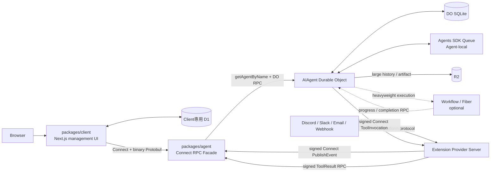
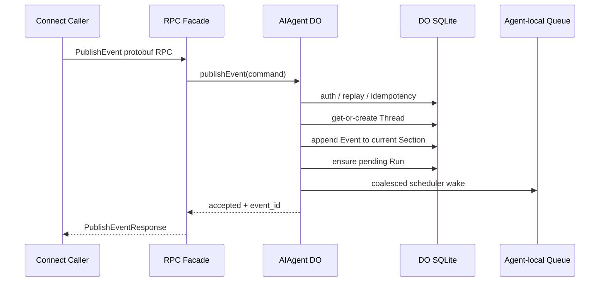
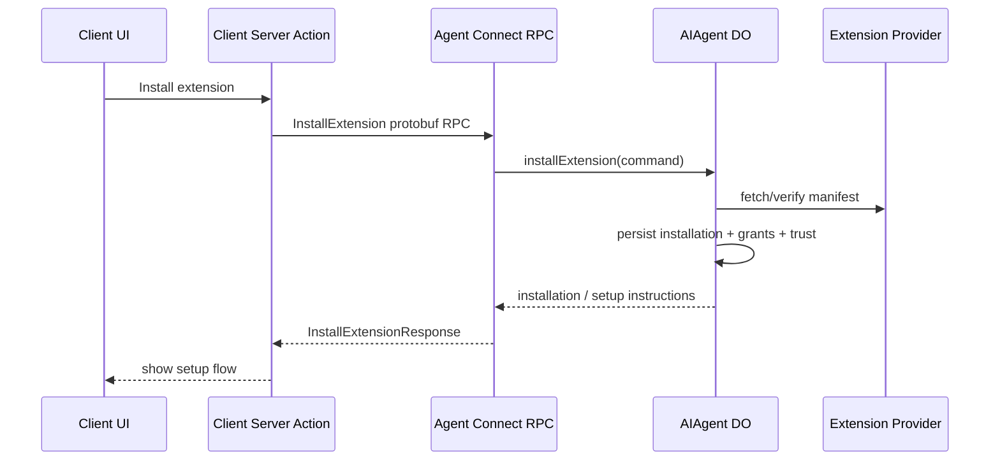
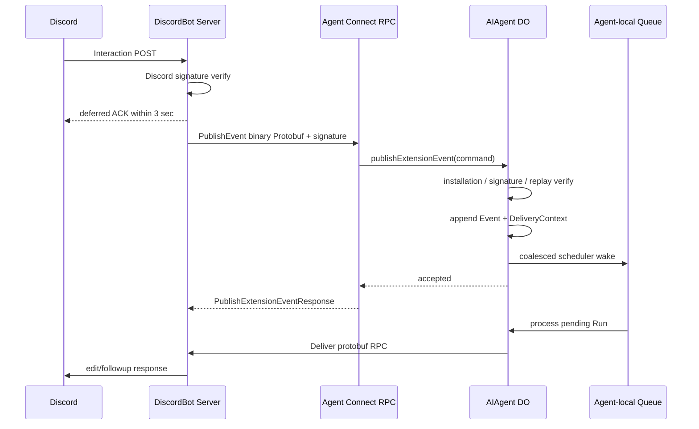

# 仕様設計・アーキテクチャ設計

- 対象: チャットに依存しない自律駆動 AI Agent Service
- Agent runtime: Cloudflare Agents SDK / SQLite-backed Durable Objects
- 公開 API: Protobuf RPC-only
- 必須 transport profile: Connect protocol + binary Protobuf
- 任意互換 profile: native gRPC
- API 契約: `packages/agent/src/typespec` を正本とし、proto3 を生成
- 管理クライアント: Next.js on Cloudflare Workers
- 更新日: 2026-06-21
- 状態: 完成アーキテクチャ基準

---

## 0. 本書の結論

本システムは、次の集約境界で設計する。

```text
1 Agent ID
  = 1 AIAgent Durable Object instance
  = 1 AI Agent aggregate root
```

AIAgent Durable Object は、AI Agent そのものとして次を所有する。

- Thread
- Section
- AgentEvent
- AgentRun
- ThreadCompaction
- ThreadHistory
- ThreadMemory
- AgentMemory
- AgentState
- Schedule
- Tool / ToolInvocation
- Extension / Installation
- Adapter Connection
- DeliveryContext / AdapterDelivery
- 権限、承認、予算、冪等性、署名 nonce

すべての外部 AgentEvent は `thread_key` を必須とする。

```text
同一 Agent ID + 同一 thread_key
  = 同一 Thread
```

`thread_key` は Extension または Client が指定する opaque string である。異なる Extension が意図的に同じ文字列を指定した場合、その Event は同じ Thread に統合される。

Agent の公開 API は **Protobuf RPC-only** とする。

```text
契約:
  TypeSpec → proto3

初期必須 transport:
  Connect protocol
  binary Protobuf
  unary RPC

任意互換 transport:
  native gRPC

公開しない:
  REST resource API
  OpenAPI Agent API
  ad-hoc JSON API
  public Durable Object fetch API
  browser direct Agent API
```

Cloudflare Workers は Web Standard の `fetch()` を中心とする。Node.js の `http2` API は非機能扱いであるため、native gRPC client/server を初期構成の前提にしない。一方、Connect protocol は HTTP/1.1 または HTTP/2 上で動作し、Connect の公式 examples には Cloudflare Workers 上の server 実装例がある。このため、Agent Worker 自身が Connect RPC facade を提供する。

```text
packages/client Next.js Server Action
  ↓ Connect + binary Protobuf
Agent RPC Worker
  ↓ Durable Object RPC
AIAgent Durable Object
```

```text
Extension Provider
  ↓ Connect + binary Protobuf + installation signature
Agent RPC Worker
  ↓ Durable Object RPC
AIAgent Durable Object
```

Event の受理と永続化は AIAgent Durable Object が直接行う。`agent_events` は Mailbox 兼 Event Log とし、別の authoritative Inbox は作らない。

即時非同期処理には Cloudflare Queues 製品ではなく、Agents SDK の Agent-local Queue を使う。

```text
Agent-local Queue
  = 各 AIAgent instance の SQLite に保存される FIFO callback queue
  = Agent ごとに独立
  = Queue consumer Worker を必要としない
```

Agent-local Queue は Event を正本として保持する場所ではない。AIAgent が保存済み Event と pending Run を処理するための wake-up mechanism として利用する。

`packages/client` は Next.js 製の Management Client である。Client 専用 D1 を読み書きし、管理対象 Agent ID、Agent RPC origin、表示設定、接続資格情報の参照を管理する。Agent は Client D1 にアクセスしない。

---

## 1. 目的

本システムは、ユーザーがチャットメッセージを送信した場合だけ応答する Bot ではない。

外部サービスの Event、時刻、内部状態の変化、Tool の結果、人間からの入力を受け取り、AI Agent が自ら次の行動を決定するサーバーサイド・ハーネスを提供する。

```text
外部または内部で事象が発生する
  ↓
thread_key 付き AgentEvent として Agent が受理する
  ↓
Agent が Thread の文脈、State、Memory、Schedule、Tool、Extension を参照する
  ↓
AgentRun を開始する
  ↓
停止、状態更新、記憶、応答、Schedule、ToolInvocation などを決定する
  ↓
結果を Agent 自身の履歴へ保存する
  ↓
必要なら次の AgentEvent を同一 Thread に予約する
```

チャットは入力インターフェイスの一つであり、中心概念ではない。

```text
Agent
  = 自律的な主体

Thread
  = Agent 内で半永久的に継続する文脈

Event
  = Thread 内で発生した事象
```

---

## 2. 非目標

初期設計では、次を目標にしない。

- Agent 横断の一覧・検索 RPC を Agent Service が提供すること
- Agent ごとに別の Cloudflare Queue resource を作成すること
- Cloudflare Queues を Agent の Mailbox 正本にすること
- Thread ごとに別 Durable Object を作成すること
- 複数 Thread のハーネス Run を同一 Agent 内で同時実行すること
- Client が Agent API を代理公開すること
- Client D1 を Agent の projection として Agent 側から更新すること
- ChatMessage を正本とすること
- egress-only Adapter を定義すること
- Extension や Tool の実装を Agent package に固定的に埋め込むこと
- REST/OpenAPI Agent API を提供すること
- Connect JSON encoding を本番 API として許可すること
- Browser から Agent RPC を直接呼ぶこと
- native gRPC Gateway を初期構成の必須要素にすること

---

## 3. 確定した設計原則

### 3.1 `packages/agent` が AI Agent Service かつハーネス本体である

`packages/agent` は一般的な Web バックエンドの一部ではなく、独立デプロイ可能な AI Agent マイクロサービスである。

以下を含む。

- TypeSpec による Protobuf RPC 契約
- TypeSpec から生成された proto3
- Connect RPC facade
- Cloudflare Agents SDK の `Agent` class
- `AIAgent` Durable Object class
- AgentEvent の受理、保存、処理
- Thread、Section、Compaction、History、ThreadMemory
- 自律判断ハーネス
- AgentState と AgentMemory
- AgentRun
- Schedule
- Tool と `tools/invocations`
- Extension と Installation
- Adapter ingress と Delivery
- 認証、認可、監査、リプレイ防止

### 3.2 `1 Agent ID = 1 AIAgent Durable Object instance`

```text
1 Agent ID
  =
1 AIAgent Durable Object instance
  =
1 Agent aggregate root
```

各 AIAgent Durable Object は、自分自身に属するデータと振る舞いを所有する。

### 3.3 Agent に説明可能な概念は Agent が所有する

原則として、以下の正本は AIAgent Durable Object に置く。

- Agent metadata
- Agent access credential verifier と ACL
- Thread
- Section
- AgentEvent
- ThreadCompaction
- ThreadHistory index
- ThreadMemory
- AgentRun
- AgentState
- AgentMemory
- Schedule
- Tool definition の有効化状態
- ToolInvocation
- Human approval
- Extension Installation
- Adapter Connection
- Adapter ingress 受理履歴
- DeliveryContext
- AdapterDelivery
- 冪等性情報
- 署名 nonce
- 因果関係
- 自律判断結果
- Agent-local scheduler state

技術上の理由で本文を R2 や Workflow に置く場合も、意味上の所有者は AIAgent とする。AIAgent は参照、digest、status、provenance、監査記録を保持する。

### 3.4 すべての公開 RPC は Agent ID にスコープする

Agent Service は Agent 横断 RPC を提供しない。

作らない RPC:

```text
ListAllAgents
SearchAgents
ListAllToolInvocations
ListAllExtensionInstallations
```

各 request message は `agent_id` を必須とする。

```text
AgentEventService.PublishEvent(agent_id, ...)
AgentThreadService.GetThread(agent_id, thread_id)
AgentScheduleService.CreateSchedule(agent_id, ...)
AgentExtensionService.InstallExtension(agent_id, ...)
```

Agent 一覧は Client が所有する管理台帳であり、Agent Service の domain ではない。

### 3.5 Protobuf RPC-only の意味

Protobuf RPC-only は「native gRPC-only」を意味しない。

```text
契約モデル:
  Protobuf service / rpc / message

初期 transport:
  Connect protocol

wire encoding:
  binary Protobuf

任意互換 transport:
  native gRPC
```

禁止するもの:

- REST resource route
- OpenAPI artifact を Agent API の正本にすること
- JSON DTO を別契約として維持すること
- Hono route から Agent client SDK を生成すること
- RPC と同じ機能を別 REST API でも提供すること

### 3.6 Connect は transport profile であり、domain API ではない

Connect の method path は生成された Protobuf service に従う。

```text
/cftamac.agent.v1.AgentEventService/PublishEvent
/cftamac.agent.v1.AgentThreadService/GetThread
/cftamac.agent.v1.AgentExtensionService/InstallExtension
```

URL の resource design は domain contract ではない。contract は service、rpc、request、response で表現する。

### 3.7 `packages/client` は Next.js 製の簡易管理クライアントである

`packages/client` は次を行う。

- Client 専用 D1 を読み書きする
- Client が管理対象として登録した Agent ID を管理する
- Agent RPC origin を管理する
- Client 上の表示名、pin、並び順、最終閲覧日時を管理する
- Agent 接続資格情報の参照を管理する
- 生成された Protobuf RPC client で Agent API を呼ぶ
- Extension の install/uninstall を Agent RPC 経由で操作する
- ToolInvocation、Schedule、Thread、Compaction を Agent RPC 経由で管理する

Client は Agent の正本データを複製しない。

### 3.8 Agent は Client D1 にアクセスしない

禁止する。

```text
packages/agent → packages/client の D1 を読む
packages/agent → packages/client の D1 へ書く
packages/agent → packages/client の内部状態へ通知する
```

Cloudflare binding も分離する。

```text
Agent Worker:
  CLIENT_DB binding を持たない

Client Worker:
  CLIENT_DB binding を持つ
```

### 3.9 Client は Agent API の利用者であり、代理 API 提供者ではない

Client から Agent のすべての管理操作を行えるが、Client 自身は管理中 Agent の API を公開しない。

Next.js Server Components と Server Actions が Client D1 と Agent RPC client を直接利用する。

`/api/client/*` や Agent REST proxy は初期設計では作らない。

### 3.10 Event は必ず Thread に所属する

外部、内部を問わず、AgentEvent は一つの Thread に所属する。

```text
AgentEvent without Thread
  = invalid
```

外部 Event RPC は `thread_key` を必須とする。

Schedule、ToolResult、Adapter ingress、Workflow completion が生成する Event にも Thread を持たせる。

Agent lifecycle や Extension install の監査 Event は、AIAgent 内部の予約済み system Thread に所属させる。

### 3.11 同一 Agent 内で同じ `thread_key` は同じ Thread を表す

```text
同じ Agent ID
+ 同じ thread_key
=
同じ Thread
```

異なる Extension、Adapter、Connection が同じ文字列を指定しても、同じ Thread に統合する。これは明示的な文脈統合である。

Agent ID が異なる場合は、同じ `thread_key` でも別 Thread である。

### 3.12 `1 Compaction = 1 Section`

```text
Section 1
  Event 1 ... N
  ↓ Compaction 1

Section 2
  Event N+1 ... M
  ↓ Compaction 2
```

Compaction は単なる要約ではない。Section を確定し、次回再開用 Handoff、詳細 History、ThreadMemory 更新を生成する境界操作である。

### 3.13 Agent-local Queue と Cloudflare Queues を区別する

本設計で初期採用するのは Agents SDK 内蔵 Queue である。

```text
Agents SDK Queue
  - 各 Agent instance の SQLite に保存
  - FIFO
  - callback を同一 Agent 上で順次実行
  - Agent restart 後も保持
  - Queue consumer Worker は存在しない

Cloudflare Queues product
  - Worker 間 message broker
  - producer / consumer Worker を持つ
  - 初期設計では使用しない
```

Agent-local Queue は head-of-line blocking を持つため、長い retry を queue item 自体へ設定しない。Queue には scheduler wake を coalesce して投入し、長時間処理には Fiber または Workflow を利用する。

---

## 4. 用語

| 用語 | 定義 |
|---|---|
| Agent | 自律判断する主体。1 AIAgent Durable Object instance に対応する |
| Thread | Agent 内の半永久的な文脈。`thread_key` で外部から指定する |
| Section | 二つの Compaction 境界間にある Event 範囲 |
| AgentEvent | Thread 内で発生した正規化済み事象 |
| Mailbox | 未処理を含む `agent_events` と pending Run の論理集合 |
| AgentRun | 固定された入力 snapshot を基にハーネスを一回実行する単位 |
| ThreadCompaction | Section を閉じ、Handoff、History、MemoryDelta を生成する操作 |
| Handoff | 次回再開用の短い引き継ぎオブジェクト |
| ThreadHistory | Section 内の経緯、意図、判断、理由、根拠を詳細に残す記録 |
| ThreadMemory | Thread 内で長期間有効な事実、方針、決定、制約の版管理集合 |
| AgentMemory | 特定 Thread に閉じない Agent 全体の記憶 |
| Schedule | 将来 AgentEvent を発生させる Agent 内部予定 |
| Tool | Agent が外界へ作用するために能動的に呼ぶ能力 |
| ToolInvocation | Tool の一回の実行と状態遷移 |
| Adapter | 外部 protocol を AgentEvent に変換する ingress capability |
| AdapterDelivery | ingress 由来 DeliveryContext に対する応答 |
| Extension | Adapter と Tool の定義を追加できる配布単位 |
| Installation | ある Agent に Extension を導入した状態 |
| Connect | Protobuf RPC を HTTP 上で運ぶ transport profile |
| native gRPC | HTTP/2 と trailer を使う任意互換 transport profile |
| Principal | Client Service、Extension Installation、Internal Service などの認証主体 |

---

## 5. システム全体像



### 5.1 信頼境界

```text
packages/client
  owns:
    Client session
    管理対象 Agent 一覧
    Agent RPC origin
    UI 表示設定
    Agent access credential reference

packages/agent
  owns:
    Agent RPC contract
    AIAgent Durable Object
    Agent domain 全体

Extension Provider
  owns:
    外部 platform protocol
    platform token
    Adapter/Tool 実装
    provider private signing key
```

### 5.2 transport matrix

| Caller | Initial transport | Encoding | 備考 |
|---|---|---|---|
| `packages/client` Server Action | Connect | binary Protobuf | fetch-based client |
| Extension Provider | Connect | binary Protobuf | installation signature 必須 |
| Internal Worker | Workers/Durable Object RPC | structured clone | public API ではない |
| Full-runtime integration | native gRPC または Connect | Protobuf | 任意互換 profile |
| Browser | 直接呼ばない | - | Next.js server-side を経由 |

---

## 6. リポジトリ構成

```text
packages/
  agent/
    package.json
    wrangler.toml
    buf.yaml
    buf.gen.yaml

    proto/
      cftamac/agent/v1/*.proto

    src/
      index.ts
      AIAgent.ts
      env.ts

      typespec/
        main.tsp
        tspconfig.yaml
        src/
          common/
            errors.tsp
            pagination.tsp
            security.tsp
          models/
            agent.tsp
            access-credential.tsp
            thread.tsp
            section.tsp
            event.tsp
            run.tsp
            compaction.tsp
            history.tsp
            memory.tsp
            state.tsp
            schedule.tsp
            tool.tsp
            extension.tsp
            adapter.tsp
          services/
            agent-lifecycle.tsp
            agent-event.tsp
            agent-thread.tsp
            agent-run.tsp
            agent-state.tsp
            agent-schedule.tsp
            agent-tool.tsp
            agent-extension.tsp
            agent-adapter.tsp
            agent-health.tsp

      generated/
        rpc/
          cftamac/agent/v1/*_pb.ts

      rpc/
        router.ts
        services/
        interceptors/
          authentication.ts
          authorization.ts
          replay-protection.ts
          validation.ts
          audit.ts
          rate-limit.ts
        do-router.ts
        connect-worker-adapter.ts

      domain/
      harness/
      threads/
      events/
      runs/
      compactions/
      schedules/
      tools/
      extensions/
      adapters/
      storage/
      observability/

  client/
    package.json
    next.config.ts
    open-next.config.ts
    wrangler.toml

    app/
      agents/
        page.tsx
        new/page.tsx
        [agentId]/
          page.tsx
          threads/
          events/
          schedules/
          tools/
          extensions/
          settings/

    src/
      server/
        db/
          schema.ts
          migrations/
          managed-agents.ts
          access-credentials.ts
        actions/
        agent-rpc/
          create-client.ts
          authentication.ts

      generated/
        agent-rpc/
          cftamac/agent/v1/*_pb.ts
```

### 6.1 依存方向

```text
packages/agent/src/typespec
  ↓ @typespec/protobuf
packages/agent/proto/**/*.proto
  ↓ Buf / protoc-gen-es
packages/agent/src/generated/rpc
packages/client/src/generated/agent-rpc
```

```text
packages/client
  → generated Agent RPC client
  → Agent Connect endpoint

packages/client
  ✕ packages/agent runtime source を import しない

packages/agent
  ✕ packages/client を参照しない
  ✕ CLIENT_DB binding を持たない
```

---

## 7. TypeSpec、Protobuf、code generation

### 7.1 正本

Agent API 契約の正本は次とする。

```text
packages/agent/src/typespec/main.tsp
```

Agent API では OpenAPI を生成しない。

### 7.2 TypeSpec Protobuf emitter

`@typespec/protobuf` を使用して proto3 service と message を生成する。

```yaml
emit:
  - "@typespec/protobuf"

options:
  "@typespec/protobuf":
    emitter-output-dir: "{project-root}/../../proto"
```

TypeSpec 側で明示する。

- `@package`
- `@Protobuf.service`
- すべての message field の `@field(n)`
- stream を採用する場合の `@stream`
- 削除 field number の `@reserve`

### 7.3 package/version

初期 package は次とする。

```proto
package cftamac.agent.v1;
```

breaking change は `v2` package として追加する。

既存 field number を再利用しない。削除した field は reserve する。

### 7.4 生成フロー

```text
packages/agent/src/typespec
  ↓ tsp compile --emit=@typespec/protobuf
packages/agent/proto/cftamac/agent/v1/*.proto
  ↓ buf lint / buf breaking / buf generate
packages/agent/src/generated/rpc/**/*.ts
packages/client/src/generated/agent-rpc/**/*.ts
```

### 7.5 binary Protobuf only

本番 Agent RPC は binary Protobuf のみ受理する。

- Connect JSON encoding は無効化または拒否する
- HTTP GET による unary RPC は無効化する
- content type が binary Protobuf profile と一致しない request は拒否する
- debug tooling の JSON 利用はローカル環境に限定する

### 7.6 初期 RPC cardinality

初期は unary RPC のみに限定する。

理由:

- Agent の正本操作は command/query 単位で完結する
- Cloudflare Worker、Next.js、Extension Provider 間の互換性が高い
- retry、idempotency、署名対象を単純化できる

将来 server streaming を追加する場合も同じ proto service に追加し、Worker runtime と client の実測検証を必須とする。

### 7.7 CI

- TypeSpec format
- TypeSpec compile
- proto 再生成差分
- `buf lint`
- `buf breaking`
- Protobuf-ES client/server descriptor 再生成差分
- field number reuse guard
- service/method uniqueness
- OpenAPI Agent artifact が生成されていないこと
- raw REST Agent route が存在しないこと

---

## 8. デプロイ単位

### 8.1 Agent Service

```text
origin:
  https://agent.example.com

runtime:
  Cloudflare Worker
  Connect RPC facade
  Cloudflare Agents SDK
  SQLite-backed AIAgent Durable Objects

bindings:
  AI_AGENT
  AGENT_BLOBS
  optional Workflows
  model provider secrets
  extension trust / signing material
```

初期設計では次を持たない。

```text
CLIENT_DB binding
Cloudflare Queues producer/consumer binding
Agent横断 D1
native gRPC server
REST/OpenAPI Agent API
```

### 8.2 Client

```text
origin:
  https://client.example.com

runtime:
  Next.js App Router
  Cloudflare OpenNext adapter
  Cloudflare Worker

bindings:
  CLIENT_DB
  CLIENT_CREDENTIAL_ENCRYPTION_KEY
```

Client Worker は fetch-based Connect client を利用できるため、full Node.js の `http2` client を必要としない。

### 8.3 Extension Provider

Extension Provider は Agent Service と別ホストにできる。

```text
https://discord-extension.example.com
https://slack-extension.example.com
https://github-extension.example.com
```

Provider は Adapter、Tool、または両方を提供できる。

Agent への呼び出しは Connect + binary Protobuf を必須 profile とする。Provider が full runtime を持つ場合、将来 native gRPC profile を追加してもよい。

### 8.4 native gRPC compatibility gateway

native gRPC が必要になった場合だけ追加する。

```text
native gRPC caller
  ↓
optional gRPC compatibility gateway
  ↓ Connect + binary Protobuf
Agent Worker
```

Gateway は別 domain API を持たない。同じ generated proto service を実装し、Agent Worker の Connect RPC へ転送する stateless compatibility layer とする。

---

## 9. Protobuf RPC service design

### 9.1 共通規則

すべての request は最低限次を持つ。

```proto
message AgentScope {
  string agent_id = 1;
}
```

command request は次も持つ。

```proto
string idempotency_key = ...;
```

Agent ID は metadata だけに置かず、request message に含める。署名、監査、再実行時に request 自体で対象 Agent を確定できるようにする。

### 9.2 AgentLifecycleService

```proto
service AgentLifecycleService {
  rpc InitializeAgent(InitializeAgentRequest) returns (InitializeAgentResponse);
  rpc GetAgent(GetAgentRequest) returns (GetAgentResponse);
  rpc DestroyAgent(DestroyAgentRequest) returns (DestroyAgentResponse);
  rpc RotateAgentCredential(RotateAgentCredentialRequest) returns (RotateAgentCredentialResponse);
}
```

### 9.3 AgentEventService

```proto
service AgentEventService {
  rpc PublishEvent(PublishEventRequest) returns (PublishEventResponse);
  rpc GetEvent(GetEventRequest) returns (GetEventResponse);
  rpc ListEvents(ListEventsRequest) returns (ListEventsResponse);
}
```

`PublishEventRequest` は `thread_key` を必須とする。

### 9.4 AgentThreadService

```proto
service AgentThreadService {
  rpc ListThreads(ListThreadsRequest) returns (ListThreadsResponse);
  rpc GetThread(GetThreadRequest) returns (GetThreadResponse);
  rpc ListSections(ListSectionsRequest) returns (ListSectionsResponse);
  rpc GetLatestCompaction(GetLatestCompactionRequest) returns (GetLatestCompactionResponse);
  rpc GetThreadMemory(GetThreadMemoryRequest) returns (GetThreadMemoryResponse);
  rpc SearchThreadHistory(SearchThreadHistoryRequest) returns (SearchThreadHistoryResponse);
}
```

### 9.5 AgentRunService

```proto
service AgentRunService {
  rpc GetRun(GetRunRequest) returns (GetRunResponse);
  rpc ListRuns(ListRunsRequest) returns (ListRunsResponse);
  rpc CancelRun(CancelRunRequest) returns (CancelRunResponse);
}
```

### 9.6 AgentStateService

```proto
service AgentStateService {
  rpc GetState(GetStateRequest) returns (GetStateResponse);
  rpc GetConfig(GetConfigRequest) returns (GetConfigResponse);
  rpc UpdateConfig(UpdateConfigRequest) returns (UpdateConfigResponse);
}
```

### 9.7 AgentScheduleService

```proto
service AgentScheduleService {
  rpc CreateSchedule(CreateScheduleRequest) returns (CreateScheduleResponse);
  rpc GetSchedule(GetScheduleRequest) returns (GetScheduleResponse);
  rpc ListSchedules(ListSchedulesRequest) returns (ListSchedulesResponse);
  rpc CancelSchedule(CancelScheduleRequest) returns (CancelScheduleResponse);
}
```

### 9.8 AgentToolService

```proto
service AgentToolService {
  rpc ListTools(ListToolsRequest) returns (ListToolsResponse);
  rpc GetInvocation(GetInvocationRequest) returns (GetInvocationResponse);
  rpc ListInvocations(ListInvocationsRequest) returns (ListInvocationsResponse);
  rpc ApproveInvocation(ApproveInvocationRequest) returns (ApproveInvocationResponse);
  rpc RejectInvocation(RejectInvocationRequest) returns (RejectInvocationResponse);
}
```

概念上の resource path は `tools/invocations` だが、公開 contract は RPC method で表現する。

### 9.9 AgentExtensionService

```proto
service AgentExtensionService {
  rpc InstallExtension(InstallExtensionRequest) returns (InstallExtensionResponse);
  rpc UninstallExtension(UninstallExtensionRequest) returns (UninstallExtensionResponse);
  rpc GetInstallation(GetInstallationRequest) returns (GetInstallationResponse);
  rpc ListInstallations(ListInstallationsRequest) returns (ListInstallationsResponse);
  rpc CreateAdapterConnection(CreateAdapterConnectionRequest) returns (CreateAdapterConnectionResponse);
  rpc DeleteAdapterConnection(DeleteAdapterConnectionRequest) returns (DeleteAdapterConnectionResponse);
  rpc ListAdapterConnections(ListAdapterConnectionsRequest) returns (ListAdapterConnectionsResponse);
}
```

### 9.10 ExtensionIngressService

Extension Installation principal が呼び出せる service を限定する。

```proto
service ExtensionIngressService {
  rpc PublishEvent(PublishExtensionEventRequest) returns (PublishExtensionEventResponse);
  rpc PublishToolResult(PublishToolResultRequest) returns (PublishToolResultResponse);
  rpc PublishDeliveryResult(PublishDeliveryResultRequest) returns (PublishDeliveryResultResponse);
}
```

Extension は Agent config、install/uninstall、approval RPC を呼べない。

### 9.11 HealthService

REST `/health` は作らない。

```proto
service AgentHealthService {
  rpc Check(CheckHealthRequest) returns (CheckHealthResponse);
}
```

---

## 10. Connect RPC facade と Durable Object routing

### 10.1 facade の責務

- Connect protocol の framing と Protobuf decode/encode
- binary profile enforcement
- authentication interceptor
- authorization pre-check
- timestamp / nonce / signature metadata の抽出
- request validation
- rate limit
- `agent_id` から AIAgent Durable Object stub を取得
- AIAgent public method を呼ぶ
- domain error を Connect error code へ変換
- audit context を付与

### 10.2 facade に置かないもの

- AgentEvent の正本保存
- Thread 解決
- Schedule 管理
- ToolInvocation の状態遷移
- Extension Installation の最終認可
- Memory 更新
- Compaction
- AgentRun scheduling

これらは AIAgent Durable Object の責務である。

### 10.3 routing example

```ts
async function publishEvent(
  req: PublishEventRequest,
  ctx: RpcContext,
): Promise<PublishEventResponse> {
  const agent = await getAgentByName(ctx.env.AI_AGENT, req.agentId);

  return agent.publishEvent({
    request: req,
    principal: ctx.principal,
    authentication: ctx.authentication,
    rawBodyDigest: ctx.rawBodyDigest,
  });
}
```

### 10.4 internal DO RPC

Connect RPC と Durable Object RPC は別物である。

```text
External/public:
  Connect protocol + Protobuf

Worker → AIAgent:
  Durable Object RPC
```

Durable Object public method を外部へ直接公開しない。

---

## 11. 認証主体と認可

### 11.1 Principal types

```text
CLIENT_SERVICE
EXTENSION_INSTALLATION
INTERNAL_SERVICE
ADMIN_OPERATOR
```

初期実装では Browser user を直接 Agent principal にしない。Browser session は Client が検証し、Client Service が acting user 情報付きで Agent RPC を呼ぶ。

### 11.2 Client Service authentication

Client から Agent への RPC は、短時間 JWT を標準とする。

必須 claim:

```text
iss
sub
jti
aud = agent service
exp
nbf
agent_id
scopes
acting_user_id
```

推奨 algorithm:

```text
EdDSA / Ed25519
```

Client D1 には private key を平文保存しない。key ID、secret reference、public fingerprint のみを保存する。

### 11.3 Extension Installation authentication

Extension Provider から Agent への RPC は Installation 単位の detached signature を標準とする。

署名対象:

```text
rpc service
rpc method
agent_id
installation_id
connection_id
timestamp
nonce
idempotency_key
SHA-256(raw protobuf request body)
```

推奨 algorithm:

```text
Ed25519
```

AIAgent DO は Installation に保存した Provider public key で署名を検証する。

### 11.4 raw bytes を署名する理由

Protobuf message を再 serialize した bytes は実装差や map ordering により署名対象として不安定になり得る。RPC facade が受信した raw body bytes の digest を署名対象とし、decode 後の message と同時に AIAgent DO へ渡す。

### 11.5 replay protection

AIAgent DO は principal 単位で次を検証する。

- timestamp が許容 window 内
- nonce が未使用
- `jti` または request ID が未使用
- idempotency key の状態
- signature key が active
- Installation が active
- requested RPC が grant 内

nonce は TTL 付きで保存する。

### 11.6 mTLS

mTLS は defense-in-depth として利用できるが、必須の唯一認証にはしない。

理由:

- `packages/client` と Agent がともに Cloudflare Workers 上にある場合、application-level JWT/署名の方が topology 非依存である
- Extension Provider の環境によって client certificate 運用可否が異なる

外部 Provider 専用 hostname で mTLS を追加する場合も、Installation signature と Agent grant の検証は省略しない。

### 11.7 RPC authorization matrix

| RPC group | CLIENT_SERVICE | EXTENSION_INSTALLATION | INTERNAL_SERVICE |
|---|---:|---:|---:|
| Agent lifecycle/config | allow by scope | deny | limited |
| Event publish | allow | allow by grant | allow |
| Thread/Event query | allow by scope | deny by default | limited |
| Schedule management | allow by scope | deny by default | limited |
| Tool approval | allow by scope | deny | deny |
| Extension install/uninstall | allow by scope | deny | deny |
| Tool/Delivery result callback | deny | allow by grant | allow |

### 11.8 final authorization is Agent-local

Facade の認証成功だけで command を確定しない。

AIAgent DO が以下を最終確認する。

- 対象 Agent ID
- Agent credential status
- Installation status
- scope/grant
- connection ownership
- Tool/Adapter capability
- nonce/idempotency
- Agent lifecycle status

---

## 12. AIAgent Durable Object

### 12.1 class outline

```ts
export class AIAgent extends Agent<Env, AgentState> {
  async initialize(input: InitializeAgentCommand): Promise<AgentProfile>;
  async publishEvent(input: PublishEventCommand): Promise<PublishEventResult>;
  async getThread(input: GetThreadQuery): Promise<ThreadView>;
  async createSchedule(input: CreateScheduleCommand): Promise<ScheduleView>;
  async installExtension(input: InstallExtensionCommand): Promise<InstallationView>;
  async invokeTool(input: InvokeToolCommand): Promise<ToolInvocationView>;
  async processPendingRuns(payload: ProcessPendingRunsPayload): Promise<void>;
  async compactThread(payload: CompactThreadPayload): Promise<void>;
}
```

### 12.2 Agent ID

Agent ID は Durable Object name と一致させる。

```text
agent_id
  = getAgentByName() に渡す name
  = Durable Object instance identity
```

### 12.3 Agent 全体の直列実行方針

初期実装では、一つの AIAgent DO 内で active AgentRun を一つに限定する。

```text
Thread A run running
Thread B event accepted
  ↓
Thread B run pending
  ↓
Thread A run complete
  ↓
scheduler selects Thread B
```

Thread は文脈分離単位であり、物理並列単位ではない。

---

## 13. Thread

### 13.1 定義

Thread は Agent 内で半永久的に継続する文脈である。

Thread はチャットルームに限定しない。

例:

```text
project:ai-agent-server
discord:guild:123:channel:456
user:suzlun:management
shared:product-strategy
```

### 13.2 `thread_key`

- 外部 Event では必須
- opaque string
- 同一 Agent 内で unique
- Extension が自由に指定可能
- 同じ文字列を意図的に使えば文脈が統合される
- Agent 境界を越えない

比較規則:

- Unicode NFC
- case-sensitive
- 空文字禁止
- 最大 512 UTF-8 bytes
- 暗黙 prefix 付与をしない

### 13.3 内部 ID

外部識別子とは別に内部 `thread_id` を持つ。

```text
thread_key
  = 外部文脈識別子

thread_id
  = Agent 内部 immutable ID
```

### 13.4 system Thread

Agent lifecycle、Extension install/uninstall、credential rotation など Thread を持たない管理操作は予約済み system Thread に Event として記録する。

```text
__system__
```

### 13.5 Agent 越境禁止

他 Agent の Thread、Memory、History を直接参照しない。

Agent 間連携が必要な場合は Tool または明示的 Agent-to-Agent protocol とする。

---

## 14. AgentEvent

### 14.1 canonical envelope

```proto
message AgentEventInput {
  string thread_key = 1;
  string type = 2;
  string source = 3;
  string idempotency_key = 4;
  google.protobuf.Timestamp occurred_at = 5;
  bytes payload = 6;
  string payload_content_type = 7;
  optional string correlation_id = 8;
  optional string causation_id = 9;
  optional EventSourceContext source_context = 10;
}
```

大きな payload は R2 へ置き、Event には参照を保存する。

### 14.2 Event type examples

```text
user.message.received
discord.interaction.received
tool.invocation.succeeded
tool.invocation.failed
schedule.triggered
extension.installed
extension.uninstalled
agent.run.interrupted
thread.compaction.completed
```

### 14.3 ChatMessage

ChatMessage は AgentEvent の projection である。

```text
ChatMessage
  ⊂ AgentEvent
```

### 14.4 idempotency

`agent_id + principal_id + idempotency_key` で重複排除する。

重複 request には既存 Event ID と結果を返す。

### 14.5 sequence

二つの sequence を持つ。

```text
agent_sequence
  = Agent 全体の順序

thread_sequence
  = Thread 内の順序
```

---

## 15. Mailbox、Agent-local Queue、Run scheduler

### 15.1 Mailbox

Mailbox は別の broker ではない。

```text
Mailbox
  = agent_events の未処理範囲
  + pending AgentRun
```

### 15.2 Event 受理フロー



`PublishEventResponse` が成功した時点で、Event は Agent の永続履歴へ受理済みである。

### 15.3 queue wake coalescing

Event ごとに queue item を大量生成しない。

```text
pending/running scheduler wake がある
  → 新しい wake を追加しない

wake がない
  → processPendingRuns を1件 queue
```

Queue callback は pending Run を一定量だけ処理し、残件があれば再度 wake する。

### 15.4 Agent-local Queue の制約

Agents SDK Queue は FIFO、逐次実行であり、retry head-of-line blocking がある。

したがって:

- queue callback の payload は小さくする
- callback 内で長い sleep retry をしない
- queue retry は短い transient error に限定する
- 長時間処理は Fiber / Workflow へ移す
- failure state は独自 table に残す

### 15.5 Cloudflare Queues product

初期設計では使わない。

導入条件:

- Agent 外の stateless worker pool が必要
- ingress burst buffer が必要
- broker-level DLQ が必要
- cross-service batch/ETL が必要

導入後も AgentEvent の正本は AIAgent DO に置く。

---

## 16. Durable Object の同時実行と Event 到着

### 16.1 runtime 前提

Durable Object は single-threaded cooperative multitasking である。

同期処理中に同時実行されないが、外部 `fetch()` や Model/Tool await 中には別 request が interleave し得る。

### 16.2 同じ Thread に Event が届いた場合

```text
run_1 executes Thread A snapshot
  ↓
new Event arrives to Thread A
  ↓
Event is appended
  ↓
run_1 snapshot is not mutated
  ↓
next pending Run processes new Event
```

現在 Run の入力を途中変更しない。

### 16.3 別 Thread に Event が届いた場合

```text
Thread A run running
Thread B Event arrives
  ↓
Thread B Event is appended immediately
Thread B pending Run is created/coalesced
  ↓
Thread A run completes
  ↓
Agent scheduler selects next Thread
```

別 Thread の Event を現在 Run の prompt に混ぜない。

### 16.4 Run input snapshot

Run 開始時に次を固定する。

- trigger Event range
- Thread Memory version
- latest ready Compaction ID
- uncompacted Event upper sequence
- Agent config version
- available Tool set version
- Extension Installation version

結果 commit 時に cancellation/generation/version を確認する。

### 16.5 interrupt Event

```text
user.cancel
human.override
permission.revoked
extension.uninstalled
```

などは active Run に interrupt flag を立てる。

外部 Model call を必ず中断できるとは限らないため、結果 return 後に generation check で破棄できるようにする。

### 16.6 fairness

Thread scheduler は最低限次を持つ。

```text
priority DESC
last_served_at ASC
pending_since ASC
```

background compaction が user-facing Thread を恒久的に阻害しないようにする。

---

## 17. AgentRun とハーネス

### 17.1 state machine

```text
pending
running
waiting_tool
waiting_approval
completed
failed
cancelled
interrupted
```

### 17.2 Context Builder

再開時の基本 prompt 順序:

```text
1. Agent identity / policy
2. current Thread Memory
3. latest ready Handoff
4. uncompacted Events
5. retrieved History
6. relevant latest Compaction from other Threads in same Agent
7. trigger Event
```

他 Agent の Thread は参照しない。

### 17.3 Decision

```ts
type AgentDecision =
  | { type: "stop"; reason: string }
  | { type: "update_state"; patch: unknown }
  | { type: "write_memory"; memory: unknown }
  | { type: "create_schedule"; input: CreateScheduleInput }
  | { type: "invoke_tool"; toolId: string; input: unknown }
  | { type: "respond"; deliveryContextId: string; content: unknown }
  | { type: "request_human_approval"; subject: unknown }
  | { type: "emit_event"; event: AgentEventInput };
```

### 17.4 Budget

- 1 Run の最大 model calls
- 1 Run の最大 Tool calls
- 1 Run の最大 token
- 日次予算
- Extension 別予算
- Tool 別上限
- loop 最大回数
- timeout
- cooldown

### 17.5 long-running execution

- 数秒程度の短い処理: Agent-local Queue callback
- eviction recovery が必要: Fiber
- 30秒超、多段、外部待機、人間承認: Workflow

---

## 18. Section と Compaction

### 18.1 `1 Compaction = 1 Section`

```text
Section N
  = previous Compaction boundary + 1
  ... current boundary
```

Compaction 開始時に current Section を freeze し、次 Section を即座に open する。

新しい Event は新 Section へ入るため、Compaction 中も受理を止めない。

### 18.2 Compaction outputs

一回の Compaction は次を生成する。

#### Handoff

次回再開用の短い引き継ぎ。

- situation
- current goals
- active intentions
- key decisions and rationale
- open loops
- pending questions
- constraints
- expected next actions
- important History references

#### ThreadHistory

議事録に近い詳細記録。

- chronology
- actor intentions
- decisions
- considered options
- explicit rationale
- assumptions
- unresolved issues
- Tool activity
- artifacts
- replay manifest

モデルの非公開内部 chain-of-thought を保存するのではなく、外部から検証できる Decision Trace を明示的に生成する。

#### ThreadMemoryDelta

```text
add
confirm
revise
supersede
invalidate
```

Memory item は provenance と version を持つ。

### 18.3 数百回の Compaction

単純な summary-of-summary だけに依存しない。

```text
Handoff
  = 再開用

History
  = 不変の詳細記録

ThreadMemory
  = 出典付きの長期知識
```

定期的に History へ戻る Memory Rebase を実行する。

trigger 例:

- 50 Compaction ごと
- Memory item 数閾値
- token 閾値
- contradiction 閾値
- 明示的 rebase request

### 18.4 Compaction 中の再開

latest ready Compaction 以後の raw Event を加えて context を作る。

```text
latest ready Handoff
+ corresponding ThreadMemory
+ uncompacted Events
```

### 18.5 History storage

大きな History body は R2 に保存する。

AIAgent DO は次を保持する。

- history_ref
- digest
- event range
- compaction ID
- provenance
- retention status

---

## 19. Schedule

### 19.1 所有権

Schedule は Agent の内部能力であり、AIAgent DO が所有する。

```text
Schedule
  = 未来に AgentEvent を発生させる予約
```

外部 Calendar へ予定を作る処理は Tool である。

### 19.2 Thread 必須

Schedule は必ず `thread_id` を持つ。

発火時に同一 Thread へ `schedule.triggered` Event を追加する。

### 19.3 runtime

Agents SDK の schedule API を使う。

- `schedule()`
- `scheduleEvery()`
- `getSchedules()`
- `cancelSchedule()`

### 19.4 Extension uninstall

Schedule metadata に `installation_id` を保持する。

Extension uninstall 時、その Installation が作成した active Schedule を cancel する。

### 19.5 overlap

interval callback が未完了の場合、同一 Schedule の重複 Run を作らない。

```text
skip
coalesce
queue-next
```

の policy を Schedule ごとに定義する。

---

## 20. Tool と `tools/invocations`

### 20.1 Tool

Tool は Agent が外界へ作用するために能動的に呼ぶ能力である。

```text
Adapter
  = external → Agent

Tool
  = Agent → external capability
```

### 20.2 ToolDefinition

```proto
message ToolDefinition {
  string id = 1;
  string version = 2;
  string display_name = 3;
  string description = 4;
  bytes input_schema = 5;
  bytes output_schema = 6;
  bool requires_approval_by_default = 7;
  optional string installation_id = 8;
  RpcTarget target = 9;
}
```

### 20.3 Tool Provider RPC

Extension Provider が Tool を提供する場合、同じ Protobuf RPC-only 原則を適用する。

```proto
service ExtensionToolService {
  rpc InvokeTool(InvokeToolRequest) returns (InvokeToolResponse);
  rpc GetOperation(GetToolOperationRequest) returns (GetToolOperationResponse);
  rpc CancelOperation(CancelToolOperationRequest) returns (CancelToolOperationResponse);
}
```

必須 profile は Connect + binary Protobuf。

### 20.4 Invocation は Thread に所属する

ToolInvocation は次を持つ。

- agent_id
- thread_id
- run_id
- tool_id
- installation_id
- idempotency_key
- input/output ref
- status
- approval
- attempt

### 20.5 lifecycle

```text
proposed
pending_approval
approved
running
succeeded
failed
outcome_unknown
cancelled
```

### 20.6 result

Tool 成功/失敗は同一 Thread へ AgentEvent として戻す。

```text
tool.invocation.succeeded
tool.invocation.failed
```

### 20.7 security

Agent → Tool Provider request も署名する。

署名対象:

- rpc service/method
- agent_id
- installation_id
- tool_id
- invocation_id
- timestamp
- nonce
- idempotency_key
- raw protobuf body digest

Provider は Agent platform public key または Agent installation key で検証する。

---

## 21. Adapter と AdapterDelivery

### 21.1 Adapter

Adapter は外部 protocol を AgentEvent へ変換する ingress capability である。

責務:

- platform signature 検証
- external payload validation
- AgentEvent への正規化
- thread_key 選択
- DeliveryContext 作成情報
- ExtensionIngressService.PublishEvent 呼び出し

### 21.2 egress-only Adapter は作らない

外向きだけの能力は Tool である。

### 21.3 AdapterDelivery

AdapterDelivery は ingress 由来 DeliveryContext に対する応答である。

例:

- Discord Interaction followup
- Slack thread reply
- Web UI response stream の確定通知

元の ingress と無関係な proactive outbound は Tool とする。

### 21.4 Delivery Provider RPC

```proto
service ExtensionDeliveryService {
  rpc Deliver(DeliverRequest) returns (DeliverResponse);
}
```

Agent から Provider への request は署名付き Connect + binary Protobuf とする。

---

## 22. Extension

### 22.1 Definition と Installation

```text
Extension Definition
  = Provider が公開する仕様

Extension Installation
  = 特定 AIAgent に導入された状態
  = AIAgent DO が所有
```

### 22.2 manifest

manifest は少なくとも次を含む。

- extension ID
- version
- schema version
- Provider identity
- Provider public signing keys
- supported RPC base URL
- Adapter definitions
- Tool definitions
- Delivery definitions
- requested grants
- update policy

manifest 自体も Provider により署名する。

### 22.3 Installation state

```text
installing
pending_external_setup
active
disabled
uninstalling
uninstalled
failed
```

### 22.4 install flow



### 22.5 uninstall flow

AIAgent DO が次を行う。

1. Installation を `uninstalling`
2. ingress を拒否
3. Adapter Connection を disable
4. Extension Tool を disable
5. pending ToolInvocation を cancel または outcome_unknown
6. Extension 由来 Schedule を cancel
7. DeliveryContext を revoke
8. trust key を revoke
9. audit Event を system Thread へ追加
10. `uninstalled`

履歴、Event、Invocation、Compaction は監査のため保持する。

---

## 23. Extension protocol と署名

### 23.1 二段階の信頼境界

```text
External platform → Extension Provider
  platform-specific verification

Extension Provider → Agent Service
  Protobuf RPC authentication + installation signature
```

Discord の生署名を Agent Service まで直接信頼しない。

### 23.2 RPC metadata

例:

```text
authorization: Bearer <optional short-lived token>
x-agent-installation-id
x-agent-connection-id
x-agent-timestamp
x-agent-nonce
x-agent-request-id
x-agent-idempotency-key
x-agent-body-sha256
x-agent-signature
x-agent-key-id
```

### 23.3 signature canonical input

```text
service-name + "\n"
method-name + "\n"
agent-id + "\n"
installation-id + "\n"
connection-id + "\n"
timestamp + "\n"
nonce + "\n"
idempotency-key + "\n"
body-sha256
```

### 23.4 key management

- Provider private key は Provider が保持
- Agent は Provider public key を Installation record に保存
- Agent 側 private key は envelope encryption または secret reference
- uninstall 時に key を revoke
- rotation は old/new overlap window を持つ
- key ID を全 request に含める

---

## 24. Discord Extension 例

### 24.1 Provider

DiscordBot Server は Agent Service と別ホストにする。

責務:

- Discord Interaction endpoint
- Discord Ed25519 signature verification
- PING/PONG
- 3秒以内 ACK
- Discord payload → AgentEvent
- Agent ExtensionIngressService への signed Connect RPC
- ExtensionDeliveryService
- Discord Tool RPC
- Bot token 管理
- command registration

### 24.2 interaction flow



### 24.3 proactive outbound

元 Interaction と無関係な Discord 投稿は Tool とする。

```text
Tool ID: discord.messages.create
```

---

## 25. Client

### 25.1 役割

`packages/client` は Agent 管理用 Next.js UI である。

- 管理対象 Agent の追加/削除
- Agent profile 表示
- Thread、Event、Run、Compaction 表示
- Schedule 管理
- ToolInvocation approval
- Extension install/uninstall
- Agent config 管理

### 25.2 Agent RPC invocation

Browser から Agent endpoint を直接呼ばない。

```text
Browser
  ↓ Next.js Server Action / Server Component
packages/client server-side
  ↓ Connect + binary Protobuf
packages/agent
```

`@connectrpc/connect-web` の fetch-based transport または Cloudflare Workers example と互換な transport を使用する。

### 25.3 Client が API を提供しない意味

Client は Agent の public proxy を作らない。

作らない:

```text
/api/client/agents
/api/client/agent-connections
/api/client/extensions
```

Next.js Server Action は UI 内部の execution boundary であり、Agent domain API ではない。

---

## 26. Client D1

### 26.1 所有するデータ

最小構成:

```sql
CREATE TABLE client_managed_agents (
  agent_id TEXT PRIMARY KEY,
  agent_rpc_origin TEXT NOT NULL,
  display_name TEXT NOT NULL,
  pinned INTEGER NOT NULL DEFAULT 0,
  sort_order INTEGER NOT NULL DEFAULT 0,
  created_at INTEGER NOT NULL,
  updated_at INTEGER NOT NULL,
  last_opened_at INTEGER
);

CREATE TABLE client_agent_credential_refs (
  agent_id TEXT PRIMARY KEY,
  credential_ref TEXT NOT NULL,
  key_id TEXT,
  masked_hint TEXT,
  status TEXT NOT NULL,
  created_at INTEGER NOT NULL,
  updated_at INTEGER NOT NULL
);
```

### 26.2 所有しないデータ

Client D1 に置かない。

- Extension Installation snapshot
- Adapter Connection snapshot
- ToolInvocation snapshot
- Schedule snapshot
- AgentEvent
- ThreadMemory
- AgentState 正本

必要時に Agent RPC から読む。

### 26.3 write ownership

Client D1 は Client が読み書きする。

Agent はアクセスしない。

---

## 27. Storage

### 27.1 DO SQLite

- Agent profile/config
- principals/credentials/grants
- Threads/Sections
- AgentEvents
- Runs
- Compactions
- ThreadMemory versions
- Schedules
- ToolInvocations
- Extension Installations
- Adapter Connections
- DeliveryContexts/Deliveries
- nonce/idempotency/audit

### 27.2 R2

- raw large Event payload
- detailed History body
- transcript
- Tool result blob
- artifacts
- archived Event segment
- export bundle

### 27.3 D1

Agent Service は初期設計で D1 を持たない。

Client のみ Client 専用 D1 を持つ。

---

## 28. DO SQLite schema overview

```text
agent_profile
agent_credentials
agent_principals
agent_audit_events
agent_request_nonces

agent_threads
agent_thread_sections
agent_events
agent_runs
agent_run_inputs

agent_thread_compactions
agent_thread_memory_versions
agent_thread_memory_items
agent_history_indexes

agent_schedules

agent_tool_definitions
agent_tool_invocations
agent_approvals

agent_extension_installations
agent_extension_adapters
agent_adapter_connections
agent_delivery_contexts
agent_adapter_deliveries
```

主要 unique constraints:

```text
(thread_id, thread_sequence)
(thread_id, idempotency_key)
(principal_id, nonce)
(principal_id, idempotency_key)
(thread_id, section_ordinal)
(thread_id, compaction_ordinal)
```

---

## 29. 10GB 制約と retention

### 29.1 原則

Agent DO SQLite は Agent の正本 index と active working set を持つ。

大容量 immutable body は R2 へ offload する。

### 29.2 threshold initial values

- inline payload: 64 KiB 以下
- 70%: warning
- 80%: compaction/archive priority
- 90%: large body R2 強制
- 95%: critical mode。read/delete/compact/export を優先

### 29.3 Event archive

```text
old Event range
  ↓
immutable R2 segment
  ↓
range + digest + summary + ref を DO に保持
```

### 29.4 History archive

History は Section ごとに immutable object として R2 に保存できる。

Agent は index と ownership metadata を保持する。

---

## 30. Error、冪等性、RPC code

### 30.1 Connect error mapping

| Domain error | Connect code |
|---|---|
| invalid protobuf/input | `invalid_argument` |
| authentication failed | `unauthenticated` |
| scope/grant denied | `permission_denied` |
| Agent/Thread/Installation not found | `not_found` |
| duplicate/conflict | `already_exists` または成功 replay |
| invalid state transition | `failed_precondition` |
| concurrency/version conflict | `aborted` |
| rate limit | `resource_exhausted` |
| transient provider failure | `unavailable` |
| timeout | `deadline_exceeded` |
| unknown internal error | `internal` |

### 30.2 duplicate command

同じ idempotency key の成功済み command は既存 response を返す。

同じ key で body digest が異なる場合は拒否する。

### 30.3 Tool unknown outcome

外部 Tool timeout 後、実行有無が不明な場合:

```text
status = outcome_unknown
```

同一 invocation ID で status query/reconcile を行う。

### 30.4 Agent-local Queue failure

Agents SDK Queue の retry exhaustion だけに依存しない。

独自 Run/Invocation/Compaction table に failure state と error を保存する。

長い backoff は Schedule または Workflow に移す。

---

## 31. Observability

共通 log context:

- agent_id
- thread_id/thread_key hash
- event_id
- run_id
- compaction_id
- tool_invocation_id
- installation_id
- adapter_connection_id
- rpc service/method
- principal_id/type
- request_id
- idempotency_key
- correlation_id
- causation_id

metrics:

- RPC latency/error by method
- authentication/authorization failure
- signature/replay rejection
- Event acceptance latency
- pending Run count
- Thread wait time
- fairness starvation
- Agent-local Queue depth
- Run/model/tool latency
- compaction duration
- DO storage bytes
- R2 archive bytes

秘密値、raw token、private key、署名 base string を log しない。

---

## 32. Testing

### 32.1 contract

- TypeSpec compile
- proto generation snapshot
- `buf lint`
- `buf breaking`
- binary Connect conformance
- JSON encoding rejection
- GET RPC rejection
- generated client/server descriptor drift

### 32.2 RPC security

- valid Client JWT
- expired/not-yet-valid JWT
- wrong audience/agent scope
- valid Extension signature
- body tampering
- nonce replay
- idempotency replay
- disabled/uninstalled Installation
- method outside grants
- key rotation overlap

### 32.3 Agent/thread

- same `thread_key` merges
- different `thread_key` separates
- same key across Agent does not cross
- new Event during same Thread Run
- new Event during another Thread Run
- Run snapshot immutability
- fairness
- interrupt generation check

### 32.4 Compaction

- Section close/new open atomicity
- Handoff/History/MemoryDelta creation
- Event arrival during compaction
- latest ready fallback
- hundreds of compactions
- memory rebase provenance

### 32.5 Tool/Extension

- install/uninstall
- Tool approval
- signed Tool RPC
- Delivery vs proactive Tool
- schedule cleanup on uninstall
- outcome_unknown reconcile

### 32.6 Client isolation

- Client D1 read/write
- Agent cannot bind Client D1
- Client does not persist Agent domain snapshots
- Browser does not receive Agent credential
- no Agent proxy route

---

## 33. 既存テンプレートからの移行

### 33.1 package restructure

```text
packages/backend/*
  → packages/agent/*

packages/frontend/*
  → packages/client/*

packages/typespec
  → packages/agent/src/typespec
```

### 33.2 remove OpenAPI Agent generation

削除・置換:

- `@typespec/openapi3` Agent emitter
- Agent OpenAPI artifact
- Orval Agent client generation
- Hono zod-openapi Agent routes
- REST Agent route contract tests

### 33.3 add Protobuf generation

追加:

- `@typespec/protobuf`
- `buf.yaml`
- `buf.gen.yaml`
- Protobuf-ES generation
- Connect RPC Worker adapter/router
- generated Agent RPC client for `packages/client`
- `buf lint` / `buf breaking`

### 33.4 root scripts

例:

```json
{
  "scripts": {
    "gen:agent:proto": "pnpm --filter @cf-tamac/agent gen:proto",
    "gen:agent:rpc": "pnpm --filter @cf-tamac/agent gen:rpc",
    "gen": "pnpm gen:agent:proto && pnpm gen:agent:rpc",
    "check:codegen": "pnpm gen && git diff --exit-code"
  }
}
```

### 33.5 Worker configuration

Agent Worker:

```text
AI_AGENT Durable Object binding
AGENT_BLOBS
optional Workflow bindings
no CLIENT_DB
no Cloudflare Queues initially
```

Client Worker:

```text
CLIENT_DB
Client credential secret refs
no AI_AGENT binding
```

---

## 34. 実装順序

### Stage 1: Protobuf contract and RPC facade

1. `packages/agent/src/typespec`
2. proto3 generation
3. Buf lint/breaking
4. Protobuf-ES generation
5. Connect Worker facade
6. auth interceptors
7. DO router

### Stage 2: Agent / Thread / Event

1. AIAgent DO
2. credentials/grants
3. Thread/Section/Event schema
4. PublishEvent
5. idempotency/replay
6. Agent-local scheduler wake

### Stage 3: Harness / Run

1. Run snapshot
2. Context Builder
3. scheduler fairness
4. interrupt
5. model invocation

### Stage 4: Compaction / Memory

1. Section boundary
2. Handoff
3. History
4. MemoryDelta
5. R2 archive
6. Rebase

### Stage 5: Schedule

1. schedule metadata
2. callback → Event
3. overlap/idempotency

### Stage 6: Tool

1. definitions
2. invocations
3. approval
4. signed Provider RPC
5. async operation reconcile

### Stage 7: Extension

1. manifest
2. install/uninstall
3. Adapter Connection
4. ingress signature
5. Delivery RPC

### Stage 8: Client

1. Next.js
2. Client D1
3. generated Connect client
4. Agent management UI
5. Extension/tool/schedule UI

### Stage 9: Discord Extension

1. DiscordBot Server
2. platform signature
3. deferred ACK
4. signed PublishEvent RPC
5. Delivery and Tools

---

## 35. 明示的な設計判断

### 採用

- Protobuf RPC-only
- Connect protocol mandatory profile
- binary Protobuf only in production
- native gRPC optional compatibility profile
- TypeSpec → proto3
- 1 Agent = 1 AIAgent DO
- Event requires Thread
- Event Log as Mailbox
- Agent-local Queue as scheduler wake
- one active Run per Agent initially
- Section/Compaction/History/Memory model
- Agent-owned Schedule/Tool/Extension
- Client-owned D1
- application-level JWT/signature security

### 初期不採用

- REST/OpenAPI Agent API
- Connect JSON encoding
- Browser direct Agent RPC
- gRPC-Web
- mandatory native gRPC gateway
- Cloudflare Queues product
- Thread-per-DO
- Agent cross-list API
- Agent access to Client D1

### 将来の導入条件

#### native gRPC gateway

- external enterprise client が native gRPC を必須とする
- server/client streaming が必要
- same proto contract で運用可能

#### gRPC-Web

- Browser direct RPC が明確に必要
- CORS、credential distribution、authorization model を再設計済み

#### Cloudflare Queues

- stateless worker pool
- burst buffer
- broker DLQ
- Agent 外 batch pipeline

---

## 36. 受け入れ基準

### Contract/API

- [ ] Agent contract が `packages/agent/src/typespec` にある
- [ ] TypeSpec から proto3 が生成される
- [ ] Agent OpenAPI artifact が存在しない
- [ ] REST Agent route が存在しない
- [ ] Connect + binary Protobuf で全 Agent RPC を呼べる
- [ ] Connect JSON request が本番で拒否される
- [ ] すべての RPC request が `agent_id` を持つ
- [ ] Agent 横断 RPC が存在しない
- [ ] generated client 以外の raw Agent API call が Client にない

### Agent ownership

- [ ] 1 Agent ID が 1 Durable Object instance に対応
- [ ] Event/Thread/Section/Run が Agent DO にある
- [ ] Schedule/ToolInvocation/Extension Installation が Agent DO にある
- [ ] AgentEvent が必ず Thread に所属する
- [ ] 別 Agent の Thread/Memory/History を参照できない

### Concurrency/Queue

- [ ] Event 受理が長い Model/Tool call を待たない
- [ ] Agent-local Queue wake が coalesce される
- [ ] same/different Thread の新 Event が current Run snapshot を変えない
- [ ] Thread fairness がある
- [ ] 長い retry が Queue head を塞がない

### Compaction

- [ ] `1 Compaction = 1 Section`
- [ ] Handoff/History/MemoryDelta を生成する
- [ ] Compaction 中も新 Event を受理する
- [ ] latest ready Compaction + raw Events で再開できる
- [ ] hundreds of compactions を想定した Memory rebase がある

### Security

- [ ] Client Service JWT を検証する
- [ ] Extension Installation signature を検証する
- [ ] raw protobuf body digest を署名対象に含める
- [ ] timestamp/nonce/idempotency replay protection がある
- [ ] final authorization を AIAgent DO が行う
- [ ] Extension が config/install/approval RPC を呼べない
- [ ] private key/token を D1/ログへ平文保存しない

### Client

- [ ] Client は Next.js 管理 UI である
- [ ] Client D1 は Client だけが読み書きする
- [ ] Client は Agent domain snapshot を保存しない
- [ ] Client は Agent API を代理公開しない
- [ ] Browser に Agent credential を渡さない

---

## 37. 参照

### リポジトリ

- `AGENTS.md`
- `package.json`
- `pnpm-workspace.yaml`
- `packages/agent/wrangler.toml`
- `packages/client/wrangler.toml`
- `packages/agent/src/typespec`

### TypeSpec / Protobuf

- [TypeSpec Protobuf emitter guide](https://typespec.io/docs/emitters/protobuf/guide/)
- [TypeSpec Protobuf emitter reference](https://typespec.io/docs/emitters/protobuf/reference/)

### Connect RPC

- [Connect](https://connectrpc.com/)
- [connect-es](https://github.com/connectrpc/connect-es)
- [Connect Cloudflare Workers example](https://github.com/connectrpc/examples-es/tree/main/cloudflare-workers)
- [connect-go](https://github.com/connectrpc/connect-go)

### Cloudflare

- [Cloudflare Workers Node.js compatibility](https://developers.cloudflare.com/workers/runtime-apis/nodejs/)
- [Cloudflare Workers Fetch API](https://developers.cloudflare.com/workers/runtime-apis/fetch/)
- [Durable Object RPC](https://developers.cloudflare.com/durable-objects/best-practices/create-durable-object-stubs-and-send-requests/)
- [Cloudflare Agents Overview](https://developers.cloudflare.com/agents/)
- [Agent class internals](https://developers.cloudflare.com/agents/runtime/lifecycle/agent-class/)
- [Queue tasks](https://developers.cloudflare.com/agents/runtime/execution/queue-tasks/)
- [Retries](https://developers.cloudflare.com/agents/runtime/execution/retries/)
- [Durable execution with fibers](https://developers.cloudflare.com/agents/runtime/execution/durable-execution/)
- [Run Workflows](https://developers.cloudflare.com/agents/runtime/execution/run-workflows/)
- [Schedule tasks](https://developers.cloudflare.com/agents/runtime/execution/schedule-tasks/)
- [Durable Objects limits](https://developers.cloudflare.com/durable-objects/platform/limits/)
- [SQLite-backed Durable Object Storage](https://developers.cloudflare.com/durable-objects/api/sqlite-storage-api/)

### Discord

- [Receiving and Responding to Interactions](https://docs.discord.com/developers/interactions/receiving-and-responding)
