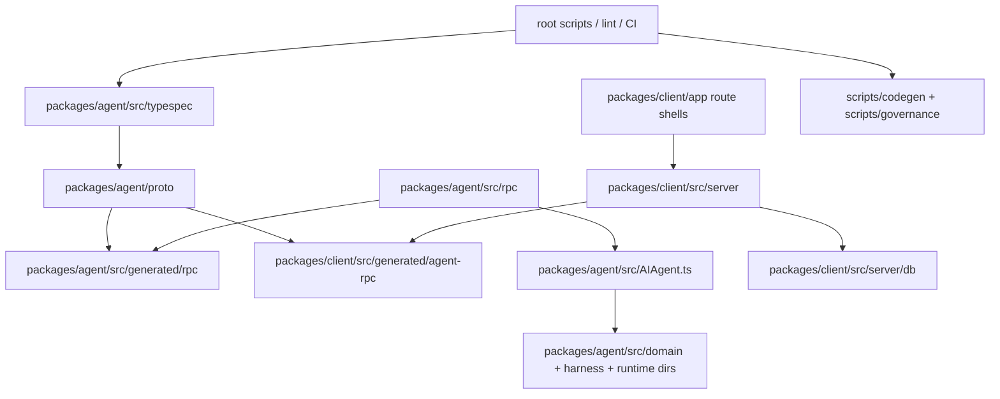
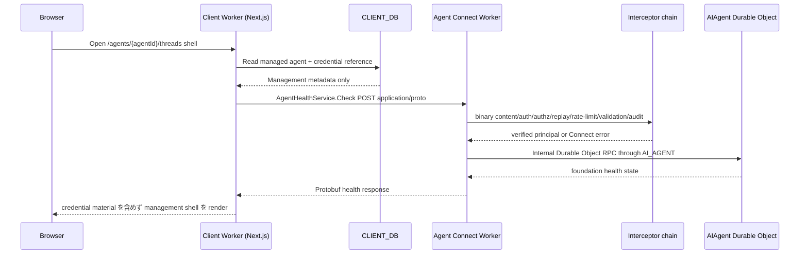
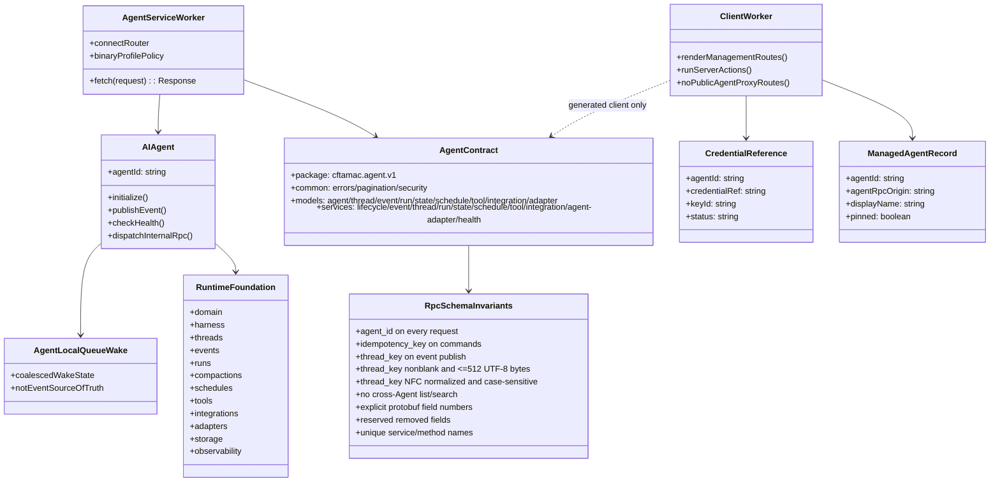
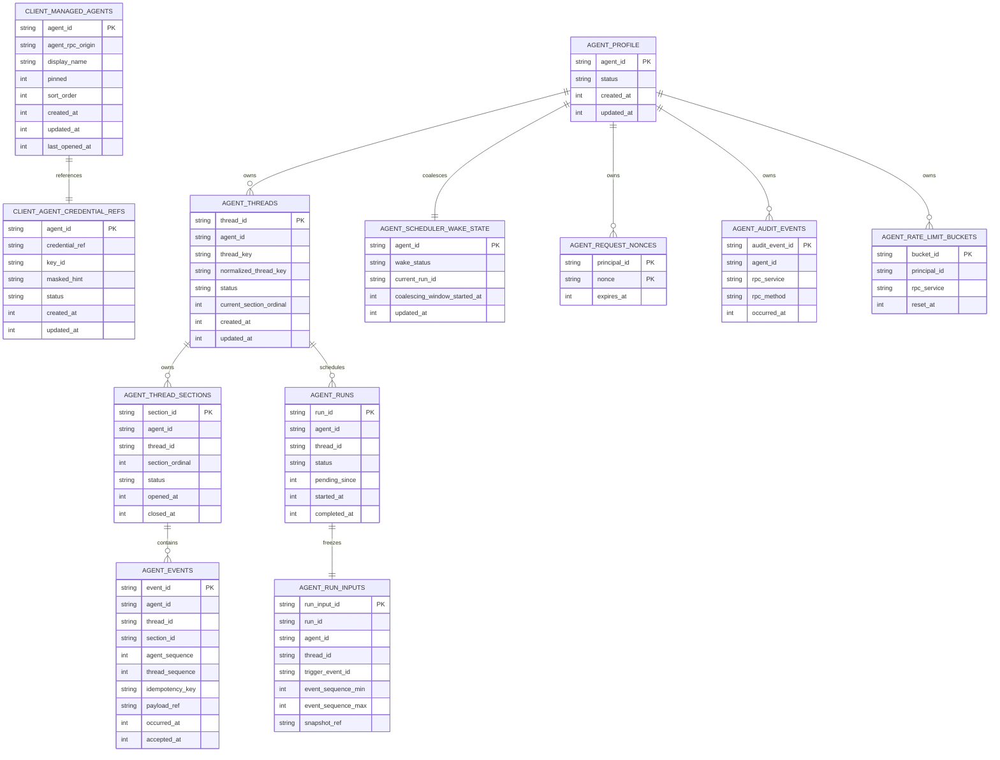
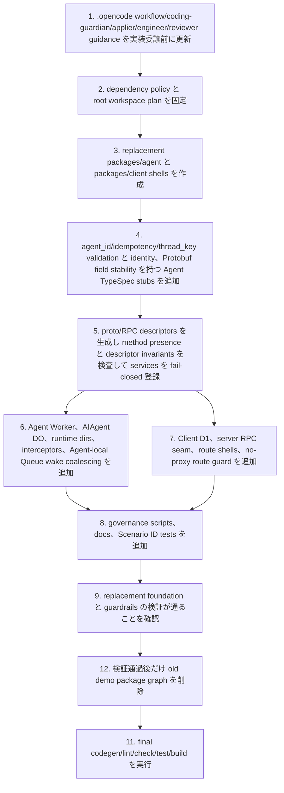

## Scope

この設計は `agent-platform`、`client`、`workspace-governance` の foundation 仕様を、`docs/memo/仕様設計・アーキテクチャ設定.md` に沿った package 構成、TypeSpec-to-proto 生成、Connect facade、Worker 分離、guardrail に落とし込む。

### In Scope

- `packages/agent` を Agent Service Worker として新設し、`packages/agent/src/typespec` に common/model/service stubs を揃える。common は `errors.tsp`、`pagination.tsp`、`security.tsp`、models は Agent/access credential/thread/section/event/run/compaction/history/memory/state/schedule/tool/integration/adapter、service files は lifecycle/event/thread/run/state/schedule/tool/integration/agent-adapter/health を含める（AGENT-PLATFORM-S001）。`packages/agent/src/typespec/src/services/agent-adapter.tsp` は service 名を `IntegrationIngressService` として定義し、`PublishEvent`、`PublishToolResult`、`PublishDeliveryResult` を持つ。
- TypeSpec から proto3 と Protobuf-ES generated code を生成し、Agent Worker と Client Worker の generated RPC output を command-owned にする（AGENT-PLATFORM-S001、WORKSPACE-GOVERNANCE-S001、S002）。
- 生成された proto/service descriptors に対し、RPC Service Inventory の service/method presence、すべての public request の `agent_id`、command request の `idempotency_key`、Event publish request の空文字ではなく 512 UTF-8 bytes 以下の `thread_key`、Agent-cross list/search RPC absence、Protobuf field number stability、service/method uniqueness を検査する codegen/governance seam を追加する（AGENT-PLATFORM-S001、S010、S011、S014、WORKSPACE-GOVERNANCE-S001、S002、S009）。
- 初期必須 transport を Connect + binary Protobuf unary RPC として実装し、unary binary content type、JSON/GET rejection、Connect code mapping を Worker adapter/interceptor で固定する（AGENT-PLATFORM-S002）。
- 生成された lifecycle/event/thread/run/state/schedule/tool/integration/`IntegrationIngressService`/health service descriptors を Connect router に登録し、health 以外の未実装 domain handler は Connect error で fail-closed する（AGENT-PLATFORM-S008、S009）。
- `AIAgent` Cloudflare Agents SDK Durable Object foundation、`AI_AGENT` Durable Object binding、Agent-owned storage/replay/idempotency/audit/rate-limit seams、runtime directories（domain、harness、threads、events、runs、compactions、schedules、tools、integrations、adapters、storage、observability）を追加する（AGENT-PLATFORM-S004、S005）。
- Agent-local Queue は Cloudflare Agents SDK の Agent-local Queue を scheduler wake/coalescing mechanism としてだけ使い、AgentEvent/Mailbox/pending Run の正本は `AIAgent` DO SQLite に置く。foundation storage として `agent_threads`、`agent_thread_sections`、`agent_events`、`agent_runs`、`agent_run_inputs`、scheduler wake/coalescing state を定義し、Cloudflare Queues product は初期構成に入れない（AGENT-PLATFORM-S005、S012）。
- Thread 解決は `agent_id` と Unicode NFC 正規化後かつ 512 UTF-8 bytes 以下の `thread_key` の組で行い、同じ組は同一 Thread、異なる `agent_id` は同じ normalized `thread_key` でも別 Thread とする。比較は case-sensitive とし、Integration/Adapter/Connection/principal 由来の暗黙 prefix は付与しない（AGENT-PLATFORM-S013）。
- authentication、authorization、replay-protection、validation、audit、rate-limit の interceptor hook seam を追加し、未検証 principal/scope/grant は default deny にする（AGENT-PLATFORM-S002、S008、S009）。
- `hello` / `users` demonstration domain、Agent REST/OpenAPI/Orval surface、Hono zod-openapi Agent routes、public Durable Object fetch API を replacement foundation の検証が通った後で削除し、active graph に残さない（AGENT-PLATFORM-S003、S006、S007）。
- Agent package boundary は旧 demo server の依存方向ルールを置き換える。許可方向は Worker entrypoint -> RPC adapter/router/interceptors -> service modules -> Agent domain/runtime modules -> Agent-owned storage/observability/types とし、逆方向 import、Client runtime import、demo package import、REST/OpenAPI/Orval contract import を禁止する。
- `packages/client` を Next.js on Cloudflare Workers の management Client Worker として新設し、Client D1 schema、server-side Agent RPC client、Agent registry/new/detail/settings に加えて detail section shells（threads、events、schedules、tools、integrations）を追加する（MANAGEMENT-CLIENT-S001〜S007）。
- Client は Agent API proxy route、`/api/client/*` Agent management API、Agent REST proxy route、arbitrary Agent RPC forwarding route を公開せず、Server Actions / Server Components を UI 内部の execution boundary に限定する（MANAGEMENT-CLIENT-S002、S008）。
- Client package boundary は旧 demo UI の依存方向ルールを Next.js に最適化して置き換える。許可方向は App Router pages/layouts -> Client components -> Server Components/Server Actions -> server-only modules -> Client D1 repositories / generated Agent RPC client とし、browser-visible modules から server-only modules、Agent credentials、Agent runtime source、direct Agent RPC construction、Agent proxy route へ到達する import を禁止する。
- 実装委譲を開始する前に、`.opencode/skills/coding-guardian/SKILL.md`、`.opencode/skills/coding-guardian/references/repo-entrypoints.md`、OpenSpec applier、unit agent/client/build agent definitions を Agent/Client restructure に合わせ、`packages/agent/**` と `packages/client/**` が permission/delegation/coding guardrail で認識されるようにする（WORKSPACE-GOVERNANCE-S008）。
- `.opencode` workflow baseline の更新後に、root scripts、lint/codegen drift checks、OpenSpec scenario coverage、supply-chain guardrails、README/AGENTS/CONTRIBUTING/CODING_STANDARDS を Agent/Client foundation に合わせる（WORKSPACE-GOVERNANCE-S001〜S008）。

### Out of Scope

- Integration Provider（Discord/Slack/Email など）本体、Provider 側 Tool/Delivery 実装、platform signature verification endpoint。
- Native gRPC compatibility gateway の実装。任意互換 profile として同一 proto 契約を使うことは妨げず、初期必須 transport は Connect + binary Protobuf に固定する。
- Health 以外の RPC の成功系 domain behavior。foundation では全 generated service を登録し、未実装 handler を Connect error で fail-closed にする。
- Production auth policy の細部。foundation では auth hook seam、metadata shape、default-deny wiring、test seam までを扱う。
- Polished management UI。foundation では App Router route shells、server-side RPC seam、Client D1 management ledger、demo-free navigation を扱う。
- Cloudflare Queues product を Agent mailbox、burst buffer、DLQ、または Event source of truth として使うこと。
- Agent Service が Agent 横断の list/search RPC を提供すること。
- Client が public Agent API proxy、`/api/client/*` Agent management API、または Agent REST proxy を公開すること。

## Assumptions / Dependencies

- Node.js 24.12+、pnpm 11.7+、Wrangler 4.x を維持する。
- 新規 dependencies は supply-chain policy を満たしてから追加する。候補: `@typespec/protobuf`, `@bufbuild/protobuf`, `@bufbuild/protoc-gen-es`, `@connectrpc/connect`, `@connectrpc/connect-web`, Cloudflare Agents SDK package, Next.js, Cloudflare/OpenNext adapter, Buf CLI 実行手段。
- `minimumReleaseAge: 4320`、`allowBuilds` 明示許可、`dangerouslyAllowAllBuilds` 禁止を維持する。
- dependency 追加・更新では `pnpm-lock.yaml` を command-owned lockfile として更新し、`package.json` / package-level `package.json` と整合した差分を review する。
- generated outputs は command で作成し、hand-edit しない。
- main specs は空のため、この change の delta specs は ADDED Requirements のみで archive/sync される。
- Client D1 migration は Client Worker 専用。Agent Worker は Client D1 を含む D1 binding を持たず、Agent-cross D1 も使わない。

## Impacted Areas

- Packages: `packages/agent/**`, `packages/client/**`, root workspace files, governance scripts. The old demo package graph is only an explicit deletion target and must not remain an active package boundary after replacement verification.
- API/contract: TypeSpec entrypoint、common/model/service stubs、proto output、Buf validation、Protobuf-ES output、Connect Worker facade、`agent_id` / `idempotency_key` / 空文字ではなく 512 UTF-8 bytes 以下の `thread_key` descriptor invariants、Thread key identity guard、explicit Protobuf field number/reserve/reuse guard、service/method uniqueness guard、Agent-cross list/search absence guard、Agent OpenAPI/Orval absence guard。
- Runtime: Agent Worker wrangler config、Client Worker/OpenNext wrangler config、`AI_AGENT` Durable Object binding for `AIAgent`、R2 binding、no Agent-side D1 binding、Client D1 binding、secret refs。
- Persistence: Agent DO SQLite foundation schema modules、Agent-local Queue wake coalescing state、Client D1 management ledger migration/repository。
- Security: Connect binary media type enforcement、JSON/GET rejection、authentication/authorization/replay-protection/rate-limit/audit hook seams、Connect code mapping。
- Client boundary: Server Actions / Server Components internal execution、no `/api/client/*` Agent management API、no Agent REST proxy、no arbitrary RPC forwarding route。
- Tooling: root `package.json`, `pnpm-workspace.yaml`, `tsconfig.base.json`, `eslint.config.js`, `vitest.config.ts`, CI, scripts under `scripts/**`。
- Tests: Agent RPC integration tests, Client server/component tests, E2E smoke tests, governance script tests, scenario coverage titles。
- Docs: `AGENTS.md`, `README.md`, `CONTRIBUTING.md`, `CODING_STANDARDS.md`。
- OpenCode governance: `.opencode/skills/coding-guardian/**`、`.opencode/agents/openspec/applier.md`、unit engineer/reviewer/designer/build agent definitions。

## Directory Tree

```text
cf-tamac
├─ AGENTS.md
├─ README.md
├─ CONTRIBUTING.md
├─ CODING_STANDARDS.md
├─ package.json
├─ pnpm-workspace.yaml
├─ pnpm-lock.yaml
├─ tsconfig.base.json
├─ tsconfig.json
├─ eslint.config.js
├─ vitest.config.ts
├─ .github
│  └─ workflows
│     └─ ci.yml
├─ .opencode
│  ├─ agents
│  │  ├─ openspec
│  │  │  └─ applier.md
│  │  └─ unit
│  │     ├─ agent
│  │     │  ├─ engineer.md
│  │     │  └─ reviewer.md
│  │     ├─ client
│  │     │  ├─ designer.md
│  │     │  ├─ engineer.md
│  │     │  └─ reviewer.md
│  │     └─ build
│  │        ├─ builder.md
│  │        └─ reviewer.md
│  └─ skills
│     └─ coding-guardian
│        ├─ SKILL.md
│        └─ references
│           └─ repo-entrypoints.md
├─ docs
│  └─ memo
│     └─ 仕様設計・アーキテクチャ設定.md
├─ openspec
│  ├─ changes
│  │  └─ establish-agent-service-foundation
│  │     ├─ proposal.md
│  │     ├─ design.md
│  │     ├─ tasks.md
│  │     └─ specs
│  │        ├─ agent-platform/spec.md
│  │        ├─ client/spec.md
│  │        └─ workspace-governance/spec.md
│  └─ specs
│     ├─ agent-platform/spec.md
│     ├─ client/spec.md
│     └─ workspace-governance/spec.md
├─ scripts
│  ├─ codegen
│  │  ├─ check-agent-codegen-drift.mjs
│  │  └─ check-agent-codegen-drift.test.mjs
│  ├─ governance
│  │  ├─ verify-agent-surface.mjs
│  │  ├─ verify-agent-surface.test.mjs
│  │  ├─ verify-package-boundaries.mjs
│  │  └─ verify-package-boundaries.test.mjs
│  ├─ openspec
│  │  ├─ verify-scenario-coverage.mjs
│  │  └─ verify-scenario-coverage.test.mjs
│  └─ security
│     ├─ verify-pnpm-supply-chain.mjs
│     └─ verify-pnpm-supply-chain.test.mjs
├─ packages
│  ├─ agent
│  │  ├─ package.json
│  │  ├─ tsconfig.json
│  │  ├─ vitest.config.ts
│  │  ├─ wrangler.toml
│  │  ├─ buf.yaml
│  │  ├─ buf.gen.yaml
│  │  ├─ src
│  │  │  ├─ index.ts
│  │  │  ├─ AIAgent.ts
│  │  │  ├─ env.ts
│  │  │  ├─ typespec
│  │  │  │  ├─ main.tsp
│  │  │  │  ├─ tspconfig.yaml
│  │  │  │  └─ src
│  │  │  │     ├─ common
│  │  │  │     │  ├─ errors.tsp
│  │  │  │     │  ├─ pagination.tsp
│  │  │  │     │  └─ security.tsp
│  │  │  │     ├─ models
│  │  │  │     │  ├─ agent.tsp
│  │  │  │     │  ├─ access-credential.tsp
│  │  │  │     │  ├─ thread.tsp
│  │  │  │     │  ├─ section.tsp
│  │  │  │     │  ├─ event.tsp
│  │  │  │     │  ├─ run.tsp
│  │  │  │     │  ├─ compaction.tsp
│  │  │  │     │  ├─ history.tsp
│  │  │  │     │  ├─ memory.tsp
│  │  │  │     │  ├─ state.tsp
│  │  │  │     │  ├─ schedule.tsp
│  │  │  │     │  ├─ tool.tsp
│  │  │  │     │  ├─ integration.tsp
│  │  │  │     │  └─ adapter.tsp
│  │  │  │     └─ services
│  │  │  │        ├─ agent-lifecycle.tsp
│  │  │  │        ├─ agent-event.tsp
│  │  │  │        ├─ agent-thread.tsp
│  │  │  │        ├─ agent-run.tsp
│  │  │  │        ├─ agent-state.tsp
│  │  │  │        ├─ agent-schedule.tsp
│  │  │  │        ├─ agent-tool.tsp
│  │  │  │        ├─ agent-integration.tsp
│  │  │  │        ├─ agent-adapter.tsp
│  │  │  │        └─ agent-health.tsp
│  │  │  ├─ generated
│  │  │  │  └─ rpc
│  │  │  │     └─ cftamac
│  │  │  │        └─ agent
│  │  │  │           └─ v1
│  │  │  │              └─ *_pb.ts
│  │  │  ├─ rpc
│  │  │  │  ├─ router.ts
│  │  │  │  ├─ connect-worker-adapter.ts
│  │  │  │  ├─ do-router.ts
│  │  │  │  ├─ errors.ts
│  │  │  │  ├─ services
│  │  │  │  │  ├─ lifecycle.ts
│  │  │  │  │  ├─ events.ts
│  │  │  │  │  ├─ threads.ts
│  │  │  │  │  ├─ runs.ts
│  │  │  │  │  ├─ state.ts
│  │  │  │  │  ├─ schedules.ts
│  │  │  │  │  ├─ tools.ts
│  │  │  │  │  ├─ integrations.ts
│  │  │  │  │  ├─ agent-adapter.ts
│  │  │  │  │  └─ health.ts
│  │  │  │  └─ interceptors
│  │  │  │     ├─ authentication.ts
│  │  │  │     ├─ authorization.ts
│  │  │  │     ├─ binary-content.ts
│  │  │  │     ├─ replay-protection.ts
│  │  │  │     ├─ validation.ts
│  │  │  │     ├─ audit.ts
│  │  │  │     └─ rate-limit.ts
│  │  │  ├─ domain/index.ts
│  │  │  ├─ harness/index.ts
│  │  │  ├─ threads/index.ts
│  │  │  ├─ events/index.ts
│  │  │  ├─ runs/index.ts
│  │  │  ├─ compactions/index.ts
│  │  │  ├─ schedules/index.ts
│  │  │  ├─ tools/index.ts
│  │  │  ├─ integrations/index.ts
│  │  │  ├─ adapters/index.ts
│  │  │  ├─ storage/schema.ts
│  │  │  ├─ observability/index.ts
│  │  │  └─ tests
│  │  │     ├─ contract-generation.test.ts
│  │  │     ├─ connect-binary.test.ts
│  │  │     ├─ forbidden-agent-surface.test.ts
│  │  │     ├─ agent-id-routing.test.ts
│  │  │     ├─ agent-worker-bindings.test.ts
│  │  │     ├─ forbidden-demo-routes.test.ts
│  │  │     ├─ agent-source-graph.test.ts
│  │  │     ├─ health-rpc.test.ts
│  │  │     ├─ fail-closed-routing.test.ts
│  │  │     ├─ rpc-schema-invariants.test.ts
│  │  │     ├─ command-event-invariants.test.ts
│  │  │     ├─ thread-key-identity.test.ts
│  │  │     ├─ protobuf-field-stability.test.ts
│  │  │     └─ agent-local-queue-wake.test.ts
│  │  └─ proto
│  │     └─ cftamac
│  │        └─ agent
│  │           └─ v1
│  │              └─ *.proto
│  └─ client
│     ├─ package.json
│     ├─ tsconfig.json
│     ├─ next.config.ts
│     ├─ open-next.config.ts
│     ├─ wrangler.toml
│     ├─ app
│     │  ├─ layout.tsx
│     │  ├─ page.tsx
│     │  └─ agents
│     │     ├─ page.tsx
│     │     ├─ new
│     │     │  └─ page.tsx
│     │     └─ [agentId]
│     │        ├─ page.tsx
│     │        ├─ threads/page.tsx
│     │        ├─ events/page.tsx
│     │        ├─ schedules/page.tsx
│     │        ├─ tools/page.tsx
│     │        ├─ integrations/page.tsx
│     │        └─ settings/page.tsx
│     └─ src
│        ├─ server
│        │  ├─ actions
│        │  │  └─ managed-agents.ts
│        │  ├─ agent-rpc
│        │  │  ├─ authentication.ts
│        │  │  └─ create-client.ts
│        │  └─ db
│        │     ├─ access-credentials.ts
│        │     ├─ managed-agents.ts
│        │     ├─ schema.ts
│        │     └─ migrations
│        │        └─ 0001_client_foundation.sql
│        ├─ generated
│        │  └─ agent-rpc
│        │     └─ cftamac
│        │        └─ agent
│        │           └─ v1
│        │              └─ *_pb.ts
│        └─ tests
│           ├─ agent-registry-shell.test.tsx
│           ├─ browser-agent-rpc-secrecy.test.ts
│           ├─ client-api-proxy-absence.test.ts
│           ├─ client-d1-schema.test.ts
│           ├─ client-repository-boundary.test.ts
│           ├─ client-bindings.test.ts
│           ├─ client-import-graph.test.ts
│           └─ management-navigation.test.tsx
├─ tests
│  └─ e2e
│     ├─ management-agent-registry.spec.ts
│     ├─ management-agent-rpc-secrecy.spec.ts
│     └─ management-navigation.spec.ts
└─ (old demo package graph removed after replacement verification)
```

## New / Changed Files

| Type        | File                                                                  | Change                                                                                                                                                                                             |
| ----------- | --------------------------------------------------------------------- | -------------------------------------------------------------------------------------------------------------------------------------------------------------------------------------------------- |
| Update      | `AGENTS.md`                                                           | Agent/Client commands, TypeSpec-to-proto source, generated-file policy, OpenSpec scenario policy を更新する。                                                                                      |
| Update      | `README.md`                                                           | template/demo API 説明を Agent Service foundation、Client Worker、codegen/runbook に置き換える。                                                                                                   |
| Update      | `CONTRIBUTING.md`                                                     | TypeSpec-to-proto、Buf、Protobuf-ES、scenario coverage、supply-chain workflow を明記する。                                                                                                         |
| Update      | `CODING_STANDARDS.md`                                                 | Agent/Client package boundaries、forbidden Agent API surface、generated output policy を enforcement に合わせる。                                                                                  |
| Reference   | `docs/memo/仕様設計・アーキテクチャ設定.md`                           | foundation 実装の設計基準として参照し、内容を実装側で書き換えない。                                                                                                                                |
| Update      | `openspec/changes/establish-agent-service-foundation/proposal.md`     | change scope、impact、workflow governance plan を記録する。                                                                                                                                        |
| Update      | `openspec/changes/establish-agent-service-foundation/design.md`       | Directory Tree、ER、test plan、workflow governance、storage foundation を記録する。                                                                                                                |
| Update      | `openspec/changes/establish-agent-service-foundation/tasks.md`        | implementation-ready checklist と verification tasks を記録する。                                                                                                                                  |
| Add         | `openspec/specs/agent-platform/spec.md`                               | archive/sync 後に Agent platform foundation spec を main spec へ反映する。                                                                                                                         |
| Add         | `openspec/specs/client/spec.md`                                       | archive/sync 後に management Client foundation spec を main spec へ反映する。                                                                                                                      |
| Add         | `openspec/specs/workspace-governance/spec.md`                         | archive/sync 後に workspace governance foundation spec を main spec へ反映する。                                                                                                                   |
| Update      | `package.json`                                                        | root scripts を `dev:agent`, `dev:client`, `gen:agent:proto`, `gen:agent:rpc`, `gen`, `check:codegen`, lint/test/build に再編する。                                                                |
| Update      | `pnpm-workspace.yaml`                                                 | workspace pattern を `packages/agent` / `packages/client` 中心にし、supply-chain guardrail を維持する。                                                                                            |
| Update      | `pnpm-lock.yaml`                                                      | dependency 追加・更新後の lockfile を command-owned 差分として更新し、package manifests と整合させる。                                                                                             |
| Update      | `tsconfig.base.json`                                                  | path aliases を `@cf-tamac/agent`、`@cf-tamac/client`、generated RPC paths に合わせる。                                                                                                            |
| Update      | `tsconfig.json`                                                       | package references/check 対象を Agent/Client foundation に合わせる。                                                                                                                               |
| Update      | `eslint.config.js`                                                    | Agent/Client boundaries、no OpenAPI/Orval/REST Agent surface、generated exclusions、Next server/client constraints を追加する。                                                                    |
| Update      | `vitest.config.ts`                                                    | projects を `agent`, `client`, governance script tests に合わせる。                                                                                                                                |
| Update      | `.github/workflows/ci.yml`                                            | codegen drift、lint、check、test の command names を foundation flow に合わせる。                                                                                                                  |
| Update      | `.opencode/skills/coding-guardian/SKILL.md`                           | Agent/Client restructure、generated RPC policy、OpenSpec/spec-test guardrail、verification commands を実装 agent の baseline に追加する。                                                          |
| Update      | `.opencode/skills/coding-guardian/references/repo-entrypoints.md`     | `packages/agent/**`、`packages/client/**`、Agent TypeSpec/proto/codegen、Client Worker、governance scripts を entrypoint として列挙する。                                                          |
| Update      | `.opencode/agents/openspec/applier.md`                                | Agent/Client package、codegen、governance、docs、`.opencode` workflow tasks の delegation map を更新する。                                                                                         |
| Move/Update | `.opencode/agents/unit/agent/engineer.md`                             | `packages/agent/**`、Agent TypeSpec/proto/codegen/governance tasks を Agent Service scope として認識する。                                                                                         |
| Move/Update | `.opencode/agents/unit/agent/reviewer.md`                             | `packages/agent/**` と Agent governance tasks を review scope として認識する。                                                                                                                     |
| Move/Update | `.opencode/agents/unit/client/engineer.md`                            | `packages/client/**` の App Router、Server Actions、server-side Agent RPC client、Client D1 tasks を Next.js Client scope として認識し、generated RPC hand edit を禁止する。                       |
| Move/Update | `.opencode/agents/unit/client/reviewer.md`                            | `packages/client/**`、management UI shell、server-only RPC boundary、no-proxy route を review scope として認識する。                                                                               |
| Move/Update | `.opencode/agents/unit/client/designer.md`                            | Client management UI wireframe/spec ownership と `packages/client/**` integration guidance を設計し、必要な UI decision を `openspec/changes/**` に残す。                                          |
| Update      | `.opencode/agents/unit/build/builder.md`                              | Agent/Client generation、lint、test、build、governance verification commands を execution support scope に追加する。                                                                               |
| Update      | `.opencode/agents/unit/build/reviewer.md`                             | Agent/Client generated-output drift、workflow governance、final gate review 観点を追加する。                                                                                                       |
| Add         | `scripts/codegen/check-agent-codegen-drift.mjs`                       | Agent proto/RPC drift、public Agent OpenAPI absence、Protobuf field stability、service/method uniqueness を検査する。                                                                              |
| Add         | `scripts/codegen/check-agent-codegen-drift.test.mjs`                  | WORKSPACE-GOVERNANCE-S001/S002/S009 と Agent descriptor invariants の fixture tests を追加する。                                                                                                   |
| Add         | `scripts/governance/verify-agent-surface.mjs`                         | forbidden Agent REST/OpenAPI/Orval/JSON surface を検査する。                                                                                                                                       |
| Add         | `scripts/governance/verify-agent-surface.test.mjs`                    | WORKSPACE-GOVERNANCE-S003 の automated fixture tests。                                                                                                                                             |
| Add         | `scripts/governance/verify-package-boundaries.mjs`                    | Agent/Client runtime coupling と binding boundary を検査する。                                                                                                                                     |
| Add         | `scripts/governance/verify-package-boundaries.test.mjs`               | WORKSPACE-GOVERNANCE-S004 の automated fixture tests。                                                                                                                                             |
| Update      | `scripts/openspec/verify-scenario-coverage.mjs`                       | foundation spec IDs と test title coverage を現在の rules に合わせて維持・検証する。                                                                                                               |
| Add         | `scripts/openspec/verify-scenario-coverage.test.mjs`                  | WORKSPACE-GOVERNANCE-S005 の scenario coverage fixture tests。                                                                                                                                     |
| Update      | `scripts/security/verify-pnpm-supply-chain.mjs`                       | foundation dependencies 追加後も release-age/build-script policy を検査する。                                                                                                                      |
| Add         | `scripts/security/verify-pnpm-supply-chain.test.mjs`                  | WORKSPACE-GOVERNANCE-S007 の supply-chain fixture tests。                                                                                                                                          |
| Add         | `packages/agent/package.json`                                         | Agent Worker package の scripts/dependencies/exports を定義する。                                                                                                                                  |
| Add         | `packages/agent/tsconfig.json`                                        | Agent TypeScript check 設定を追加する。                                                                                                                                                            |
| Add         | `packages/agent/vitest.config.ts`                                     | Agent RPC/Worker tests 設定を追加する。                                                                                                                                                            |
| Add         | `packages/agent/wrangler.toml`                                        | Agent Worker bindings として `AIAgent` 用 `AI_AGENT` Durable Object binding、R2、secrets を定義し、D1 binding、`CLIENT_DB`、Cloudflare Queues は定義しない。                                       |
| Add         | `packages/agent/buf.yaml`                                             | Buf lint/breaking 設定を追加する。                                                                                                                                                                 |
| Add         | `packages/agent/buf.gen.yaml`                                         | Agent と Client outputs 向け Protobuf-ES generation targets を追加する。                                                                                                                           |
| Add         | `packages/agent/src/index.ts`                                         | Worker `fetch` entrypoint を Connect adapter へ配線する。                                                                                                                                          |
| Add         | `packages/agent/src/AIAgent.ts`                                       | Cloudflare Agents SDK `AIAgent` Durable Object foundation と internal RPC methods を追加する。                                                                                                     |
| Add         | `packages/agent/src/env.ts`                                           | Agent Worker binding types と no-Client-DB type boundary を追加する。                                                                                                                              |
| Add         | `packages/agent/src/typespec/main.tsp`                                | 全 foundation common/model/service stubs を import する Agent TypeSpec root と protobuf package を定義する。                                                                                       |
| Add         | `packages/agent/src/typespec/tspconfig.yaml`                          | TypeSpec protobuf emitter output config を追加する。                                                                                                                                               |
| Add         | `packages/agent/src/typespec/src/common/errors.tsp`                   | foundation RPC 用 common error/status messages を追加する。                                                                                                                                        |
| Add         | `packages/agent/src/typespec/src/common/pagination.tsp`               | pagination request/response model stubs を追加する。                                                                                                                                               |
| Add         | `packages/agent/src/typespec/src/common/security.tsp`                 | foundation hooks 用 metadata/security common message shapes を追加する。                                                                                                                           |
| Add         | `packages/agent/src/typespec/src/models/*.tsp`                        | Agent、credential、thread、section、event、run、compaction、history、memory、state、schedule、tool、integration、adapter model stubs を追加する。                                                  |
| Add         | `packages/agent/src/typespec/src/services/*.tsp`                      | lifecycle/event/thread/run/state/schedule/tool/integration/agent-adapter/health service files を追加する。                                                                                         |
| Add         | `packages/agent/src/typespec/src/services/agent-adapter.tsp`          | service 名は `IntegrationIngressService` とし、`PublishEvent`、`PublishToolResult`、`PublishDeliveryResult` RPC stubs を追加する。                                                                 |
| Generated   | `packages/agent/proto/cftamac/agent/v1.proto`                         | TypeSpec protobuf emitter が生成する。                                                                                                                                                             |
| Generated   | `packages/agent/src/generated/rpc/cftamac/agent/v1_pb.ts`             | Protobuf-ES が生成する Agent RPC descriptors。                                                                                                                                                     |
| Generated   | `packages/client/src/generated/agent-rpc/cftamac/agent/v1_pb.ts`      | Protobuf-ES が生成する Client RPC descriptors。                                                                                                                                                    |
| Add         | `packages/agent/src/rpc/router.ts`                                    | 全 generated services の Connect service registration と fail-closed method routing を追加する。                                                                                                   |
| Add         | `packages/agent/src/rpc/connect-worker-adapter.ts`                    | Connect binary profile enforcement と JSON/GET rejection を持つ Worker `fetch()` adapter を追加する。                                                                                              |
| Add         | `packages/agent/src/rpc/do-router.ts`                                 | `agent_id` から `AIAgent` Durable Object RPC へ dispatch する。                                                                                                                                    |
| Add         | `packages/agent/src/rpc/errors.ts`                                    | domain/foundation error から Connect code への mapping を追加する。                                                                                                                                |
| Add         | `packages/agent/src/rpc/services/*.ts`                                | health handler と lifecycle/event/thread/run/state/schedule/tool/integration/`IntegrationIngressService` methods 用 fail-closed service modules を追加する。                                       |
| Add         | `packages/agent/src/rpc/services/agent-adapter.ts`                    | TypeSpec の `agent-adapter.tsp` で定義された `IntegrationIngressService` の `PublishEvent`、`PublishToolResult`、`PublishDeliveryResult` を fail-closed で登録する service module を追加する。     |
| Add         | `packages/agent/src/rpc/interceptors/authentication.ts`               | agent-scoped methods 向け fail-closed default を持つ authentication hook seam を追加する。                                                                                                         |
| Add         | `packages/agent/src/rpc/interceptors/authorization.ts`                | deny-by-default scope/grant evaluation を持つ authorization hook seam を追加する。                                                                                                                 |
| Add         | `packages/agent/src/rpc/interceptors/binary-content.ts`               | Binary Protobuf content-type と HTTP method checks を追加する。                                                                                                                                    |
| Add         | `packages/agent/src/rpc/interceptors/replay-protection.ts`            | timestamp/nonce/idempotency hook seam を追加する。                                                                                                                                                 |
| Add         | `packages/agent/src/rpc/interceptors/validation.ts`                   | request validation hook seam を追加する。                                                                                                                                                          |
| Add         | `packages/agent/src/rpc/interceptors/audit.ts`                        | audit context hook seam を追加する。                                                                                                                                                               |
| Add         | `packages/agent/src/rpc/interceptors/rate-limit.ts`                   | fail-closed error mapping を持つ rate-limit hook seam を追加する。                                                                                                                                 |
| Add         | `packages/agent/src/domain/index.ts`                                  | Agent aggregate domain foundation exports を追加する。                                                                                                                                             |
| Add         | `packages/agent/src/harness/index.ts`                                 | Agent harness foundation exports を追加する。                                                                                                                                                      |
| Add         | `packages/agent/src/threads/index.ts`                                 | Thread foundation exports を追加する。                                                                                                                                                             |
| Add         | `packages/agent/src/events/index.ts`                                  | AgentEvent foundation exports を追加する。                                                                                                                                                         |
| Add         | `packages/agent/src/runs/index.ts`                                    | AgentRun foundation exports を追加する。                                                                                                                                                           |
| Add         | `packages/agent/src/compactions/index.ts`                             | Compaction/history/memory foundation exports を追加する。                                                                                                                                          |
| Add         | `packages/agent/src/schedules/index.ts`                               | Schedule foundation exports を追加する。                                                                                                                                                           |
| Add         | `packages/agent/src/tools/index.ts`                                   | Tool/invocation foundation exports を追加する。                                                                                                                                                    |
| Add         | `packages/agent/src/integrations/index.ts`                            | Integration/installation foundation exports を追加する。                                                                                                                                           |
| Add         | `packages/agent/src/adapters/index.ts`                                | Adapter/delivery foundation exports を追加する。                                                                                                                                                   |
| Add         | `packages/agent/src/storage/schema.ts`                                | Agent DO SQLite foundation schema constants for profile、credentials/principals、thread/section/event/run/input snapshot、scheduler wake/coalescing、replay/idempotency、audit、rate-limit seeds。 |
| Add         | `packages/agent/src/observability/index.ts`                           | shared log/metric context foundation を追加する。                                                                                                                                                  |
| Add         | `packages/agent/src/tests/contract-generation.test.ts`                | AGENT-PLATFORM-S001 の TypeSpec/proto generation と Agent OpenAPI absence を検査する。                                                                                                             |
| Add         | `packages/agent/src/tests/connect-binary.test.ts`                     | AGENT-PLATFORM-S002 の binary Connect acceptance と JSON/GET rejection を検査する。                                                                                                                |
| Add         | `packages/agent/src/tests/forbidden-agent-surface.test.ts`            | AGENT-PLATFORM-S003 の REST/OpenAPI/Orval surface absence を検査する。                                                                                                                             |
| Add         | `packages/agent/src/tests/agent-id-routing.test.ts`                   | AGENT-PLATFORM-S004 の `agent_id` to `AIAgent` identity routing を検査する。                                                                                                                       |
| Add         | `packages/agent/src/tests/agent-worker-bindings.test.ts`              | AGENT-PLATFORM-S005 の Agent Worker binding boundary を検査する。                                                                                                                                  |
| Add         | `packages/agent/src/tests/forbidden-demo-routes.test.ts`              | AGENT-PLATFORM-S006 の demo route absence を検査する。                                                                                                                                             |
| Add         | `packages/agent/src/tests/agent-source-graph.test.ts`                 | AGENT-PLATFORM-S007 の demo domain reachability absence を検査する。                                                                                                                               |
| Add         | `packages/agent/src/tests/health-rpc.test.ts`                         | AGENT-PLATFORM-S008 の health RPC facade path を検査する。                                                                                                                                         |
| Add         | `packages/agent/src/tests/fail-closed-routing.test.ts`                | AGENT-PLATFORM-S009 の generated method fail-closed behavior を検査する。                                                                                                                          |
| Add         | `packages/agent/src/tests/rpc-schema-invariants.test.ts`              | AGENT-PLATFORM-S010 の `agent_id` と Agent-cross list/search absence を descriptor から検査する。                                                                                                  |
| Add         | `packages/agent/src/tests/command-event-invariants.test.ts`           | AGENT-PLATFORM-S011 の command `idempotency_key` と Event publish `thread_key` の未指定/空文字/512 UTF-8 bytes 超過 rejection を検査する。                                                         |
| Add         | `packages/agent/src/tests/thread-key-identity.test.ts`                | AGENT-PLATFORM-S013 の受理された 512 UTF-8 bytes 以下の same `agent_id` + normalized `thread_key` identity、case-sensitive comparison、no implicit prefix、cross-Agent separation を検査する。     |
| Add         | `packages/agent/src/tests/protobuf-field-stability.test.ts`           | AGENT-PLATFORM-S014 の explicit `@field(n)`、reserved field、field number reuse、service/method uniqueness guard を検査する。                                                                      |
| Add         | `packages/agent/src/tests/agent-local-queue-wake.test.ts`             | AGENT-PLATFORM-S012 の Agent-local Queue wake coalescing と Event 正本境界を検査する。                                                                                                             |
| Add         | `packages/client/package.json`                                        | Next.js Client Worker package の scripts/dependencies/exports を追加する。                                                                                                                         |
| Add         | `packages/client/tsconfig.json`                                       | Client TS 設定を追加する。                                                                                                                                                                         |
| Add         | `packages/client/next.config.ts`                                      | Cloudflare adapter 向け Next.js App Router 設定を追加する。                                                                                                                                        |
| Add         | `packages/client/open-next.config.ts`                                 | Cloudflare/OpenNext adapter 設定を追加する。                                                                                                                                                       |
| Add         | `packages/client/wrangler.toml`                                       | Client Worker の `CLIENT_DB` と credential secret refs を定義し、`AI_AGENT` は定義しない。                                                                                                         |
| Add         | `packages/client/app/**/*.tsx`                                        | Agent registry、registration、detail overview、threads、events、schedules、tools、integrations、settings shell routes を追加する。                                                                 |
| Add         | `packages/client/src/server/db/schema.ts`                             | Client D1 management ledger schema を追加する。                                                                                                                                                    |
| Add         | `packages/client/src/server/db/migrations/0001_client_foundation.sql` | Client D1 initial migration を追加する。                                                                                                                                                           |
| Add         | `packages/client/src/server/db/managed-agents.ts`                     | management-only writes に限定した managed Agent repository を追加する。                                                                                                                            |
| Add         | `packages/client/src/server/db/access-credentials.ts`                 | plaintext credential body を保存しない credential reference repository。                                                                                                                           |
| Add         | `packages/client/src/server/actions/managed-agents.ts`                | Agent registry shell 用 Server Actions を追加する。                                                                                                                                                |
| Add         | `packages/client/src/server/agent-rpc/create-client.ts`               | server-side generated Connect client factory を追加する。                                                                                                                                          |
| Add         | `packages/client/src/server/agent-rpc/authentication.ts`              | Client Service auth metadata foundation を追加する。                                                                                                                                               |
| Add         | `packages/client/src/tests/agent-registry-shell.test.tsx`             | MANAGEMENT-CLIENT-S001 の registry/detail shell rendering を検査する。                                                                                                                             |
| Add         | `packages/client/src/tests/browser-agent-rpc-secrecy.test.ts`         | MANAGEMENT-CLIENT-S002 の browser bundle / server-only Agent RPC boundary を検査する。                                                                                                             |
| Add         | `packages/client/src/tests/client-api-proxy-absence.test.ts`          | MANAGEMENT-CLIENT-S008 の Agent API proxy route absence を検査する。                                                                                                                               |
| Add         | `packages/client/src/tests/client-d1-schema.test.ts`                  | MANAGEMENT-CLIENT-S003 の Client D1 table boundary を検査する。                                                                                                                                    |
| Add         | `packages/client/src/tests/client-repository-boundary.test.ts`        | MANAGEMENT-CLIENT-S004 の Agent-domain snapshot write absence を検査する。                                                                                                                         |
| Add         | `packages/client/src/tests/client-bindings.test.ts`                   | MANAGEMENT-CLIENT-S005 の Client Worker binding isolation を検査する。                                                                                                                             |
| Add         | `packages/client/src/tests/client-import-graph.test.ts`               | MANAGEMENT-CLIENT-S006 の generated RPC import と Agent runtime source absence を検査する。                                                                                                        |
| Add         | `packages/client/src/tests/management-navigation.test.tsx`            | MANAGEMENT-CLIENT-S007 の management navigation と demo route absence を検査する。                                                                                                                 |
| Add         | `tests/e2e/management-agent-registry.spec.ts`                         | MANAGEMENT-CLIENT-S001 の Browser から見える registry shell smoke を検査する。                                                                                                                     |
| Add         | `tests/e2e/management-agent-rpc-secrecy.spec.ts`                      | MANAGEMENT-CLIENT-S002 の Browser から見える credential/RPC absence smoke を検査する。                                                                                                             |
| Add         | `tests/e2e/management-navigation.spec.ts`                             | MANAGEMENT-CLIENT-S007 の Browser から見える navigation smoke を検査する。                                                                                                                         |
| Delete      | old demo server package graph                                         | replacement Agent package/codegen/governance/tests の検証後に active workspace graph から外す。                                                                                                    |
| Delete      | old demo UI package graph                                             | replacement Client package/routes/tests の検証後に active workspace graph から外す。                                                                                                               |
| Delete      | old demo contract package graph                                       | Agent TypeSpec-to-proto pipeline の検証後に active workspace graph から外す。                                                                                                                      |
| Delete      | `wrangler.toml`                                                       | single Worker config を package-level Agent/Client Worker configs で置き換える。                                                                                                                   |

## System Diagram

```mermaid
flowchart LR
  Browser[Browser]
  Client[packages/client\nNext.js Worker]
  ClientDB[(CLIENT_DB\nClient D1)]
  AgentRPC[packages/agent\nConnect RPC Worker]
  AIAgent[AIAgent Durable Object\nAI_AGENT binding]
  DOSQLite[(DO SQLite)]
  LocalQueue[Agent-local Queue\nwake/coalescing only]
  R2[(Agent R2 blobs)]
  TypeSpec[packages/agent/src/typespec]
  Proto[packages/agent/proto\ncftamac.agent.v1]
  GenAgent[packages/agent/src/generated/rpc]
  GenClient[packages/client/src/generated/agent-rpc]
  OptionalGrpc[optional native gRPC compatibility\nsame proto only]

  Browser -->|HTML/RSC/Server Actions only| Client
  Client <--> ClientDB
  Client -->|Connect + binary Protobuf| AgentRPC
  OptionalGrpc -. same proto / compatibility .-> AgentRPC
  AgentRPC -->|Durable Object RPC| AIAgent
  AIAgent <--> DOSQLite
  AIAgent -->|coalesced scheduler wake| LocalQueue
  DOSQLite -->|Event / pending Run source of truth| AIAgent
  AIAgent <--> R2
  TypeSpec -->|@typespec/protobuf| Proto
  Proto -->|Buf / Protobuf-ES| GenAgent
  Proto -->|Buf / Protobuf-ES| GenClient
```

## Package Diagram



## RPC Service Inventory

Foundation TypeSpec は memo 9.2〜9.11 の public RPC service と method を descriptor level で定義する。`AgentIntegrationService` は install/uninstall に加えて Adapter Connection 管理（`CreateAdapterConnection`、`DeleteAdapterConnection`、`ListAdapterConnections`）を所有する。Integration から Agent へ入る callback surface は `packages/agent/src/typespec/src/services/agent-adapter.tsp` で `IntegrationIngressService` として定義し、`PublishEvent`、`PublishToolResult`、`PublishDeliveryResult` を持つ。

各 TypeSpec message field は TypeSpec source で `@field(n)` を明示する。削除済み field number/name は `@reserve` または generated proto の `reserved` で保持し、field number reuse は codegen drift check の failure にする。Service 名は `cftamac.agent.v1` package 内で一意、method 名は同一 service 内で一意にし、重複は descriptor guard で拒否する。

| Service                     | Planned TypeSpec file                                            | RPC methods required in foundation descriptors                                                                                                                       | Descriptor check                                                                                                                                                                                                              |
| --------------------------- | ---------------------------------------------------------------- | -------------------------------------------------------------------------------------------------------------------------------------------------------------------- | ----------------------------------------------------------------------------------------------------------------------------------------------------------------------------------------------------------------------------- |
| `AgentLifecycleService`     | `packages/agent/src/typespec/src/services/agent-lifecycle.tsp`   | `InitializeAgent`, `GetAgent`, `DestroyAgent`, `RotateAgentCredential`                                                                                               | service と全 method の存在、command request の `idempotency_key`、全 request の `agent_id` を検査する。                                                                                                                       |
| `AgentEventService`         | `packages/agent/src/typespec/src/services/agent-event.tsp`       | `PublishEvent`, `GetEvent`, `ListEvents`                                                                                                                             | `PublishEvent` の空文字ではなく 512 UTF-8 bytes 以下の `thread_key`、command `idempotency_key`、全 request の `agent_id` を検査する。                                                                                         |
| `AgentThreadService`        | `packages/agent/src/typespec/src/services/agent-thread.tsp`      | `ListThreads`, `GetThread`, `ListSections`, `GetLatestCompaction`, `GetThreadMemory`, `SearchThreadHistory`                                                          | Agent-scoped query として全 request の `agent_id` を検査し、Agent-cross search ではないことを method allowlist で検査する。                                                                                                   |
| `AgentRunService`           | `packages/agent/src/typespec/src/services/agent-run.tsp`         | `GetRun`, `ListRuns`, `CancelRun`                                                                                                                                    | `CancelRun` の `idempotency_key` と全 request の `agent_id` を検査する。                                                                                                                                                      |
| `AgentStateService`         | `packages/agent/src/typespec/src/services/agent-state.tsp`       | `GetState`, `GetConfig`, `UpdateConfig`                                                                                                                              | `UpdateConfig` の `idempotency_key` と全 request の `agent_id` を検査する。                                                                                                                                                   |
| `AgentScheduleService`      | `packages/agent/src/typespec/src/services/agent-schedule.tsp`    | `CreateSchedule`, `GetSchedule`, `ListSchedules`, `CancelSchedule`                                                                                                   | create/cancel command の `idempotency_key` と全 request の `agent_id` を検査する。                                                                                                                                            |
| `AgentToolService`          | `packages/agent/src/typespec/src/services/agent-tool.tsp`        | `ListTools`, `GetInvocation`, `ListInvocations`, `ApproveInvocation`, `RejectInvocation`                                                                             | approve/reject command の `idempotency_key` と全 request の `agent_id` を検査する。                                                                                                                                           |
| `AgentIntegrationService`   | `packages/agent/src/typespec/src/services/agent-integration.tsp` | `InstallIntegration`, `UninstallIntegration`, `GetInstallation`, `ListInstallations`, `CreateAdapterConnection`, `DeleteAdapterConnection`, `ListAdapterConnections` | install/uninstall/create/delete command の `idempotency_key`、全 request の `agent_id`、Integration Installation principal からの deny を検査する。                                                                           |
| `IntegrationIngressService` | `packages/agent/src/typespec/src/services/agent-adapter.tsp`     | `PublishEvent`, `PublishToolResult`, `PublishDeliveryResult`                                                                                                         | Integration ingress callback service の存在、`PublishEvent` の空文字ではなく 512 UTF-8 bytes 以下の `thread_key`、command `idempotency_key`、全 request の `agent_id`、config/install/approval RPC を含まないことを検査する。 |
| `AgentHealthService`        | `packages/agent/src/typespec/src/services/agent-health.tsp`      | `Check`                                                                                                                                                              | health request の Agent scope と Connect binary path を検査する。                                                                                                                                                             |

Descriptor inventory checks は、method の過不足、service 名の typo、`IntegrationIngressService` と `AgentIntegrationService` の混同、Agent-cross list/search method の混入、明示 field number の欠落、reserved field 漏れ、field number reuse、service/method 重複を fail させる。

## Sequence Diagram



## UI Wireframes

N/A — この foundation では wireframe をまだ生成しない。必要な UI/UX decision は `.opencode/agents/unit/client/designer.md` の更新計画と tasks で扱う。

## Domain Model Diagram



## ER Diagram



この ER は foundation storage contract だけを固定する。`agent_threads` は `(agent_id, normalized_thread_key)` を unique にし、`normalized_thread_key` は Unicode NFC 正規化済み、512 UTF-8 bytes 以下、case-sensitive、暗黙 prefix なしの比較キーとして扱う。`agent_events` は Event log / Mailbox の正本であり、`agent_runs` と `agent_run_inputs` は pending Run と入力 snapshot の最小 metadata を保持する。`agent_scheduler_wake_state` は wake の pending/running/coalesced 状態を保存するが、full harness、model invocation、compaction、Tool 実行は後続 stage の domain behavior とする。

## Package-Level Design

### Package List

| Package              | Purpose / Responsibility                                                                                    | Public API                                                         | Dependencies                                                                     |
| -------------------- | ----------------------------------------------------------------------------------------------------------- | ------------------------------------------------------------------ | -------------------------------------------------------------------------------- |
| `packages/agent`     | Agent Service Worker、TypeSpec-to-proto 契約、Connect facade、AIAgent DO foundation を所有する。            | Worker `fetch`、generated Connect services、`AIAgent` binding      | Cloudflare Workers、Cloudflare Agents SDK、Connect、Protobuf-ES、generated proto |
| `packages/client`    | Next.js management Client Worker、Client D1 ledger、server-side Agent RPC client、route shells を所有する。 | Next.js routes、Server Actions、generated Agent RPC client factory | Next.js、Cloudflare/OpenNext adapter、Connect client、Client D1                  |
| `scripts/codegen`    | Agent codegen drift と generated output verification を root command から実行する。                         | root package scripts から呼ぶ CLI scripts                          | Node.js、git、pnpm commands                                                      |
| `scripts/governance` | forbidden surface、package boundary、`.opencode` workflow alignment を検査する。                            | CLI scripts と fixtures/tests                                      | Node.js fs/path、Vitest または node:test                                         |
| root workspace       | commands、lint、TS paths、CI、supply-chain policy を束ねる。                                                | `pnpm` scripts、ESLint、Vitest projects、GitHub Actions            | pnpm、ESLint、Vitest、OpenSpec                                                   |
| docs / `.opencode`   | developer guidance、review runbooks、subagent permission/delegation baseline を提供する。                   | Markdown docs と agent/skill definitions                           | OpenSpec/spec-test contract、coding-guardian                                     |

### Details

#### `packages/agent`

- 責務: Agent Service の公開 RPC contract、Worker entrypoint、Connect facade、`AIAgent` DO foundation、Agent-owned storage/binding を所有する。Client D1 や management UI は所有しない。
- 公開 API: `cftamac.agent.v1` から生成した Connect binary Protobuf service endpoints、RPC Service Inventory の全 generated service registration、foundation `AgentHealthService.Check`、Worker `fetch` entrypoint。REST/OpenAPI/JSON/Browser direct/proxy API は公開しない。
- 主なデータ構造: generated Protobuf messages、`Env`、`AgentScope`、request descriptor invariant metadata（`agent_id` / `idempotency_key` / 空文字ではなく 512 UTF-8 bytes 以下の `thread_key`）、TypeSpec field-number metadata、reserved field metadata、foundation audit/replay/rate-limit metadata、`agent_threads`（`normalized_thread_key` を含む）、`agent_thread_sections`、`agent_events`、`agent_runs`、`agent_run_inputs`、Agent-local Queue wake coalescing state、DO SQLite schema constants、runtime module index types。
- 主な流れ: TypeSpec compile -> proto -> Buf -> Protobuf-ES -> RPC Service Inventory、field stability、descriptor invariant checks -> Connect router -> interceptor chain -> DO RPC dispatcher -> handler response または fail-closed Connect error。Event publish は `thread_key` の未指定/空文字/512 UTF-8 bytes 超過を拒否し、Unicode NFC 正規化後の 512 UTF-8 bytes 以下の値を case-sensitive かつ暗黙 prefix なしで `(agent_id, normalized_thread_key)` lookup -> DO SQLite の Thread/Section 解決 -> Event append -> pending Run/Input metadata 保存 -> coalesced Agent-local Queue wake の順に進む。
- 依存関係: contract generation は `@typespec/protobuf`、descriptor generation は Buf/Protobuf-ES、Worker facade は Connect、`AIAgent` は Cloudflare Agents SDK を使う。
- error handling: binary profile 違反は `unimplemented` または `invalid_argument`、malformed Protobuf は `invalid_argument`、authn/authz hooks は `unauthenticated` / `permission_denied` で fail closed、rate limit は `resource_exhausted`、未実装 generated handler は `unimplemented` に map する。raw REST paths は domain handler へ到達しない。
- test strategy: `packages/agent/src/tests` の Vitest/Workers integration tests が AGENT-PLATFORM-S001〜S014 を bracketed Scenario ID 付き title で検査し、`contract-generation.test.ts`、`rpc-schema-invariants.test.ts`、`command-event-invariants.test.ts`、`protobuf-field-stability.test.ts` が RPC Service Inventory、service/method presence、field number stability、未指定/空文字/512 UTF-8 bytes 超過の `thread_key` rejection を検査し、`thread-key-identity.test.ts` が受理された key の Thread identity invariant を検査する。
- 非機能: deterministic generation、public REST/OpenAPI/Orval Agent surface なし、Agent-cross list/search RPC なし、Cloudflare Queues product mailbox binding なし、Agent-local Queue は wake/coalescing 専用。
- 性能: 初期 RPC は unary/fetch-based とし、generated descriptors は Worker module instance ごとに一度だけ読み込む。rate-limit hook の metadata read は bounded にする。
- security: browser direct API なし、request body `agent_id`、command `idempotency_key`、Event publish `thread_key` は未指定/空文字/512 UTF-8 bytes 超過を拒否、Thread identity は `agent_id` と normalized `thread_key` の組に限定、binary content enforcement、default-deny auth hooks、replay/rate-limit/audit hook seams、Agent-side D1 binding と Client D1 binding なし。

#### `packages/client`

- 責務: Browser-facing management shell、Client-owned D1 ledger、server-side Agent RPC invocation を所有する。Agent domain data は Agent 側に残し、実装後は Agent RPC 経由で読む。
- 公開 API: `/agents`、`/agents/new`、`/agents/[agentId]`、`/agents/[agentId]/threads`、`/agents/[agentId]/events`、`/agents/[agentId]/schedules`、`/agents/[agentId]/tools`、`/agents/[agentId]/integrations`、`/agents/[agentId]/settings` の Next.js App Router pages、management ledger 用 Server Actions、server-only Agent RPC client factory。`/api/client/*` Agent management API、Agent REST proxy、arbitrary Agent RPC forwarding route は公開しない。
- 主なデータ構造: `client_managed_agents`、`client_agent_credential_refs`、generated Agent RPC descriptors、Server Action input types。
- 主な流れ: Browser route -> Next Server Component / Server Action -> Client D1 repository または generated Agent RPC client -> credential を露出せずに render。Server Actions / Server Components は UI 内部境界として扱い、public Agent domain API として生成・文書化しない。
- 依存関係: Next.js、Cloudflare/OpenNext adapter、D1 binding types、Connect fetch-based client、generated Agent RPC code。
- error handling: D1 constraint failure は form/action error に map し、Agent RPC connection failure は management status error として render する。credential reference は secret body を返さない。
- test strategy: component/server tests が MANAGEMENT-CLIENT-S001〜S008 を検査し、Playwright smoke が Browser-visible bundle と route behavior を検査する。
- 非機能: Agent Worker とは独立して deploy でき、Client package は `AI_AGENT` binding を持たない。
- 性能: registry page は bounded な Client D1 rows だけを読む。Client D1 に Agent domain snapshot cache を置かない。
- security: credential refs のみ保存し、Agent RPC invocation は server-side に限定する。Agent runtime source import と Client-owned Agent API proxy route は存在しない。

#### `scripts/codegen`

- 責務: TypeSpec、Buf、Protobuf-ES、generated-output drift checks を deterministic commands として束ねる。
- 公開 API: `pnpm gen:agent:proto`、`pnpm gen:agent:rpc`、`pnpm gen`、`pnpm check:codegen`。
- 主なデータ構造: tracked proto files、tracked generated RPC files、service/method allowlist、field-number/reserved-field snapshot、git diff allowlist。
- 主な流れ: generate -> format/lint proto -> generate descriptors -> RPC Service Inventory と field stability を検査 -> generated outputs だけの git diff を確認 -> public Agent OpenAPI artifact を拒否。
- 依存関係: pnpm、git、TypeSpec compiler、Buf/Protobuf-ES tooling。
- error handling: command は file list と remediation command を出して non-zero で終了する。
- test strategy: governance tests が WORKSPACE-GOVERNANCE-S001〜S002/S009 と AGENT-PLATFORM-S001/S010〜S011/S014 の RPC Service Inventory、descriptor invariant、Protobuf field stability checks を検査する。
- 非機能: generated files は command-owned とする。
- 性能: scripts は `node_modules` と generated caches の scan を避ける。
- security: secrets は読まず、installed tool execution 以外の network use を行わない。

#### `scripts/governance`

- 責務: Agent REST/OpenAPI/Orval/ad-hoc JSON surface、Client-owned Agent API proxy route、Agent/Client runtime coupling、`.opencode` workflow drift を拒否する。
- 公開 API: `pnpm lint:agent-surface`、`pnpm lint:workspace-boundaries` を `pnpm lint` から呼ぶ。
- 主なデータ構造: path allow/deny patterns、import graph checks、binding key checks、`.opencode` agent/skill definition checks。
- 主な流れ: source/config/package exports/Next route manifests/`.opencode` definitions を scan -> forbidden file/path/import/binding/proxy route/stale delegation を report -> non-zero で終了。
- 依存関係: Node.js fs/path、fixture 用 test runner。
- error handling: diagnostics には file path と violated rule を含める。
- test strategy: fixture-based tests が WORKSPACE-GOVERNANCE-S003〜S005、S008 と MANAGEMENT-CLIENT-S008 boundary fixtures を検査する。
- 非機能: deterministic local scans。
- 性能: repository source paths と `.opencode` definitions の bounded scan にする。
- security: accidental public surface expansion と stale permission/delegation による境界逸脱を防ぐ。

#### root workspace

- 責務: command graph、workspace package discovery、TS path aliases、lint/test/check/build orchestration、CI を管理する。
- 公開 API: root `pnpm` scripts と CI workflow。
- 主なデータ構造: workspace package list、ESLint boundary elements、Vitest projects、OpenSpec config、`pnpm-lock.yaml`。
- 主な流れ: install -> format/lint/check/test/codegen -> replacement foundation verification -> demo active graph removal -> build -> package ごとの deploy。
- 依存関係: pnpm、ESLint、Vitest、OpenSpec、supply-chain scripts。
- error handling: CI と local commands は最初の violated guardrail で command output とともに失敗する。
- test strategy: root verification commands が WORKSPACE-GOVERNANCE-S006〜S008 を検査する。
- 非機能: generated hand edits と lint bypass を行わない。
- 性能: project-scoped tests と generated path ignores により feedback を bounded に保つ。
- security: release-age、build-script、permission/delegation policies を維持する。

## Implementation Plan



Implementation delegation は node A の OpenCode workflow baseline と WORKSPACE-GOVERNANCE-S008 の計画更新を完了してから開始する。package/code implementation tasks は、applier、engineer、reviewer が `packages/agent/**` と `packages/client/**` を認識した後でのみ実行する。

## Test Plan

### User Acceptance Test (Manual)

| UAT ID                           | Related Requirement                            | Spec Summary                                                                                                                                                                                                                                            | Customer Problem Summary                                                                                                              | Steps                                                                                                                                                              | Expected Behavior                                                                                                                                                                                                                                 |
| -------------------------------- | ---------------------------------------------- | ------------------------------------------------------------------------------------------------------------------------------------------------------------------------------------------------------------------------------------------------------- | ------------------------------------------------------------------------------------------------------------------------------------- | ------------------------------------------------------------------------------------------------------------------------------------------------------------------ | ------------------------------------------------------------------------------------------------------------------------------------------------------------------------------------------------------------------------------------------------- |
| UAT-AGENT-PLATFORM-SMK-001       | Protobuf RPC-only Agent API                    | Agent API は TypeSpec から proto へ生成され、Connect binary Protobuf で提供される。                                                                                                                                                                     | 運用者は一つの contract と一つの必須 public transport profile を必要とする。                                                          | generation を実行し、Agent Worker を local 起動し、binary Connect で health RPC を呼び、公開 docs/routes を確認する。                                              | すべての foundation services の proto/RPC generation が成功し、health RPC が応答し、REST/OpenAPI/Orval Agent surfaces は存在しない。                                                                                                              |
| UAT-AGENT-PLATFORM-BND-002       | Agent-scoped RPC schema invariants             | Public Agent RPC requests は `agent_id`、commands は `idempotency_key`、Event publish requests は空文字ではなく 512 UTF-8 bytes 以下の `thread_key` を持ち、RPC Service Inventory の service/method が揃い、cross-Agent list/search RPCs は存在しない。 | 運用者は audit、signature、replay、Agent ownership、foundation RPC method surface を generated descriptors から確認できる必要がある。 | descriptor invariant checks と未指定/空文字/512 UTF-8 bytes 超過の `thread_key` validation fixtures を実行し、generated service list と method list を確認する。   | inventory と invariant checks が通り、`IntegrationIngressService.PublishEvent/PublishToolResult/PublishDeliveryResult` を含む全 method が存在し、Agent-cross list/search method がなく、不正な `thread_key` fixtures は拒否されることを報告する。 |
| UAT-AGENT-PLATFORM-BND-004       | Thread key identity invariant                  | 同一 `agent_id` と同一 normalized かつ 512 UTF-8 bytes 以下の `thread_key` は同一 Thread、異なる `agent_id` は別 Thread であり、暗黙 prefix はない。                                                                                                    | 運用者は Integration/Adapter が同じ `thread_key` を使う時の統合と Agent 境界を予測できる必要がある。                                  | Thread key identity tests を実行し、NFC 正規化、512 UTF-8 bytes 以下の受理された key、case-sensitive 比較、no implicit prefix、cross-Agent separation を確認する。 | same Agent + same normalized key は同じ `thread_id`、case difference は別 Thread、different Agent は別 Thread と報告される。                                                                                                                      |
| UAT-AGENT-PLATFORM-BND-003       | Agent-local Queue wake boundary                | Agent-local Queue は wake/coalescing 専用で、Cloudflare Queues product は構成されない。                                                                                                                                                                 | 運用者は wake processing が遅延しても Events が durable であることを必要とする。                                                      | Agent queue wake tests を実行し、Agent Worker bindings と DO SQLite foundation tables を確認する。                                                                 | Events は `agent_events` に保存され、pending Runs は `agent_runs` / `agent_run_inputs` に保存され、wake items は coalesced され、Cloudflare Queues bindings は存在しない。                                                                        |
| UAT-MANAGEMENT-CLIENT-SMK-001    | Server-side management UI shell                | Client は Agent registry と detail section shells を render し、Agent RPC を server-side に保つ。                                                                                                                                                       | 管理者は credential を Browser に露出せず management UI を使う必要がある。                                                            | Client Worker を local 起動し、`/agents` と `/agents/{agentId}/threads` を開き、browser bundle/network behavior を確認する。                                       | registry と detail section shells が render され、demo content はなく、Agent RPC credential material は Browser に配信されない。                                                                                                                  |
| UAT-MANAGEMENT-CLIENT-SEC-002    | No public Agent API proxy from Client          | Client は `/api/client/*`、Agent REST proxy、arbitrary Agent RPC forwarding routes を公開しない。                                                                                                                                                       | 管理者は二つ目の public Agent API を作らず Client UI を使う必要がある。                                                               | management pages 利用中に Client route manifest と browser network behavior を確認する。                                                                           | Browser は management pages/actions だけを利用でき、Client-owned Agent proxy API は到達不能である。                                                                                                                                               |
| UAT-WORKSPACE-GOVERNANCE-SMK-001 | Agent Protobuf generation and drift governance | Root scripts は generated Agent outputs を再現し、drift を検出する。                                                                                                                                                                                    | reviewer は deterministic codegen evidence を必要とする。                                                                             | `pnpm gen` と `pnpm check:codegen` を実行し、command output を確認する。                                                                                           | clean tree で commands が通り、generated files が異なる場合は drift を報告する。                                                                                                                                                                  |
| UAT-WORKSPACE-GOVERNANCE-GOV-003 | Protobuf field stability guard                 | すべての Protobuf field は明示 field number を持ち、削除 field は reserved で、field number reuse と service/method 重複は拒否される。                                                                                                                  | reviewer は proto contract の互換性を field number と service surface の両方で確認したい。                                            | `pnpm check:codegen` と field stability fixture tests を実行する。                                                                                                 | `@field(n)` 欠落、reserve 漏れ、field number reuse、service/method 重複は failure として報告される。                                                                                                                                              |
| UAT-WORKSPACE-GOVERNANCE-GOV-002 | OpenCode workflow alignment                    | coding-guardian と agent definitions は `packages/agent/**` と `packages/client/**` を新しい実装 scope として認識する。                                                                                                                                 | applier、engineer、reviewer が古い template path へ誤委譲しないことが必要である。                                                     | `.opencode` governance test を実行し、coding-guardian entrypoints と agent permission/delegation files を確認する。                                                | Agent/Client paths が認識され、generated RPC hand edit は禁止され、stale demo-only guidance は失敗として報告される。                                                                                                                              |
| UAT-WORKSPACE-GOVERNANCE-SEC-001 | Supply-chain guardrail preservation            | pnpm release-age と build-script policies は維持される。                                                                                                                                                                                                | release manager は codegen/runtime packages 追加時も dependency risk controls を維持する必要がある。                                  | `pnpm lint:supply-chain` を実行し、`pnpm-workspace.yaml` と `pnpm-lock.yaml` を確認する。                                                                          | supply-chain lint は 72-hour release-age と explicit build-script approval がある場合だけ通る。                                                                                                                                                   |

### E2E Test (Playwright)

| E2E ID                        | Playwright Test Name                                                         | Related Scenario       | Category | Summary                                                                       | Steps (Playwright)                                                                                                                          | Expected Behavior                                                                                             |
| ----------------------------- | ---------------------------------------------------------------------------- | ---------------------- | -------- | ----------------------------------------------------------------------------- | ------------------------------------------------------------------------------------------------------------------------------------------- | ------------------------------------------------------------------------------------------------------------- |
| E2E-MANAGEMENT-CLIENT-HAP-001 | `[MANAGEMENT-CLIENT-S001] Agent registry shell renders without demo content` | MANAGEMENT-CLIENT-S001 | HAP      | Browser が registry shell を開く。                                            | `tests/e2e/management-agent-registry.spec.ts` で Client dev server を起動し、`/agents` へ移動して headings/navigation を確認する。          | Agent registry empty state が表示され、`hello`/`users` content は存在しない。                                 |
| E2E-MANAGEMENT-CLIENT-SEC-002 | `[MANAGEMENT-CLIENT-S002] Browser bundle excludes Agent RPC credentials`     | MANAGEMENT-CLIENT-S002 | SEC      | Browser assets に credential material や direct RPC invocation が含まれない。 | `tests/e2e/management-agent-rpc-secrecy.spec.ts` で Client を build し、page を load して delivered chunks と network requests を確認する。 | credential strings と direct Agent RPC calls は Browser に配信される assets に存在しない。                    |
| E2E-MANAGEMENT-CLIENT-REG-003 | `[MANAGEMENT-CLIENT-S007] Management navigation excludes demo routes`        | MANAGEMENT-CLIENT-S007 | REG      | primary navigation は management shell routes だけを列挙する。                | `tests/e2e/management-navigation.spec.ts` で app shell を巡回し、links と route config output を確認する。                                  | registry/detail sections の Agent management links があり、`/hello` と `/users` product routes は存在しない。 |

### Integration Test (Endpoint)

| IT ID                           | Test Name                                                                                      | Genre  | Category | Summary                                                                                             | Steps (Test)                                                                                                                                                                                                                                                                        | Expected Behavior                                                                                                                                                                                                                           |
| ------------------------------- | ---------------------------------------------------------------------------------------------- | ------ | -------- | --------------------------------------------------------------------------------------------------- | ----------------------------------------------------------------------------------------------------------------------------------------------------------------------------------------------------------------------------------------------------------------------------------- | ------------------------------------------------------------------------------------------------------------------------------------------------------------------------------------------------------------------------------------------- |
| IT-AGENT-PLATFORM-HAP-001       | `[AGENT-PLATFORM-S001] TypeSpec emits proto3 without Agent OpenAPI`                            | agent  | HAP      | contract generation output shape と RPC Service Inventory を検査する。                              | `packages/agent/src/tests/contract-generation.test.ts` で Agent proto generation を temp workspace で実行し、outputs と service/method descriptors を確認する。                                                                                                                     | 全 foundation common/model/service stubs の `cftamac/agent/v1.proto` が存在し、`IntegrationIngressService` を含む RPC Service Inventory の全 method が存在し、Agent OpenAPI output path は存在しない。                                      |
| IT-AGENT-PLATFORM-SEC-002       | `[AGENT-PLATFORM-S002] Binary Connect accepted and JSON rejected`                              | agent  | SEC      | transport profile enforcement を検査する。                                                          | `packages/agent/src/tests/connect-binary.test.ts` で `POST` `application/proto`、JSON、GET、malformed Protobuf requests を Worker test harness に送る。                                                                                                                             | binary は handler に到達し、JSON/GET は `unimplemented`、invalid content/protobuf は handler 前に `invalid_argument` を返す。                                                                                                               |
| IT-AGENT-PLATFORM-REG-003       | `[AGENT-PLATFORM-S003] REST and Orval Agent surfaces are unreachable`                          | agent  | REG      | public Agent surface absence を検査する。                                                           | `packages/agent/src/tests/forbidden-agent-surface.test.ts` で route table/package exports を確認し、known REST paths を request する。                                                                                                                                              | REST/OpenAPI/Orval Agent surfaces は存在せず、到達不能である。                                                                                                                                                                              |
| IT-AGENT-PLATFORM-HAP-004       | `[AGENT-PLATFORM-S004] Agent ID resolves to one AIAgent instance`                              | agent  | HAP      | Durable Object identity routing を検査する。                                                        | `packages/agent/src/tests/agent-id-routing.test.ts` で同じ `agent_id` を二回、別 `agent_id` を一回 DO dispatcher に渡す。                                                                                                                                                           | 同じ ID は同じ name へ、別 ID は別 name へ map される。                                                                                                                                                                                     |
| IT-AGENT-PLATFORM-BND-005       | `[AGENT-PLATFORM-S005] Agent Worker bindings exclude Client D1 and Cloudflare Queues`          | agent  | BND      | binding set を検査する。                                                                            | `packages/agent/src/tests/agent-worker-bindings.test.ts` で Agent `wrangler.toml` を parse する。                                                                                                                                                                                   | `AIAgent` 用 `AI_AGENT` と R2 は存在し、すべての D1 bindings、CLIENT_DB、Agent-cross D1、queues は存在しない。                                                                                                                              |
| IT-AGENT-PLATFORM-REG-006       | `[AGENT-PLATFORM-S006] Demo resource paths are not served by the Agent Worker`                 | agent  | REG      | unsupported demo route behavior を検査する。                                                        | `packages/agent/src/tests/forbidden-demo-routes.test.ts` で `/api/v1/hello`、`/api/v1/users`、`/api/v1/users/{id}` を Worker harness に request する。                                                                                                                              | domain handler は実行されず、unsupported-route または Connect-compatible error が返る。                                                                                                                                                     |
| IT-AGENT-PLATFORM-REG-007       | `[AGENT-PLATFORM-S007] Demo domain files are not reachable from Agent entrypoints`             | agent  | REG      | Agent source graph absence を検査する。                                                             | `packages/agent/src/tests/agent-source-graph.test.ts` で Agent source に governance scanner を実行する。                                                                                                                                                                            | `hello` と `users` files は Agent entrypoints から到達不能である。                                                                                                                                                                          |
| IT-AGENT-PLATFORM-HAP-008       | `[AGENT-PLATFORM-S008] Health RPC reaches the Connect Worker facade`                           | agent  | HAP      | foundation health RPC を検査する。                                                                  | `packages/agent/src/tests/health-rpc.test.ts` で authenticated binary Connect `AgentHealthService.Check` を送る。                                                                                                                                                                   | Protobuf health response は Connect facade 経由で返り、REST health route は使われない。                                                                                                                                                     |
| IT-AGENT-PLATFORM-ERR-009       | `[AGENT-PLATFORM-S009] Foundation handlers fail closed for unmapped methods`                   | agent  | ERR      | fail-closed routing を検査する。                                                                    | `packages/agent/src/tests/fail-closed-routing.test.ts` で handler のない generated lifecycle/event/thread/run/state/schedule/tool/integration/`IntegrationIngressService` methods を呼ぶ。                                                                                          | JSON や public DO fetch fallback を使わず、Connect `unimplemented` が返る。                                                                                                                                                                 |
| IT-AGENT-PLATFORM-BND-010       | `[AGENT-PLATFORM-S010] Public RPC descriptors require agent_id and no cross-Agent list/search` | agent  | BND      | Agent scope、RPC Service Inventory、forbidden cross-Agent RPCs の descriptor invariant を検査する。 | `packages/agent/src/tests/rpc-schema-invariants.test.ts` で generated proto/service descriptors と service method names を列挙し、memo 9.2〜9.11 の required service/method allowlist と比較する。                                                                                  | すべての public request descriptor は `agent_id` を持ち、`IntegrationIngressService.PublishEvent/PublishToolResult/PublishDeliveryResult` を含む required service/method が存在し、forbidden cross-Agent list/search methods は存在しない。 |
| IT-AGENT-PLATFORM-BND-011       | `[AGENT-PLATFORM-S011] Command and Event publish descriptors require replay and Thread keys`   | agent  | BND      | commands と Event publish requests の descriptor invariant と `thread_key` validation を検査する。  | `packages/agent/src/tests/command-event-invariants.test.ts` で command request descriptors と Event publish descriptors を分類し、未指定、空文字、512 UTF-8 bytes 超過の validation fixtures を実行する。                                                                           | commands は `idempotency_key` を公開し、Event publish requests は空文字ではなく 512 UTF-8 bytes 以下の `thread_key` を公開し、未指定/空文字/512 UTF-8 bytes 超過 fixtures は validation に失敗する。                                        |
| IT-AGENT-PLATFORM-BND-013       | `[AGENT-PLATFORM-S013] Thread key identity is normalized and Agent-scoped`                     | agent  | BND      | Thread key identity の正規化と Agent 境界を検査する。                                               | `packages/agent/src/tests/thread-key-identity.test.ts` で 512 UTF-8 bytes 以下の同一 Agent の NFC 等価 key、大小文字差、異なる Integration/Adapter source、異なる Agent の同一 key を投入する。                                                                                     | same Agent + same normalized key は同じ `thread_id` に解決し、case difference と different Agent は別 Thread になり、暗黙 prefix は付与されない。                                                                                           |
| IT-AGENT-PLATFORM-GOV-014       | `[AGENT-PLATFORM-S014] Protobuf field numbers and service methods are stable`                  | agent  | GOV      | Agent contract の field number と service/method uniqueness を検査する。                            | `packages/agent/src/tests/protobuf-field-stability.test.ts` で TypeSpec `@field(n)`、generated proto `reserved`、field reuse fixture、duplicate service/method fixture を検査する。                                                                                                 | すべての field は明示 number を持ち、削除 field は reserved で、reuse と重複 fixture は失敗する。                                                                                                                                           |
| IT-AGENT-PLATFORM-HAP-012       | `[AGENT-PLATFORM-S012] Agent-local Queue coalesces scheduler wakes without owning events`      | agent  | HAP      | wake coalescing と Event source-of-truth boundary を検査する。                                      | `packages/agent/src/tests/agent-local-queue-wake.test.ts` で wake pending 中に複数 Events を受理し、`agent_threads`、`agent_thread_sections`、`agent_events`、`agent_runs`、`agent_run_inputs`、scheduler wake state を確認する。                                                   | coalesced wake は一つだけ記録され、Events と pending Run metadata は DO SQLite に残り、Cloudflare Queues API は呼ばれない。                                                                                                                 |
| IT-MANAGEMENT-CLIENT-BND-001    | `[MANAGEMENT-CLIENT-S003] Client D1 exposes only management tables`                            | client | BND      | Client D1 schema を検査する。                                                                       | `packages/client/src/tests/client-d1-schema.test.ts` で Client migration を apply/parse し、table list を確認する。                                                                                                                                                                 | management tables は存在し、Agent-domain snapshot tables は存在しない。                                                                                                                                                                     |
| IT-MANAGEMENT-CLIENT-ERR-002    | `[MANAGEMENT-CLIENT-S004] Client repository rejects Agent-domain snapshot persistence`         | client | ERR      | repository API boundary を検査する。                                                                | `packages/client/src/tests/client-repository-boundary.test.ts` で type-level/runtime tests が snapshot-shaped data を repository APIs に渡す。                                                                                                                                      | Agent-domain snapshots を受け付ける write API は存在しない。                                                                                                                                                                                |
| IT-WORKSPACE-GOVERNANCE-GOV-008 | `[WORKSPACE-GOVERNANCE-S008] OpenCode workflow recognizes Agent and Client foundations`        | agent  | GOV      | `.opencode` workflow alignment を検査する。                                                         | `scripts/governance/verify-package-boundaries.test.mjs` で `.opencode/skills/coding-guardian/SKILL.md`、`.opencode/skills/coding-guardian/references/repo-entrypoints.md`、`.opencode/agents/openspec/applier.md`、unit engineer/reviewer/designer/build agent files を scan する。 | `packages/agent/**` と `packages/client/**` が permission/delegation/coding guardrail で認識され、generated RPC hand edit は許可されない。                                                                                                  |

### Unit/Component Test (UT)

| UT ID                           | Test Name                                                                                       | Package                            | Category | Summary                                                                | Steps (Test)                                                                                                                                                                                                        | Expected Behavior                                                                                                                     |
| ------------------------------- | ----------------------------------------------------------------------------------------------- | ---------------------------------- | -------- | ---------------------------------------------------------------------- | ------------------------------------------------------------------------------------------------------------------------------------------------------------------------------------------------------------------- | ------------------------------------------------------------------------------------------------------------------------------------- |
| UT-MANAGEMENT-CLIENT-HAP-001    | `[MANAGEMENT-CLIENT-S001] Agent registry shell renders without demo content`                    | `packages/client`                  | HAP      | route shell rendering を検査する。                                     | `packages/client/src/tests/agent-registry-shell.test.tsx` で `/agents` と detail route shell components を render する。                                                                                            | registry empty state と detail section navigation が demo content なしで render される。                                              |
| UT-MANAGEMENT-CLIENT-SEC-002    | `[MANAGEMENT-CLIENT-S002] Browser bundle excludes Agent RPC credentials`                        | `packages/client`                  | SEC      | server-only module boundary を検査する。                               | `packages/client/src/tests/browser-agent-rpc-secrecy.test.ts` で module graph と server-only markers を分析する。                                                                                                   | generated Agent RPC client factory と credential metadata modules は server-only である。                                             |
| UT-MANAGEMENT-CLIENT-SEC-008    | `[MANAGEMENT-CLIENT-S008] Client exposes no Agent API proxy route`                              | `packages/client`                  | SEC      | Client route manifest と App Router API boundary を検査する。          | `packages/client/src/tests/client-api-proxy-absence.test.ts` で `/api/client/*`、`/api/agent*`、proxy patterns の route handlers と browser-visible paths を列挙する。                                              | Client-owned Agent API proxy、REST proxy、arbitrary RPC forwarding route は存在しない。                                               |
| UT-MANAGEMENT-CLIENT-BND-003    | `[MANAGEMENT-CLIENT-S005] Client Worker binding set is isolated from Agent runtime`             | `packages/client`                  | BND      | Client wrangler binding を検査する。                                   | `packages/client/src/tests/client-bindings.test.ts` で Client config を parse し、binding names を assert する。                                                                                                    | CLIENT_DB は存在し、AI_AGENT と Agent storage bindings は存在しない。                                                                 |
| UT-MANAGEMENT-CLIENT-BND-004    | `[MANAGEMENT-CLIENT-S006] Client imports generated Agent RPC code without Agent runtime source` | `packages/client`                  | BND      | Client import graph を検査する。                                       | `packages/client/src/tests/client-import-graph.test.ts` で server-side imports を分析する。                                                                                                                         | imports は generated RPC/Connect packages を使い、`packages/agent/src` を import しない。                                             |
| UT-MANAGEMENT-CLIENT-REG-005    | `[MANAGEMENT-CLIENT-S007] Management navigation excludes demo routes`                           | `packages/client`                  | REG      | navigation shell route list を検査する。                               | `packages/client/src/tests/management-navigation.test.tsx` で primary navigation を render し、route links を列挙する。                                                                                             | registry、new、detail、threads、events、schedules、tools、integrations、settings links が存在し、demo links は存在しない。            |
| UT-WORKSPACE-GOVERNANCE-HAP-001 | `[WORKSPACE-GOVERNANCE-S001] Root generation commands produce deterministic Agent outputs`      | root scripts                       | HAP      | deterministic generation command wrapper を検査する。                  | `scripts/codegen/check-agent-codegen-drift.test.mjs` で script を fixture 内で二回実行する。                                                                                                                        | output file hashes は安定し、Agent OpenAPI output は存在しない。                                                                      |
| UT-WORKSPACE-GOVERNANCE-REG-002 | `[WORKSPACE-GOVERNANCE-S002] Codegen check fails on Agent generated drift`                      | root scripts                       | REG      | drift detection を検査する。                                           | `scripts/codegen/check-agent-codegen-drift.test.mjs` で generated fixture を変更し、check を実行する。                                                                                                              | script は non-zero で終了し、changed generated path を列挙する。                                                                      |
| UT-WORKSPACE-GOVERNANCE-GOV-009 | `[WORKSPACE-GOVERNANCE-S009] Protobuf field stability guard rejects unstable descriptors`       | root scripts                       | GOV      | field number stability と service/method uniqueness guard を検査する。 | `scripts/codegen/check-agent-codegen-drift.test.mjs` で `@field(n)` 欠落、reserve 漏れ、field number reuse、duplicate service/method fixtures に guard を実行する。                                                 | unstable fixture は path と rule 名付きで失敗し、明示 field number と reserved fields を持つ fixture は通る。                         |
| UT-WORKSPACE-GOVERNANCE-REG-003 | `[WORKSPACE-GOVERNANCE-S003] Lint rejects forbidden Agent API surface fixtures`                 | `scripts/governance`               | REG      | forbidden surface scanner を検査する。                                 | `scripts/governance/verify-agent-surface.test.mjs` で REST/OpenAPI/Orval/JSON surfaces を含む fixtures に scanner を実行する。                                                                                      | scanner は actionable diagnostics 付きで失敗する。                                                                                    |
| UT-WORKSPACE-GOVERNANCE-BND-004 | `[WORKSPACE-GOVERNANCE-S004] Lint rejects Agent and Client runtime coupling`                    | `scripts/governance`               | BND      | runtime coupling scanner を検査する。                                  | `scripts/governance/verify-package-boundaries.test.mjs` で cross-import fixture に scanner を実行する。                                                                                                             | scanner は失敗し、source と target paths を報告する。                                                                                 |
| UT-WORKSPACE-GOVERNANCE-REG-005 | `[WORKSPACE-GOVERNANCE-S005] Scenario ID coverage validates foundation specs`                   | `scripts/openspec`                 | REG      | scenario coverage を検査する。                                         | `scripts/openspec/verify-scenario-coverage.test.mjs` で valid/invalid fixtures に scenario coverage script を実行する。                                                                                             | missing、duplicate、orphan Scenario IDs は失敗し、valid titles は通る。                                                               |
| UT-WORKSPACE-GOVERNANCE-SMK-006 | `[WORKSPACE-GOVERNANCE-S006] Documentation exposes Agent and Client foundation commands`        | docs/root                          | SMK      | documentation command coverage を検査する。                            | `scripts/governance/verify-agent-surface.test.mjs` で README/AGENTS/CONTRIBUTING/CODING_STANDARDS command text と no demo API docs を parse する。                                                                  | foundation commands は存在し、demo API route documentation は存在しない。                                                             |
| UT-WORKSPACE-GOVERNANCE-SEC-007 | `[WORKSPACE-GOVERNANCE-S007] Supply-chain lint enforces release-age and build-script policy`    | `scripts/security`                 | SEC      | supply-chain config validation を検査する。                            | `scripts/security/verify-pnpm-supply-chain.test.mjs` で valid と weakened pnpm-workspace fixtures に script を実行する。                                                                                            | valid fixture は通り、weakened release-age/build-script policies は失敗する。                                                         |
| UT-WORKSPACE-GOVERNANCE-GOV-008 | `[WORKSPACE-GOVERNANCE-S008] OpenCode workflow recognizes Agent and Client foundations`         | `.opencode` / `scripts/governance` | GOV      | OpenCode permission/delegation/coding-guardian alignment を検査する。  | `scripts/governance/verify-package-boundaries.test.mjs` で `.opencode` skill/agent definitions を scan し、`packages/agent/**`、`packages/client/**`、generated RPC deny rules、applier delegation map を確認する。 | Agent/Client foundation paths が認識され、古い template-only guidance と generated-file hand edit permission は失敗として報告される。 |

## Rollback / Migration

- Contract rollback: keep the last passing proto/generated outputs in git history; revert TypeSpec/proto/client generation commits together; run `pnpm check:codegen` after rollback.
- Worker rollback: Agent and Client deploy independently. Roll back `packages/agent` Worker without altering `packages/client` D1, or roll back `packages/client` Worker without changing Agent DO state.
- Client D1 migration rollback: Client foundation migration only creates management ledger tables. Rollback by restoring prior Client Worker version and applying a reviewed D1 cleanup/export plan for `client_managed_agents` and `client_agent_credential_refs` if data was created.
- Package restructure rollback: restore previous package tree and root scripts from git as a single revert; do not hand-edit generated artifacts during rollback.

## Release Procedure

- 実装 phase では、package/code implementation delegation の前に `.opencode` workflow guidance（coding-guardian、entrypoint reference、applier、engineer/reviewer/designer/build agent definitions）を更新し、`[WORKSPACE-GOVERNANCE-S008] OpenCode workflow recognizes Agent and Client foundations` の governance test を追加・実行できる状態にしておく。
- `corepack enable && pnpm install`
- `pnpm lint:supply-chain`
- `pnpm gen`
- `pnpm check:codegen`
- `pnpm format:check`
- `pnpm lint`
- `pnpm check`
- `pnpm test:run`
- `pnpm build`
- Agent environment bindings 設定後に `pnpm --filter @cf-tamac/agent deploy` で Agent Worker を deploy する。
- Client D1 と credential secret refs 設定後に `pnpm --filter @cf-tamac/client deploy` で Client Worker を deploy する。
- Smoke test として binary Connect `AgentHealthService.Check`、代表的な fail-closed non-health RPC、Client `/agents`、`/agents/{agentId}/threads`、governance lint commands を確認する。

## Acceptance Criteria

- `openspec validate --type change establish-agent-service-foundation --strict --no-interactive` passes.
- Delta specs archive/sync cleanly as ADDED Requirements for all three Spec Units.
- Every Scenario ID listed in specs has at least one automated test task and planned test title with bracketed ID.
- Agent API generation produces full proto/RPC outputs for common/model/service stubs and no public Agent OpenAPI artifact.
- Generated proto/service descriptor checks は、すべての public Agent RPC request が `agent_id` を持ち、すべての command request が `idempotency_key` を持ち、すべての public Event publish request が空文字ではなく 512 UTF-8 bytes 以下の `thread_key` を持ち、未指定/空文字/512 UTF-8 bytes 超過 fixtures が拒否され、Agent-cross list/search RPCs が存在せず、すべての Protobuf field number が明示され、削除 field が reserved で、field number reuse と service/method 重複が拒否されることを証明する。
- Thread identity tests は、same `agent_id` + same Unicode NFC normalized かつ 512 UTF-8 bytes 以下の `thread_key` が同一 Thread に解決し、case-sensitive 比較、暗黙 prefix なし、different `agent_id` separation が守られることを証明する。
- Agent Worker and Client Worker configs prove binding separation, including `AI_AGENT` for `AIAgent` only in Agent Worker, no D1 binding in Agent Worker, and `CLIENT_DB` only in Client Worker.
- Agent-local Queue tests prove wake coalescing, DO SQLite Event source of truth, and Cloudflare Queues product absence.
- Foundation storage design は、`agent_threads`、`agent_thread_sections`、`agent_events`、`agent_runs`、`agent_run_inputs`、scheduler wake/coalescing state が queue wake behavior より前に定義され、最小限の foundation contracts に留まることを証明する。
- Client route tests prove no Agent API proxy route, `/api/client/*` Agent management API, Agent REST proxy, or arbitrary Agent RPC forwarding route is exposed.
- `.opencode` governance tests prove coding-guardian, entrypoint references, applier delegation, and engineer/reviewer permission guidance recognize `packages/agent/**` and `packages/client/**` after restructure.
- Connect binary profile enforcement rejects JSON/GET and maps failures to Connect codes before domain handling.
- Root lint/codegen/supply-chain commands fail on forbidden fixtures and pass on clean foundation state.
- dependency additions は `minimumReleaseAge: 4320` と `allowBuilds` policy を弱めず、review 済みの `pnpm-lock.yaml` changes を含む。
- demo active graph removal の前に Replacement Agent/Client/codegen/governance foundation の検証が通っている。
- No files under `generated/**` are hand-edited; generated outputs are produced by commands.

## Open Issues

- None.
