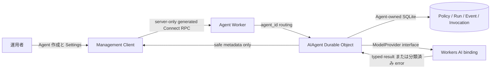
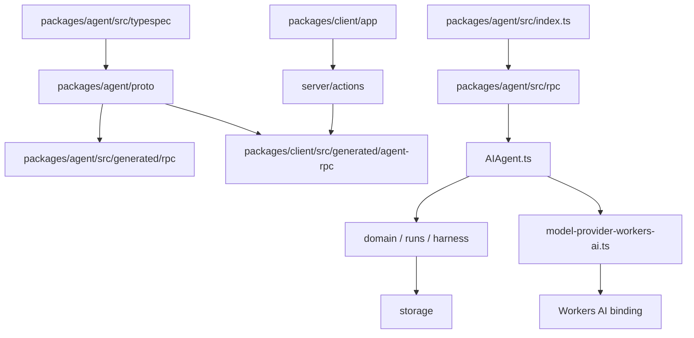
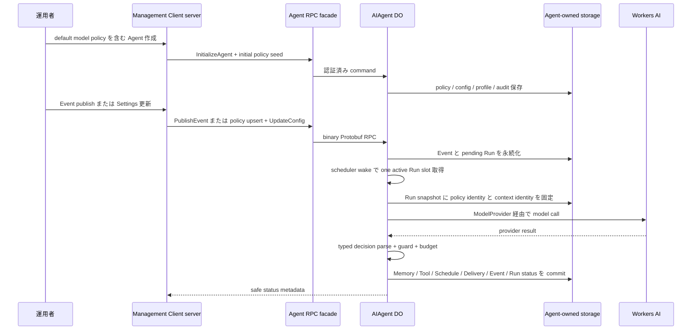
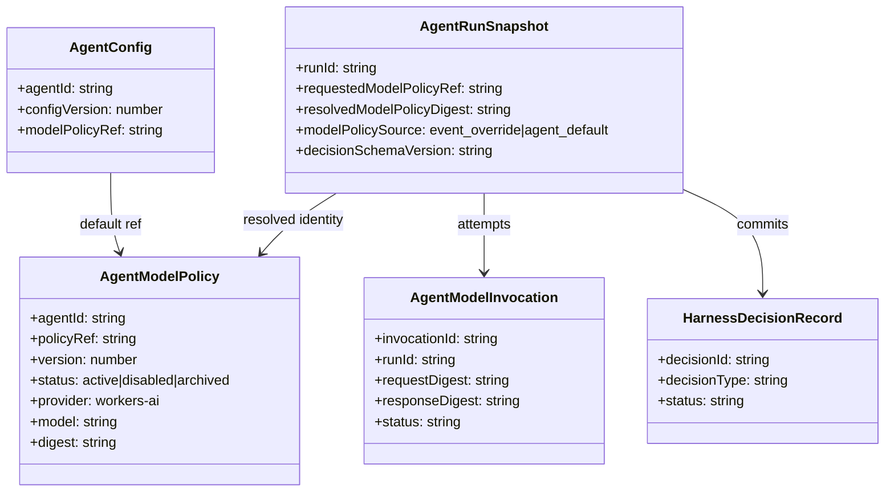
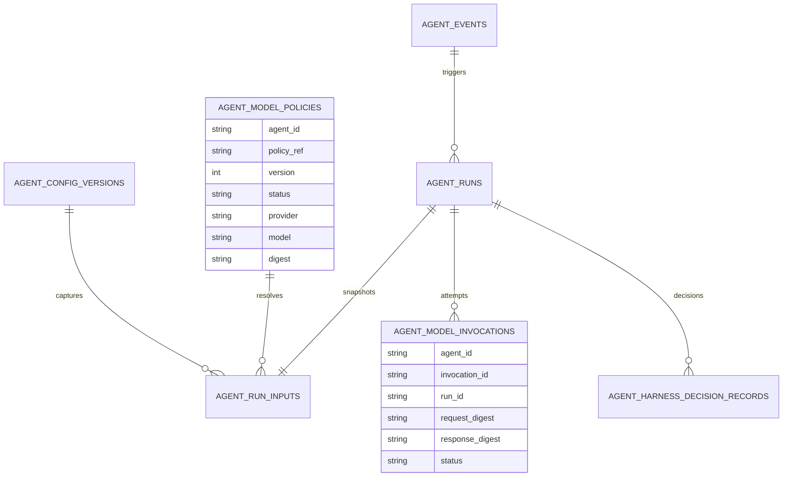
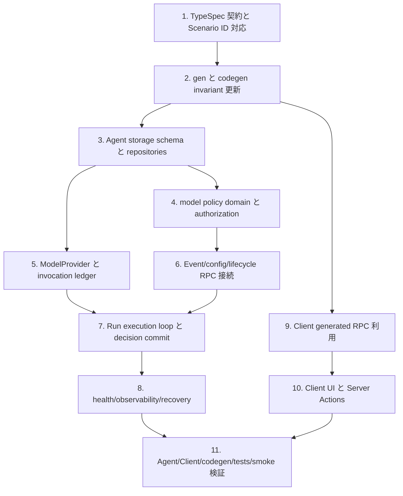

## Scope

### In Scope

- `agent-model-policy`、`agent-model-invocation`、`agent-runtime` を中心に、Agent-owned model policy、Workers AI 実行、Run snapshot、model invocation ledger、typed decision parsing、decision commit、waiting/resume を接続する。
- Agent API は TypeSpec を正本にし、`AgentModelPolicyService` と既存 service の request/response 拡張を Protobuf RPC-only として生成する。
- Agent Worker は Workers AI `AI` binding を明示的に要求し、missing binding、invalid policy、unsupported provider/model、provider failure、malformed output、budget exceeded を分類して fail closed する。
- Management Client は Agent 作成と Settings で default model policy を server-side Agent RPC 経由で登録・更新・表示する。
- Secret、Agent credential、Provider credential、raw prompt、raw completion、raw reasoning を storage、audit、log、RPC response、Browser bundle、Client D1 に残さない。

### Out of Scope

- Agent REST、OpenAPI、Orval、ad-hoc JSON API、Browser direct Agent RPC、Client Agent API proxy route は対象外であり追加しない。
- OpenAI、Anthropic、AI Gateway など Workers AI 以外の provider adapter は対象外。`ModelProvider` 境界は provider 追加を妨げない形にするが、provider 実装は Workers AI に限定する。
- Agent 横断 list/search RPC、Client D1 への Agent domain snapshot 保存、Cloudflare Queues product を mailbox 正本にする構成は対象外。
- Raw chain-of-thought や hidden reasoning の保存、表示、debug log 出力は対象外ではなく禁止事項として扱う。

## Assumptions / Dependencies

- Agent public API の正本は `packages/agent/src/typespec/main.tsp` と配下の TypeSpec tree である。
- Generated outputs は `pnpm gen:agent:proto && pnpm gen:agent:rpc` が所有し、手編集しない。
- Agent runtime は `AIAgent` Durable Object SQLite と Agent-owned blob storage を正本にし、Client D1 を参照しない。
- Workers AI は Cloudflare Worker env binding `AI` として渡される。binding がない環境では model execution readiness と Run execution が fail closed する。
- Client は Server Components / Server Actions / server-only modules だけで Agent RPC を呼び、Browser-visible modules は Agent credential と generated Agent RPC construction に到達しない。
- Durable Object SQLite schema は table 追加と既存 snapshot/event/config columns の拡張を含む。互換分岐を置かず、release は Worker、TypeSpec、generated descriptors、Client server code を揃えて行う。

## Impacted Areas

- `packages/agent/src/typespec/**`: model policy model/service、Event override、Run snapshot、health、config、lifecycle、integration ingress の契約。
- `packages/agent/proto/**` と `packages/**/src/generated/**`: command-owned generated proto/RPC descriptors。
- `packages/agent/src/storage/**`: Agent-owned model policy repository、model invocation ledger、Run snapshot metadata、Event requested policy metadata。
- `packages/agent/src/runs/**` と `packages/agent/src/harness/**`: scheduler から model execution loop、typed decision parser、commit guard、budget、waiting/resume。
- `packages/agent/src/rpc/**`: AgentModelPolicyService、message mapping、DO router、health/model diagnostics、Connect error mapping。
- `packages/agent/src/observability/**`: safe metadata、redaction、failure category、prompt/response digest。
- `packages/client/app/**`、`packages/client/src/components/**`、`packages/client/src/server/actions/**`: Agent creation/settings model policy UI と server-only RPC action。
- `scripts/codegen/check-agent-codegen-drift.mjs` と tests: RPC inventory、schema invariants、Scenario ID coverage、secret/browser boundary。
- Operational configuration: `packages/agent/wrangler.toml` の Workers AI binding、`playwright.config.ts` の Management Client E2E 起動 command、smoke readiness。

## Directory Tree

```text
openspec/changes/complete-autonomous-agent-runtime
├─ proposal.md
├─ design.md
├─ tasks.md
├─ staging-smoke-notes.md
└─ specs
   ├─ agent-model-policy/spec.md
   ├─ agent-model-invocation/spec.md
   ├─ agent-platform/spec.md
   ├─ agent-health/spec.md
   ├─ agent-lifecycle/spec.md
   ├─ agent-eventing/spec.md
   ├─ agent-runtime/spec.md
   ├─ agent-security/spec.md
   ├─ agent-memory/spec.md
   ├─ agent-tool/spec.md
   ├─ agent-schedule/spec.md
   ├─ agent-integration/spec.md
   ├─ client-management/spec.md
   └─ client-registry/spec.md
packages
├─ agent
│  ├─ wrangler.toml
│  ├─ proto/cftamac/agent/v1.proto
│  └─ src
│     ├─ AIAgent.ts
│     ├─ AIAgent.types.ts
│     ├─ env.ts
│     ├─ model-provider-workers-ai.ts
│     ├─ typespec/main.tsp
│     ├─ typespec/src/models/model-policy.tsp
│     ├─ typespec/src/models/agent.tsp
│     ├─ typespec/src/models/event.tsp
│     ├─ typespec/src/models/run.tsp
│     ├─ typespec/src/services/agent-model-policy.tsp
│     ├─ typespec/src/services/agent-event.tsp
│     ├─ typespec/src/services/agent-health.tsp
│     ├─ typespec/src/services/agent-lifecycle.tsp
│     ├─ typespec/src/services/agent-run.tsp
│     ├─ typespec/src/services/agent-state.tsp
│     ├─ typespec/src/services/agent-adapter.tsp
│     ├─ generated/rpc/cftamac/agent/v1_pb.ts
│     ├─ rpc/router.ts
│     ├─ rpc/do-router.ts
│     ├─ rpc/model-policy-do-router.ts
│     ├─ rpc/model-policy-message-mappers.ts
│     ├─ rpc/services/model-policies.ts
│     ├─ rpc/services/health.ts
│     ├─ storage/schema.ts
│     ├─ storage/table-initializer.ts
│     ├─ storage/repositories.ts
│     ├─ storage/model-policy-schema.ts
│     ├─ storage/model-policy-repository.ts
│     ├─ storage/model-policy-generation-parameters.ts
│     ├─ storage/model-invocation-schema.ts
│     ├─ storage/model-invocation-repository.ts
│     ├─ domain/final-authorization.ts
│     ├─ domain/lifecycle-operations.ts
│     ├─ domain/state-operations.ts
│     ├─ domain/errors.ts
│     ├─ domain/safe-inline-json.ts
│     ├─ events/operations.ts
│     ├─ runs/scheduler.ts
│     ├─ runs/operations.ts
│     ├─ runs/views.ts
│     ├─ harness/context-builder.ts
│     ├─ harness/model-io.ts
│     ├─ harness/decisions.ts
│     ├─ harness/commit-guard.ts
│     ├─ harness/budget.ts
│     ├─ tools/operations.ts
│     ├─ schedules/operations.ts
│     ├─ integrations/operations.ts
│     ├─ integrations/operations-ingress-delivery.ts
│     ├─ observability/records.ts
│     ├─ observability/redaction.ts
│     └─ tests
│        ├─ model-policy-rpc.test.ts
│        ├─ model-policy-resolution.test.ts
│        ├─ model-invocation-ledger.test.ts
│        ├─ model-output-parser.test.ts
│        ├─ run-model-execution.test.ts
│        ├─ workers-ai-binding.test.ts
│        ├─ rpc-schema-invariants.test.ts
│        ├─ command-event-invariants.test.ts
│        ├─ health-rpc.test.ts
│        └─ agent-worker-bindings.test.ts
└─ client
   ├─ src/generated/agent-rpc/cftamac/agent/v1_pb.ts
   ├─ app/agents/new/page.tsx
   ├─ app/agents/[agentId]/settings/page.tsx
   └─ src
      ├─ server/actions/agent-lifecycle.ts
      ├─ server/actions/agent-operations.ts
      ├─ server/actions/model-policies.ts
      ├─ components/agent-registration-form.tsx
      ├─ components/agent-settings-form.tsx
      ├─ components/model-policy-fields.tsx
      ├─ components/model-policy-summary.tsx
      ├─ components/schemas/agent-registration.ts
      ├─ components/schemas/agent-settings.ts
      └─ tests
         ├─ agent-management-ui.test.tsx
         ├─ browser-agent-rpc-secrecy.test.ts
         ├─ client-agent-operations.test.ts
         └─ client-repository-boundary.test.ts
scripts
└─ codegen/check-agent-codegen-drift.mjs
tests
└─ e2e/management-model-policy.spec.ts
playwright.config.ts
```

## New / Changed Files

| Type       | File                                                                                      | Change                                                                                                              |
| ---------- | ----------------------------------------------------------------------------------------- | ------------------------------------------------------------------------------------------------------------------- |
| Add        | `openspec/changes/complete-autonomous-agent-runtime/specs/agent-model-policy/spec.md`     | Agent-owned model policy の正本仕様を追加する。                                                                     |
| Add        | `openspec/changes/complete-autonomous-agent-runtime/specs/agent-model-invocation/spec.md` | ModelProvider、model request/output、ledger、recovery、安全性の仕様を追加する。                                     |
| Update     | `packages/agent/wrangler.toml`                                                            | Workers AI `AI` binding を Agent Worker に追加し、Client D1/Queues を持たない境界を維持する。                       |
| Update     | `packages/agent/src/env.ts`                                                               | `AgentWorkerEnv` に `AI` binding と readiness 判定に必要な型を追加する。                                            |
| Update     | `packages/agent/src/typespec/main.tsp`                                                    | model policy model/service を TypeSpec tree に読み込ませる。                                                        |
| Add        | `packages/agent/src/typespec/src/models/model-policy.tsp`                                 | policy ref、version、status、digest、安全な provider/model metadata、request/response model を定義する。            |
| Update     | `packages/agent/src/typespec/src/models/agent.tsp`                                        | `AgentConfig.modelPolicyRef` と initial model policy seed の契約を更新する。                                        |
| Update     | `packages/agent/src/typespec/src/models/event.tsp`                                        | Event-scoped optional `modelPolicyRef` と safe metadata を追加する。                                                |
| Update     | `packages/agent/src/typespec/src/models/run.tsp`                                          | Run snapshot、model policy identity、decision schema、invocation metadata を追加する。                              |
| Add        | `packages/agent/src/typespec/src/services/agent-model-policy.tsp`                         | `AgentModelPolicyService` の policy 管理 RPC を定義する。                                                           |
| Update     | `packages/agent/src/typespec/src/services/agent-event.tsp`                                | Client Event publish の policy override request/response を反映する。                                               |
| Update     | `packages/agent/src/typespec/src/services/agent-adapter.tsp`                              | Integration ingress の policy override と delivery result metadata を反映する。                                     |
| Update     | `packages/agent/src/typespec/src/services/agent-health.tsp`                               | model execution capability status を health response に追加する。                                                   |
| Update     | `packages/agent/src/typespec/src/services/agent-lifecycle.tsp`                            | initialize 時の initial policy seed と config ref を追加する。                                                      |
| Update     | `packages/agent/src/typespec/src/services/agent-state.tsp`                                | default model policy の safe metadata と `UpdateConfig` validation を追加する。                                     |
| Update     | `packages/agent/src/typespec/src/services/agent-run.tsp`                                  | Run query に policy snapshot、invocation、safe failure metadata を追加する。                                        |
| Generated  | `packages/agent/proto/cftamac/agent/v1.proto`                                             | TypeSpec から生成し、手編集しない。                                                                                 |
| Generated  | `packages/agent/src/generated/rpc/cftamac/agent/v1_pb.ts`                                 | Agent RPC descriptors を生成し、手編集しない。                                                                      |
| Generated  | `packages/client/src/generated/agent-rpc/cftamac/agent/v1_pb.ts`                          | Client 用 Agent RPC descriptors を生成し、手編集しない。                                                            |
| Update     | `scripts/codegen/check-agent-codegen-drift.mjs`                                           | `AgentModelPolicyService` と model policy invariant を codegen drift guard に追加する。                             |
| Add        | `packages/agent/src/storage/model-policy-schema.ts`                                       | model policy tables と digest/version/status metadata を定義する。                                                  |
| Add        | `packages/agent/src/storage/model-policy-repository.ts`                                   | Agent-owned policy upsert/get/list/archive/validate 用 repository を追加する。                                      |
| Add        | `packages/agent/src/storage/model-policy-generation-parameters.ts`                        | inline safe JSON から generation parameter を検証・抽出し、provider request に渡す安全な数値へ正規化する。          |
| Add        | `packages/agent/src/storage/model-invocation-schema.ts`                                   | raw prompt/completion を持たない invocation ledger と lease columns を定義する。                                    |
| Add        | `packages/agent/src/storage/model-invocation-repository.ts`                               | invocation attempt、heartbeat、status、digest、usage、recovery 用 repository を追加する。                           |
| Update     | `packages/agent/src/storage/schema.ts`                                                    | model policy schema、invocation schema、Run snapshot/Event policy metadata を統合する。                             |
| Update     | `packages/agent/src/storage/table-initializer.ts`                                         | Agent-owned SQLite table 初期化に model policy と invocation ledger を含める。                                      |
| Update     | `packages/agent/src/storage/repositories.ts`                                              | repository factory に model policy と invocation ledger を接続する。                                                |
| Update     | `packages/agent/src/AIAgent.types.ts`                                                     | DO command/query 型に policy、model execution、waiting/resume metadata を追加する。                                 |
| Update     | `packages/agent/src/AIAgent.ts`                                                           | model policy RPC、Run execution loop、Workers AI provider seam を DO method として接続する。                        |
| Add        | `packages/agent/src/model-provider-workers-ai.ts`                                         | Workers AI binding を pure `ModelProvider` interface に適合させる adapter を追加する。                              |
| Add        | `packages/agent/src/harness/model-io.ts`                                                  | model request、provider result、decision schema parse、安全な digest helper を定義する。                            |
| Update     | `packages/agent/src/harness/context-builder.ts`                                           | Context Builder output を stable ordering と safe metadata で model input へ渡す。                                  |
| Update     | `packages/agent/src/harness/decisions.ts`                                                 | typed decision schema、safe summary、decision commit result を拡張する。                                            |
| Update     | `packages/agent/src/harness/commit-guard.ts`                                              | policy digest、config、capability、lease generation の stale guard を追加する。                                     |
| Update     | `packages/agent/src/harness/budget.ts`                                                    | model call、token usage、provider cost unit を budget accounting に含める。                                         |
| Update     | `packages/agent/src/runs/scheduler.ts`                                                    | pending Run start から model execution loop へ接続し、snapshot を拡張する。                                         |
| Update     | `packages/agent/src/runs/operations.ts`                                                   | Run status、waiting/resume、provider failure、budget failure、recovery を実装する。                                 |
| Update     | `packages/agent/src/runs/views.ts`                                                        | Run query 用に safe model metadata、invocation summary、failure category を返す。                                   |
| Update     | `packages/agent/src/events/operations.ts`                                                 | Event model policy override validation と requested ref 保存を追加する。                                            |
| Update     | `packages/agent/src/domain/final-authorization.ts`                                        | model policy scope と Integration allowlist の final authorization を追加する。                                     |
| Update     | `packages/agent/src/domain/lifecycle-operations.ts`                                       | InitializeAgent と UpdateConfig の policy seed/ref validation を追加する。                                          |
| Update     | `packages/agent/src/domain/state-operations.ts`                                           | GetConfig/GetState の safe model policy metadata を追加する。                                                       |
| Update     | `packages/agent/src/domain/errors.ts`                                                     | model execution failure category と Connect code mapping source を追加する。                                        |
| Add        | `packages/agent/src/domain/safe-inline-json.ts`                                           | 復元した safe inline metadata の `inlineBytes` と `sha256` を一致させる同期 helper を追加する。                     |
| Update     | `packages/agent/src/tools/operations.ts`                                                  | `invoke_tool` decision、waiting Run、Tool result resume、stale result rejection を接続する。                        |
| Update     | `packages/agent/src/schedules/operations.ts`                                              | `create_schedule` decision から Agent-owned Schedule を作成する経路を接続する。                                     |
| Update     | `packages/agent/src/integrations/operations.ts`                                           | Installation/Connection model policy allowlist を管理する。                                                         |
| Update     | `packages/agent/src/integrations/operations-ingress-delivery.ts`                          | Integration ingress override と Delivery result resume 分類を追加する。                                             |
| Update     | `packages/agent/src/observability/records.ts`                                             | model policy、invocation、failure、budget の safe observability record を追加する。                                 |
| Update     | `packages/agent/src/observability/redaction.ts`                                           | raw prompt/completion/reasoning/credential の redaction guard を強化する。                                          |
| Update     | `packages/agent/src/rpc/router.ts`                                                        | `AgentModelPolicyService` を generated descriptors から登録する。                                                   |
| Update     | `packages/agent/src/rpc/do-router.ts`                                                     | Model policy DO command/query を routing する。                                                                     |
| Add        | `packages/agent/src/rpc/model-policy-do-router.ts`                                        | policy RPC と AIAgent DO method の boundary を分離する。                                                            |
| Add        | `packages/agent/src/rpc/model-policy-message-mappers.ts`                                  | generated model policy messages と domain command/query を変換する。                                                |
| Add        | `packages/agent/src/rpc/services/model-policies.ts`                                       | AgentModelPolicyService handler を追加する。                                                                        |
| Update     | `packages/agent/src/rpc/services/health.ts`                                               | model execution readiness を health response へ追加する。                                                           |
| Add/Update | `packages/agent/src/tests/*.test.ts`                                                      | Scenario ID 付きで policy、invocation、run execution、binding、health、schema invariants を検証する。               |
| Add        | `packages/client/src/server/actions/model-policies.ts`                                    | Client server-only model policy validation/upsert/config update action を追加する。                                 |
| Update     | `packages/client/src/server/actions/agent-lifecycle.ts`                                   | Agent creation flow で initial policy と config ref を Agent RPC へ渡す。                                           |
| Update     | `packages/client/src/server/actions/agent-operations.ts`                                  | Settings 更新で policy upsert と UpdateConfig を順序付きに呼ぶ。                                                    |
| Add        | `packages/client/src/components/model-policy-fields.tsx`                                  | Browser-safe model policy 入力部品を追加する。                                                                      |
| Add        | `packages/client/src/components/model-policy-summary.tsx`                                 | safe policy metadata 表示部品を追加する。                                                                           |
| Update     | `packages/client/src/components/agent-registration-form.tsx`                              | Agent creation form に default model policy 入力を追加する。                                                        |
| Update     | `packages/client/src/components/agent-settings-form.tsx`                                  | Settings form に default model policy 更新 UI を追加する。                                                          |
| Update     | `packages/client/src/components/schemas/agent-registration.ts`                            | initial policy 入力 validation を追加する。                                                                         |
| Update     | `packages/client/src/components/schemas/agent-settings.ts`                                | settings policy 入力 validation を追加する。                                                                        |
| Update     | `packages/client/app/agents/new/page.tsx`                                                 | server action と form 初期値に model policy fields を接続する。                                                     |
| Update     | `packages/client/app/agents/[agentId]/settings/page.tsx`                                  | Agent RPC から取得した safe policy metadata を Settings に表示する。                                                |
| Add/Update | `packages/client/src/tests/*.test.tsx`                                                    | Client UI、server action、browser secrecy、D1 boundary を Scenario ID 付きで検証する。                              |
| Add        | `tests/e2e/management-model-policy.spec.ts`                                               | Agent creation/settings model policy flow と Browser secrecy を Playwright で検証する。                             |
| Update     | `playwright.config.ts`                                                                    | Playwright webServer を root script に存在する `pnpm dev:client` へ合わせ、Management Client E2E を再現可能にする。 |
| Add        | `openspec/changes/complete-autonomous-agent-runtime/staging-smoke-notes.md`               | default policy と Event override の staging smoke 記録項目を safe metadata/digest 限定で固定する。                  |

## System Diagram



## Package Diagram



## Sequence Diagram



## UI Wireframes

N/A。wireframe は未生成。

## Domain Model Diagram



## ER Diagram



## Package-Level Design

### Package List

| Package           | Purpose / Responsibility                                                                                   | Public API                                                            | Dependencies                                                                                             |
| ----------------- | ---------------------------------------------------------------------------------------------------------- | --------------------------------------------------------------------- | -------------------------------------------------------------------------------------------------------- |
| `packages/agent`  | Agent Worker、AIAgent Durable Object、Agent-owned policy/runtime/storage、Protobuf RPC facade を所有する。 | `AgentModelPolicyService`、既存 Agent RPC services、`AIAgent` methods | Cloudflare Workers、Cloudflare Agents SDK、Workers AI binding、Drizzle DO SQLite、generated Protobuf RPC |
| `packages/client` | Management Client UI と server-only Agent RPC invocation を所有し、Browser secrecy を維持する。            | Next.js route pages、Server Actions、browser-safe components          | generated Client Agent RPC descriptors、Client D1 ledger、server-only credential resolution              |
| `scripts/codegen` | generated output drift と Agent RPC invariant を検査する。                                                 | `pnpm check:codegen`                                                  | TypeSpec/proto/generated descriptors                                                                     |
| `tests/e2e`       | Management Client の operator flow と Browser secrecy を確認する。                                         | Playwright specs                                                      | built Client/Agent test environment                                                                      |

### Details

#### packages/agent

- Purpose / Responsibility: Agent public API、Agent-owned storage、Run execution、model policy、model invocation、decision commit を単一 Agent aggregate に閉じる。Client D1、Browser direct RPC、REST/OpenAPI/Orval は所有しない。
- Public API: generated Protobuf RPC services。`AgentModelPolicyService` を追加し、既存 lifecycle/event/run/state/health/integration RPC に model policy metadata を反映する。
- Key Data Structures: `AgentModelPolicy`、`AgentRunInputSnapshot`、`AgentModelInvocation`、`HarnessDecision`、`AgentConfig`、`AgentEvent`。
- Key Flows: Event publish または scheduler fire が Event と pending Run を保存し、scheduler が one active slot を取得し、snapshot で model policy と context を固定し、Workers AI provider を呼び、typed decisions を検証して commit する。
- Dependencies: TypeSpec/protobuf generation、Cloudflare Agents SDK Durable Object、Workers AI binding、Drizzle Durable Object SQLite、Agent-owned blob storage。
- Error Handling: Domain errors は missing binding、invalid policy、unsupported provider/model、provider failure、malformed output、authorization failure、budget exceeded、stale generation に分類し、Connect code と safe details に map する。
- Testing Strategy: Agent unit/integration tests で `AGENT-MODEL-POLICY-*`、`AGENT-MODEL-INVOCATION-*`、`AGENT-RUNTIME-*`、`AGENT-SECURITY-*`、`AGENT-PLATFORM-*`、`AGENT-HEALTH-*` を検証する。
- Non-Functional: one active Run slot、lease/heartbeat/recovery、safe observability、codegen drift guard、Scenario ID coverage を維持する。
- Performance: Context bundle は digest/reference metadata を使い、raw body の無制限展開を避ける。Model invocation ledger は retry と timeout を分類し、unbounded duplicate invocation を防ぐ。
- Security: Provider credential、Agent credential、raw prompt、raw completion、raw reasoning を保存・公開せず、policy override は principal scope と Integration allowlist で検証する。

#### packages/client

- Purpose / Responsibility: Agent 管理 UI、Agent creation/settings model policy UI、server-only Agent RPC action を所有する。Agent domain 正本と credential material は所有しない。
- Public API: App Router pages と Server Actions。公開 Agent proxy route は持たない。
- Key Data Structures: Browser-safe form state、policy ref/provider/model/digest/status の safe metadata、Client D1 managed Agent ledger。
- Key Flows: Agent creation form が model policy fields を受け取り、Server Action が Validate/Upsert/Initialize を呼ぶ。Settings form は UpsertModelPolicy 成功後に UpdateConfig を呼ぶ。
- Dependencies: `packages/client/src/generated/agent-rpc/**`、server-only Agent RPC client factory、Client credential reference resolution。
- Error Handling: Agent RPC error は secret-free message に正規化し、Browser に stack、token、credential、raw prompt/completion を渡さない。
- Testing Strategy: Component tests と server action tests で `CLIENT-MANAGEMENT-S017`、`CLIENT-MANAGEMENT-S018`、`CLIENT-REGISTRY-S009`、`CLIENT-REGISTRY-S010` を検証する。
- Non-Functional: Browser bundle secrecy、Client D1 boundary、accessibility validation、no direct network call を維持する。
- Performance: Settings/creation は server-side action で必要な Agent RPC だけを順序付きに呼び、Browser には safe metadata だけを返す。
- Security: Agent RPC credential と Provider credential は server-only module に閉じ、Client D1 は policy body の正本にならない。

#### scripts/codegen

- Purpose / Responsibility: generated proto/RPC output と public RPC invariant を検査し、AgentModelPolicyService と schema fields の drift を検出する。
- Public API: `pnpm check:codegen`。
- Key Data Structures: generated descriptors、service inventory、request field invariant、Protobuf field stability list。
- Key Flows: `pnpm gen` 後に descriptor inventory と git diff を確認する。
- Dependencies: generated Agent/Client RPC output、TypeSpec emit、Node.js scripts。
- Error Handling: missing service、missing `agent_id`、missing `idempotency_key`、field number 欠落、OpenAPI output presence は失敗にする。
- Testing Strategy: codegen script tests と `pnpm check:codegen` で `AGENT-PLATFORM-S016` と `AGENT-MODEL-POLICY-S004` を検証する。
- Non-Functional: generated output は command-owned とし、手編集を不要にする。
- Performance: descriptor scan は CI で実行可能な線形走査に留める。
- Security: OpenAPI/Orval/ad-hoc JSON Agent surface を検出し、policy RPC の Protobuf-only 境界を維持する。

## Implementation Plan



## Test Plan

### User Acceptance Test (Manual)

| UAT ID                        | Related Requirement                                 | Spec Summary                                                         | Customer Problem Summary                                       | Steps                                                                                   | Expected Behavior                                                                                           |
| ----------------------------- | --------------------------------------------------- | -------------------------------------------------------------------- | -------------------------------------------------------------- | --------------------------------------------------------------------------------------- | ----------------------------------------------------------------------------------------------------------- |
| UAT-CLIENT-MANAGEMENT-HAP-001 | CLIENT-MANAGEMENT-R017 model policy management UI   | Agent 作成時に default model policy を入力し、Agent に seed される。 | 管理者は CLI なしで model policy 付き Agent を作成したい。     | Agent creation 画面を開き、policy ref、provider、model、parameters を入力して作成する。 | 作成後の Settings/overview に policy ref、digest、provider、model、config version が表示される。            |
| UAT-AGENT-RUNTIME-HAP-001     | AGENT-RUNTIME-R011 Run execution loop               | Event publish から model decision commit まで進む。                  | 運用者は Agent が Event を受けて自律判断することを確認したい。 | default policy を持つ Agent に Event を publish し、Run 詳細を確認する。                | Run snapshot に policy identity があり、model invocation と decision record が safe metadata で確認できる。 |
| UAT-AGENT-SECURITY-SEC-001    | AGENT-SECURITY-R017 secret-safe observability       | raw prompt、completion、reasoning、credential が表示されない。       | 運用者は安全な監査情報だけを見たい。                           | Run 詳細、audit、Client UI、logs を確認する。                                           | prompt digest、response digest、decision summary は見えるが raw payload と secret は表示されない。          |
| UAT-AGENT-HEALTH-SMK-001      | AGENT-HEALTH-R004 model execution capability health | Health が Workers AI readiness を報告する。                          | Smoke test は model 実行不能状態を早く検出したい。             | Workers AI binding あり/なしの環境で health RPC を呼ぶ。                                | binding ありは readiness を返し、binding なしは `unavailable` を secret-free に返す。                       |

### E2E Test (Playwright)

| E2E ID                        | Playwright Test Name                                                                             | Related Scenario       | Category | Summary                                                         | Steps (Playwright)                                                                | Expected Behavior                                                                                  |
| ----------------------------- | ------------------------------------------------------------------------------------------------ | ---------------------- | -------- | --------------------------------------------------------------- | --------------------------------------------------------------------------------- | -------------------------------------------------------------------------------------------------- |
| E2E-CLIENT-MANAGEMENT-HAP-001 | `[CLIENT-MANAGEMENT-S017] Agent creation flow が initial model policy を server-side で送信する` | CLIENT-MANAGEMENT-S017 | HAP      | Agent 作成 form が policy 入力を受け取り server action に渡す。 | `/agents/new` を開き、model policy fields を入力し、作成を送信する。              | 成功表示と safe metadata が表示され、Browser network に Agent credential が存在しない。            |
| E2E-CLIENT-MANAGEMENT-HAP-002 | `[CLIENT-MANAGEMENT-S018] Settings 画面が default model policy を安全に更新する`                 | CLIENT-MANAGEMENT-S018 | HAP      | Settings から policy upsert と config update を行う。           | `/agents/[agentId]/settings` で policy ref/provider/model を変更して保存する。    | UI は更新済み digest/config version を表示し、direct Agent RPC request は Browser から発生しない。 |
| E2E-CLIENT-MANAGEMENT-SEC-001 | `[CLIENT-MANAGEMENT-S018] Browser bundle が Agent credential と Provider credential を含まない`  | CLIENT-MANAGEMENT-S018 | SEC      | Browser secrecy を画面遷移後も維持する。                        | Agent list、creation、settings、runs を移動し bundle/network/storage を検査する。 | credential、Provider secret、raw prompt、raw completion、direct Agent RPC payload が存在しない。   |

### Integration Test (Endpoint)

| IT ID                         | Test Name                                                                                 | Genre  | Category | Summary                                                        | Steps (Test)                                                                  | Expected Behavior                                                                      |
| ----------------------------- | ----------------------------------------------------------------------------------------- | ------ | -------- | -------------------------------------------------------------- | ----------------------------------------------------------------------------- | -------------------------------------------------------------------------------------- |
| IT-AGENT-MODEL-POLICY-HAP-001 | `[AGENT-MODEL-POLICY-S004] AgentModelPolicyService が Agent-scoped policy 管理を公開する` | agent  | HAP      | generated service と request invariants を検査する。           | TypeSpec 生成後の descriptors から service/method/request fields を列挙する。 | service が存在し、request は `agent_id` と mutating `idempotency_key` を持つ。         |
| IT-AGENT-PLATFORM-BND-001     | `[AGENT-PLATFORM-S016] AgentModelPolicyService is generated as Protobuf RPC only`         | agent  | BND      | REST/OpenAPI/Orval surface なしで policy RPC が登録される。    | Worker route と generated output artifacts を検査する。                       | binary Connect service だけが登録され、OpenAPI/Orval は存在しない。                    |
| IT-AGENT-HEALTH-SMK-001       | `[AGENT-HEALTH-S004] Health Check が model execution capability を安全に報告する`         | agent  | SMK      | Health response の readiness と secrecy を検証する。           | binding あり/なしの test env で binary health RPC を呼ぶ。                    | `serving`/`unavailable` が返り、secret と raw prompt/completion は含まれない。         |
| IT-AGENT-EVENTING-PERM-001    | `[AGENT-EVENTING-S011] Integration Event の grant 外 policy override は拒否される`        | agent  | PERM     | Integration allowlist 外 override を拒否する。                 | signed ingress request に grant 外 `modelPolicyRef` を入れて呼ぶ。            | Event、pending Run、Queue wake は作成されず permission error になる。                  |
| IT-AGENT-RUNTIME-HAP-001      | `[AGENT-RUNTIME-S011] Pending Run が model execution から terminal status へ進む`         | agent  | HAP      | deterministic mock provider で Run execution loop を検証する。 | Event publish 後に scheduler wake を実行し、mock decision を返す。            | Run snapshot、invocation ledger、decision record、terminal status が保存される。       |
| IT-AGENT-RUNTIME-BND-001      | `[AGENT-RUNTIME-S015] Tool waiting は active slot を解放して結果で resume する`           | agent  | BND      | Tool 待ちが active slot を解放する。                           | invoke_tool decision を返し、Tool result callback を送る。                    | Run は waiting で slot を解放し、result 到着後に one active slot を再取得する。        |
| IT-AGENT-SECURITY-SEC-001     | `[AGENT-SECURITY-S017] Observability が prompt completion reasoning を保存しない`         | agent  | SEC      | observability と response の secret-free を検証する。          | prompt/completion/reasoning を含む mock provider result を処理する。          | ledger/audit/log/view は digest と safe summary だけを保持する。                       |
| IT-CLIENT-REGISTRY-BND-001    | `[CLIENT-REGISTRY-S009] Client D1 は model policy body を正本保存しない`                  | client | BND      | Client D1 に policy body と secret が残らない。                | Settings action 実行後に Client D1 rows を検査する。                          | safe ref/digest metadata 以外の policy body、secret、raw provider token は存在しない。 |

### Unit/Component Test (UT)

| UT ID                             | Test Name                                                                                        | Package         | Category | Summary                                               | Steps (Test)                                           | Expected Behavior                                                                |
| --------------------------------- | ------------------------------------------------------------------------------------------------ | --------------- | -------- | ----------------------------------------------------- | ------------------------------------------------------ | -------------------------------------------------------------------------------- |
| UT-AGENT-MODEL-POLICY-HAP-001     | `[AGENT-MODEL-POLICY-S001] Model policy upsert が safe metadata と digest を保存する`            | packages/agent  | HAP      | repository upsert と digest 計算を検証する。          | safe policy input を repository に渡す。               | version、status、digest、safe metadata が保存され、secret は保存されない。       |
| UT-AGENT-MODEL-POLICY-ERR-001     | `[AGENT-MODEL-POLICY-S002] Unsupported provider または model は状態変更前に拒否される`           | packages/agent  | ERR      | unsupported provider/model を拒否する。               | invalid provider/model で validate/upsert を呼ぶ。     | 状態変更なしで分類済み error を返す。                                            |
| UT-AGENT-MODEL-INVOCATION-ERR-001 | `[AGENT-MODEL-INVOCATION-S001] Missing Workers AI binding は model call 前に拒否される`          | packages/agent  | ERR      | binding 欠落時の fail closed を検証する。             | `AI` binding なし env で ModelProvider を作成する。    | provider call は行われず `missing_binding` になる。                              |
| UT-AGENT-MODEL-INVOCATION-HAP-001 | `[AGENT-MODEL-INVOCATION-S003] Context bundle が安定順序で model request へ変換される`           | packages/agent  | HAP      | context ordering と prompt digest を検証する。        | snapshot から context bundle を作成する。              | identity/policy/Memory/Handoff/Events/History/AgentMemory/trigger の順序になる。 |
| UT-AGENT-MODEL-INVOCATION-ERR-002 | `[AGENT-MODEL-INVOCATION-S005] Malformed model output は side effect なしで拒否される`           | packages/agent  | ERR      | parser が malformed output を拒否する。               | unsupported schema と壊れた payload を parser に渡す。 | decision は生成されず side effect sink は呼ばれない。                            |
| UT-AGENT-RUNTIME-BND-001          | `[AGENT-RUNTIME-S013] Stale policy digest は model call または commit を拒否する`                | packages/agent  | BND      | stale guard を検証する。                              | snapshot digest と repository digest を不一致にする。  | commit は拒否され、side effect は作成されない。                                  |
| UT-AGENT-RUNTIME-ERR-001          | `[AGENT-RUNTIME-S016] Budget exceeded は decision commit 前に Run を停止する`                    | packages/agent  | ERR      | model/token/provider budget の停止を検証する。        | budget exceeded 状態で decision commit を呼ぶ。        | Run は分類済み failure となり追加 side effect はない。                           |
| UT-AGENT-TOOL-BND-001             | `[AGENT-TOOL-S010] Tool result が waiting Run を stale guard 付きで resume する`                 | packages/agent  | BND      | Tool result の resume と stale rejection を検証する。 | waiting Run に一致/不一致 result を渡す。              | 一致 result は resume し、不一致 result は追加 side effect なしで記録される。    |
| UT-CLIENT-MANAGEMENT-HAP-001      | `[CLIENT-MANAGEMENT-S017] Agent creation flow が initial model policy を server-side で送信する` | packages/client | HAP      | form と server action payload を検証する。            | component に入力し action mock を呼ぶ。                | initial policy と `modelPolicyRef` が server action に渡る。                     |
| UT-CLIENT-MANAGEMENT-SEC-001      | `[CLIENT-MANAGEMENT-S018] Settings 画面が default model policy を安全に更新する`                 | packages/client | SEC      | Settings UI が secret-free data だけを描画する。      | safe metadata と secret-like fields を渡す。           | secret-like fields は描画されず、safe ref/digest/provider/model だけ表示される。 |

## Rollback / Migration

- Durable Object SQLite は model policy、model invocation、Run snapshot/Event metadata の table/column を追加する。Release は Agent Worker、generated descriptors、Client server code を揃えて行い、途中状態用の互換分岐は置かない。
- 契約を戻す必要がある場合は、直前の Agent Worker と Management Client を同じ generated descriptor set で再 deploy する。追加済み model policy/ledger rows は参照されない inert data として保持し、削除が必要な場合は separate operator script で digest と retention を確認してから実行する。
- Rollback 中も raw prompt、raw completion、raw reasoning、credential material を export しない。監査に必要な情報は policy ref/digest、invocation digest、safe failure metadata に限定する。

## Release Procedure

- `pnpm gen:agent:proto && pnpm gen:agent:rpc` を実行し、generated output を TypeSpec と一致させる。
- `pnpm check:codegen` を実行し、RPC inventory、field stability、generated drift を確認する。
- `pnpm check:agent && pnpm test:agent` を実行し、Agent contract/runtime/storage/security tests を確認する。
- `pnpm check:client && pnpm test:client` を実行し、Client UI/server-only boundary を確認する。
- `pnpm test:e2e` を実行し、Management Client の model policy flow と Browser secrecy を確認する。
- `pnpm lint` を実行し、OpenSpec validate、Scenario ID coverage、governance、supply-chain checks を確認する。
- Staging で Workers AI binding を設定した Agent Worker を deploy し、Event publish から default policy decision commit まで smoke を実行する。
- Staging で Event-scoped override を指定し、accepted/rejected と decision commit を smoke で確認する。

## Acceptance Criteria

- `AgentModelPolicyService` が TypeSpec/proto/generated Agent/Client RPC descriptors に存在し、REST/OpenAPI/Orval/JSON Agent surface が存在しない。
- Workers AI binding の有無が health と Run execution で `serving`/`degraded`/`unavailable` として secret-free に分類される。
- Agent 作成時に default model policy を seed でき、`AgentConfig.modelPolicyRef` が policy body ではなく Agent-owned ref を指す。
- Event-scoped `modelPolicyRef` は登録済みかつ認可済みの Agent-owned ref だけを受理し、Integration allowlist 外は Event acceptance 前に拒否される。
- Run snapshot は requested/resolved model policy ref/digest/provider/model/version/source、decision schema version、config/capability generation を固定する。
- Model invocation ledger は raw prompt/raw completion/raw reasoning を持たず、digest、usage、latency、failure category、lease/recovery state を保持する。
- Typed `HarnessDecision[]` の parse/validate が malformed output、unknown decision、権限外 Tool、不正 Event emit を side effect 前に拒否する。
- Decision commit は Memory、ToolInvocation、Schedule、Delivery、AgentEvent、stop を idempotency、authorization、budget、stale guard 付きで確定する。
- Waiting Run は active slot を解放し、Tool result、approval、Delivery result で deterministic に resume または follow-up Event に分類される。
- Management Client は default model policy を作成/更新/表示でき、Browser bundle、network response、Client D1 に Agent credential、Provider credential、policy body 正本、raw prompt/completion/reasoning を含めない。
- `pnpm check:codegen`、`pnpm test:agent`、`pnpm test:client`、`pnpm test:e2e`、`pnpm lint` が通る。

## Open Issues

- N/A。Issue #5 と本 change の delta specs で provider 範囲、override 拒否点、fallback 禁止、secret-safe storage、waiting/resume 分類を固定済み。
