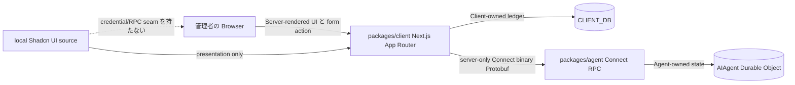
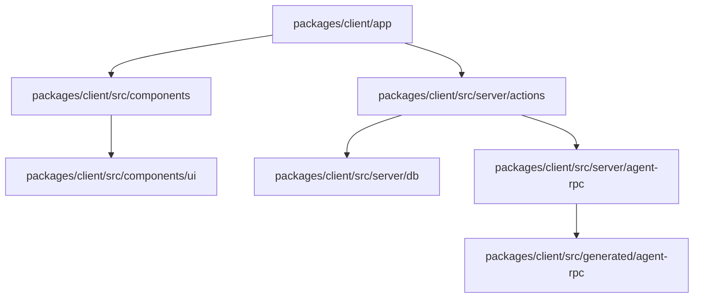
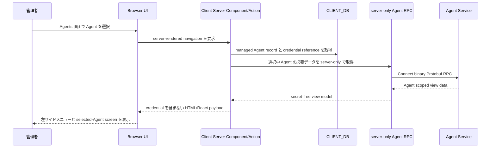
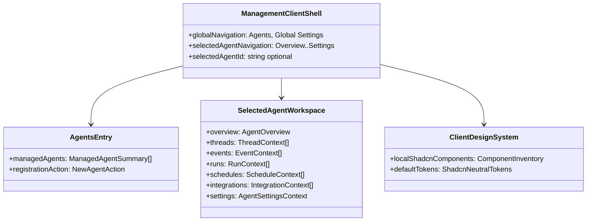
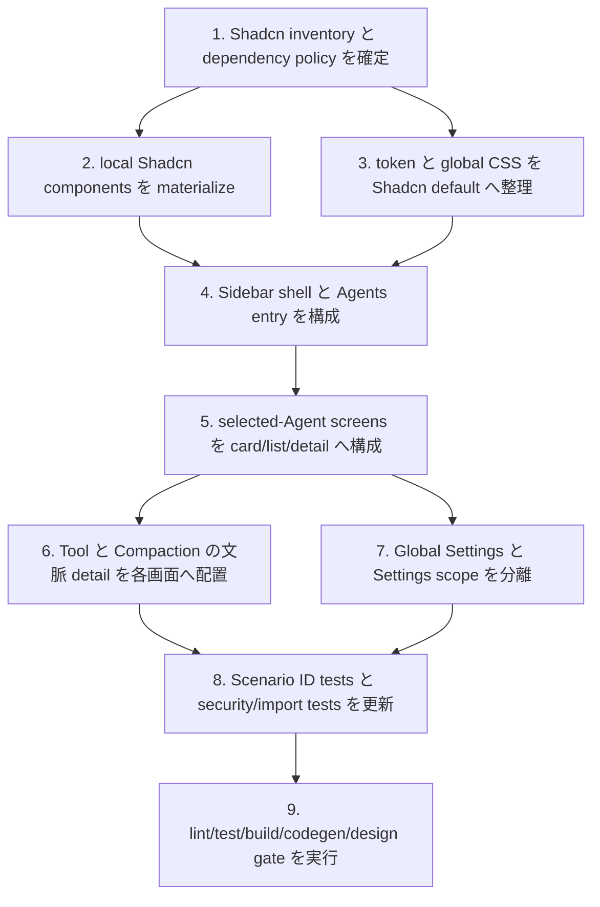

## Scope

### In Scope

- `client-design-system`、`management-client-shell`、`agent-management-ui` の各 Spec Unit に対応し、Management Client を Shadcn UI 公式コンポーネントのローカルソース、Shadcn default design token、左サイドメニュー、Agent 選択前後のスコープ分離、card/list/detail 構成で実装できる設計へ確定する。
- `Agents`、`Global Settings`、選択中 Agent の `Overview`、`Threads`、`Events`、`Runs`、`Schedules`、`Integrations`、`Settings` の画面構成、状態表示、レスポンシブ挙動、アクセシビリティ、user-facing copy slot を定義する。
- Browser bundle に Agent credential、direct Agent RPC invocation logic、Agent runtime import、public Agent API proxy route を含めない恒久セキュリティ境界を維持する。

### Out of Scope

- Agent Service TypeSpec、proto、generated RPC output、Connect RPC service inventory、AIAgent Durable Object runtime の変更は対象外。UI 再設計により Agent contract 差分が必要になった場合は、この変更を止めて別の Agent contract 変更として扱う。
- `packages/agent/**`、`packages/agent/proto/**`、`packages/agent/src/generated/rpc/**`、`packages/client/src/generated/agent-rpc/**` の手編集は対象外。
- Client D1 schema の Agent-domain snapshot 追加、Client Worker への Agent API proxy route 追加、Browser direct Agent RPC は対象外。
- Shadcn default token から外れる独自 palette、radial gradient 背景、暫定 CSS shim、route 固有の ad-hoc global class による視覚調整は対象外。

## Assumptions / Dependencies

- `packages/client/components.json` は Shadcn `new-york`、`neutral`、`cssVariables: true`、`rsc: true`、`lucide` を設定しているため、この設定を design system の基準として採用する。
- `packages/client/src/components/ui/**` は既に Shadcn UI component 領域として使われているため、全公式コンポーネントの materialization 先として継続する。
- Materialization は `packages/client` を working directory とし、`pnpm dlx shadcn@latest add <official-component-names> --overwrite` を、committed component inventory に基づいて実行する。これにより実行時 remote registry 消費ではなく、編集可能なローカル TSX source を repository に持つ。
- Shadcn component が要求する runtime dependencies の追加は `pnpm-workspace.yaml` の `minimumReleaseAge: 4320` と `allowBuilds` policy を維持して行う。
- Agent RPC は引き続き `packages/client/src/server/agent-rpc/**` の `server-only` module から generated Agent RPC client を通じて呼び出す。
- `Global Settings` の route は selected-Agent `Settings` と明確に分けるため `/global-settings` を採用する。
- `New Agent` は左サイドメニュー項目ではなく、`Agents` screen の primary action として registration flow を起動する。既存 `/agents/new` route を利用する場合も、導線は `Agents` screen 内 action に限定する。
- Shadcn default token strategy は `neutral` の light/dark token block をそのまま採用し、theme mode は Shadcn の class-based dark mode に沿って扱う。

## Impacted Areas

- `packages/client/app/**`: App Router shell、management layout、Agents entry、Global Settings、selected-Agent route shells、root layout、root page。
- `packages/client/src/components/**`: Shadcn UI local components、management composition components、lists/details/forms/dialogs/sheets/sidebar。
- `packages/client/src/server/actions/**`: Server Actions の user-facing result shape と secret-safe error mapping を UI state に接続する箇所。
- `packages/client/src/server/agent-rpc/**`: 実装対象ではなく、server-only boundary の維持対象。
- `packages/client/src/server/db/**`: 実装対象ではなく、Client-owned managed Agent ledger と credential reference boundary の維持対象。
- `packages/client/src/tests/**` と `tests/**`: Scenario ID を含む component/unit/E2E/governance tests の追加・更新対象。
- Operational concerns: dependency release-age gate、design-audit/Impeccable evidence、OpenSpec scenario coverage、codegen drift guard。

## Directory Tree

```text
openspec/changes/redesign-management-client-ui-shadcn
├─ design.md
├─ tasks.md
├─ specs
│  ├─ client-design-system
│  │  └─ spec.md
│  ├─ management-client-shell
│  │  └─ spec.md
│  └─ agent-management-ui
│     └─ spec.md
└─ wireframes
   ├─ shell-no-agent-selected.wireframe.html
   ├─ shell-agent-selected-overview.wireframe.html
   ├─ agent-threads.wireframe.html
   ├─ agent-events.wireframe.html
   ├─ agent-runs.wireframe.html
   ├─ agent-schedules.wireframe.html
   ├─ agent-integrations.wireframe.html
   ├─ agent-settings.wireframe.html
   ├─ global-settings.wireframe.html
   └─ new-agent-action.wireframe.html
packages/client
├─ app
│  ├─ globals.css
│  ├─ layout.tsx
│  ├─ page.tsx
│  ├─ global-settings
│  │  └─ page.tsx
│  └─ agents
│     ├─ page.tsx
│     ├─ new
│     │  └─ page.tsx
│     └─ [agentId]
│        ├─ page.tsx
│        ├─ threads
│        │  └─ page.tsx
│        ├─ events
│        │  └─ page.tsx
│        ├─ runs
│        │  └─ page.tsx
│        ├─ schedules
│        │  └─ page.tsx
│        ├─ integrations
│        │  └─ page.tsx
│        └─ settings
│           └─ page.tsx
├─ components.json
├─ tailwind.config.ts
└─ src
   ├─ components
   │  ├─ ui
   │  │  └─ *.tsx
   │  └─ *.tsx
   ├─ lib
   │  └─ utils.ts
   └─ tests
      └─ *.test.tsx
```

## New / Changed Files

| Type       | File                                                                                          | Change                                                                                                                             |
| ---------- | --------------------------------------------------------------------------------------------- | ---------------------------------------------------------------------------------------------------------------------------------- |
| Add        | `openspec/changes/redesign-management-client-ui-shadcn/specs/client-design-system/spec.md`    | Shadcn local component availability、default token boundary、visual quality、browser secrecy を enduring contract として追加する。 |
| Add        | `openspec/changes/redesign-management-client-ui-shadcn/specs/management-client-shell/spec.md` | 左サイドメニュー、global/selected-Agent scope、Global Settings、contextual detail、security boundary の delta を定義する。         |
| Add        | `openspec/changes/redesign-management-client-ui-shadcn/specs/agent-management-ui/spec.md`     | Agents entry、selected-Agent screens、card/list/detail、Tool/Compaction contexts、responsive detail behavior の delta を定義する。 |
| Update     | `openspec/changes/redesign-management-client-ui-shadcn/design.md`                             | 実装設計、wireframe 参照、package design、test plan、release runbook を template 構造で記述する。                                  |
| Add        | `openspec/changes/redesign-management-client-ui-shadcn/tasks.md`                              | 承認後に実行できる implementation checklist と Scenario ID 対応 test tasks を定義する。                                            |
| Add        | `openspec/changes/redesign-management-client-ui-shadcn/wireframes/*.wireframe.html`           | 10 画面の UI 構造を design.md から参照できる preview として保持する。                                                              |
| Add/Update | `packages/client/src/components/ui/*.tsx`                                                     | Shadcn 公式コンポーネントを全て編集可能なローカルソースとして materialize し、既存 component も default 実装へ揃える。             |
| Update     | `packages/client/app/globals.css`                                                             | Shadcn default token block と Tailwind directives だけに整理し、独自 token と global visual shim を取り除く。                      |
| Update     | `packages/client/tailwind.config.ts`                                                          | Shadcn default semantic token mapping と content 設定に整理し、独自 palette mapping を使わない。                                   |
| Update     | `packages/client/app/layout.tsx`                                                              | skip link、theme class、server-rendered shell を受ける root layout に整理する。                                                    |
| Update     | `packages/client/app/page.tsx`                                                                | root entry を Agents entry へ誘導し、Shadcn component composition で表示する。                                                     |
| Add        | `packages/client/app/global-settings/page.tsx`                                                | Client-wide settings だけを扱う global scope 画面を追加する。                                                                      |
| Update     | `packages/client/app/agents/page.tsx`                                                         | Agent 一覧・登録 action・選択を扱う card/list entry screen へ整理する。                                                            |
| Update     | `packages/client/app/agents/new/page.tsx`                                                     | Agents screen action から起動される registration flow として Shadcn Form/Dialog compatible composition にする。                    |
| Update     | `packages/client/app/agents/[agentId]/**/*.tsx`                                               | selected-Agent screens を Overview/Threads/Events/Runs/Schedules/Integrations/Settings の scope に合わせる。                       |
| Update     | `packages/client/src/components/*.tsx`                                                        | table 偏重と route 固有 CSS 依存を減らし、Shadcn component を使った card/list/detail composition に揃える。                        |
| Delete     | `packages/client/src/components/ui/cn.ts`                                                     | `cn` helper を `packages/client/src/lib/utils.ts` に一本化し、Shadcn default import pattern に揃える。                             |
| Update/Add | `packages/client/src/tests/*.test.tsx`                                                        | 各 ADDED/MODIFIED Scenario ID を bracketed ID 付き test title で検証する。                                                         |

## System Diagram



## Package Diagram



## Sequence Diagram



## UI Wireframes

### Agents entry without selected Agent

<iframe src="wireframes/shell-no-agent-selected.wireframe.html" title="Agents entry without selected Agent" width="1200" height="760"></iframe>

### Selected Agent Overview

<iframe src="wireframes/shell-agent-selected-overview.wireframe.html" title="Selected Agent Overview" width="1200" height="760"></iframe>

### Agent Threads

<iframe src="wireframes/agent-threads.wireframe.html" title="Agent Threads" width="1200" height="760"></iframe>

### Agent Events

<iframe src="wireframes/agent-events.wireframe.html" title="Agent Events" width="1200" height="760"></iframe>

### Agent Runs

<iframe src="wireframes/agent-runs.wireframe.html" title="Agent Runs" width="1200" height="760"></iframe>

### Agent Schedules

<iframe src="wireframes/agent-schedules.wireframe.html" title="Agent Schedules" width="1200" height="760"></iframe>

### Agent Integrations

<iframe src="wireframes/agent-integrations.wireframe.html" title="Agent Integrations" width="1200" height="760"></iframe>

### Agent Settings

<iframe src="wireframes/agent-settings.wireframe.html" title="Agent Settings" width="1200" height="760"></iframe>

### Global Settings

<iframe src="wireframes/global-settings.wireframe.html" title="Global Settings" width="1200" height="760"></iframe>

### New Agent Action

<iframe src="wireframes/new-agent-action.wireframe.html" title="New Agent Action" width="1200" height="760"></iframe>

## Domain Model Diagram



## ER Diagram

N/A。Client D1 schema を拡張しない。Client D1 は managed Agent records と credential references の所有境界を維持し、Agent-domain snapshots は保存しない。

## Package-Level Design

### Package List

| Package                                | Purpose / Responsibility                                                             | Public API                                            | Dependencies                                                            |
| -------------------------------------- | ------------------------------------------------------------------------------------ | ----------------------------------------------------- | ----------------------------------------------------------------------- |
| `packages/client/app`                  | App Router の route shell、Server Component、Server Action 呼び出し境界を所有する。  | `/agents`, `/global-settings`, `/agents/[agentId]/**` | `packages/client/src/components`, `packages/client/src/server/actions`  |
| `packages/client/src/components`       | Management UI の reusable composition と Shadcn primitive の組み合わせを所有する。   | React components                                      | `packages/client/src/components/ui`, `packages/client/src/lib/utils`    |
| `packages/client/src/components/ui`    | Shadcn 公式コンポーネントを編集可能なローカルソースとして保持する。                  | Shadcn UI component exports                           | Radix UI, lucide-react, class-variance-authority, Tailwind CSS          |
| `packages/client/src/server/actions`   | Client D1 と Agent RPC の server-only result を browser-safe view model に変換する。 | Server Actions / server functions                     | `packages/client/src/server/db`, `packages/client/src/server/agent-rpc` |
| `packages/client/src/server/agent-rpc` | generated Agent RPC client と authentication metadata を server-only に閉じる。      | server-only Agent RPC factory                         | `packages/client/src/generated/agent-rpc`, Connect runtime              |
| `packages/client/src/server/db`        | Client-owned managed Agent ledger と credential reference repository を所有する。    | repository functions                                  | Drizzle D1, `CLIENT_DB`                                                 |
| `packages/client/src/tests`            | Scenario ID と UI/security/design-system の verification を所有する。                | Vitest tests                                          | React Testing Library, governance helpers                               |

### Details

#### `packages/client/app`

- Purpose / Responsibility: Management Client の URL、layout、Server Component composition、Server Action invocation を所有する。Agent credential や Agent RPC client construction は所有しない。
- Public API: App Router routes と form/action boundaries。
- Key Data Structures: route params、search params、browser-safe view models。
- Key Flows: Browser request を受け、Server Component が Client D1 と server-only Agent RPC 由来の view model を読み、Shadcn composition に渡して描画する。
- Dependencies: UI components と server actions に依存する。generated Agent RPC code へ直接依存しない。
- Error Handling: Server Action result を secret-free message に変換し、Shadcn `Alert` と `FormMessage` で表示する。
- Testing Strategy: `MANAGEMENT-CLIENT-SHELL-S001`、`S008`、`S009`、`S010`、`S011`、`S012`、`S013` と `AGENT-MANAGEMENT-UI-S001` から `S008`、`S017`、`S018`、`S019` から `S021` を component/E2E tests で検証する。
- Non-Functional: Browser bundle secrecy、a11y landmarks、responsive navigation を維持する。
- Performance: Server-rendered shell を基本にし、large lists は pagination と detail sheet で分割する。
- Security: Server-only modules 以外で credential、Connect runtime、generated Agent RPC factory を import しない。

#### `packages/client/src/components`

- Purpose / Responsibility: Agents entry、Sidebar shell、selected-Agent section、list/detail、forms、empty/loading/error state の reusable UI composition を所有する。
- Public API: React components と typed props。
- Key Data Structures: `ManagedAgentSummaryView`, `AgentSectionNavItem`, `AgentContextPanel`, `SecretSafeActionState` 相当の view model。
- Key Flows: View model を Shadcn primitives に渡し、card/list/detail と responsive sheet/drawer の構造を作る。
- Dependencies: local Shadcn components と `cn` helper に依存する。server-only modules へ依存しない。
- Error Handling: 表示層では secret-free message と validation message のみを扱う。
- Testing Strategy: `CLIENT-DESIGN-SYSTEM-S004` と `AGENT-MANAGEMENT-UI-S019` から `S021` を component tests と import-boundary tests で検証する。
- Non-Functional: focus order、ARIA、reduced motion、contrast を design-audit gate で確認する。
- Performance: 画面ごとに必要な interactive client component を限定し、Server Component composition を優先する。
- Security: UI component 層は Agent RPC client、credential resolver、Connect runtime、Agent runtime import を持たない。

#### `packages/client/src/components/ui`

- Purpose / Responsibility: Shadcn 公式コンポーネントを全てローカルソースとして保持し、project-specific composition から利用できる状態にする。
- Public API: `Button`, `Card`, `Sidebar`, `Sheet`, `Dialog`, `Form`, `Table`, `Tabs`, `Tooltip`, `DropdownMenu`, `Sonner` などの Shadcn exports。
- Key Data Structures: Shadcn component props、variant definitions、`cn` helper import。
- Key Flows: `pnpm dlx shadcn@latest add <official-component-names> --overwrite` で registry source を materialize し、repository に commit された TSX として consume する。
- Dependencies: Radix UI、lucide-react、Tailwind CSS、class-variance-authority など Shadcn component が要求する runtime dependencies。
- Error Handling: Component materialization や dependency install failure は supply-chain policy に従って止め、迂回しない。
- Testing Strategy: `CLIENT-DESIGN-SYSTEM-S001`、`S002`、`S003`、`S004` を file inventory、CSS token scan、component rendering、import-boundary scan で検証する。
- Non-Functional: Shadcn default token と accessible primitive behavior を保持する。
- Performance: Tree-shaking と route-level imports を維持し、全 component materialization が即時全 bundle に入らないよう import を管理する。
- Security: UI primitives は presentation-only であり、Agent RPC seam を含まない。

#### `packages/client/src/server/actions`

- Purpose / Responsibility: Client D1 と Agent RPC の結果を browser-safe view model と action state に変換する。
- Public API: Server Actions と server-side query helpers。
- Key Data Structures: action result、validation error map、secret-free error message、idempotency key。
- Key Flows: form input を server-side validation し、Client D1 または server-only Agent RPC を呼び、success/error state を UI に返す。
- Dependencies: Client D1 repositories と server-only Agent RPC modules。
- Error Handling: raw stack、token、credential、signature base string を返さず、操作可能な message に変換する。
- Testing Strategy: `AGENT-MANAGEMENT-UI-S002`、`S004`、`S006`、`S007`、`S008`、`S017`、`S018` と security scenarios を Server Action tests で検証する。
- Non-Functional: pending/disabled state と idempotency を UI に渡せる result shape を保つ。
- Performance: Server Action は必要な query/RPC だけを呼び、list/detail をページ単位で取得する。
- Security: Server Actions は public Agent API ではなく UI internal boundary として扱う。

#### `packages/client/src/server/agent-rpc`

- Purpose / Responsibility: generated Agent RPC client と authentication metadata の construction を server-only に閉じる。
- Public API: server-only Agent RPC factory と typed client accessors。
- Key Data Structures: generated Protobuf request/response、authentication metadata、acting user context。
- Key Flows: Client server-side module が Agent RPC origin と credential reference を解決し、Connect binary Protobuf request を送る。
- Dependencies: generated Agent RPC descriptors と Connect runtime。
- Error Handling: Agent RPC error を domain-safe result に変換し、Browser に secret を渡さない。
- Testing Strategy: `MANAGEMENT-CLIENT-SHELL-S002`、`S008`、`AGENT-MANAGEMENT-UI-S009` の existing tests と regression tests を維持する。
- Non-Functional: codegen drift と server-only import guard を維持する。
- Performance: fetch-based unary RPC を必要 screen data に限定する。
- Security: Browser direct Agent RPC、public proxy route、Agent runtime import を禁止する。

## Implementation Plan



## Test Plan

### User Acceptance Test (Manual)

| UAT ID                              | Related Requirement                                                    | Spec Summary                                                         | Customer Problem Summary                                                              | Steps                                                                      | Expected Behavior                                                                                                          |
| ----------------------------------- | ---------------------------------------------------------------------- | -------------------------------------------------------------------- | ------------------------------------------------------------------------------------- | -------------------------------------------------------------------------- | -------------------------------------------------------------------------------------------------------------------------- |
| UAT-MANAGEMENT-CLIENT-SHELL-HAP-001 | MANAGEMENT-CLIENT-SHELL-R001 + Server-side management UI shell         | 左サイドメニューで global scope と selected-Agent scope を分離する。 | 管理者が全体設定と Agent 固有操作を混同しないようにする。                             | `/agents` を開き、Agent 未選択状態と Agent 選択後状態を確認する。          | 未選択時は `Agents` と `Global Settings` が明確で、選択後に Overview から Settings までの Agent scoped menu が表示される。 |
| UAT-AGENT-MANAGEMENT-UI-HAP-001     | AGENT-MANAGEMENT-UI-R001 + 管理対象 Agent list と registration UI      | Agents screen が一覧、登録、選択の開始点になる。                     | 管理者が最初にどこから Agent 管理を始めるか迷わない。                                 | `Agents` 画面で一覧、New Agent action、Agent selection を確認する。        | 一覧は card/list で読みやすく、New Agent action は画面内にあり、選択後に Agent workspace へ進む。                          |
| UAT-CLIENT-DESIGN-SYSTEM-REG-001    | CLIENT-DESIGN-SYSTEM-R001 + Local Shadcn component source availability | Shadcn 公式コンポーネントが local source として利用できる。          | UI 品質のために必要な公式 primitive が欠けず、実装時に remote registry に依存しない。 | component inventory と `packages/client/src/components/ui/**` を確認する。 | 公式 component が編集可能な TSX source として存在し、runtime remote consumption がない。                                   |

### E2E Test (Playwright)

| E2E ID                              | Playwright Test Name                                                                                | Related Scenario             | Category | Summary                                                          | Steps (Playwright)                                                                   | Expected Behavior                                                                                                       |
| ----------------------------------- | --------------------------------------------------------------------------------------------------- | ---------------------------- | -------- | ---------------------------------------------------------------- | ------------------------------------------------------------------------------------ | ----------------------------------------------------------------------------------------------------------------------- |
| E2E-MANAGEMENT-CLIENT-SHELL-HAP-009 | `[MANAGEMENT-CLIENT-SHELL-S009] Agent 未選択時の左サイドメニューが global scope を表示する`         | MANAGEMENT-CLIENT-SHELL-S009 | HAP      | Agent 未選択時の navigation scope を検証する。                   | `/agents` を開き、sidebar landmarks と nav labels を取得する。                       | `Agents` と `Global Settings` が global nav に表示され、selected-Agent nav は hidden または disabled semantics を持つ。 |
| E2E-MANAGEMENT-CLIENT-SHELL-HAP-010 | `[MANAGEMENT-CLIENT-SHELL-S010] Agent 選択後に selected-Agent navigation が表示される`              | MANAGEMENT-CLIENT-SHELL-S010 | HAP      | Agent selection 後の selected-Agent navigation を検証する。      | Agents list から Agent を選択し、selected-Agent sidebar を確認する。                 | Overview、Threads、Events、Runs、Schedules、Integrations、Settings が Agent identity と一緒に表示される。               |
| E2E-MANAGEMENT-CLIENT-SHELL-HAP-011 | `[MANAGEMENT-CLIENT-SHELL-S011] New Agent action が Agents screen から registration flow を開く`    | MANAGEMENT-CLIENT-SHELL-S011 | HAP      | New Agent が Agents screen action として機能することを検証する。 | `/agents` の primary action を押し、registration form を確認する。                   | Agent ID、RPC origin、credential reference、model policy の入力が accessible form として表示される。                    |
| E2E-MANAGEMENT-CLIENT-SHELL-HAP-012 | `[MANAGEMENT-CLIENT-SHELL-S012] Tool と Compaction context が選択中 Agent 画面内で確認できる`       | MANAGEMENT-CLIENT-SHELL-S012 | HAP      | Tool/Compaction が文脈 detail として到達できることを検証する。   | Runs、Events、Threads、Overview、Settings を移動し、関連 detail section を確認する。 | Run 内 ToolInvocation、Event context、Thread Compaction、Overview summary、Settings Tool catalog が表示される。         |
| E2E-MANAGEMENT-CLIENT-SHELL-HAP-013 | `[MANAGEMENT-CLIENT-SHELL-S013] Global Settings が Client-wide 設定だけを表示する`                  | MANAGEMENT-CLIENT-SHELL-S013 | HAP      | Global Settings の scope を検証する。                            | `/global-settings` を開き、Agent identity や Agent scoped actions の有無を確認する。 | Client-wide display/security preferences だけが表示され、selected-Agent context は表示されない。                        |
| E2E-AGENT-MANAGEMENT-UI-HAP-019     | `[AGENT-MANAGEMENT-UI-S019] selected-Agent screens が card list detail 構成で表示される`            | AGENT-MANAGEMENT-UI-S019     | HAP      | selected-Agent screens の情報設計を検証する。                    | Overview から Settings までを巡回し、list/detail と heading hierarchy を確認する。   | 各 screen は card/list/detail 構成で、table は比較に必要な箇所だけに使われる。                                          |
| E2E-AGENT-MANAGEMENT-UI-HAP-020     | `[AGENT-MANAGEMENT-UI-S020] Tool と Compaction が文脈情報として表示される`                          | AGENT-MANAGEMENT-UI-S020     | HAP      | Tool/Compaction の文脈表示を検証する。                           | Runs、Events、Threads、Overview、Settings を開き、detail panel を確認する。          | ToolInvocation と Compaction 情報が該当する Agent scoped screen の detail として表示される。                            |
| E2E-AGENT-MANAGEMENT-UI-A11Y-021    | `[AGENT-MANAGEMENT-UI-S021] モバイル幅で selected-Agent detail が Sheet と focus management を使う` | AGENT-MANAGEMENT-UI-S021     | A11Y     | responsive detail と focus behavior を検証する。                 | viewport を mobile にし、sidebar と detail sheet を keyboard で操作する。            | Sheet が focus trap、Esc close、focus return を満たし、Agent scope が保持される。                                       |

### Integration Test (Endpoint)

| IT ID                              | Test Name                                                                                       | Genre                | Category | Summary                                                            | Steps (Test)                                                                                                                 | Expected Behavior                                                                                                            |
| ---------------------------------- | ----------------------------------------------------------------------------------------------- | -------------------- | -------- | ------------------------------------------------------------------ | ---------------------------------------------------------------------------------------------------------------------------- | ---------------------------------------------------------------------------------------------------------------------------- |
| IT-MANAGEMENT-CLIENT-SHELL-SEC-002 | `[MANAGEMENT-CLIENT-SHELL-S002] Browser bundle が Agent RPC seam を含まない`                    | client/governance    | SEC      | Browser-delivered chunks の secrecy boundary を検証する。          | production build artifacts または import graph を scan する。                                                                | Agent credential、direct RPC invocation、Connect runtime construction、Agent runtime import が browser bundle に含まれない。 |
| IT-MANAGEMENT-CLIENT-SHELL-SEC-008 | `[MANAGEMENT-CLIENT-SHELL-S008] Client は public Agent API proxy route を公開しない`            | client/governance    | SEC      | App Router route handlers と network behavior を検証する。         | route manifest と `app/api/**` を列挙し、Server Actions の境界を確認する。                                                   | public Agent API proxy route がなく、Server Actions は internal UI boundary として扱われる。                                 |
| IT-CLIENT-DESIGN-SYSTEM-REG-001    | `[CLIENT-DESIGN-SYSTEM-S001] 全 Shadcn 公式 component が local source として存在する`           | client/design-system | REG      | component inventory と local files を検証する。                    | committed official component inventory を読み、`src/components/ui/**` と imports を検査する。                                | すべての component entry が local editable source を持ち、runtime remote registry consumption がない。                       |
| IT-CLIENT-DESIGN-SYSTEM-REG-002    | `[CLIENT-DESIGN-SYSTEM-S002] Shadcn default token だけが styling source である`                 | client/design-system | REG      | CSS/token boundary を検証する。                                    | `globals.css`, `tailwind.config.ts`, component classes を scan する。                                                        | Shadcn default token block と Tailwind utilities に揃い、独自 token や global visual shim がない。                           |
| IT-CLIENT-DESIGN-SYSTEM-SEC-004    | `[CLIENT-DESIGN-SYSTEM-S004] UI component 層が Agent RPC seam を import しない`                 | client/governance    | SEC      | UI component import graph の secrecy boundary を検証する。         | `packages/client/src/components/**` を scan し、server-only、Connect、generated RPC、credential resolver import を確認する。 | component 層は presentation primitive と browser-safe props だけに依存する。                                                 |
| IT-AGENT-MANAGEMENT-UI-SEC-009     | `[AGENT-MANAGEMENT-UI-S009] Browser が Agent credentials を受け取らず Agent RPC を直接呼ばない` | client/security      | SEC      | selected-Agent screens を移動した時の browser secrecy を検証する。 | HTML、network response、storage、bundle scan を実行する。                                                                    | Agent credential、秘密鍵、生 JWT、Provider secret、direct Agent RPC request が存在しない。                                   |

### Unit/Component Test (UT)

| UT ID                              | Test Name                                                                                              | Package                            | Category | Summary                                                   | Steps (Test)                                                                                             | Expected Behavior                                                                                                                       |
| ---------------------------------- | ------------------------------------------------------------------------------------------------------ | ---------------------------------- | -------- | --------------------------------------------------------- | -------------------------------------------------------------------------------------------------------- | --------------------------------------------------------------------------------------------------------------------------------------- |
| UT-MANAGEMENT-CLIENT-SHELL-HAP-001 | `[MANAGEMENT-CLIENT-SHELL-S001] Agent registry shell が sidebar shell と Agents entry を描画する`      | packages/client/app                | HAP      | Registry shell の positive supported surface を検証する。 | Server Component を render し、heading、global nav、Agents action、Agent list affordance を query する。 | 管理 shell、empty guidance、registration action、detail navigation affordances が表示される。                                           |
| UT-MANAGEMENT-CLIENT-SHELL-HAP-007 | `[MANAGEMENT-CLIENT-SHELL-S007] Management route graph が supported Agent sections を公開する`         | packages/client/src/tests          | HAP      | supported route graph を検証する。                        | App Router file graph helper で supported routes を列挙する。                                            | `/agents`, `/global-settings`, `/agents/[agentId]`, `threads`, `events`, `runs`, `schedules`, `integrations`, `settings` が確認できる。 |
| UT-AGENT-MANAGEMENT-UI-HAP-001     | `[AGENT-MANAGEMENT-UI-S001] Agent list が card list と並び順を支援する`                                | packages/client/src/components     | HAP      | Agents entry の list behavior を検証する。                | 複数 Agent view model を render し、pin、sort、last opened、selection action を確認する。                | pinned/sorted order と final-opened action が browser-safe props で表示される。                                                         |
| UT-AGENT-MANAGEMENT-UI-ERR-002     | `[AGENT-MANAGEMENT-UI-S002] Add Agent form が connection metadata を検証する`                          | packages/client/src/components     | ERR      | registration form validation を検証する。                 | invalid Agent ID/RPC origin/credential ref を入力し、form state を確認する。                             | accessible validation message が field と関連付けられ、server success 前に record が作られない。                                        |
| UT-AGENT-MANAGEMENT-UI-HAP-003     | `[AGENT-MANAGEMENT-UI-S003] Overview が profile と config を secret-free に描画する`                   | packages/client/app                | HAP      | Overview view model rendering を検証する。                | Server-safe Agent profile/config view model を render する。                                             | profile、lifecycle、config version、credential generation、capability summary が表示され、secret は表示されない。                       |
| UT-AGENT-MANAGEMENT-UI-HAP-004     | `[AGENT-MANAGEMENT-UI-S004] Settings が config update と credential rotation の結果を表示する`         | packages/client/src/components     | HAP      | Settings action result rendering を検証する。             | success/error action states を render する。                                                             | 更新済み config version または credential generation と secret-free error が表示される。                                                |
| UT-AGENT-MANAGEMENT-UI-HAP-005     | `[AGENT-MANAGEMENT-UI-S005] Thread Event Run と Compaction context が Agent-owned history を表示する`  | packages/client/src/components     | HAP      | exploration views の context rendering を検証する。       | Thread/Event/Run/Compaction view model を render する。                                                  | sequence、status、causal link、provenance、paging/filter scope が表示される。                                                           |
| UT-AGENT-MANAGEMENT-UI-HAP-006     | `[AGENT-MANAGEMENT-UI-S006] Schedule section が schedules を作成し cancel する`                        | packages/client/src/components     | HAP      | Schedule section の action state を検証する。             | create/cancel action results を render する。                                                            | Schedule status、next fire、overlap policy、cancel result が Agent scope とともに表示される。                                           |
| UT-AGENT-MANAGEMENT-UI-HAP-007     | `[AGENT-MANAGEMENT-UI-S007] Tool 承認 context が明示 action を要求する`                                | packages/client/src/components     | HAP      | Tool approval control を検証する。                        | pending approval view model を render し、approve/reject flow を操作する。                               | Tool summary、risk metadata、confirmation、acting user context が表示される。                                                           |
| UT-AGENT-MANAGEMENT-UI-HAP-008     | `[AGENT-MANAGEMENT-UI-S008] Integration section が汎用 Integration を管理する`                         | packages/client/src/components     | HAP      | Integration list/detail composition を検証する。          | installation/setup/cleanup view model を render する。                                                   | Installation 状態、grant、Adapter、Tool、Delivery、setup、cleanup result が card/list/detail で表示される。                             |
| UT-AGENT-MANAGEMENT-UI-HAP-017     | `[AGENT-MANAGEMENT-UI-S017] Agent registration flow が initial model policy を server-side で送信する` | packages/client/src/server/actions | HAP      | Registration flow の model policy submission を検証する。 | initial policy 入力を submit し、server-side validation と Agent RPC payload boundary を確認する。       | initial model policy と `initialConfig.modelPolicyRef` が server-side で送信され、Browser は credential material を受け取らない。       |
| UT-AGENT-MANAGEMENT-UI-HAP-018     | `[AGENT-MANAGEMENT-UI-S018] Settings 画面が default model policy を安全に更新する`                     | packages/client/src/server/actions | HAP      | Settings model policy update を検証する。                 | policy upsert と config update の success/error states を render する。                                  | policy ref、digest、provider、model、config version が更新表示され、invalid policy と permission error は secret-free に表示される。    |
| UT-CLIENT-DESIGN-SYSTEM-A11Y-003   | `[CLIENT-DESIGN-SYSTEM-S003] responsive shell と reduced motion state が動作する`                      | packages/client/src/components     | A11Y     | mobile Sheet と reduced motion を検証する。               | viewport/media query を stub し、sidebar/detail/skeleton を render する。                                | mobile は Sheet/Drawer を使い、reduced motion では pulse/spinner が無効化または安全な表示になる。                                       |

## Rollback / Migration

- DB migration は N/A。Client D1 schema は変更しない。
- Agent contract migration は N/A。TypeSpec/proto/generated RPC output は変更しない。
- Release 前の safety check として `git diff --exit-code -- packages/agent/src/typespec packages/agent/proto packages/agent/src/generated/rpc packages/client/src/generated/agent-rpc` を実行し、Agent contract と generated output に差分がないことを確認する。
- UI release で問題が出た場合は、Shadcn local component source、default token、left sidebar scope、browser secrecy boundary を保持したまま、該当 route/component の composition を修正する。Agent API や generated output へ戻り道を作らない。

## Release Procedure

- `corepack enable && pnpm install` を実行し、dependency policy を維持した状態で workspace を準備する。
- Shadcn materialization で dependency 追加が必要な場合は、72 時間 release-age gate と package-by-package build-script approval を満たす。
- `pnpm --filter @cf-tamac/client check` を実行する。
- `pnpm test:client` を実行し、Scenario ID を含む Client tests を確認する。
- `pnpm lint` を実行し、OpenSpec strict validation、Scenario coverage、governance、supply-chain を確認する。
- `pnpm build:client` を実行する。
- `pnpm check:codegen` を実行し、UI redesign が generated RPC drift を生まないことを確認する。
- `node .opencode/skills/impeccable/scripts/detect.mjs packages/client/app packages/client/src/components` と design-audit protocol を実行し、presentation-facing UI evidence を記録する。

## Acceptance Criteria

- `openspec validate --type change redesign-management-client-ui-shadcn --strict --no-interactive` が PASS する。
- `client-design-system`、`management-client-shell`、`agent-management-ui` の ADDED/MODIFIED Scenario ID に対応する automated test task が `tasks.md` に存在する。
- `packages/client/src/components/ui/**` に全 Shadcn 公式 component が local editable source として materialize される計画が tasks に存在する。
- Styling は Shadcn default token に限定され、独自 token、extra CSS shim、ad-hoc global visual classes を残さない計画が tasks に存在する。
- Agent credential/RPC secrecy と no-proxy boundary の tests が、positive supported surface または恒久セキュリティ境界を検証する形で定義される。
- Agent TypeSpec/proto/generated RPC output を変更しない verification task が含まれる。

## Open Issues

- N/A。component path、materialization approach、Global Settings route、New Agent action boundary、Shadcn default token strategy はこの design で決定済み。
