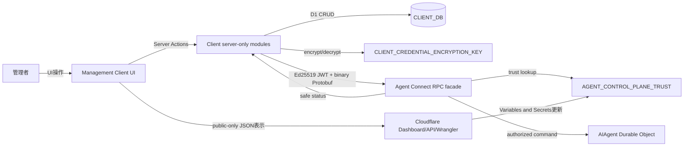
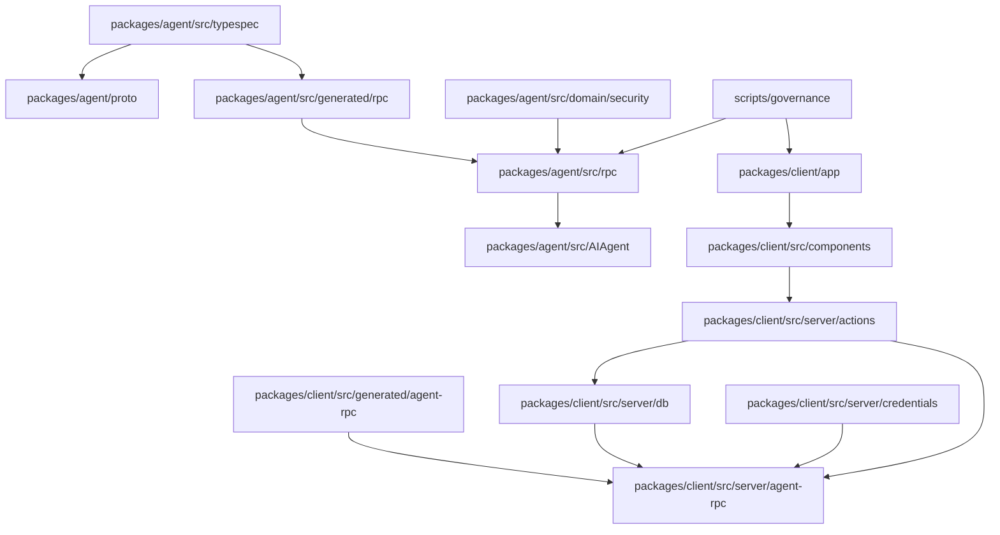
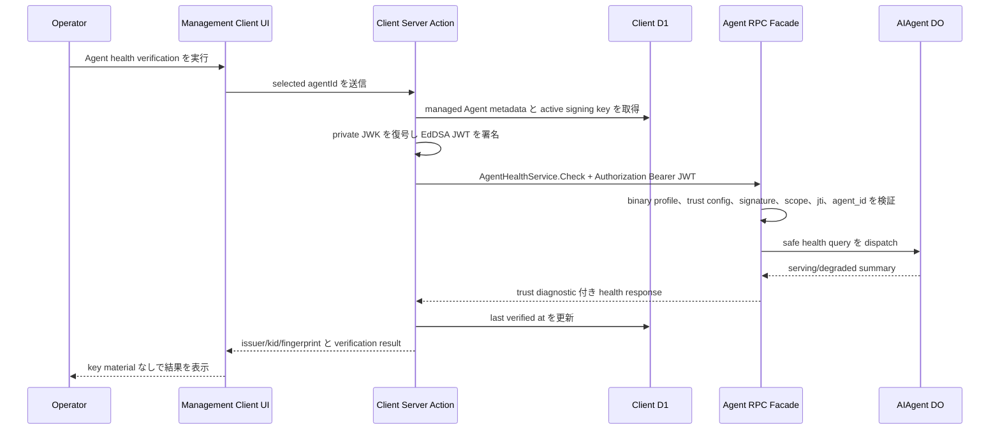
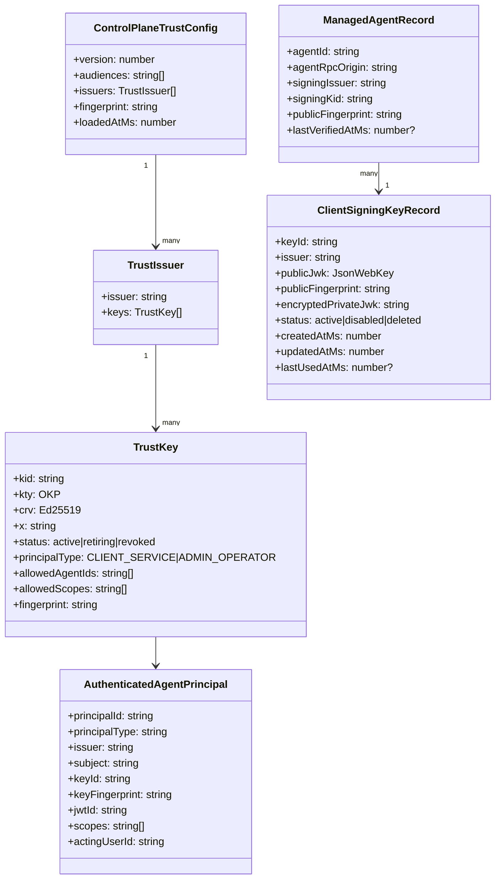
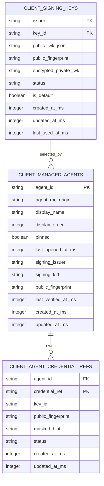
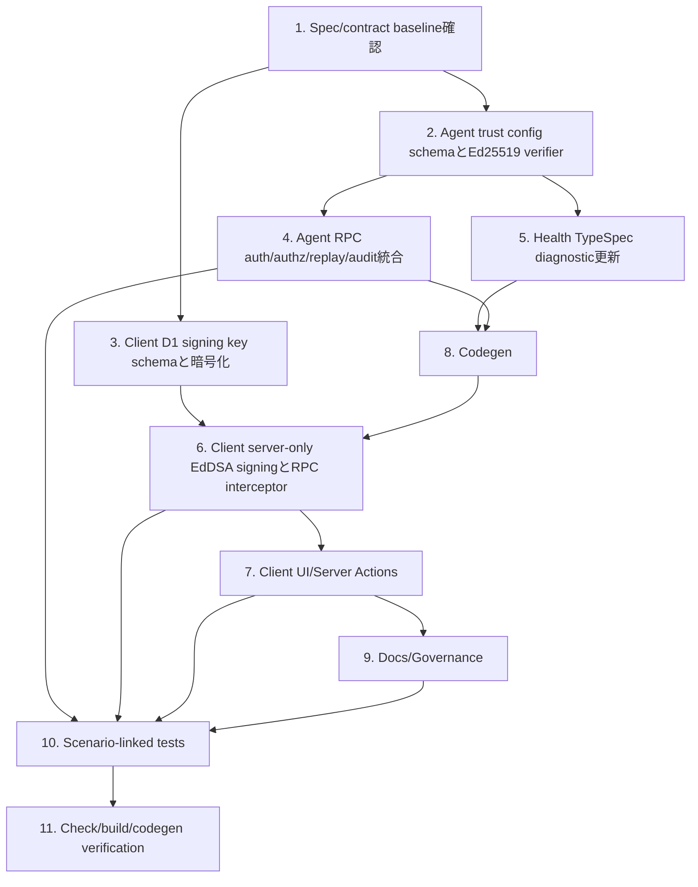

## Scope

### In Scope

- `agent-security`: Agent production Client Service authentication を Ed25519 JWT と `AGENT_CONTROL_PLANE_TRUST` に統一し、trust config validation、issuer/kid lookup、key status、allowed Agent/scope、method scope matrix、`jti` replay protection、safe audit/metrics を実装する。
- `client-registry`: Client D1 に encrypted signing key store を追加し、managed Agent record に signing issuer/kid/public fingerprint/last verified metadata を保持し、server-only module で private JWK 復号と EdDSA JWT signing を行う。
- `client-management`: 既存 Management Client route shell の中で signing key 管理、Agent ごとの signing key selection、public trust config export、rotation/revoke/recovery guidance、health verification を提供する。
- `agent-health`: `AgentHealthService.Check` を trust config と issuer/kid/fingerprint diagnostic に拡張し、key material を返さない安全な health response にする。
- `workspace-governance`: documentation、governance tests、browser secrecy checks、scenario coverage を production credential 境界に合わせる。
- Agent API contract は TypeSpec -> proto -> generated RPC のコマンド生成で更新し、生成済み output は手編集しない。

### Out of Scope

- Agent REST/JSON authentication API、OpenAPI/Orval Agent SDK、Browser 直接 Agent RPC 呼び出し。
- bootstrap token、bootstrap RPC、AgentTrustRegistry Durable Object、HS256 shared secret を production Client Service auth として扱う経路。
- Cloudflare Worker secrets を runtime から自動編集する仕組み。
- Recovery key を Client-managed signing key store に保存する仕組み。Recovery key は break-glass 用の別管理として documentation と trust config contract で扱う。
- Wireframe HTML 生成。UI は既存 Management Client の視覚言語に合わせるが、この proposal では wireframe artifact を生成しない。

## Assumptions / Dependencies

- `packages/agent` と `packages/client` の foundation、Connect unary binary Protobuf facade、AIAgent Durable Object、Client D1、generated Agent RPC client は存在する。
- Agent API source of truth は `packages/agent/src/typespec/main.tsp` と `packages/agent/src/typespec/src/services/*.tsp` であり、proto/RPC outputs は `pnpm gen:agent:proto && pnpm gen:agent:rpc` で生成する。
- Cloudflare Workers Web Crypto は Ed25519 key generation/import/sign/verify を利用できる。利用できない環境差が検出された場合は dependency 追加前に実行環境で検証し、production path を Web Crypto 互換に閉じる。
- `CLIENT_CREDENTIAL_ENCRYPTION_KEY` は Client Worker secret として事前に設定され、D1 に保存する private JWK 暗号化の root secret として扱う。
- Agent Worker は `AGENT_CONTROL_PLANE_TRUST` を required secret として受け取り、`AGENT_RPC_AUDIENCE` または trust config audiences を audience 検証に使う。
- D1 schema migration は Client-owned management ledger だけを対象にし、Agent domain snapshots は追加しない。
- 既存 `x-agent-test-*` seam は tests 専用に残せるが、production request path では credential として扱わない。

## Impacted Areas

- Agent env and security: required secret names、trust config schema、Ed25519 public JWK import、Client Service JWT verifier、failure reasons、scope matrix、replay storage、audit context。
- Agent RPC facade: binary profile enforcement 後の authentication/authorization/replay interceptors、method required scope mapping、health service response mapping。
- Agent TypeSpec/proto: health diagnostic fields、security/auth metadata models、generated proto/RPC outputs。
- Client D1: managed Agent signing metadata columns、signing key store table、migration、repository tests。
- Client server-only modules: credential encryption/decryption、Ed25519 key generation/signing、fingerprint calculation、Agent RPC interceptor、health verification action。
- Client UI: signing key management panel、Agent settings key selection、trust config export panel、rotation/revoke/recovery guidance、safe errors。
- Documentation/governance: Agent/Client README、operations runbook、lint/governance scripts、scenario coverage tests、browser bundle secrecy checks。

## Directory Tree

```text
packages
├─ agent
│  ├─ README.md
│  ├─ wrangler.toml
│  ├─ proto
│  │  └─ cftamac/agent/v1.proto
│  └─ src
│     ├─ env.ts
│     ├─ typespec
│     │  └─ src
│     │     ├─ common/security.tsp
│     │     └─ services/agent-health.tsp
│     ├─ generated/rpc/cftamac/agent/v1_pb.ts
│     ├─ domain/security
│     │  ├─ trust-config.ts
│     │  ├─ jwt.ts
│     │  ├─ replay.ts
│     │  └─ types.ts
│     ├─ rpc
│     │  ├─ command-context.ts
│     │  ├─ services/health.ts
│     │  └─ interceptors
│     │     ├─ authentication.ts
│     │     ├─ authorization.ts
│     │     ├─ audit.ts
│     │     ├─ replay-protection.ts
│     │     └─ types.ts
│     ├─ observability
│     │  ├─ records.ts
│     │  └─ redaction.ts
│     └─ tests
│        ├─ control-plane-trust-config.test.ts
│        ├─ client-service-ed25519-auth.test.ts
│        ├─ health-rpc.test.ts
│        ├─ rpc-interceptors.test.ts
│        └─ security-foundation.test.ts
├─ client
│  ├─ README.md
│  ├─ wrangler.toml
│  ├─ app
│  │  ├─ agents/page.tsx
│  │  └─ agents/[agentId]/settings/page.tsx
│  └─ src
│     ├─ server
│     │  ├─ env.ts
│     │  ├─ db
│     │  │  ├─ schema.ts
│     │  │  ├─ managed-agents.ts
│     │  │  ├─ signing-keys.ts
│     │  │  └─ migrations/0002_control_plane_signing_keys.sql
│     │  ├─ credentials
│     │  │  ├─ encryption.ts
│     │  │  └─ signing-keys.ts
│     │  ├─ agent-rpc
│     │  │  ├─ authentication.ts
│     │  │  ├─ agent-loader.ts
│     │  │  └─ create-client.ts
│     │  └─ actions
│     │     ├─ signing-keys.ts
│     │     ├─ trust-config.ts
│     │     └─ agent-health.ts
│     ├─ components
│     │  ├─ signing-key-management.tsx
│     │  ├─ trust-config-export.tsx
│     │  ├─ agent-signing-key-select.tsx
│     │  ├─ key-rotation-guide.tsx
│     │  └─ schemas/signing-key.ts
│     └─ tests
│        ├─ client-signing-key-store.test.ts
│        ├─ client-agent-rpc-factory.test.ts
│        ├─ browser-agent-rpc-secrecy.test.ts
│        └─ agent-management-ui.test.tsx
├─ docs
│  └─ operations/agent-control-plane-auth.md
├─ scripts
│  ├─ governance
│  │  ├─ verify-agent-surface.mjs
│  │  ├─ verify-agent-surface.test.mjs
│  │  ├─ verify-package-boundaries.mjs
│  │  └─ verify-package-boundaries.test.mjs
│  └─ openspec
│     ├─ verify-scenario-coverage.mjs
│     └─ verify-scenario-coverage.test.mjs
└─ tests
   └─ e2e
      ├─ management-agent-rpc-secrecy.spec.ts
      └─ management-agent-registry.spec.ts
```

## New / Changed Files

| Type      | File                                                                           | Change                                                                                                                 |
| --------- | ------------------------------------------------------------------------------ | ---------------------------------------------------------------------------------------------------------------------- |
| Update    | `packages/agent/README.md`                                                     | Agent trust config、required secrets、rotation/revoke smoke 手順を説明する。                                           |
| Update    | `packages/agent/wrangler.toml`                                                 | `AGENT_CONTROL_PLANE_TRUST` と `AGENT_RPC_AUDIENCE` の運用前提を反映する。                                             |
| Update    | `packages/agent/src/env.ts`                                                    | required secret を `AGENT_CONTROL_PLANE_TRUST` に更新し、`AGENT_CLIENT_JWT_PUBLIC_KEYS` production source を削除する。 |
| Update    | `packages/agent/src/typespec/src/common/security.tsp`                          | Health diagnostic と auth summary に必要な security metadata model を追加する。                                        |
| Update    | `packages/agent/src/typespec/src/services/agent-health.tsp`                    | trust config/version/fingerprint/issuer/kid diagnostic fields を追加する。                                             |
| Generated | `packages/agent/proto/cftamac/agent/v1.proto`                                  | TypeSpec から生成される Agent proto。手編集しない。                                                                    |
| Generated | `packages/agent/src/generated/rpc/cftamac/agent/v1_pb.ts`                      | Protobuf-ES generated Agent RPC descriptor。手編集しない。                                                             |
| Add       | `packages/agent/src/domain/security/trust-config.ts`                           | `AGENT_CONTROL_PLANE_TRUST` schema validation、fingerprint、issuer/kid lookup、key status policy を実装する。          |
| Update    | `packages/agent/src/domain/security/jwt.ts`                                    | EdDSA-only Client Service JWT verification、max TTL、allowed Agent/scope、trust policy failure reasons を実装する。    |
| Update    | `packages/agent/src/domain/security/replay.ts`                                 | Client Service `jti` replay window を principal + Agent scope に接続する。                                             |
| Update    | `packages/agent/src/domain/security/types.ts`                                  | Authenticated principal に issuer、kid、fingerprint、principalType、scope policy fields を追加する。                   |
| Update    | `packages/agent/src/rpc/command-context.ts`                                    | AIAgent へ渡す auth/audit context を Ed25519 JWT principal に合わせる。                                                |
| Update    | `packages/agent/src/rpc/interceptors/authentication.ts`                        | test seam と production Authorization bearer path を分離し、production では `x-agent-test-*` を認証に使わない。        |
| Update    | `packages/agent/src/rpc/interceptors/authorization.ts`                         | method required scope matrix と allowedAgentIds validation を実装する。                                                |
| Update    | `packages/agent/src/rpc/interceptors/audit.ts`                                 | issuer/subject/kid/principalType/actingUserId/scopes/jwtId を safe audit context に接続する。                          |
| Update    | `packages/agent/src/rpc/interceptors/replay-protection.ts`                     | `jti` replay rejection を domain handling 前に実行する。                                                               |
| Update    | `packages/agent/src/rpc/interceptors/types.ts`                                 | auth failure reason、safe diagnostic fields、principal metadata 型を追加する。                                         |
| Update    | `packages/agent/src/rpc/services/health.ts`                                    | trust config diagnostic と current issuer/kid/fingerprint verification summary を返す。                                |
| Update    | `packages/agent/src/observability/records.ts`                                  | Authentication success/reject/replay/scope denied records を safe field に限定する。                                   |
| Update    | `packages/agent/src/observability/redaction.ts`                                | JWT、private JWK、public key full value、encrypted private JWK の redaction を強化する。                               |
| Add       | `packages/agent/src/tests/control-plane-trust-config.test.ts`                  | Trust config schema/status/fingerprint/fail-closed tests を追加する。                                                  |
| Add       | `packages/agent/src/tests/client-service-ed25519-auth.test.ts`                 | Ed25519 JWT happy/error/replay/scope tests を追加する。                                                                |
| Update    | `packages/agent/src/tests/health-rpc.test.ts`                                  | trust diagnostic と key material 非露出を確認する。                                                                    |
| Update    | `packages/agent/src/tests/rpc-interceptors.test.ts`                            | production Authorization path、binary profile、scope matrix、test seam 分離を確認する。                                |
| Update    | `packages/agent/src/tests/security-foundation.test.ts`                         | Scenario ID coverage と observability redaction cases を追加する。                                                     |
| Update    | `packages/client/README.md`                                                    | Signing key management、trust export、Agent health verification、secret setup を説明する。                             |
| Update    | `packages/client/wrangler.toml`                                                | `CLIENT_CREDENTIAL_ENCRYPTION_KEY` secret 前提を明記する。                                                             |
| Update    | `packages/client/app/agents/page.tsx`                                          | Registry page に signing key management/trust export entry を追加する。                                                |
| Update    | `packages/client/app/agents/[agentId]/settings/page.tsx`                       | Agent ごとの signing key selection、health verification、rotation guidance を表示する。                                |
| Update    | `packages/client/src/server/env.ts`                                            | `CLIENT_CREDENTIAL_ENCRYPTION_KEY` を required server-only secret として検証する。                                     |
| Update    | `packages/client/src/server/db/schema.ts`                                      | managed Agent signing metadata と signing key store table metadata を追加する。                                        |
| Update    | `packages/client/src/server/db/managed-agents.ts`                              | signing issuer/kid/fingerprint/last verified CRUD を追加する。                                                         |
| Add       | `packages/client/src/server/db/signing-keys.ts`                                | Client signing key repository と status transitions を実装する。                                                       |
| Add       | `packages/client/src/server/db/migrations/0002_control_plane_signing_keys.sql` | D1 schema に signing key store と managed Agent signing metadata を追加する。                                          |
| Add       | `packages/client/src/server/credentials/encryption.ts`                         | `CLIENT_CREDENTIAL_ENCRYPTION_KEY` による private JWK 暗号化/復号を実装する。                                          |
| Add       | `packages/client/src/server/credentials/signing-keys.ts`                       | Ed25519 key generation、JWK fingerprint、private JWK 解決を実装する。                                                  |
| Update    | `packages/client/src/server/agent-rpc/authentication.ts`                       | HS256 signing を除去し、EdDSA JWT signing と bearer interceptor を実装する。                                           |
| Update    | `packages/client/src/server/agent-rpc/agent-loader.ts`                         | managed Agent signing metadata と key fingerprint validation を読み込む。                                              |
| Update    | `packages/client/src/server/agent-rpc/create-client.ts`                        | Agent RPC client factory が selected signing key を使うようにする。                                                    |
| Add       | `packages/client/src/server/actions/signing-keys.ts`                           | Key generation/status/default selection actions を追加する。                                                           |
| Add       | `packages/client/src/server/actions/trust-config.ts`                           | Public-only trust config export、merge/update JSON、schema validation actions を追加する。                             |
| Add       | `packages/client/src/server/actions/agent-health.ts`                           | Selected signing key で Agent health verification を実行する。                                                         |
| Add       | `packages/client/src/components/signing-key-management.tsx`                    | Signing key lifecycle UI を追加する。                                                                                  |
| Add       | `packages/client/src/components/trust-config-export.tsx`                       | Trust config export/validation/warnings UI を追加する。                                                                |
| Add       | `packages/client/src/components/agent-signing-key-select.tsx`                  | Agent ごとの issuer/kid/fingerprint selection UI を追加する。                                                          |
| Add       | `packages/client/src/components/key-rotation-guide.tsx`                        | Rotation/revoke/recovery guidance UI を追加する。                                                                      |
| Add       | `packages/client/src/components/schemas/signing-key.ts`                        | Signing key UI form validation schema を追加する。                                                                     |
| Add       | `packages/client/src/tests/client-signing-key-store.test.ts`                   | D1 store/encryption/status/fingerprint tests を追加する。                                                              |
| Update    | `packages/client/src/tests/client-agent-rpc-factory.test.ts`                   | EdDSA bearer token generation と key selection tests を追加する。                                                      |
| Update    | `packages/client/src/tests/browser-agent-rpc-secrecy.test.ts`                  | Browser-visible signing material 不在を検査する。                                                                      |
| Update    | `packages/client/src/tests/agent-management-ui.test.tsx`                       | Signing key/trust export/health verification component tests を追加する。                                              |
| Add       | `docs/operations/agent-control-plane-auth.md`                                  | Trust config、key generation、rotation、revoke、break-glass recovery runbook を追加する。                              |
| Update    | `scripts/governance/verify-agent-surface.mjs`                                  | Forbidden auth surfaces と Agent REST/JSON/bootstrap production trust path を検出する。                                |
| Update    | `scripts/governance/verify-agent-surface.test.mjs`                             | Production auth guardrail fixtures を追加する。                                                                        |
| Update    | `scripts/governance/verify-package-boundaries.mjs`                             | Browser-visible signing material/import boundary checks を追加する。                                                   |
| Update    | `scripts/governance/verify-package-boundaries.test.mjs`                        | Client signing material boundary fixtures を追加する。                                                                 |
| Update    | `scripts/openspec/verify-scenario-coverage.mjs`                                | Manual tag と auth Scenario ID coverage の検出を確認する。                                                             |
| Update    | `scripts/openspec/verify-scenario-coverage.test.mjs`                           | Production auth scenario coverage cases を追加する。                                                                   |
| Update    | `tests/e2e/management-agent-rpc-secrecy.spec.ts`                               | Signing key UI と browser bundle secrecy E2E を追加する。                                                              |
| Update    | `tests/e2e/management-agent-registry.spec.ts`                                  | Agent signing key selection、trust export、health verification E2E を追加する。                                        |
| Generated | `packages/client/src/generated/agent-rpc/cftamac/agent/v1_pb.ts`               | Agent health contract 変更に伴う generated client output。手編集しない。                                               |

## System Diagram



## Package Diagram



## Sequence Diagram



## UI Wireframes

N/A — wireframe not yet generated

## Domain Model Diagram



## ER Diagram



## Package-Level Design

### Package List

| Package                                  | Purpose / Responsibility                                                                         | Public API                                                               | Dependencies                                                |
| ---------------------------------------- | ------------------------------------------------------------------------------------------------ | ------------------------------------------------------------------------ | ----------------------------------------------------------- |
| `packages/agent/src/domain/security`     | Trust config、Ed25519 JWT、scope/replay primitives を所有する。                                  | `parseControlPlaneTrustConfig`, `verifyClientServiceJwt`, replay helpers | Web Crypto、Agent env、domain security types                |
| `packages/agent/src/rpc`                 | Binary Connect facade で auth/authz/replay/audit/health を実行する。                             | Connect service handlers/interceptors                                    | generated RPC descriptors、domain security、AIAgent routing |
| `packages/client/src/server/db`          | Client D1 managed Agent/signing key persistence を所有する。                                     | repository functions、Drizzle table definitions                          | Drizzle D1、Client env                                      |
| `packages/client/src/server/credentials` | Private JWK encryption/decryption、Ed25519 key generation、fingerprint を server-only に閉じる。 | key generation/encryption/signing helpers                                | Web Crypto、Client env                                      |
| `packages/client/src/server/agent-rpc`   | Selected signing key で Agent RPC bearer JWT を付与する。                                        | client factory、auth interceptor、Agent loader                           | generated Agent RPC client、Client DB、credentials          |
| `packages/client/src/server/actions`     | UI 操作を server-side persistence/RPC に接続する。                                               | signing key/trust config/health Server Actions                           | Client DB、credentials、agent-rpc                           |
| `packages/client/src/components`         | Key management、trust export、Agent key selection、rotation guidance を描画する。                | React components and form schemas                                        | Server Actions、existing UI primitives                      |
| `scripts/governance`                     | Forbidden surfaces、browser secrecy、package boundary を検査する。                               | CLI scripts used by lint/test                                            | file scanning, test fixtures                                |

### Details

#### `packages/agent/src/domain/security`

- Purpose / Responsibility: Agent Worker が production Client Service credential を検証するための trust config、JWT verification、replay inputs、principal policy を所有する。Client D1 や UI を参照しない。
- Public API: Trust config parser/diagnostic helper、issuer/kid resolver、Ed25519 JWT verifier、failure reason 型、scope policy 型。
- Key Data Structures: `ControlPlaneTrustConfig`、`TrustIssuer`、`TrustKeyPolicy`、`ClientServiceJwtPrincipalContext`、`ClientServiceJwtFailureReason`。
- Key Flows: env secret parse -> schema validation -> fingerprint calculation -> issuer/kid lookup -> Ed25519 import/verify -> claim/policy validation -> principal normalization。
- Dependencies: Web Crypto と base64url utilities。外部 key registry、Client runtime source、Browser APIs には依存しない。
- Error Handling: malformed config/token、unsupported alg、unknown issuer/kid、inactive key、invalid signature、audience/time/agent/scope/replay failures を safe reason に分類する。
- Testing Strategy: `AGENT-SECURITY-S001`、`S002`、`S010`、`S011`、`S012`、`S013`、`S014`、`S015` を unit/integration tests で直接覆う。
- Non-Functional: Fail closed、secret-free diagnostics、bounded token TTL。
- Performance: Trust config parse は request ごとの過剰 parse を避け、env string fingerprint と loadedAt を使った cache を検討する。
- Security: Private key parameter `d` 拒否、public key full value の log 抑止、production で `x-agent-test-*` 不使用。

#### `packages/agent/src/rpc`

- Purpose / Responsibility: Connect unary binary Protobuf profile を enforce し、domain handling 前に authentication、authorization、replay、audit context binding を完了する。
- Public API: generated service registration、RPC interceptors、`AgentHealthService.Check` handler。
- Key Data Structures: `AuthenticatedAgentPrincipal`、`AgentRpcGuardRejection`、method scope matrix、health diagnostic DTO。
- Key Flows: binary content validation -> Authorization bearer extraction -> trust config auth -> method scope/agent policy -> jti replay -> service handler -> AIAgent DO dispatch。
- Dependencies: generated RPC descriptors、Agent security domain、storage replay repository、observability modules。
- Error Handling: Connect code mapping は stable code に統一し、diagnostic details は safe fields のみ返す。
- Testing Strategy: `rpc-interceptors.test.ts`、`health-rpc.test.ts` で `AGENT-HEALTH-S001`、`S002`、`S003` と auth failures を覆う。
- Non-Functional: Auth rejection は Agent-owned state mutation 前に終わる。
- Performance: Replay storage access は protected methods のみに限定し、read-only health でも jti uniqueness を守る。
- Security: Test seam と production auth path を分離し、audit は key fingerprint/kid までに制限する。

#### `packages/client/src/server/db` and `credentials`

- Purpose / Responsibility: Client-owned D1 に encrypted signing key store と Agent signing metadata を保存し、private JWK を server-only で扱う。
- Public API: signing key repository、managed Agent repository extensions、encryption/fingerprint/key generation helpers。
- Key Data Structures: `ClientSigningKeyRecord`、`ManagedAgentRecord`、encrypted private JWK envelope、public JWK fingerprint。
- Key Flows: key generation -> private JWK encrypt -> D1 save -> public trust export -> Agent selection -> private JWK decrypt -> JWT signing。
- Dependencies: Drizzle D1、Cloudflare D1、Web Crypto、`CLIENT_CREDENTIAL_ENCRYPTION_KEY`。
- Error Handling: missing encryption secret、decrypt failure、disabled/deleted key、fingerprint mismatch は server-side typed error と safe UI message に変換する。
- Testing Strategy: `CLIENT-REGISTRY-S001`、`S002`、`S006`、`S007`、`S008` を repository/unit tests で覆う。
- Non-Functional: D1 migration は Client management ledger だけを拡張する。
- Performance: Key lookup は issuer/kid primary key で行い、signing 後に lastUsedAtMs を必要な範囲で更新する。
- Security: Private JWK plaintext は function scope 外へ出さず、log と Browser serialization を禁止する。

#### `packages/client/src/server/agent-rpc` and `actions`

- Purpose / Responsibility: Agent ごとの selected signing key を解決し、EdDSA JWT bearer metadata を生成済み Connect client に付与する。
- Public API: Agent RPC client factory、auth interceptor、signing key/trust config/health Server Actions。
- Key Data Structures: `ResolvedAgentRpcCredential` を Ed25519 JWK ベースへ更新、trust export view model、health verification result。
- Key Flows: Server Action -> Agent metadata load -> signing key validate -> JWT sign -> Agent RPC call -> safe result -> UI revalidation。
- Dependencies: generated Agent RPC client、Client DB repositories、credentials helpers、acting user source。
- Error Handling: Agent trust mismatch、scope denied、health failure は key material を含まない action result として返す。
- Testing Strategy: `CLIENT-REGISTRY-S003` と `AGENT-HEALTH-S003` を server action/factory tests で覆う。
- Non-Functional: Browser-visible modules は server-only imports に到達できない。
- Performance: JWT TTL は 300 秒を基準とし、token は RPC 呼び出しごとに生成する。
- Security: JWT payload は `iss`、`sub`、`aud`、`agent_id`、`scopes`、`acting_user_id`、`jti`、`nbf`、`exp` に限定する。

#### `packages/client/app` and `components`

- Purpose / Responsibility: 既存 Management Client routes の中で signing key lifecycle、trust config export、Agent key selection、rotation/revoke/recovery guidance を表示する。
- Public API: Server-rendered pages and form components。
- Key Data Structures: Browser-safe signing key summary、trust config preview、verification status、rotation checklist view model。
- Key Flows: registry page key management -> generate/disable/delete/default action -> trust export preview; Agent settings -> select key -> health verify -> last verified update。
- Dependencies: Server Actions、UI primitives、schemas。
- Error Handling: Form validation errors、Agent auth mismatch、schema validation errors を accessible field/message として表示する。
- Testing Strategy: `CLIENT-MANAGEMENT-S010` から `S016` を component tests と Playwright E2E で覆う。
- Non-Functional: Mobile/desktop responsive、既存 visual language を維持する。
- Performance: Trust config preview は public data のみで生成し、大きな JSON は textarea/preview rendering を過剰更新しない。
- Security: No private JWK、生 JWT、encrypted private JWK in props/HTML/bundle/storage。

#### `scripts/governance` and documentation

- Purpose / Responsibility: Auth boundary と operations runbook が drift しないように検査する。
- Public API: lint/governance scripts、README/runbook。
- Key Data Structures: forbidden pattern definitions、allowed server-only path lists、Scenario ID coverage fixtures。
- Key Flows: lint -> forbidden surface scan -> package boundary scan -> scenario coverage -> failure report。
- Dependencies: repository file graph and existing lint commands。
- Error Handling: Failures は path、rule、safe explanation を出す。
- Testing Strategy: `WORKSPACE-GOVERNANCE-S010`、`S011`、`S012` を governance tests で覆う。
- Non-Functional: Guardrails は生成物手編集や secret bypass を許さない。
- Performance: Scans are limited to repo source/build artifact paths already used by governance scripts。
- Security: Private signing material の browser-visible reachability を検出する。

## Implementation Plan



## Test Plan

### User Acceptance Test (Manual)

| UAT ID                           | Related Requirement                                                   | Spec Summary                                                               | Customer Problem Summary                                                          | Steps                                                                                      | Expected Behavior                                                                                               |
| -------------------------------- | --------------------------------------------------------------------- | -------------------------------------------------------------------------- | --------------------------------------------------------------------------------- | ------------------------------------------------------------------------------------------ | --------------------------------------------------------------------------------------------------------------- |
| UAT-CLIENT-MANAGEMENT-HAP-001    | CLIENT-MANAGEMENT-R001 Signing key management UI と server actions    | Management Client で Ed25519 signing key を生成し lifecycle を管理できる。 | 運用者が private key を手貼りせずに Client Service credential を管理したい。      | Management Client を開く、signing key を生成する、default にする、disabled にする。        | issuer/kid/fingerprint/status が表示され、private JWK は画面と network に出ない。                               |
| UAT-CLIENT-MANAGEMENT-SEC-002    | CLIENT-MANAGEMENT-R003 Agent trust config export UI                   | Agent Worker に貼る public-only trust config JSON を生成できる。           | 運用者が public key と policy だけを安全に Agent trust config へ反映したい。      | Signing key を選択し、allowedAgentIds/scopes を選び、export JSON を確認する。              | JSON に `d`、private JWK、encrypted private JWK が含まれず、schema validation と warning が表示される。         |
| UAT-CLIENT-MANAGEMENT-HAP-003    | CLIENT-MANAGEMENT-R004 Rotation revoke recovery guidance              | Rotation/revoke/recovery の操作順と health verification が UI で追える。   | Key rotation 中に Agent trust config と Client selection がずれることを避けたい。 | Rotation guidance を開き、Agent key selection を切り替え、health verification を実行する。 | issuer/kid/fingerprint と verification result が表示され、失敗時に secret なしの対処 message が出る。           |
| UAT-WORKSPACE-GOVERNANCE-SEC-004 | WORKSPACE-GOVERNANCE-R001 Production credential operations governance | Operations runbook が production credential 境界を説明する。               | 運用者と reviewer が同じ手順で trust config、revoke、recovery を扱いたい。        | `docs/operations/agent-control-plane-auth.md` と README を読む。                           | required secrets、trust config schema、rotation、revoke、break-glass recovery、private key 非露出が確認できる。 |

### E2E Test (Playwright)

| E2E ID                        | Playwright Test Name                                                    | Related Scenario       | Category | Summary                                                                    | Steps (Playwright)                                                       | Expected Behavior                                                                  |
| ----------------------------- | ----------------------------------------------------------------------- | ---------------------- | -------- | -------------------------------------------------------------------------- | ------------------------------------------------------------------------ | ---------------------------------------------------------------------------------- |
| E2E-CLIENT-MANAGEMENT-HAP-001 | `[CLIENT-MANAGEMENT-S010] Signing key lifecycle can be managed`         | CLIENT-MANAGEMENT-S010 | HAP      | UI から key generation/status/default selection を実行する。               | `/agents` を開く、key を生成、default を選択、disabled にする。          | UI と server action result が status を反映し、trust config warning が表示される。 |
| E2E-CLIENT-MANAGEMENT-SEC-002 | `[CLIENT-MANAGEMENT-S011] Browser receives no signing material`         | CLIENT-MANAGEMENT-S011 | SEC      | Browser payload と storage に signing material がないことを検査する。      | Key 管理 UI 操作後に responses、HTML、storage、bundles を走査する。      | private JWK、encrypted private JWK、生 JWT が見つからない。                        |
| E2E-CLIENT-MANAGEMENT-HAP-003 | `[CLIENT-MANAGEMENT-S012] Agent settings verifies selected signing key` | CLIENT-MANAGEMENT-S012 | HAP      | Agent settings で issuer/kid selection と health verification を実行する。 | `/agents/[agentId]/settings` を開く、signing key を選択、verify を押す。 | issuer/kid/fingerprint/last verified と verification result が表示される。         |
| E2E-CLIENT-MANAGEMENT-SEC-004 | `[CLIENT-MANAGEMENT-S013] Trust config export is public only`           | CLIENT-MANAGEMENT-S013 | SEC      | Trust config export に private material が入らない。                       | Export UI で scopes/agents を選択し JSON preview を読む。                | JSON に public JWK fields と policy があり、`d` と private fields がない。         |
| E2E-CLIENT-MANAGEMENT-SEC-005 | `[CLIENT-MANAGEMENT-S014] Broad scope warns before export`              | CLIENT-MANAGEMENT-S014 | SEC      | Wildcard/high scope 選択時の warning を確認する。                          | `*` agent または `agent:admin` を選択する。                              | Broad permission warning と schema validation result が表示される。                |

### Integration Test (Endpoint)

| IT ID                      | Test Name                                                                        | Genre  | Category | Summary                                                      | Steps (Test)                                                                   | Expected Behavior                                                        |
| -------------------------- | -------------------------------------------------------------------------------- | ------ | -------- | ------------------------------------------------------------ | ------------------------------------------------------------------------------ | ------------------------------------------------------------------------ |
| IT-AGENT-SECURITY-HAP-001  | `[AGENT-SECURITY-S001] Valid Ed25519 Client Service JWT authenticates Agent RPC` | agent  | HAP      | Valid JWT が principal と audit context へ正規化される。     | trust config fixture、Ed25519 key、JWT、binary request を作成して RPC を呼ぶ。 | RPC は認証され、issuer/kid/jwtId/scopes が DO context に渡る。           |
| IT-AGENT-SECURITY-ERR-002  | `[AGENT-SECURITY-S011] Invalid trust config fails closed`                        | agent  | ERR      | Parse/schema/revoked/unknown key を拒否する。                | 不正 trust config と revoked key config で RPC を呼ぶ。                        | unauthenticated/permission denied で拒否され、state は変わらない。       |
| IT-AGENT-SECURITY-PERM-003 | `[AGENT-SECURITY-S013] Method scope matrix rejects missing scope`                | agent  | PERM     | 不足 scope の mutating RPC を拒否する。                      | `agent:read` token で write/tool/admin RPC を呼ぶ。                            | permission denied となり mutation は発生しない。                         |
| IT-AGENT-SECURITY-SEC-004  | `[AGENT-SECURITY-S015] Replayed jti is rejected before mutation`                 | agent  | SEC      | 同一 `jti` の replay を拒否する。                            | 同一 principal/jti で二度 RPC を呼ぶ。                                         | 一回目のみ処理され、二回目は replay denied。                             |
| IT-AGENT-HEALTH-HAP-005    | `[AGENT-HEALTH-S003] Health reports issuer kid fingerprint diagnostic safely`    | agent  | HAP      | Health RPC が trust diagnostic を返す。                      | Valid JWT で Check を呼び、response を検査する。                               | issuer/kid/fingerprint status が返り、key material は返らない。          |
| IT-CLIENT-REGISTRY-HAP-006 | `[CLIENT-REGISTRY-S003] Server Action signs Agent RPC with selected key`         | client | HAP      | Client server が D1 key selection で bearer JWT を生成する。 | D1 に managed Agent と signing key fixture を作り Server Action を実行する。   | Authorization header は EdDSA JWT で、Browser result は safe data のみ。 |
| IT-CLIENT-REGISTRY-ERR-007 | `[CLIENT-REGISTRY-S007] Disabled signing key is not used`                        | client | ERR      | disabled/deleted key で Agent RPC を送らない。               | disabled key を参照する managed Agent で RPC factory を実行する。              | signing 前に typed error となり outbound RPC は作られない。              |

### Unit/Component Test (UT)

| UT ID                           | Test Name                                                                         | Package            | Category | Summary                                                            | Steps (Test)                                                         | Expected Behavior                                                    |
| ------------------------------- | --------------------------------------------------------------------------------- | ------------------ | -------- | ------------------------------------------------------------------ | -------------------------------------------------------------------- | -------------------------------------------------------------------- |
| UT-AGENT-SECURITY-BND-001       | `[AGENT-SECURITY-S010] Trust config parser resolves active Ed25519 key policy`    | packages/agent     | BND      | Trust config parser と fingerprint を確認する。                    | valid config fixture を parse し issuer/kid lookup を実行する。      | public key policy と fingerprint が返る。                            |
| UT-AGENT-SECURITY-ERR-002       | `[AGENT-SECURITY-S012] Retiring key enforces bounded token window`                | packages/agent     | ERR      | retiring key と max TTL の境界を確認する。                         | retiring key で valid/expired/overlong JWT を検証する。              | valid bounded token だけが受理される。                               |
| UT-CLIENT-REGISTRY-SEC-003      | `[CLIENT-REGISTRY-S006] Server-side key generation omits private JWK from result` | packages/client    | SEC      | Key generation action result が public-only であることを確認する。 | key generation helper/action を実行し serialized result を検査する。 | private JWK plaintext と encrypted private JWK が含まれない。        |
| UT-CLIENT-REGISTRY-SEC-004      | `[CLIENT-REGISTRY-S008] Fingerprint mismatch blocks signing`                      | packages/client    | SEC      | Registry と signing key fingerprint 不一致を拒否する。             | mismatched fixtures で Agent RPC credential resolution を実行する。  | signing は実行されず safe error が返る。                             |
| UT-CLIENT-MANAGEMENT-A11Y-005   | `[CLIENT-MANAGEMENT-S014] Trust export warning is accessible`                     | packages/client    | A11Y     | Broad scope warning が accessible に表示される。                   | Component に wildcard/high scope state を渡す。                      | alert/description と validation status が関連付く。                  |
| UT-WORKSPACE-GOVERNANCE-SEC-006 | `[WORKSPACE-GOVERNANCE-S011] Guardrails reject browser-visible signing material`  | scripts/governance | SEC      | Forbidden import/material fixtures を検出する。                    | governance script fixtures を実行する。                              | private signing material の browser reachability が failure になる。 |
| UT-WORKSPACE-GOVERNANCE-REG-007 | `[WORKSPACE-GOVERNANCE-S012] Scenario coverage validates production auth specs`   | scripts/openspec   | REG      | Scenario IDs と test title/manual tag coverage を確認する。        | coverage checker fixture を実行する。                                | missing/duplicate/orphan Scenario ID が報告される。                  |

## Rollback / Migration

- Client D1 migration は `client_signing_keys` table 追加と `client_managed_agents` signing metadata columns 追加を行う。Data migration は existing managed Agent records に default signing key が存在しない状態を許容し、Agent RPC 実行時に explicit key selection を要求する。
- `AGENT_CLIENT_JWT_PUBLIC_KEYS` production auth source は残さない。Release が中止される場合は Worker version と D1 backup を release 前状態に戻し、compatibility alias は追加しない。
- D1 rollback が必要な場合は release 前 backup を復元する。Deleted signing key の private material は復旧不能として扱うため、復旧後に key generation と trust config 更新を実行する。
- Agent trust config parse/validation が失敗する場合、Agent Worker は fail closed する。運用復旧は Cloudflare Dashboard/API/Wrangler で valid `AGENT_CONTROL_PLANE_TRUST` を設定し、Client health verification で確認する。

## Release Procedure

- `corepack enable && pnpm install` を実行し、依存状態を確定する。
- Client D1 migration を local/staging に適用し、`CLIENT_CREDENTIAL_ENCRYPTION_KEY` を secret として設定する。
- Agent staging Worker に `AGENT_CONTROL_PLANE_TRUST` と `AGENT_RPC_AUDIENCE` を設定する。
- `pnpm gen:agent:proto && pnpm gen:agent:rpc` を実行し、generated output を更新する。
- `pnpm check:codegen` を実行し、generated drift がないことを確認する。
- `pnpm test:agent`、`pnpm test:management-client`、`pnpm test:governance`、`pnpm test:e2e` を実行する。
- `pnpm check:agent && pnpm check:management-client` を実行する。
- `pnpm build:foundation` を実行する。
- Management Client で signing key を生成し、public trust config を Agent Worker secret に設定し、Agent health verification を実行する。
- Rotation、emergency revoke、break-glass recovery runbook を staging で確認し、本番適用前に public trust config fingerprint を記録する。

## Acceptance Criteria

- `AGENT_CONTROL_PLANE_TRUST` から複数 issuer/key/policy を検証でき、private key parameter `d`、parse error、unknown issuer/kid、revoked key は fail closed する。
- Client server-only modules が Ed25519 JWT を署名し、Agent RPC は valid token だけを受理する。
- `alg` 不一致、不正署名、期限不正、audience 不一致、agent_id 不一致、allowedAgentIds 不一致、scope 不足、replayed `jti` が拒否される。
- Client D1 は encrypted private JWK だけを保存し、Browser-visible code/payload/storage/logs に private signing material が出ない。
- Management Client は signing key lifecycle、Agent key selection、trust config export、health verification、rotation/revoke/recovery guidance を提供する。
- Agent health response は trust diagnostic を返し、key material と token body を返さない。
- Docs、governance scripts、scenario-linked automated tests が production credential boundary を検証する。
- `pnpm check:codegen`、`pnpm test:agent`、`pnpm test:management-client`、`pnpm test:governance`、`pnpm check:agent && pnpm check:management-client` が成功する。

## Open Issues

- N/A。現時点で実装前に必要な未決定事項はない。
