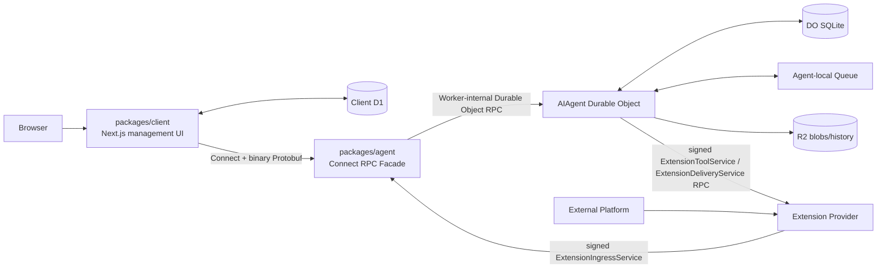
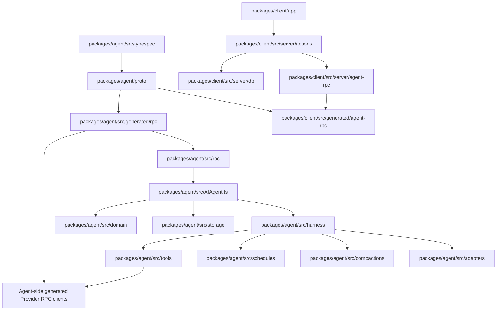
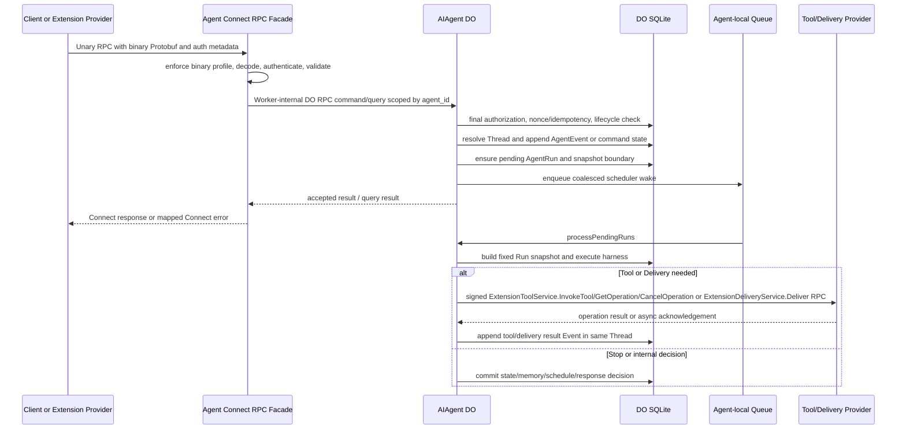
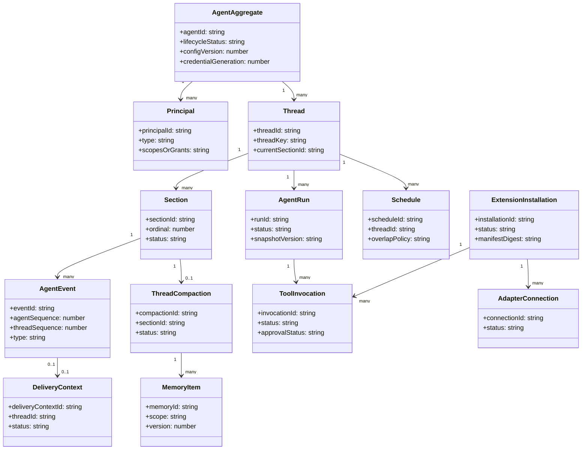
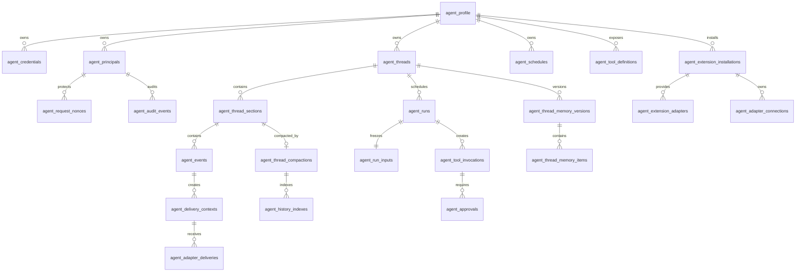
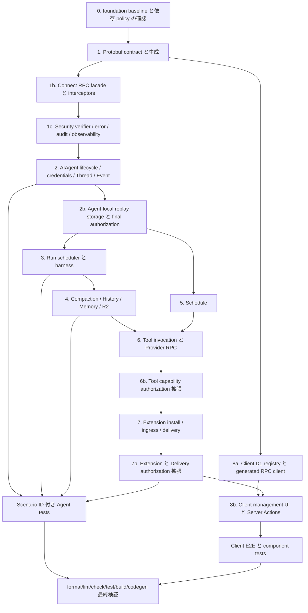

## Scope

### In Scope

- Foundation 前提: `establish-agent-service-foundation` が適用済みであることを前提に、foundation が作成した `packages/agent`、`packages/client`、TypeSpec-to-proto 生成、Connect facade、AIAgent DO foundation、Client D1、guardrail を再作成せず、Stage 1〜8 の機能挙動を上乗せする。
- Stage 1: `packages/agent` の TypeSpec Protobuf 契約、proto3 生成、Buf/Protobuf-ES 生成、Connect + binary Protobuf の RPC facade、認証/認可/検証 interceptor、Worker-internal Durable Object RPC router、`AgentHealthService.Check` を機能 contract として詳細化する。
- Stage 2: `1 Agent ID = 1 AIAgent Durable Object instance` を基準に、Agent lifecycle、credential/grant、Thread、Section、AgentEvent、Mailbox、idempotency/replay、Agent-local Queue wake を実装する。
- Stage 3: AgentRun、run input snapshot、Context Builder、scheduler fairness、interrupt/generation check、budget、harness decision commit を実装する。
- Stage 4: `1 Compaction = 1 Section`、Handoff、ThreadHistory、ThreadMemory、AgentMemory、R2 offload、Memory rebase を実装する。
- Stage 5: Agent-owned Schedule、thread-scoped `schedule.triggered` Event、overlap policy、Extension uninstall 時の schedule cleanup を実装する。
- Stage 6: ToolDefinition、ToolInvocation lifecycle、approval、signed Tool Provider RPC、async operation reconcile、Tool result Event を実装する。
- Stage 7: Agent 側の Extension manifest 検証、Installation、`packages/agent/src/adapters/**/*.ts` による Adapter ingress 境界、`AgentExtensionService.CreateAdapterConnection/DeleteAdapterConnection/ListAdapterConnections` による Adapter Connection 管理、`packages/agent/src/typespec/src/services/agent-adapter.tsp` で定義される ExtensionIngressService、Provider-facing `ExtensionDeliveryService.Deliver` client、uninstall cleanup、Installation signature/replay protection を実装する。
- Stage 8: `packages/client` の Next.js 管理 UI、Client 専用 D1 registry、credential reference、server-side generated Connect client、Agent/Thread/Event/Run/Compaction/Schedule/Tool/Extension/Settings 画面を実装する。
- 対象 Spec Unit は `agent-lifecycle-be`、`agent-eventing-be`、`agent-runtime-be`、`agent-memory-be`、`agent-schedule-be`、`agent-tool-be`、`agent-extension-be`、`agent-security-be`、`agent-health-be`、`client-registry-be`、`client-management-fe` とする。

### Out of Scope

- Stage 9 の Discord Extension Provider 実装、Discord Interaction endpoint、Discord Bot token 管理、Discord command registration。Agent 側の generic Extension/Tool/Delivery interop は Stage 1-8 の対象に残す。
- Agent の REST resource API、Agent OpenAPI artifact、Connect JSON production API、Browser からの Agent RPC 直接呼び出し、必須 native gRPC gateway、gRPC-Web。
- Agent 横断の一覧/検索 RPC、Thread ごとの Durable Object 分割、Cloudflare Queues product を Agent mailbox 正本にする設計。
- Agent から Client D1 を読み書きする projection、Client が Agent API を代理公開する public proxy route。
- 生成済み artifact の手編集。proto / generated RPC client は TypeSpec / Buf / Protobuf-ES の生成フローから作る。
- foundation-only の package restructure、demo removal、guardrail scaffold の重複実装。旧 surface が残る場合はこの change で上書き削除せず、foundation 未適用として先に解消する。

## Assumptions / Dependencies

- `docs/memo/仕様設計・アーキテクチャ設定.md` を設計上の正とし、OpenSpec の delta spec は proposal.md の Spec Unit 分割に従う。
- `establish-agent-service-foundation` の proposal/design/spec/tasks が適用・同期済みであり、`packages/agent`、`packages/client`、Agent TypeSpec-to-proto pipeline、Connect facade、AIAgent DO foundation、Client D1 ledger、forbidden-surface guardrails が存在する。
- apply phase は foundation baseline 検証から開始し、未適用・不足・矛盾があれば Stage 1 実装を止めて foundation を先に完了する。
- Agent API 契約の正本は `packages/agent/src/typespec/main.tsp` とし、Agent API では OpenAPI を生成しない。
- Durable Object RPC methods は Agent Worker 内部の facade -> AIAgent 呼び出し専用であり、external/public API は Connect + binary Protobuf の generated service のみとする。
- 本番 Agent RPC は Connect protocol + binary Protobuf + unary RPC を必須 profile とする。native gRPC は同じ proto contract に対する任意互換 profile として扱う。
- `packages/agent` は Cloudflare Workers + Cloudflare Agents SDK + SQLite-backed Durable Objects + R2 を前提に、Client D1 binding と Cloudflare Queues product binding を持たない。
- `packages/client` は Next.js App Router + Cloudflare OpenNext adapter を前提に、Client 専用 D1 と server-side Connect client を所有する。
- `@typespec/protobuf`、Buf/Protobuf-ES、Connect、Cloudflare Agents SDK、Next.js/OpenNext などの依存追加は、`pnpm-workspace.yaml` の 72 時間 minimumReleaseAge と `allowBuilds` 方針を満たす。
- 既存 lint/CI は `pnpm format:check`、`pnpm lint`、`pnpm check`、`pnpm test:run`、`pnpm check:codegen` を基準に更新する。
- OpenSpec の main specs は空であるため、全 delta spec は ADDED Requirements のみで構成する。

## Impacted Areas

- API contract: foundation の `packages/agent/src/typespec/**`、`packages/agent/proto/**`、`packages/agent/src/generated/rpc/**`、`packages/client/src/generated/agent-rpc/**` を詳細化し、`ExtensionToolService` / `ExtensionDeliveryService` 用の Provider-facing generated clients を追加する。
- Agent runtime: `packages/agent/src/index.ts`、`AIAgent.ts`、RPC facade、domain modules、`adapters` modules、DO SQLite schema/migrations、Agent-local Queue callbacks、R2 archive references、optional Workflow/Fiber integration points。
- Security/operations: JWT verification、Extension detached signature、raw body digest、nonce/idempotency tables、grant/scope matrix、rate limiting、audit log、metrics、Connect error mapping、secret redaction。
- Client backend: Client D1 schema/migrations、managed agent registry、credential reference、server-side Agent RPC factory、Server Actions。
- Client frontend: Agent registry、Agent detail、Threads/Events/Runs/Compactions、Schedules、Tools/Approvals、Extensions、Settings 用の Next.js App Router pages/components。
- Tooling/docs: root/package scripts、workspace package entries、ESLint boundaries、Vitest/Playwright projects、OpenSpec scenario coverage tests、CI/codegen drift checks、AGENTS.md、CODING_STANDARDS.md、CONTRIBUTING.md、coding-guardian skill/reference。
- Legacy surface: foundation で除去/非活性化された template `packages/typespec` OpenAPI emitter/output、`packages/frontend/api` Orval Agent SDK、`packages/backend/http` Hono zod-openapi Agent routes と OpenAPI contract tests が再導入されないことを検証する。

## Directory Tree

```text
packages
├─ agent
│  ├─ package.json
│  ├─ README.md
│  ├─ wrangler.toml
│  ├─ buf.yaml
│  ├─ buf.gen.yaml
│  ├─ proto
│  │  └─ cftamac/agent/v1/*.proto
│  └─ src
│     ├─ index.ts
│     ├─ AIAgent.ts
│     ├─ env.ts
│     ├─ typespec
│     │  ├─ main.tsp
│     │  ├─ tspconfig.yaml
│     │  └─ src
│     │     ├─ common
│     │     ├─ models
│     │     └─ services
│     │        ├─ agent-lifecycle.tsp
│     │        ├─ agent-event.tsp
│     │        ├─ agent-thread.tsp
│     │        ├─ agent-run.tsp
│     │        ├─ agent-state.tsp
│     │        ├─ agent-schedule.tsp
│     │        ├─ agent-tool.tsp
│     │        ├─ agent-extension.tsp
│     │        ├─ agent-adapter.tsp
│     │        ├─ extension-tool.tsp
│     │        ├─ extension-delivery.tsp
│     │        └─ agent-health.tsp
│     ├─ generated/rpc
│     │  └─ cftamac/agent/v1/*_pb.ts
│     ├─ rpc
│     │  ├─ router.ts
│     │  ├─ do-router.ts
│     │  ├─ connect-worker-adapter.ts
│     │  ├─ interceptors
│     │  └─ services
│     ├─ domain
│     ├─ events
│     ├─ threads
│     ├─ runs
│     ├─ harness
│     ├─ compactions
│     ├─ schedules
│     ├─ tools
│     ├─ extensions
│     ├─ adapters
│     ├─ storage
│     ├─ observability
│     └─ tests
├─ client
│  ├─ package.json
│  ├─ README.md
│  ├─ next.config.ts
│  ├─ open-next.config.ts
│  ├─ wrangler.toml
│  ├─ app
│  │  └─ agents
│  │     ├─ page.tsx
│  │     ├─ new/page.tsx
│  │     └─ [agentId]
│  │        ├─ page.tsx
│  │        ├─ threads/page.tsx
│  │        ├─ events/page.tsx
│  │        ├─ runs/page.tsx
│  │        ├─ compactions/page.tsx
│  │        ├─ schedules/page.tsx
│  │        ├─ tools/page.tsx
│  │        ├─ extensions/page.tsx
│  │        └─ settings/page.tsx
│  └─ src
│     ├─ server
│     │  ├─ db
│     │  │  ├─ schema.ts
│     │  │  ├─ migrations
│     │  │  ├─ managed-agents.ts
│     │  │  └─ access-credentials.ts
│     │  ├─ actions
│     │  └─ agent-rpc
│     ├─ components
│     ├─ generated/agent-rpc
│     └─ tests
├─ tests
│  └─ e2e
package.json
pnpm-workspace.yaml
AGENTS.md
CODING_STANDARDS.md
CONTRIBUTING.md
scripts/governance/verify-agent-surface.mjs
scripts/governance/verify-agent-surface.test.mjs
.opencode/skills/coding-guardian/SKILL.md
.opencode/skills/coding-guardian/references/repo-entrypoints.md
eslint.config.js
vitest.config.ts
playwright.config.ts
foundationで不在確認: packages/typespec Agent OpenAPI, packages/frontend/api Orval Agent SDK, packages/backend/http Agent Hono routes
```

## New / Changed Files

| Type       | File                                                               | Change                                                                                                                                                                                                      |
| ---------- | ------------------------------------------------------------------ | ----------------------------------------------------------------------------------------------------------------------------------------------------------------------------------------------------------- |
| Update     | `packages/agent/package.json`                                      | foundation scripts を Stage 1〜8 の build/check/test/generation/local dev に拡張する。                                                                                                                      |
| Update     | `packages/agent/wrangler.toml`                                     | Agent Worker、AIAgent Durable Object、R2、optional Workflow binding を機能実装の binding に合わせて確認/拡張する。                                                                                          |
| Update     | `packages/agent/buf.yaml`                                          | proto lint/breaking の module 設定を Stage 1〜8 の proto に合わせる。                                                                                                                                       |
| Update     | `packages/agent/buf.gen.yaml`                                      | Protobuf-ES と client/server descriptor 生成先を Agent/Client/Provider-facing RPC に合わせる。                                                                                                              |
| Update     | `packages/agent/src/typespec/main.tsp`                             | `cftamac.agent.v1` の TypeSpec Protobuf entrypoint を全 Stage 1〜8 services/models へ接続する。                                                                                                             |
| Update     | `packages/agent/src/typespec/tspconfig.yaml`                       | `@typespec/protobuf` 出力と Agent OpenAPI 非生成を確認する。                                                                                                                                                |
| Update     | `packages/agent/src/typespec/src/common/*.tsp`                     | errors、pagination、security、idempotency、timestamp/nonce 共通型を詳細化する。                                                                                                                             |
| Update     | `packages/agent/src/typespec/src/models/*.tsp`                     | Agent、Thread、Event、Run、Compaction、Memory、Schedule、Tool、Extension、Adapter model を詳細化する。                                                                                                      |
| Update     | `packages/agent/src/typespec/src/services/agent-lifecycle.tsp`     | AgentLifecycleService の InitializeAgent/GetAgent/DestroyAgent/RotateAgentCredential を実装可能 contract にする。                                                                                           |
| Update     | `packages/agent/src/typespec/src/services/agent-event.tsp`         | AgentEventService の PublishEvent/GetEvent/ListEvents を実装可能 contract にする。                                                                                                                          |
| Update     | `packages/agent/src/typespec/src/services/agent-thread.tsp`        | AgentThreadService の Thread/Section/Compaction/Memory/History query を実装可能 contract にする。                                                                                                           |
| Update     | `packages/agent/src/typespec/src/services/agent-run.tsp`           | AgentRunService の GetRun/ListRuns/CancelRun を実装可能 contract にする。                                                                                                                                   |
| Update     | `packages/agent/src/typespec/src/services/agent-state.tsp`         | AgentStateService の GetState/GetConfig/UpdateConfig を実装可能 contract にする。                                                                                                                           |
| Update     | `packages/agent/src/typespec/src/services/agent-schedule.tsp`      | AgentScheduleService の Create/Get/List/CancelSchedule を実装可能 contract にする。                                                                                                                         |
| Update     | `packages/agent/src/typespec/src/services/agent-tool.tsp`          | AgentToolService の Tool catalog、Invocation query、approval/rejection を実装可能 contract にする。                                                                                                         |
| Update     | `packages/agent/src/typespec/src/services/agent-extension.tsp`     | AgentExtensionService の install/uninstall/get/list Installation と CreateAdapterConnection/DeleteAdapterConnection/ListAdapterConnections を実装可能 contract にする。                                     |
| Update     | `packages/agent/src/typespec/src/services/agent-adapter.tsp`       | foundation で存在する service file を詳細化し、ExtensionIngressService の PublishEvent/PublishToolResult/PublishDeliveryResult だけを定義する。Adapter Connection 管理や個別取得用の追加 RPC は定義しない。 |
| Add        | `packages/agent/src/typespec/src/services/extension-tool.tsp`      | Agent -> Provider の `ExtensionToolService.InvokeTool/GetOperation/CancelOperation` を定義する。                                                                                                            |
| Add        | `packages/agent/src/typespec/src/services/extension-delivery.tsp`  | Agent -> Provider の `ExtensionDeliveryService.Deliver` を定義する。                                                                                                                                        |
| Update     | `packages/agent/src/typespec/src/services/agent-health.tsp`        | AgentHealthService.Check を Stage 1〜8 の safe health contract に詳細化し REST `/health` を作らない。                                                                                                       |
| Generated  | `packages/agent/proto/cftamac/agent/v1/*.proto`                    | TypeSpec から生成する proto3 artifact。手編集しない。                                                                                                                                                       |
| Generated  | `packages/agent/src/generated/rpc/cftamac/agent/v1/*_pb.ts`        | Protobuf-ES generated server/client descriptor。手編集しない。                                                                                                                                              |
| Update     | `packages/agent/src/index.ts`                                      | Connect Worker entrypoint と AIAgent Durable Object export を Stage 1〜8 handlers に接続する。                                                                                                              |
| Update     | `packages/agent/src/AIAgent.ts`                                    | Cloudflare Agents SDK `Agent` subclass と Worker-internal DO RPC methods を機能実装へ拡張する。                                                                                                             |
| Update     | `packages/agent/src/env.ts`                                        | Worker binding と secret reference 型を Stage 1〜8 に合わせる。                                                                                                                                             |
| Update     | `packages/agent/src/rpc/router.ts`                                 | Generated services と Provider-facing client descriptor を登録/参照する。                                                                                                                                   |
| Update     | `packages/agent/src/rpc/connect-worker-adapter.ts`                 | Cloudflare Workers fetch と Connect handler の binary-only adapter を実装/強化する。                                                                                                                        |
| Update     | `packages/agent/src/rpc/do-router.ts`                              | `agent_id` から `getAgentByName` で AIAgent stub へ routing する Worker-internal 境界を維持する。                                                                                                           |
| Update     | `packages/agent/src/rpc/interceptors/*.ts`                         | binary enforcement、authentication、authorization、replay、validation、audit、rate limit を具体化する。                                                                                                     |
| Update     | `packages/agent/src/rpc/services/*.ts`                             | Protobuf RPC handlers から AIAgent DO RPC command/query へ変換する。                                                                                                                                        |
| Add/Update | `packages/agent/src/domain/**/*.ts`                                | Agent aggregate、principal、grant、idempotency、domain error、state machine を実装する。                                                                                                                    |
| Add/Update | `packages/agent/src/storage/**/*.ts`                               | DO SQLite tables、repository、transaction、R2 blob reference を実装する。                                                                                                                                   |
| Add/Update | `packages/agent/src/events/**/*.ts`                                | Thread resolution、Event append、sequence、Mailbox integration を実装する。                                                                                                                                 |
| Add/Update | `packages/agent/src/runs/**/*.ts`                                  | pending/running Run、snapshot、fairness scheduler、interrupt を実装する。                                                                                                                                   |
| Add/Update | `packages/agent/src/harness/**/*.ts`                               | Context Builder、decision interpreter、budget enforcement を実装する。                                                                                                                                      |
| Add/Update | `packages/agent/src/compactions/**/*.ts`                           | Section freeze、Handoff、History、MemoryDelta、rebase を実装する。                                                                                                                                          |
| Add/Update | `packages/agent/src/schedules/**/*.ts`                             | Agent-owned Schedule と overlap policy を実装する。                                                                                                                                                         |
| Add/Update | `packages/agent/src/tools/**/*.ts`                                 | Tool registry、ToolInvocation lifecycle、approval、provider RPC を実装する。                                                                                                                                |
| Add/Update | `packages/agent/src/extensions/**/*.ts`                            | manifest verification、Installation、Adapter Connection、Delivery を実装する。                                                                                                                              |
| Add/Update | `packages/agent/src/adapters/**/*.ts`                              | Adapter ingress normalization、Connection validation、DeliveryContext 作成境界を実装する。                                                                                                                  |
| Add/Update | `packages/agent/src/observability/**/*.ts`                         | structured log、metrics、audit redaction を実装する。                                                                                                                                                       |
| Add/Update | `packages/agent/src/tests/**/*.test.ts`                            | Agent contract/runtime/security/memory/schedule/tool/extension/health Scenario ID tests を追加する。                                                                                                        |
| Add/Update | `packages/agent/README.md`                                         | Agent Service local dev、generation、deployment、Provider interop、secret handling を記載する。                                                                                                             |
| Update     | `packages/client/package.json`                                     | Next.js/OpenNext Client scripts と Stage 8 tests/build を拡張する。                                                                                                                                         |
| Update     | `packages/client/next.config.ts`                                   | Next.js App Router runtime 設定を Stage 8 UI に合わせる。                                                                                                                                                   |
| Update     | `packages/client/open-next.config.ts`                              | Cloudflare OpenNext adapter 設定を Stage 8 UI に合わせる。                                                                                                                                                  |
| Update     | `packages/client/wrangler.toml`                                    | Client Worker、CLIENT_DB、credential secret reference binding を確認/拡張する。                                                                                                                             |
| Update     | `packages/client/src/server/db/schema.ts`                          | Client 専用 D1 の managed agents と credential refs schema を詳細化する。                                                                                                                                   |
| Add/Update | `packages/client/src/server/db/migrations/*.sql`                   | Client D1 schema migration を追加/更新する。                                                                                                                                                                |
| Add/Update | `packages/client/src/server/db/managed-agents.ts`                  | `client_managed_agents` の create/update/list/delete/pin/sort/last-opened repository を実装する。                                                                                                           |
| Add/Update | `packages/client/src/server/db/access-credentials.ts`              | `client_agent_credential_refs` の secret-free credential reference repository を実装する。                                                                                                                  |
| Add/Update | `packages/client/src/server/agent-rpc/*.ts`                        | server-side generated Connect client と JWT/signature metadata 生成を実装する。                                                                                                                             |
| Add/Update | `packages/client/src/server/actions/*.ts`                          | Agent registry と Agent RPC 操作用 Server Actions を実装する。                                                                                                                                              |
| Add/Update | `packages/client/app/agents/**/*.tsx`                              | Agent 管理 UI route と Server Component を実装する。                                                                                                                                                        |
| Add/Update | `packages/client/src/components/**/*.tsx`                          | Client UI で再利用する表示/フォームコンポーネントを実装する。                                                                                                                                               |
| Generated  | `packages/client/src/generated/agent-rpc/cftamac/agent/v1/*_pb.ts` | Agent RPC client descriptor。手編集しない。                                                                                                                                                                 |
| Add/Update | `packages/client/src/tests/**/*.{test.ts,test.tsx}`                | Client registry/server/UI Scenario ID tests を追加する。                                                                                                                                                    |
| Add/Update | `packages/client/README.md`                                        | Client local dev、D1 migration、server-side RPC、secret handling を記載する。                                                                                                                               |
| Add/Update | `tests/e2e/**/*.spec.ts`                                           | Client management UI と Browser credential non-exposure の Playwright tests を追加する。                                                                                                                    |
| Update     | `package.json`                                                     | agent/client build、check、test、generation、codegen drift scripts を拡張する。                                                                                                                             |
| Update     | `pnpm-workspace.yaml`                                              | `packages/agent` と `packages/client` の workspace inclusion と supply-chain 設定を確認する。                                                                                                               |
| Update     | `AGENTS.md`                                                        | Agent API contract source、Protobuf generation、Client/Agent commands、generated guardrails を更新する。                                                                                                    |
| Update     | `CODING_STANDARDS.md`                                              | Enforced package boundaries、Agent Protobuf-only codegen、generated exclusions、OpenSpec checks を更新する。                                                                                                |
| Update     | `CONTRIBUTING.md`                                                  | Agent/Client setup、generation、test/build、docs sync 手順を更新する。                                                                                                                                      |
| Update     | `.opencode/skills/coding-guardian/SKILL.md`                        | coding-guardian の API contract、entrypoint、package boundary guidance を更新する。                                                                                                                         |
| Update     | `.opencode/skills/coding-guardian/references/repo-entrypoints.md`  | Agent/Client/Protobuf/Provider interop entrypoints を追加し旧 entrypoints を整理する。                                                                                                                      |
| Update     | `eslint.config.js`                                                 | `packages/agent` と `packages/client` の依存境界、generated 除外、TSDoc ルールを追加する。                                                                                                                  |
| Update     | `vitest.config.ts`                                                 | Agent と Client server-side/unit test project を追加する。                                                                                                                                                  |
| Update     | `playwright.config.ts`                                             | Client management UI e2e project を追加する。                                                                                                                                                               |
| Update     | `scripts/governance/verify-agent-surface.mjs`                      | forbidden Agent REST/OpenAPI/Orval/JSON surface が Stage 1〜8 で再導入されないことを検査する。                                                                                                              |
| Add/Update | `scripts/governance/verify-agent-surface.test.mjs`                 | legacy Agent surface absence と Stage 1〜8 guardrail fixture tests を追加する。                                                                                                                             |
| Verify     | `packages/typespec/**`                                             | foundation 後、Agent OpenAPI 正本として active workspace graph に残らないことを確認する。                                                                                                                   |
| Verify     | `packages/frontend/api/**`                                         | foundation 後、Orval Agent SDK として active workspace graph に残らないことを確認する。                                                                                                                     |
| Verify     | `packages/backend/http/src/routes/**`                              | foundation 後、Hono zod-openapi Agent REST routes として到達不能であることを確認する。                                                                                                                      |
| Verify     | `packages/backend/http/src/contracts/openapi-contract.test.ts`     | foundation 後、Agent OpenAPI contract test として到達不能であることを確認する。                                                                                                                             |

## Legacy OpenAPI / Orval / Hono Route Disposition

- foundation は Agent OpenAPI generation を保持しない。`packages/typespec` の Agent API 正本は `packages/agent/src/typespec` に置き換わり、Agent contract generation は `@typespec/protobuf` のみを使う。この change はその不在を検証し、再導入しない。
- foundation は Orval Agent SDK generation を保持しない。Client は `packages/client/src/generated/agent-rpc` の proto descriptor 由来 generated client を使う。この change は Server Actions/Server Components が OpenAPI/Orval client を参照しないことを検証する。
- foundation は Hono zod-openapi Agent routes を保持しない。Agent operations は `packages/agent/src/rpc/services/**` の Connect service handlers に集約する。この change は旧 route や OpenAPI contract test が workspace scripts から到達不能であることを検証する。
- foundation-only の template backend/frontend active graph removal はこの change で重複しない。もし旧 graph が残る場合は foundation 未適用として扱い、Stage 1 実装へ進まない。
- 将来 non-Agent API が必要な場合は別の OpenSpec change で導入し、削除済み Agent route names を compatibility shim として再利用しない。

## Public RPC Behavior Coverage Map

foundation の RPC Service Inventory に存在する公開 query/get/cancel methods は、この change で domain behavior、authorization、pagination、snapshot metadata、error mapping、tests を具体化する。Adapter Connection 管理は `AgentExtensionService.CreateAdapterConnection/DeleteAdapterConnection/ListAdapterConnections` に限定し、Adapter 専用 service や個別取得 RPC は導入しない。

| Service method                           | Behavior owner           | Spec coverage             | Implementation/test tasks |
| ---------------------------------------- | ------------------------ | ------------------------- | ------------------------- |
| `AgentThreadService.ListThreads`         | Thread/Event query       | `AGENT-EVENTING-BE-S009`  | 4.12、12.76               |
| `AgentThreadService.GetThread`           | Thread/Event query       | `AGENT-EVENTING-BE-S009`  | 4.12、12.76               |
| `AgentThreadService.ListSections`        | Section query            | `AGENT-EVENTING-BE-S009`  | 4.12、12.76               |
| `AgentThreadService.GetLatestCompaction` | Compaction query         | `AGENT-MEMORY-BE-S008`    | 6.10、12.77               |
| `AgentThreadService.GetThreadMemory`     | ThreadMemory query       | `AGENT-MEMORY-BE-S008`    | 6.10、12.77               |
| `AgentThreadService.SearchThreadHistory` | History search           | `AGENT-MEMORY-BE-S008`    | 6.10、12.77               |
| `AgentRunService.GetRun`                 | Run snapshot query       | `AGENT-RUNTIME-BE-S009`   | 5.9、12.78                |
| `AgentRunService.ListRuns`               | Run list query           | `AGENT-RUNTIME-BE-S009`   | 5.9、12.78                |
| `AgentRunService.CancelRun`              | Run cancellation command | `AGENT-RUNTIME-BE-S010`   | 5.10、12.79               |
| `AgentStateService.GetState`             | Agent state query        | `AGENT-LIFECYCLE-BE-S007` | 4.13、12.80               |
| `AgentStateService.GetConfig`            | Agent config query       | `AGENT-LIFECYCLE-BE-S007` | 4.13、12.80               |

## System Diagram



## Package Diagram



## Sequence Diagram



## UI Wireframes

N/A — wireframe not yet generated

## Domain Model Diagram



## ER Diagram



## Package-Level Design

### Package List

| Package           | Purpose / Responsibility                                     | Public API                                                                                   | Dependencies                                                       |
| ----------------- | ------------------------------------------------------------ | -------------------------------------------------------------------------------------------- | ------------------------------------------------------------------ |
| `packages/agent`  | Agent Service、Protobuf RPC facade、AIAgent DO、Agent domain | Connect RPC services、Worker-internal AIAgent DO RPC methods、generated Provider RPC clients | Cloudflare Workers/Agents SDK、DO SQLite、R2、Connect、Protobuf-ES |
| `packages/client` | Next.js 管理 UI と Client 専用 registry                      | App Router pages、Server Actions、server-side RPC client、Client D1 repositories             | Next.js/OpenNext、Client D1、generated Agent RPC client            |
| root tooling/docs | workspace、lint、format、test、codegen、rules docs の入口    | `pnpm gen:*`、`pnpm check:*`、`pnpm test:*`、AGENTS/CODING/CONTRIBUTING/coding-guardian      | pnpm、ESLint、Vitest、Playwright、OpenSpec                         |

### Details

#### packages/agent

- Purpose / Responsibility: Agent API contract、Connect RPC facade、AIAgent Durable Object、Thread/Event/Run/Memory/Schedule/Tool/Extension/Security の正本を所有する。Client D1 と Agent REST/OpenAPI contract は所有しない。
- Public API: `AgentLifecycleService`、`AgentEventService`、`AgentThreadService`、`AgentRunService`、`AgentStateService`、`AgentScheduleService`、`AgentToolService`、`AgentExtensionService`（CreateAdapterConnection、DeleteAdapterConnection、ListAdapterConnections を含む）、`ExtensionIngressService`、`AgentHealthService` の unary RPC。Provider-facing contract として `ExtensionToolService` と `ExtensionDeliveryService` を同じ TypeSpec/proto package から生成し、Agent は client として呼ぶ。
- Key Data Structures: `AgentScope`、`AgentEventInput`、`ThreadView`、`RunSnapshot`、`Handoff`、`ThreadHistoryIndex`、`MemoryItem`、`ScheduleView`、`ToolDefinition`、`ToolInvocationView`、`ProviderOperation`、`ExtensionManifest`、`InstallationView`、`AdapterConnectionView`、`DeliveryContext`、`HealthStatus`、`Principal`、`Grant`、`IdempotencyRecord`。
- Key Flows: RPC facade が binary Protobuf/auth/validation を処理し、AIAgent DO が final authorization、state transition、SQLite transaction、Queue wake、harness decision commit を行う。DO RPC は Worker-internal のみで外部公開しない。
- Dependencies: Cloudflare Agents SDK は Agent-local Queue と Agent lifecycle、DO SQLite は Agent aggregate の正本、R2 は large body/history、Connect/Protobuf-ES は RPC transport と generated descriptor のために使う。
- Error Handling: Domain error を Connect code に変換し、idempotency replay は同一 digest で記録済み response、異なる digest は conflict とする。外部 Provider timeout は `outcome_unknown` と reconcile task に落とす。
- Testing Strategy: TypeSpec/proto/codegen conformance、Connect binary rejection、DO SQLite transaction、Run scheduler、Compaction、Schedule、Tool/Extension/Security の Vitest integration/unit test を Scenario ID 付きで実装する。
- Non-Functional: structured log、metrics、audit event、request ID/correlation ID、rate limit、secret redaction、storage threshold を標準化する。
- Performance: Event acceptance は model/tool call を待たず、Queue wake を coalesce し、large body/history は R2 offload で DO SQLite working set を守る。
- Security: JWT/Extension signature、raw body digest、nonce/idempotency、scope/grant、Agent-local final authorization、private key/token 非ログ化を必須にする。

#### packages/client

- Purpose / Responsibility: 管理対象 Agent registry、credential reference、server-side Agent RPC 呼び出し、管理 UI を所有する。Agent domain snapshot の正本と Agent public proxy は所有しない。
- Public API: App Router pages、Server Actions、server-only Agent RPC factory、`managed-agents.ts` / `access-credentials.ts` Client D1 repositories。
- Key Data Structures: `client_managed_agents`、`client_agent_credential_refs`、ManagedAgent repository model、AccessCredentialRef repository model、Server Action input/result、UI view model。
- Key Flows: Browser request を Server Component/Server Action が受け、Client D1 から registry/credential reference を読み、server-side generated Connect client で Agent RPC を呼び、UI に必要な view model だけを返す。
- Dependencies: Next.js/OpenNext は Worker hosted UI、D1 は Client registry、generated Agent RPC client は Agent 操作、UI components は Client 内または shared UI package を使う。
- Error Handling: Agent RPC error は user-facing message と retry guidance に変換し、credential secret は Browser payload に含めない。Client D1 conflict は form error として表示する。
- Testing Strategy: Server Action/D1 repository の unit/integration、Agent RPC factory の mocked Connect tests、management UI の Playwright E2E/component tests を Scenario ID 付きで実装する。
- Non-Functional: Agent credential 非公開、Client-side cache に secret を置かない、Agent proxy route を作らない、audit に必要な acting user 情報を server-side metadata に含める。
- Performance: Agent list は Client D1 でページングし、Agent domain details は画面単位で server-side RPC query を実行する。
- Security: Browser direct Agent RPC を禁止し、Client Service JWT は短命かつ `agent_id`/scope/acting user を含む。

#### root tooling/docs

- Purpose / Responsibility: 新 package 構成を workspace、lint、format、test、codegen、CI、contributor docs、coding-guardian guidance の graph に接続する。
- Public API: root scripts、ESLint boundary settings、Vitest/Playwright project definitions、OpenSpec scenario coverage、AGENTS.md、CODING_STANDARDS.md、CONTRIBUTING.md、coding-guardian skill/reference。
- Key Data Structures: package scripts、workspace filters、generated artifact drift target、scenario ID references。
- Key Flows: TypeSpec compile -> proto generation -> Protobuf-ES generation -> Agent/Client generated drift check -> lint/check/test/build。旧 Agent OpenAPI/Orval/Hono route paths は削除し、非 Agent API として保持しない。
- Dependencies: pnpm、ESLint、Prettier、Vitest、Playwright、OpenSpec CLI、Buf/TypeSpec toolchain。
- Error Handling: codegen drift は `git diff --exit-code`、OpenSpec は `openspec validate --all --strict`、scenario coverage は test title reference で fail させる。
- Testing Strategy: CI と同じ root commands を apply phase の完了条件にする。
- Non-Functional: supply-chain policy を弱めず、生成物の手編集を検出する。
- Performance: CI job timeout 内に収まるよう package-level scripts と targeted tests を分ける。
- Security: dependency build script approval を package-by-package に維持する。

### Storage Threshold Initial Values

Agent DO SQLite は正本 index と active working set を持ち、大きな immutable body は R2 に置く。初期値は memo の threshold に合わせ、storage monitor、Event payload handling、History archive、Tool result blob、export/compact 操作の共通 policy として実装する。

| Threshold                | Initial behavior                                                                                   |
| ------------------------ | -------------------------------------------------------------------------------------------------- |
| inline payload <= 64 KiB | 64 KiB 以下の payload/body は digest と size metadata 付きで inline 保存できる。                   |
| 70% DO storage usage     | warning metrics、audit-safe log、Client/ops 表示用 degraded signal を出す。                        |
| 80% DO storage usage     | compaction/archive priority を上げ、background compact/export candidate を優先する。               |
| 90% DO storage usage     | large body は R2 保存を強制し、inline 保存の例外を拒否する。                                       |
| 95% DO storage usage     | critical mode とし、read/delete/compact/export を優先して mutation や新規大容量 write を制限する。 |

## Implementation Plan



## Test Plan

### User Acceptance Test (Manual)

| UAT ID                           | Related Requirement                                | Spec Summary                                      | Customer Problem Summary                                   | Steps                                                                     | Expected Behavior                                                        |
| -------------------------------- | -------------------------------------------------- | ------------------------------------------------- | ---------------------------------------------------------- | ------------------------------------------------------------------------- | ------------------------------------------------------------------------ |
| UAT-AGENT-LIFECYCLE-BE-HAP-001   | AGENT-LIFECYCLE-BE-R001 Agent identity             | Agent ID が Durable Object identity と一致する。  | 管理対象 Agent が別 Agent と混線しないことを確認したい。   | Client UI から Agent を登録し、初期化、取得、credential rotation を行う。 | 同一 Agent ID の profile/config/audit が一貫して表示される。             |
| UAT-AGENT-EVENTING-BE-HAP-001    | AGENT-EVENTING-BE-R001 Thread/Event                | `thread_key` 付き Event が Thread に保存される。  | 外部 Event を長期文脈に安全に追加したい。                  | 同じ `thread_key` と別 `thread_key` の Event を送信し Thread 一覧を見る。 | 同じ key は同じ Thread、別 key は別 Thread へ分離される。                |
| UAT-AGENT-RUNTIME-BE-HAP-001     | AGENT-RUNTIME-BE-R001 Run scheduler                | Event 受理後に Run が非同期処理される。           | Event 受理が model/tool 実行で遅延しないことを確認したい。 | Event を連続投入し、Run queue と status を見る。                          | Event は即時 accepted、Run は順序と fairness に従い進む。                |
| UAT-AGENT-MEMORY-BE-HAP-001      | AGENT-MEMORY-BE-R001 Compaction                    | Section が Handoff/History/Memory に圧縮される。  | 長期 Thread を再開可能にしたい。                           | Thread に十分な Event を投入し compaction を実行する。                    | latest Handoff、History index、Memory item が表示される。                |
| UAT-AGENT-SCHEDULE-BE-HAP-001    | AGENT-SCHEDULE-BE-R001 Schedule                    | Schedule 発火が同一 Thread の Event になる。      | 時刻で Agent が自律的に動いてほしい。                      | UI で Schedule を作成し、発火後の Event/Run を確認する。                  | `schedule.triggered` Event と対応 Run が同一 Thread に残る。             |
| UAT-AGENT-TOOL-BE-PERM-001       | AGENT-TOOL-BE-R002 Tool approval                   | 承認必須 ToolInvocation を人間が承認/拒否できる。 | Agent の外部作用を監督したい。                             | 承認必須 Tool を発生させ、UI で承認/拒否する。                            | status transition と audit が正しく記録される。                          |
| UAT-AGENT-EXTENSION-BE-HAP-001   | AGENT-EXTENSION-BE-R001 Extension interoperability | Provider manifest から Installation を作る。      | 外部 Provider を Agent に追加したい。                      | UI から signed manifest を指定し Extension を install/uninstall する。    | grants、adapter/tool/delivery、cleanup が一貫して反映される。            |
| UAT-CLIENT-MANAGEMENT-FE-HAP-001 | CLIENT-MANAGEMENT-FE-R001 Management UI            | Agent 管理画面から主要操作を完結できる。          | CLI なしで Agent を管理したい。                            | Agent 一覧から各 detail tab を操作する。                                  | profile、threads、runs、memory、schedule、tool、extension が操作できる。 |

### E2E Test (Playwright)

| E2E ID                            | Playwright Test Name                                                                        | Related Scenario          | Category | Summary                             | Steps (Playwright)                                                           | Expected Behavior                                          |
| --------------------------------- | ------------------------------------------------------------------------------------------- | ------------------------- | -------- | ----------------------------------- | ---------------------------------------------------------------------------- | ---------------------------------------------------------- |
| E2E-CLIENT-MANAGEMENT-FE-HAP-001  | `[CLIENT-MANAGEMENT-FE-S001] Agent list supports registry display and ordering`             | CLIENT-MANAGEMENT-FE-S001 | HAP      | Agent 一覧と pin/order を検証する。 | Client D1 を seed し、`/agents` を開き、pin/reorder 後に再読み込みする。     | 表示名、pin、order、last opened が保持される。             |
| E2E-CLIENT-MANAGEMENT-FE-HAP-002  | `[CLIENT-MANAGEMENT-FE-S003] Agent overview renders server-side profile and config`         | CLIENT-MANAGEMENT-FE-S003 | HAP      | Agent overview を検証する。         | Agent RPC を mock し、overview を開いて各 section を確認する。               | profile/config/credential status が表示される。            |
| E2E-CLIENT-MANAGEMENT-FE-HAP-003  | `[CLIENT-MANAGEMENT-FE-S005] Thread Event Run and Compaction tabs show Agent-owned history` | CLIENT-MANAGEMENT-FE-S005 | HAP      | History exploration UI を検証する。 | Threads/Events/Runs/Compactions tabs を開き、filters/provenance を確認する。 | Agent-owned records、sequence、causal links が表示される。 |
| E2E-CLIENT-MANAGEMENT-FE-HAP-004  | `[CLIENT-MANAGEMENT-FE-S006] Schedule tab creates and cancels schedules`                    | CLIENT-MANAGEMENT-FE-S006 | HAP      | Schedule UI を検証する。            | schedules tab を開き、create と cancel を実行して RPC calls を確認する。     | 作成/取消結果が UI に反映される。                          |
| E2E-CLIENT-MANAGEMENT-FE-PERM-001 | `[CLIENT-MANAGEMENT-FE-S007] Tool approvals require explicit user action`                   | CLIENT-MANAGEMENT-FE-S007 | PERM     | Tool approval UI を検証する。       | tools tab を開き、pending invocation を approve/reject する。                | status と監査対象 metadata が表示される。                  |
| E2E-CLIENT-MANAGEMENT-FE-SEC-001  | `[CLIENT-MANAGEMENT-FE-S009] Browser does not receive Agent credentials`                    | CLIENT-MANAGEMENT-FE-S009 | SEC      | Secret 非露出を検証する。           | responses/storage を intercept し、全 tab を巡回する。                       | credential/token/private key が Browser に露出しない。     |

### Integration Test (Endpoint)

| IT ID                         | Test Name                                                                                  | Genre | Category | Summary                               | Steps (Test)                                                                                           | Expected Behavior                                                                              |
| ----------------------------- | ------------------------------------------------------------------------------------------ | ----- | -------- | ------------------------------------- | ------------------------------------------------------------------------------------------------------ | ---------------------------------------------------------------------------------------------- |
| IT-AGENT-LIFECYCLE-BE-HAP-001 | `[AGENT-LIFECYCLE-BE-S001] InitializeAgent creates profile in the named Durable Object`    | be    | HAP      | Agent lifecycle RPC を検証する。      | Connect request から DO RPC を通し、SQLite の保存内容を確認する。                                      | profile、system Thread、audit が作成される。                                                   |
| IT-AGENT-EVENTING-BE-HAP-001  | `[AGENT-EVENTING-BE-S002] Same agent and thread_key resolve to the same Thread`            | be    | HAP      | Thread resolution を検証する。        | 同じ key の Event を二つ publish し、thread/events 一覧を確認する。                                    | 同一 thread_id と連続 sequence になる。                                                        |
| IT-AGENT-RUNTIME-BE-REG-001   | `[AGENT-RUNTIME-BE-S004] New event does not mutate a running snapshot`                     | be    | REG      | Snapshot immutability を検証する。    | Run を開始し、model 待機中に Event を append して commit を確認する。                                  | 実行中 snapshot は変わらず次 Run が作成される。                                                |
| IT-AGENT-MEMORY-BE-HAP-001    | `[AGENT-MEMORY-BE-S003] Compaction creates handoff history and memory delta`               | be    | HAP      | Compaction output を検証する。        | Section を freeze し、compaction を実行して records/R2 を確認する。                                    | Handoff/History/MemoryDelta が作られる。                                                       |
| IT-AGENT-SCHEDULE-BE-BND-001  | `[AGENT-SCHEDULE-BE-S003] Overlap policy prevents duplicate interval runs`                 | be    | BND      | Schedule overlap を検証する。         | prior callback が active の間に interval を trigger する。                                             | policy に従い skip/coalesce/queue-next になる。                                                |
| IT-AGENT-TOOL-BE-PERM-001     | `[AGENT-TOOL-BE-S004] Authorized approval transitions invocation state`                    | be    | PERM     | Approval RPC を検証する。             | pending approval を作成し、scope 付きで approve/reject する。                                          | state transition と audit が正しい。                                                           |
| IT-AGENT-EXTENSION-BE-SEC-001 | `[AGENT-EXTENSION-BE-S005] Signed extension ingress appends an event and delivery context` | be    | SEC      | Extension ingress を検証する。        | signed PublishEvent を送り、nonce/digest と DB 保存を確認する。                                        | Event と DeliveryContext が保存される。                                                        |
| IT-AGENT-SECURITY-BE-SEC-001  | `[AGENT-SECURITY-BE-S004] Tampered body digest and nonce replay are rejected`              | be    | SEC      | Signature/replay を検証する。         | tampered body と replay nonce を送信する。                                                             | `unauthenticated`/`permission_denied` 相当で拒否される。                                       |
| IT-AGENT-SECURITY-BE-SEC-002  | `[AGENT-SECURITY-BE-S009] Durable Object RPC stays behind the Connect facade`              | be    | SEC      | DO RPC internal boundary を検証する。 | direct public DO/fetch route を試し、route 不在を確認して Connect 経由だけを通す。                     | 外部公開 route はなく Connect facade だけが AIAgent に到達する。                               |
| IT-AGENT-HEALTH-BE-SMK-001    | `[AGENT-HEALTH-BE-S001] Check returns safe serving status through Protobuf RPC`            | be    | SMK      | Health RPC を検証する。               | binary Protobuf Check を送り、status/safe metadata を確認する。                                        | serving/degraded と safe metadata だけが返る。                                                 |
| IT-CLIENT-REGISTRY-BE-HAP-001 | `[CLIENT-REGISTRY-BE-S001] Managed agent registry persists display and ordering metadata`  | be    | HAP      | Client D1 registry を検証する。       | D1 test DB に対して Server Action/repository を実行する。                                              | registry metadata が永続化される。                                                             |
| IT-AGENT-EVENTING-BE-HAP-002  | `[AGENT-EVENTING-BE-S009] ListThreads GetThread and ListSections stay Agent scoped`        | be    | HAP      | Thread/Section query を検証する。     | 複数 Agent/Thread/Section を作成し、ListThreads/GetThread/ListSections を呼ぶ。                        | 対象 Agent の Thread と Section だけが順序付きで返る。                                         |
| IT-AGENT-MEMORY-BE-HAP-002    | `[AGENT-MEMORY-BE-S008] Thread memory and history queries return scoped references`        | be    | HAP      | Memory/History query を検証する。     | Compaction/Memory/History を seed し、GetLatestCompaction/GetThreadMemory/SearchThreadHistory を呼ぶ。 | latest ready compaction、Memory version、History results が scope と provenance を保って返る。 |
| IT-AGENT-RUNTIME-BE-HAP-002   | `[AGENT-RUNTIME-BE-S009] GetRun and ListRuns expose immutable snapshots`                   | be    | HAP      | Run query を検証する。                | 複数 Runs と snapshots を seed し、GetRun/ListRuns を呼ぶ。                                            | authorized scope の Run status、snapshot ref、causal links だけが返る。                        |
| IT-AGENT-RUNTIME-BE-BND-001   | `[AGENT-RUNTIME-BE-S010] CancelRun interrupts pending or running work idempotently`        | be    | BND      | Run cancel を検証する。               | pending/running Run に CancelRun を同じ key で複数回実行する。                                         | terminal/cancelling status と replay response が一貫し、stale commit は拒否される。            |
| IT-AGENT-LIFECYCLE-BE-HAP-002 | `[AGENT-LIFECYCLE-BE-S007] GetState and GetConfig return Agent-local snapshots`            | be    | HAP      | State/Config query を検証する。       | initialized Agent に GetState/GetConfig を実行し、別 Agent の state も用意する。                       | 対象 Agent の state/config version と safe metadata だけが返る。                               |

### Unit/Component Test (UT)

| UT ID                            | Test Name                                                                         | Package            | Category | Summary                                   | Steps (Test)                                                                 | Expected Behavior                                                    |
| -------------------------------- | --------------------------------------------------------------------------------- | ------------------ | -------- | ----------------------------------------- | ---------------------------------------------------------------------------- | -------------------------------------------------------------------- |
| UT-AGENT-LIFECYCLE-BE-BND-001    | `[AGENT-LIFECYCLE-BE-S001] InitializeAgent requires explicit agent_id`            | packages/agent     | BND      | request validation を検証する。           | agent_id なしの request を作り、validation を実行する。                      | invalid_argument へ mapping される。                                 |
| UT-AGENT-LIFECYCLE-BE-HAP-001    | `[AGENT-LIFECYCLE-BE-S005] RotateAgentCredential creates a new active generation` | packages/agent     | HAP      | credential rotation state を検証する。    | generation 1 を配置し、generation 2 へ rotate する。                         | new generation と overlap/revocation metadata が記録される。         |
| UT-AGENT-EVENTING-BE-BND-001     | `[AGENT-EVENTING-BE-S001] PublishEvent rejects empty thread_key`                  | packages/agent     | BND      | thread_key validation を検証する。        | empty/NFC cases を配置し、validation を実行する。                            | 空文字を拒否し NFC 正規化を行う。                                    |
| UT-AGENT-RUNTIME-BE-HAP-001      | `[AGENT-RUNTIME-BE-S003] Scheduler selects by priority and last served time`      | packages/agent     | HAP      | fairness comparator を検証する。          | pending runs を配置し、sort/select 結果を確認する。                          | priority DESC、last_served ASC で選ばれる。                          |
| UT-AGENT-MEMORY-BE-REG-001       | `[AGENT-MEMORY-BE-S007] Memory rebase preserves provenance`                       | packages/agent     | REG      | rebase logic を検証する。                 | items/history を配置し、rebase 後の lineage を確認する。                     | provenance と supersede chain が残る。                               |
| UT-AGENT-TOOL-BE-HAP-001         | `[AGENT-TOOL-BE-S007] Unknown tool outcome is reconciled by operation status`     | packages/agent     | HAP      | reconcile state machine を検証する。      | timeout した invocation に Provider status result を適用する。               | status が outcome_unknown から収束する。                             |
| UT-AGENT-TOOL-BE-BND-001         | `[AGENT-TOOL-BE-S008] Tool cancellation propagates to Provider operation`         | packages/agent     | BND      | Provider cancellation client を検証する。 | running invocation を cancel し、signed CancelOperation request を確認する。 | cancellation attempt と final status が重複 Event なしで記録される。 |
| UT-AGENT-HEALTH-BE-SEC-001       | `[AGENT-HEALTH-BE-S002] REST health endpoint is not an Agent public API`          | packages/agent     | SEC      | health endpoint boundary を検証する。     | `/health`、Connect JSON、GET unary を request し、rejection を確認する。     | production health は binary Protobuf Check のみ通る。                |
| UT-GOVERNANCE-BE-SEC-001         | `[AGENT-SECURITY-BE-S009] Governance rejects public Durable Object RPC fixtures`  | scripts/governance | SEC      | public DO RPC guardrail を検証する。      | public DO RPC route fixture を scanner にかける。                            | scanner が public DO RPC route を失敗として報告する。                |
| UT-GOVERNANCE-BE-SEC-002         | `[AGENT-HEALTH-BE-S002] Governance rejects REST or JSON Agent health fixtures`    | scripts/governance | SEC      | REST/JSON health guardrail を検証する。   | `/health` route と JSON health fixture を scanner にかける。                 | scanner が Agent public health surface を失敗として報告する。        |
| UT-GOVERNANCE-BE-BND-001         | `[CLIENT-REGISTRY-BE-S005] Governance rejects public Agent proxy route fixtures`  | scripts/governance | BND      | Client proxy guardrail を検証する。       | `/api/client/agents` などの proxy route fixture を scanner にかける。        | scanner が public Agent proxy route を失敗として報告する。           |
| UT-CLIENT-REGISTRY-BE-SEC-001    | `[CLIENT-REGISTRY-BE-S002] Credential references never persist plaintext secrets` | packages/client    | SEC      | credential masking を検証する。           | credential ref を保存し、stored record を確認する。                          | secret value が保存/返却されない。                                   |
| UT-CLIENT-MANAGEMENT-FE-A11Y-001 | `[CLIENT-MANAGEMENT-FE-S002] Add agent form exposes validation errors accessibly` | packages/client    | A11Y     | form accessibility を検証する。           | form を render し、invalid submit 後に alerts を確認する。                   | 入力エラーが label/alert に関連付く。                                |

## Rollback / Migration

- Contract rollback: `cftamac.agent.v1` では field number を再利用せず、破壊的変更は `v2` package 追加で扱う。rollback は直近の TypeSpec/proto/generated artifact を再生成して差分確認する。
- Agent schema rollback: 初期導入は additive table 作成を基本とする。問題時は Agent Worker traffic を止め、DO SQLite/R2 を export してから rollback Worker を deploy する。
- Client D1 rollback: `client_managed_agents` と `client_agent_credential_refs` は Client 専用 schema とし、migration は forward/backward SQL を用意する。credential secret 本体は D1 に保存しないため、rollback 時も secret exposure は発生しない。
- Generated files rollback: 手編集せず、TypeSpec/Buf source を戻して `pnpm gen:*` と `pnpm check:codegen` で再生成する。
- Feature exposure rollback: Client UI route を deploy 側で閉じても Agent Service の正本データは保持する。Extension uninstall は履歴を消さず capability を disable/revoke する。

## Release Procedure

- 依存追加の supply-chain review を完了し、72 時間 minimumReleaseAge と `allowBuilds` 方針を満たす。
- `corepack enable && pnpm install` を実行する。
- `pnpm gen:agent:proto`、`pnpm gen:agent:rpc`、`pnpm check:codegen` を実行し、generated drift がないことを確認する。
- `pnpm format:check`、`pnpm lint`、`pnpm check`、`pnpm test:run`、`pnpm build` を実行する。
- Agent Worker を staging に deploy し、AgentHealthService、InitializeAgent、PublishEvent、Run scheduling、Compaction、Schedule、Tool、Extension ingress の smoke test を行う。
- Client Worker を staging に deploy し、Client D1 migration、Agent registry、server-side Agent RPC、UI navigation、Browser secret non-exposure を確認する。
- Production deploy は Agent Service、Client の順に行い、RPC latency/error、auth failure、Run pending count、storage threshold、Client Server Action error を監視する。

## Acceptance Criteria

- `openspec validate --type change implement-agent-service-base --strict --no-interactive` が PASS する。
- 全 Scenario ID に対応する automated test title が `[SCENARIO_ID]` を含む。
- Agent API は TypeSpec -> proto3 -> Protobuf-ES -> Connect RPC の生成/実装フローで整合し、Agent OpenAPI/Orval/Hono REST route が存在しない。
- `AgentExtensionService.CreateAdapterConnection/DeleteAdapterConnection/ListAdapterConnections`、`packages/agent/src/typespec/src/services/agent-adapter.tsp` で定義される `ExtensionIngressService.PublishEvent/PublishToolResult/PublishDeliveryResult`、`AgentHealthService.Check`、Provider-facing `ExtensionToolService.InvokeTool/GetOperation/CancelOperation`、`ExtensionDeliveryService.Deliver` が TypeSpec/proto/generated client/server descriptors と tests で追跡される。
- `AgentThreadService.ListThreads/GetThread/ListSections/GetLatestCompaction/GetThreadMemory/SearchThreadHistory`、`AgentRunService.GetRun/ListRuns/CancelRun`、`AgentStateService.GetState/GetConfig` の scope、authorization、pagination/snapshot、cancel behavior が Scenario ID 付き tests で追跡される。
- AIAgent Durable Object RPC methods は Worker-internal routing のみから到達し、外部 public API として公開されない。
- Event acceptance、Run scheduling、Compaction、Schedule、Tool、Extension、Security、Client registry/UI の代表 happy/error/boundary/security test が PASS する。
- `pnpm format:check`、`pnpm lint`、`pnpm check`、`pnpm test:run`、`pnpm check:codegen`、`pnpm build` が PASS する。
- Browser に Agent credential/private key/token が露出せず、Agent は Client D1 binding を持たない。

## Open Issues

- なし。実装時の外部 dependency version と Cloudflare runtime 制約は supply-chain review と spike test で確認する。
