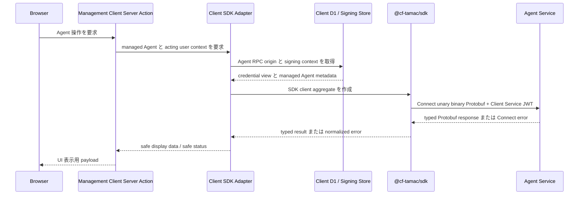
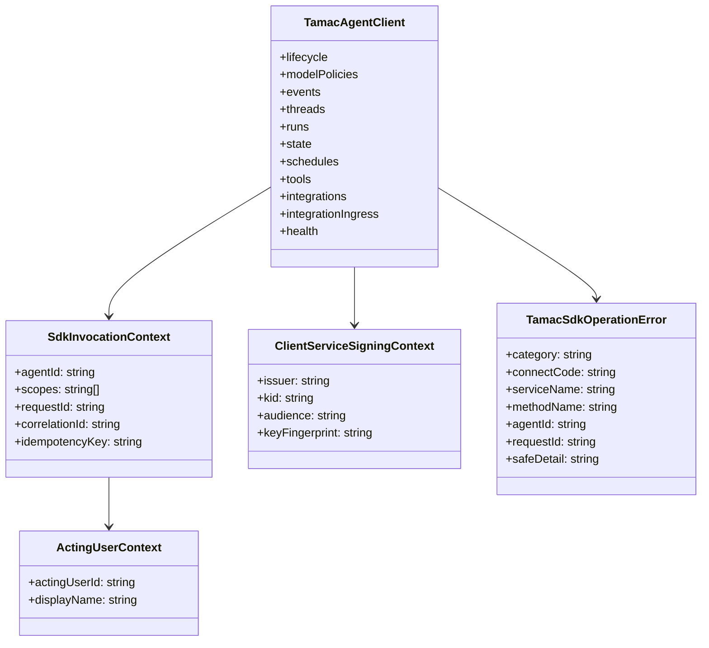
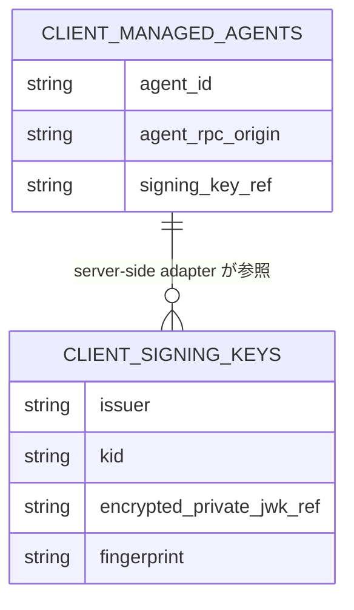
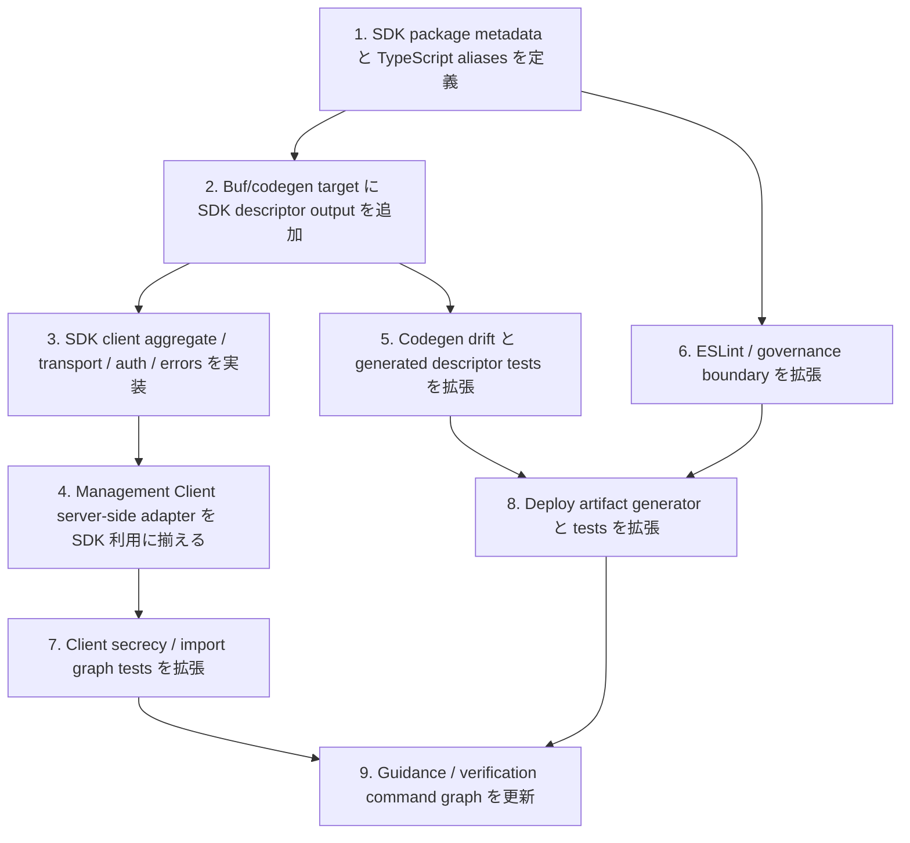

## Scope

### In Scope

- `TAMAC-SDK-S001` から `TAMAC-SDK-S006` までを満たす server-side SDK package `@cf-tamac/sdk` の package/API/auth/error/transport design。
- `WORKSPACE-GOVERNANCE-S015` から `WORKSPACE-GOVERNANCE-S017` までを満たす SDK package classification、generated Agent RPC descriptor generation、deploy artifact validation、package boundary governance。
- Management Client の server-side Agent RPC adapter が SDK を利用し、Client D1、signing key store、acting user derivation、server-only boundary を所有する design。
- Agent TypeSpec/proto contract は existing `cftamac.agent.v1` generated Protobuf RPC contract を source とし、SDK はその typed consumer として動作する design。
- Verification は SDK UT、Client server/browser boundary tests、governance tests、codegen drift check、deploy artifact tests、`openspec validate`、lint/test/build command を対象にする。

### Out of Scope

- UI route/screen design は既存 Management Client shell と Server Action 接続の範囲に限定する。
- SDK は generated Protobuf RPC descriptors の typed consumer として設計する。
- Client D1 schema の永続 table design は existing management ledger と signing key store の責務を維持する。

## Assumptions / Dependencies

- Agent public API source of truth は `packages/agent/src/typespec/main.tsp` であり、proto3 と Protobuf-ES descriptors は generation command が所有する。
- Existing runtime dependencies として `@connectrpc/connect`、`@connectrpc/connect-web`、`@bufbuild/protobuf`、Web Crypto Ed25519 signing capability を利用できる。
- Management Client の `CLIENT_DB`、encrypted signing key store、`CLIENT_CREDENTIAL_ENCRYPTION_KEY`、acting user policy、managed Agent record resolution は Client adapter が所有する。
- SDK は framework-neutral server-side package とし、Next.js 固有の `server-only` marker、Client D1 repository、Worker env resolution は Client server-side adapter が所有する。
- Deploy artifact generator は Agent artifact と Client artifact を別 root として作成し、Client artifact には SDK runtime closure を含める。

## Impacted Areas

- SDK package: package metadata、public exports、client aggregate、transport、auth metadata、error normalization、invocation context、generated descriptors、SDK tests。
- Agent codegen: Buf generation target、codegen drift script、generated descriptor stability checks、Agent surface governance。
- Management Client: server-only Agent RPC adapter、Server Actions that call Agent RPC、browser secrecy tests、import graph tests。
- Workspace tooling: root scripts、workspace packages、TypeScript path aliases、ESLint boundary classifier、governance scripts、deploy artifact generator、CI validation commands。
- Security: Client Service JWT claims、acting user metadata、request ID/correlation ID/idempotency metadata、safe error detail、browser-delivered data classification。
- Operations: deploy-client artifact closure、codegen drift reports、package boundary lint reports、release verification commands。

## Directory Tree

```text
.
├─ package.json
├─ pnpm-workspace.yaml
├─ tsconfig.base.json
├─ eslint.config.js
├─ packages
│  ├─ agent
│  │  └─ buf.gen.yaml
│  ├─ client
│  │  ├─ package.json
│  │  └─ src
│  │     ├─ server
│  │     │  ├─ agent-rpc
│  │     │  │  ├─ agent-loader.ts
│  │     │  │  └─ index.ts
│  │     │  └─ actions
│  │     │     └─ model-policies.ts
│  │     └─ tests
│  │        ├─ browser-agent-rpc-secrecy.test.ts
│  │        ├─ client-agent-rpc-factory.test.ts
│  │        └─ client-import-graph.test.ts
│  └─ sdk
│     ├─ package.json
│     ├─ tsconfig.json
│     └─ src
│        ├─ index.ts
│        ├─ client.ts
│        ├─ transport.ts
│        ├─ invocation-context.ts
│        ├─ errors.ts
│        ├─ auth
│        │  ├─ client-service-jwt.ts
│        │  └─ types.ts
│        ├─ generated
│        │  └─ agent-rpc
│        │     └─ cftamac
│        │        └─ agent
│        │           └─ v1_pb.ts
│        └─ tests
│           ├─ client.test.ts
│           ├─ auth.test.ts
│           ├─ errors.test.ts
│           └─ browser-boundary.test.ts
├─ scripts
│  ├─ codegen
│  │  ├─ check-agent-codegen-drift.mjs
│  │  └─ check-agent-codegen-drift.test.mjs
│  ├─ deploy
│  │  ├─ generate-deploy-artifacts.mjs
│  │  └─ generate-deploy-artifacts.test.mjs
│  └─ governance
│     ├─ verify-agent-surface.mjs
│     ├─ verify-agent-surface.test.mjs
│     ├─ verify-package-boundaries.mjs
│     └─ verify-package-boundaries.test.mjs
└─ .opencode
   ├─ skills
   │  └─ coding-guardian
   │     ├─ SKILL.md
   │     └─ references
   │        └─ repo-entrypoints.md
   └─ agents
      └─ unit
         ├─ agent
         │  ├─ engineer.md
         │  └─ reviewer.md
         └─ client
            ├─ engineer.md
            └─ reviewer.md
```

## New / Changed Files

| Type   | File                                                              | Change                                                                                                          |
| ------ | ----------------------------------------------------------------- | --------------------------------------------------------------------------------------------------------------- |
| Update | `package.json`                                                    | SDK package scripts、codegen drift 対象、verification command graph を追加する。                                |
| Update | `pnpm-workspace.yaml`                                             | `packages/sdk` を workspace package として分類する。                                                            |
| Update | `tsconfig.base.json`                                              | `@cf-tamac/sdk` と SDK generated descriptor aliases を追加する。                                                |
| Update | `eslint.config.js`                                                | SDK runtime と SDK generated descriptor の boundary element を追加し、server-side import ownership を検査する。 |
| Update | `packages/agent/buf.gen.yaml`                                     | SDK-owned Agent RPC descriptor output target を追加する。                                                       |
| Add    | `packages/sdk/package.json`                                       | `@cf-tamac/sdk` package metadata、exports、dependencies、scripts を定義する。                                   |
| Add    | `packages/sdk/tsconfig.json`                                      | SDK TypeScript build/check configuration を定義する。                                                           |
| Add    | `packages/sdk/src/index.ts`                                       | SDK public exports を re-export only entrypoint として定義する。                                                |
| Add    | `packages/sdk/src/client.ts`                                      | Agent service client aggregate と public factory を実装する。                                                   |
| Add    | `packages/sdk/src/transport.ts`                                   | Connect unary binary Protobuf transport construction を実装する。                                               |
| Add    | `packages/sdk/src/invocation-context.ts`                          | Agent ID、scope、acting user、request correlation、idempotency context types を定義する。                       |
| Add    | `packages/sdk/src/errors.ts`                                      | Connect code から SDK normalized error への mapping を実装する。                                                |
| Add    | `packages/sdk/src/auth/client-service-jwt.ts`                     | EdDSA Client Service JWT generation と RPC metadata builder を実装する。                                        |
| Add    | `packages/sdk/src/auth/types.ts`                                  | credential view、signing context、acting user context の public types を定義する。                              |
| Add    | `packages/sdk/src/generated/agent-rpc/cftamac/agent/v1_pb.ts`     | Agent RPC descriptor を generation command が生成する。                                                         |
| Add    | `packages/sdk/src/tests/client.test.ts`                           | `TAMAC-SDK-S001` と `TAMAC-SDK-S002` の SDK client aggregate behavior を検証する。                              |
| Add    | `packages/sdk/src/tests/auth.test.ts`                             | `TAMAC-SDK-S003` と `TAMAC-SDK-S004` の JWT metadata と signing context を検証する。                            |
| Add    | `packages/sdk/src/tests/errors.test.ts`                           | `TAMAC-SDK-S006` の normalized error mapping を検証する。                                                       |
| Add    | `packages/sdk/src/tests/browser-boundary.test.ts`                 | `TAMAC-SDK-S005` の server-side package metadata と safe result shape を検証する。                              |
| Update | `packages/client/package.json`                                    | Management Client から `@cf-tamac/sdk` を workspace dependency として利用する。                                 |
| Update | `packages/client/src/server/agent-rpc/agent-loader.ts`            | Client D1/signing key resolution 後に SDK client aggregate を作成する adapter とする。                          |
| Update | `packages/client/src/server/agent-rpc/index.ts`                   | Client server-side adapter の public server exports を整理する。                                                |
| Update | `packages/client/src/server/actions/model-policies.ts`            | Registration-time Agent RPC validation を SDK-backed server adapter 経由に揃える。                              |
| Update | `packages/client/src/tests/browser-agent-rpc-secrecy.test.ts`     | Browser-delivered graph が safe UI data boundary であることを SDK package 含めて検証する。                      |
| Update | `packages/client/src/tests/client-agent-rpc-factory.test.ts`      | Client adapter が SDK client aggregate と signing context を渡すことを検証する。                                |
| Update | `packages/client/src/tests/client-import-graph.test.ts`           | Client server-side graph と browser-visible graph の SDK boundary を検証する。                                  |
| Update | `scripts/codegen/check-agent-codegen-drift.mjs`                   | SDK generated descriptor root と drift report を追加する。                                                      |
| Update | `scripts/codegen/check-agent-codegen-drift.test.mjs`              | SDK descriptor drift と report path を検証する。                                                                |
| Update | `scripts/deploy/generate-deploy-artifacts.mjs`                    | Client artifact に SDK runtime closure、package metadata、generated descriptors を含める。                      |
| Update | `scripts/deploy/generate-deploy-artifacts.test.mjs`               | `WORKSPACE-GOVERNANCE-S017` の Client artifact closure を検証する。                                             |
| Update | `scripts/governance/verify-agent-surface.mjs`                     | SDK package を Agent RPC SDK surface validation の scan 対象へ追加する。                                        |
| Update | `scripts/governance/verify-agent-surface.test.mjs`                | SDK package の Protobuf RPC-only validation fixture を追加する。                                                |
| Update | `scripts/governance/verify-package-boundaries.mjs`                | `WORKSPACE-GOVERNANCE-S015` の SDK server-side classification と generated output ownership を検証する。        |
| Update | `scripts/governance/verify-package-boundaries.test.mjs`           | SDK import ownership、browser-delivered boundary、generated descriptor policy fixtures を追加する。             |
| Update | `.opencode/skills/coding-guardian/SKILL.md`                       | SDK package、SDK generated descriptors、Client server-side SDK usage を coding baseline に追加する。            |
| Update | `.opencode/skills/coding-guardian/references/repo-entrypoints.md` | SDK entrypoints と generated output ownership を entrypoint reference に追加する。                              |
| Update | `.opencode/agents/unit/agent/engineer.md`                         | Agent/codegen/governance apply scope に SDK generated descriptor design を追加する。                            |
| Update | `.opencode/agents/unit/agent/reviewer.md`                         | Agent/codegen/governance review scope に SDK descriptor validation を追加する。                                 |
| Update | `.opencode/agents/unit/client/engineer.md`                        | Client server-side SDK adapter と browser boundary ownership を guidance に追加する。                           |
| Update | `.opencode/agents/unit/client/reviewer.md`                        | Client SDK import boundary と browser secrecy review gate を guidance に追加する。                              |

## System Diagram

```mermaid
flowchart LR
  ServerConsumer[サーバーサイド利用者] -->|@cf-tamac/sdk| SDK[`@cf-tamac/sdk`]
  MgmtClient[Management Client server-side adapter] -->|@cf-tamac/sdk| SDK
  ClientDB[(Client D1 / signing key store)] -->|credential view| MgmtClient
  SDK -->|Connect unary binary Protobuf + Client Service JWT| AgentWorker[Agent Service Worker]
  AgentWorker -->|Durable Object RPC| AIAgent[`AIAgent` Durable Object]
  SDK -->|typed result / normalized error| ServerConsumer
  MgmtClient -->|safe display data| Browser[Browser]
```

## Package Diagram

```mermaid
flowchart TB
  TypeSpec[`packages/agent/src/typespec`] --> Proto[`packages/agent/proto`]
  Proto --> AgentDesc[`packages/agent/src/generated/rpc`]
  Proto --> SdkDesc[`packages/sdk/src/generated/agent-rpc`]
  SdkDesc --> SDK[`@cf-tamac/sdk`]
  SDK --> ClientServer[`packages/client/src/server`]
  ClientServer --> ClientActions[`Server Actions / Server Components`]
  ClientActions --> BrowserUI[`Browser UI data`]
  SDK --> ServerConsumer[Other server-side consumers]
```

## Sequence Diagram



## UI Wireframe Screenshots

UI wireframe 対象: existing Management Client shell の server-side action 接続に限定する。

## Domain Model Diagram



## ER Diagram



## Package-Level Design

### Package List

| Package              | Purpose / Responsibility                                                                                | Public API                                                 | Dependencies                                                           |
| -------------------- | ------------------------------------------------------------------------------------------------------- | ---------------------------------------------------------- | ---------------------------------------------------------------------- |
| `@cf-tamac/sdk`      | Server-side Agent RPC SDK として client aggregate、auth metadata、error 正規化を所有する。              | `createTamacAgentClient`, SDK public types, error helpers  | `@connectrpc/connect`, `@connectrpc/connect-web`, `@bufbuild/protobuf` |
| `@cf-tamac/agent`    | TypeSpec/proto/generation source と Agent Worker runtime を所有する。                                   | generated Protobuf RPC contract                            | TypeSpec, Buf, Cloudflare Workers                                      |
| `@cf-tamac/client`   | Management Client server-side adapter、Client D1、signing key store、UI execution boundary を所有する。 | Server Actions, server-only adapter                        | `@cf-tamac/sdk`, Next.js, Drizzle D1                                   |
| workspace governance | Codegen drift、package boundary、Agent surface、deploy artifact validation を所有する。                 | `pnpm check:codegen`, `pnpm lint`, deploy artifact scripts | Node.js scripts, ESLint, OpenSpec                                      |

### Details

#### `@cf-tamac/sdk`

- Purpose / Responsibility: Agent RPC の server-side SDK として generated descriptors、Connect transport、Client Service JWT metadata、acting user context、normalized error をまとめる。
- Public API: `createTamacAgentClient`、`TamacAgentClient`、`ResolvedAgentRpcCredential`、`ActingUserContext`、`ClientServiceSigningContext`、`TamacSdkOperationError`、`normalizeTamacSdkError`。
- Key Data Structures: `SdkInvocationContext` は `agentId`、`scopes`、`requestId`、`correlationId`、`idempotencyKey`、service/method context を持つ。
- Key Flows: consumer が server-side context を渡す → SDK が per-call metadata と binary Connect transport を構成する → Agent Service へ typed RPC を送る → typed result または normalized error を返す。
- Dependencies: Connect runtime は fetch-based unary binary Protobuf transport に利用し、Protobuf runtime は generated descriptors に利用する。
- Error Handling: Connect code を stable SDK category に mapping し、service/method、Agent、request correlation、安全な detail を含める。
- Testing Strategy: `TAMAC-SDK-S001` から `TAMAC-SDK-S006` を SDK UT で検証し、transport/auth/error/browser-boundary shape を fixture 化する。
- Non-Functional: Request context と transport construction は per server execution に束ね、observability context を log へ渡せる形にする。
- Performance: Reusable transport factory と service aggregate により、同一 request context 内の service client creation を抑える。
- Security: Credential view と signing context は server-side execution context から受け取り、browser-delivered data は safe display/status/correlation に限定する。

#### `@cf-tamac/client` server-side adapter

- Purpose / Responsibility: Client D1、managed Agent record、encrypted signing key store、acting user derivation を解決し、SDK client aggregate を作る。
- Public API: `loadAgentRpcClients` 相当の server-only adapter と Server Actions が利用する safe result helpers。
- Key Data Structures: managed Agent metadata、credential reference、signing key selection、acting user context、scope policy。
- Key Flows: Server Action → adapter → Client D1/signing key store → SDK client aggregate → Agent RPC → safe UI payload。
- Dependencies: `@cf-tamac/sdk` を server-side graph で利用し、Next.js env と Client D1 repository は Client package が所有する。
- Error Handling: SDK normalized error を Server Action result に写し、UI は safe category と correlation identifier を表示できる。
- Testing Strategy: `TAMAC-SDK-S005` と `WORKSPACE-GOVERNANCE-S015` を Client tests と governance tests で検証する。
- Non-Functional: Server Actions は existing route shell と server-side boundary を維持する。
- Performance: signing key resolution と SDK construction は request 単位で行い、同一 action 内の repeated calls は aggregate を共有する。
- Security: Browser-delivered payload は display data、safe status、safe error category、correlation identifier に限定する。

#### Agent TypeSpec / codegen

- Purpose / Responsibility: Agent public RPC contract と generated outputs の source/generation pipeline を所有する。
- Public API: `cftamac.agent.v1` Protobuf RPC services と generated descriptors。
- Key Data Structures: Proto service descriptors、request/response message descriptors、Protobuf field stability metadata。
- Key Flows: TypeSpec compile → proto3 emit → Buf generation → Agent descriptors and SDK descriptors → codegen drift check。
- Dependencies: TypeSpec protobuf emitter、Buf、Protobuf-ES plugin。
- Error Handling: Codegen drift は path、command、descriptor group を含む report で fail する。
- Testing Strategy: `WORKSPACE-GOVERNANCE-S016` を codegen drift tests と generated descriptor checks で検証する。
- Non-Functional: Generation は deterministic output を生成する。
- Performance: Codegen command は CI で再現可能な時間に収まる target set とする。
- Security: Agent public API は Protobuf RPC contract と binary Connect transport を source とする。

#### Workspace governance / deploy artifact

- Purpose / Responsibility: SDK package classification、Client browser boundary、Agent surface、generated ownership、self-contained deploy artifact を検証する。
- Public API: `pnpm lint`、`pnpm check:codegen`、`pnpm gen:deploy-artifacts`、`pnpm check:deploy-artifacts`。
- Key Data Structures: package graph classification、boundary fixture、deploy artifact spec、generated root registry。
- Key Flows: source scan → package graph classification → boundary validation → deploy artifact generation → artifact closure validation。
- Dependencies: ESLint boundary rules、Node governance scripts、OpenSpec scenario coverage。
- Error Handling: Validation failures include path、rule name、recommended command context。
- Testing Strategy: `WORKSPACE-GOVERNANCE-S015` から `WORKSPACE-GOVERNANCE-S017` を governance/codegen/deploy tests で検証する。
- Non-Functional: Developer guidance と `.opencode` agent guidance は SDK package を active implementation/review scope として扱う。
- Performance: Governance scan は existing file enumeration pattern と fixture tests を使い、validation 時間を安定させる。
- Security: SDK import ownership と browser-delivered data boundary を validation target とする。

## Implementation Plan



## Test Plan

### User Acceptance Test (Manual)

| UAT ID                           | Related Requirement                              | Spec Summary                                                            | Customer Problem Summary                                                              | Steps                                                                                                                        | Expected Behavior                                                                                      |
| -------------------------------- | ------------------------------------------------ | ----------------------------------------------------------------------- | ------------------------------------------------------------------------------------- | ---------------------------------------------------------------------------------------------------------------------------- | ------------------------------------------------------------------------------------------------------ |
| UAT-TAMAC-SDK-HAP-001            | TAMAC-SDK-R001 Server-side Agent 操作 SDK        | SDK consumer が `@cf-tamac/sdk` で Agent health を呼び出す。            | Server-side consumer が小さい組み込み面で Agent 操作を始めたい。                      | SDK sample server script で Agent origin、`agent_id`、scope、acting user、signing context を渡して health check を実行する。 | typed health result と correlation identifier を確認できる。                                           |
| UAT-TAMAC-SDK-SEC-002            | TAMAC-SDK-R003 Server-side boundary              | Management Client は SDK result を safe display data として UI に返す。 | 管理者は UI を使いながら Agent credential handling を server-side に集約したい。      | Management Client で Agent 操作を実行し、Browser payload と server log の correlation を確認する。                           | Browser には display data、safe status、safe error category、correlation identifier が届く。           |
| UAT-WORKSPACE-GOVERNANCE-SMK-003 | WORKSPACE-GOVERNANCE-R001 SDK package governance | Deploy Client artifact が SDK runtime closure を含む。                  | 運用者は Cloudflare Deploy Button 用 Client artifact を自己完結 root として扱いたい。 | `pnpm gen:deploy-artifacts` と `pnpm check:deploy-artifacts` を実行し、Client artifact manifest を確認する。                 | Client artifact が SDK package metadata、runtime source、generated descriptors、Worker config を含む。 |

### E2E Test (Playwright)

| E2E ID                           | Playwright Test Name                                                               | Related Scenario          | Category | Summary                                                                   | Steps (Playwright)                                                                                                            | Expected Behavior                                                                          |
| -------------------------------- | ---------------------------------------------------------------------------------- | ------------------------- | -------- | ------------------------------------------------------------------------- | ----------------------------------------------------------------------------------------------------------------------------- | ------------------------------------------------------------------------------------------ |
| E2E-TAMAC-SDK-SEC-001            | `[TAMAC-SDK-S005] Management Client が SDK result を安全な表示データとして返す`    | TAMAC-SDK-S005            | SEC      | UI action が SDK-backed server-side adapter を通じて safe result を返す。 | `/agents/[agentId]` の server action backed 操作を fixture Agent RPC で実行し、response payload と browser chunk を検査する。 | Browser payload は display data、safe status、correlation identifier で構成される。        |
| E2E-WORKSPACE-GOVERNANCE-SMK-001 | `[WORKSPACE-GOVERNANCE-S017] Client deploy artifact が SDK runtime closure を含む` | WORKSPACE-GOVERNANCE-S017 | SMK      | Generated Client deploy artifact を smoke 検査する。                      | Artifact generation command を test fixture から実行し、artifact root の package metadata と runtime closure を検査する。     | Client artifact は Cloudflare Worker deploy root として必要な SDK runtime closure を含む。 |

### Integration Test (Endpoint)

| IT ID                           | Test Name                                                                                    | Genre      | Category | Summary                                                                   | Steps (Test)                                                                                                                       | Expected Behavior                                                                       |
| ------------------------------- | -------------------------------------------------------------------------------------------- | ---------- | -------- | ------------------------------------------------------------------------- | ---------------------------------------------------------------------------------------------------------------------------------- | --------------------------------------------------------------------------------------- |
| IT-TAMAC-SDK-HAP-001            | `[TAMAC-SDK-S001] Server-side consumer が SDK で Agent health を確認する`                    | sdk        | HAP      | SDK health client が binary Connect request と auth metadata を生成する。 | Mock fetch transport で `AgentHealthService.Check` を呼び、method、content type、JWT metadata、typed response を検査する。         | SDK は typed health result を返し、request context を保持する。                         |
| IT-TAMAC-SDK-HAP-002            | `[TAMAC-SDK-S002] SDK client 集約が Agent service 群を同じ呼び出し文脈で提供する`            | sdk        | HAP      | Service aggregate が shared context を使う。                              | lifecycle/events/threads/runs/state/schedules/tools/integrations/health client を生成し、shared context を検査する。               | 各 client は同じ origin、Agent ID、scope、acting user、correlation context を利用する。 |
| IT-TAMAC-SDK-SEC-003            | `[TAMAC-SDK-S003] SDK が acting user 付き Client Service JWT を付与する`                     | sdk        | SEC      | JWT claims と RPC metadata を検査する。                                   | test signing context で mutating RPC metadata を生成し、claims、request ID、idempotency key を decode して検査する。               | JWT と metadata は Agent ID、scope、acting user、request context に対応する。           |
| IT-TAMAC-SDK-SEC-004            | `[TAMAC-SDK-S004] SDK consumer が自身の server-side storage から signing context を供給する` | sdk        | SEC      | consumer-supplied signing context を SDK が利用する。                     | caller-provided signing context と callback fixture で SDK client を作り、signing invocation を検査する。                          | SDK public API は credential view と acting user view を typed input として扱う。       |
| IT-TAMAC-SDK-ERR-005            | `[TAMAC-SDK-S006] Permission denied が SDK normalized error として返る`                      | sdk        | ERR      | Connect error を SDK normalized error に mapping する。                   | Mock transport が `permission_denied` と `aborted` を返す case を実行し、category、code、service/method、safe detail を検査する。  | Normalized error が stable category と correlation context を持つ。                     |
| IT-WORKSPACE-GOVERNANCE-REG-006 | `[WORKSPACE-GOVERNANCE-S016] Codegen drift check が SDK Agent RPC descriptors を検査する`    | governance | REG      | SDK generated descriptor root を codegen drift check に含める。           | Drift fixture で SDK descriptor output に差分を作り、check script の report を検査する。                                           | Report は SDK descriptor path と command context を含む。                               |
| IT-WORKSPACE-GOVERNANCE-SMK-007 | `[WORKSPACE-GOVERNANCE-S017] Client deploy artifact が SDK runtime closure を含む`           | deploy     | SMK      | Client artifact closure を検査する。                                      | Deploy artifact test fixture で Client artifact を生成し、SDK package metadata、runtime source、generated descriptors を列挙する。 | Artifact root は self-contained Client Worker 構成になる。                              |

### Unit/Component Test (UT)

| UT ID                           | Test Name                                                                                                 | Package              | Category | Summary                                          | Steps (Test)                                                                                              | Expected Behavior                                                                 |
| ------------------------------- | --------------------------------------------------------------------------------------------------------- | -------------------- | -------- | ------------------------------------------------ | --------------------------------------------------------------------------------------------------------- | --------------------------------------------------------------------------------- |
| UT-TAMAC-SDK-HAP-001            | `[TAMAC-SDK-S001] SDK health client は binary Connect transport を構成する`                               | `@cf-tamac/sdk`      | HAP      | Transport factory の binary profile を検査する。 | transport factory に test fetch を渡し、HTTP method、content type、useBinaryFormat を検査する。           | Binary Connect profile で request が作成される。                                  |
| UT-TAMAC-SDK-BND-002            | `[TAMAC-SDK-S002] TamacAgentClient は service aggregate を公開する`                                       | `@cf-tamac/sdk`      | BND      | Public aggregate property を検査する。           | factory return object の service keys と generated descriptor binding を検査する。                        | Required service clients が typed aggregate として利用できる。                    |
| UT-TAMAC-SDK-SEC-003            | `[TAMAC-SDK-S003] Client Service JWT claims は Agent context に対応する`                                  | `@cf-tamac/sdk`      | SEC      | JWT builder の claims を検査する。               | deterministic clock/key fixture で JWT を生成し、claims と metadata を assert する。                      | issuer、audience、Agent ID、scope、acting user、jti、request context が含まれる。 |
| UT-TAMAC-SDK-SEC-004            | `[TAMAC-SDK-S005] SDK result serializer は safe display data を返す`                                      | `@cf-tamac/sdk`      | SEC      | Safe result helper の output shape を検査する。  | success/error result を serialize し、display data、status、category、correlation fields を assert する。 | Browser-delivered shape が safe UI data に限定される。                            |
| UT-WORKSPACE-GOVERNANCE-BND-005 | `[WORKSPACE-GOVERNANCE-S015] Workspace validation が SDK を server-side Agent RPC package として分類する` | `scripts/governance` | BND      | Package boundary fixture を検査する。            | server-side SDK import fixture と browser-visible graph fixture を validation script に通す。             | SDK imports は server-side execution boundary ownership として分類される。        |
| UT-WORKSPACE-GOVERNANCE-REG-006 | `[WORKSPACE-GOVERNANCE-S016] SDK descriptor drift が report される`                                       | `scripts/codegen`    | REG      | Codegen drift report を検査する。                | SDK descriptor fixture 差分を作り、script output の path と rule name を assert する。                    | Drift report に SDK generated root が含まれる。                                   |
| UT-WORKSPACE-GOVERNANCE-SMK-007 | `[WORKSPACE-GOVERNANCE-S017] Deploy artifact validation は SDK closure を検査する`                        | `scripts/deploy`     | SMK      | Deploy artifact required files を検査する。      | Client artifact fixture を生成し、SDK package metadata と generated descriptors を assert する。          | Artifact validation が SDK closure を required files として扱う。                 |

## Release Recovery

- Package recovery: `@cf-tamac/sdk` と SDK generated descriptors は TypeSpec/proto source から再生成可能な package output として扱う。Release gate は `pnpm check:codegen` と `pnpm lint` を通過条件にする。
- Data handling: Client D1 schema は existing managed Agent record と signing key store を利用する。Release gate は codegen と package boundary validation を扱う。
- Contract handling: Agent Protobuf RPC contract は existing `cftamac.agent.v1` を利用する。SDK package release は generated descriptor drift check を通過した commit に限定する。
- Validation recovery: codegen drift、package boundary、deploy artifact validation の report を修正対象として扱い、publish は validation pass 後に実行する。

## Release Procedure

- `corepack enable && pnpm install` を実行する。
- `pnpm gen:agent:proto && pnpm gen:agent:rpc` を実行し、Agent と SDK の generated descriptors を生成する。
- `pnpm check:codegen` を実行し、generated descriptor drift と RPC invariant を確認する。
- `pnpm lint` を実行し、OpenSpec、ESLint、governance、supply-chain validation を確認する。
- `pnpm test:agent && pnpm test:client && pnpm test:governance` を実行する。
- `pnpm test:run` を実行し、workspace tests を確認する。
- `pnpm gen:deploy-artifacts && pnpm check:deploy-artifacts` を実行し、Client artifact closure を確認する。
- `pnpm build` を実行し、Agent、SDK、Management Client build を確認する。

## Acceptance Criteria

- `@cf-tamac/sdk` は server-side SDK package として `TAMAC-SDK-S001` から `TAMAC-SDK-S006` までの automated tests を通過する。
- Management Client server-side adapter は SDK client aggregate を利用し、Browser-delivered payload は safe display data、safe status、safe error category、correlation identifier に限定される。
- Codegen drift check は SDK generated Agent RPC descriptors を検査し、`WORKSPACE-GOVERNANCE-S016` の report expectations を満たす。
- Workspace governance は SDK package を server-side Agent RPC package として分類し、`WORKSPACE-GOVERNANCE-S015` の package boundary expectations を満たす。
- Deploy artifact generator は `WORKSPACE-GOVERNANCE-S017` の Client artifact closure expectations を満たす。
- `openspec validate --type change "introduce-tamac-sdk" --strict --no-interactive` が pass する。

## Open Issues

- 決定済み: SDK core、Client adapter、Agent codegen/governance の責務分割を apply phase の基準にする。
