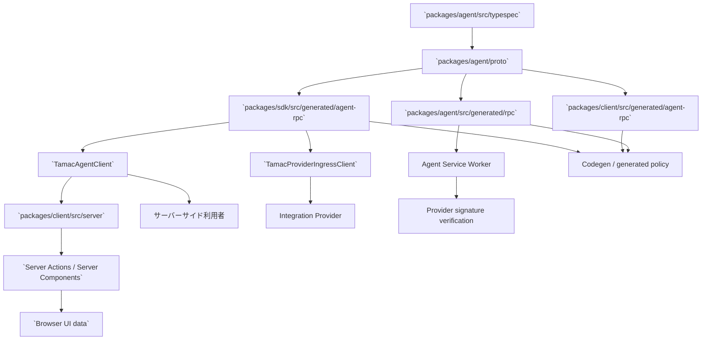
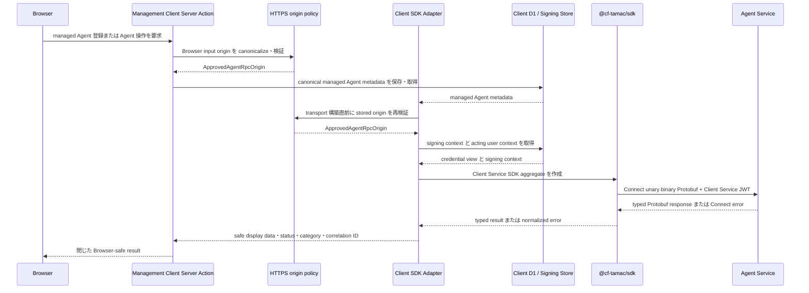
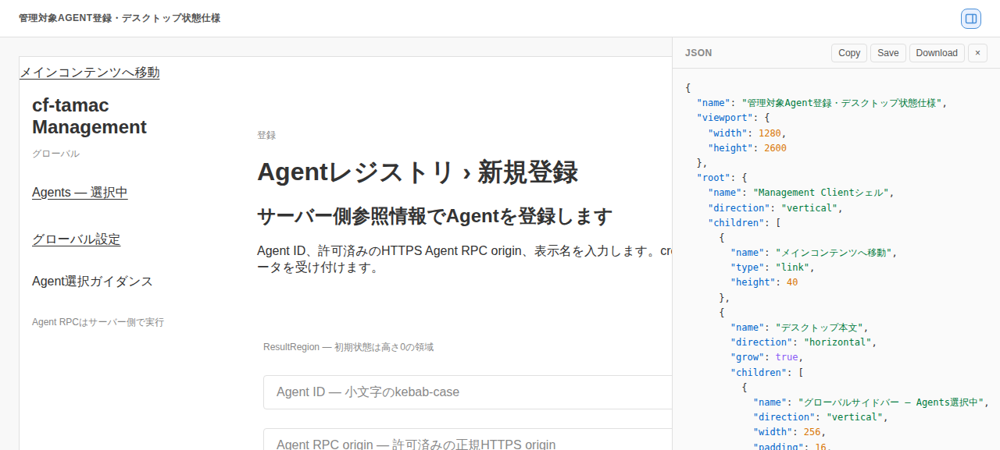
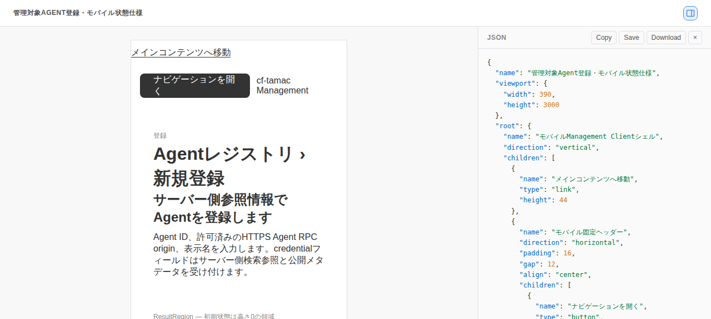
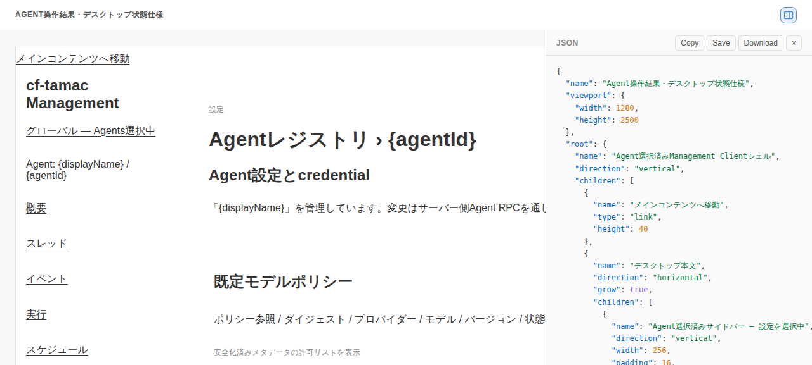
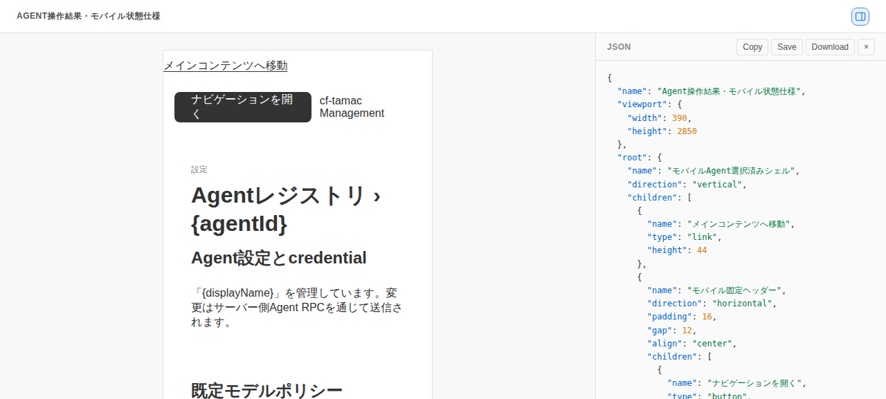
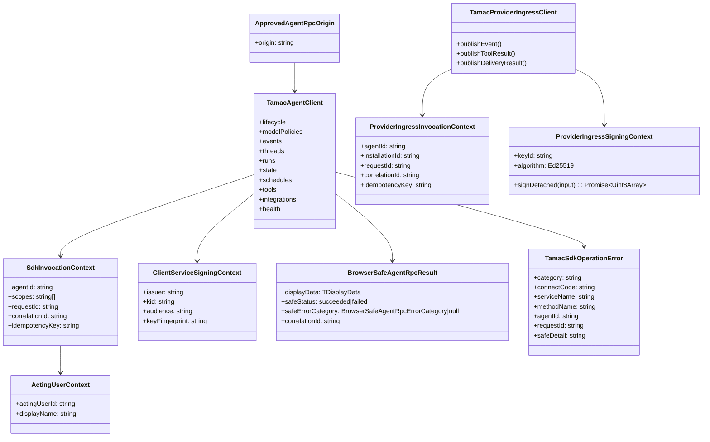
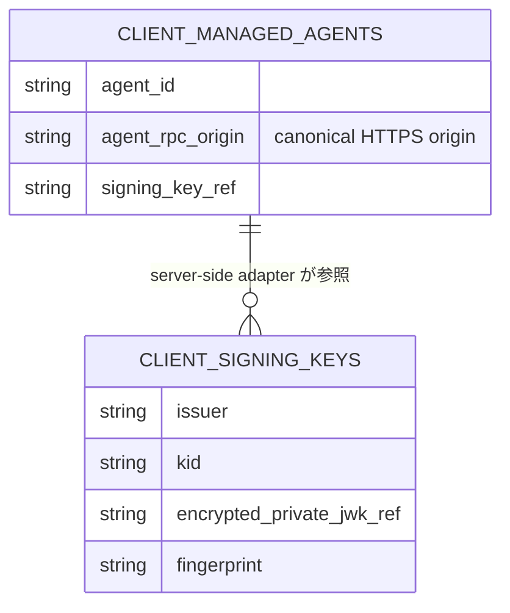
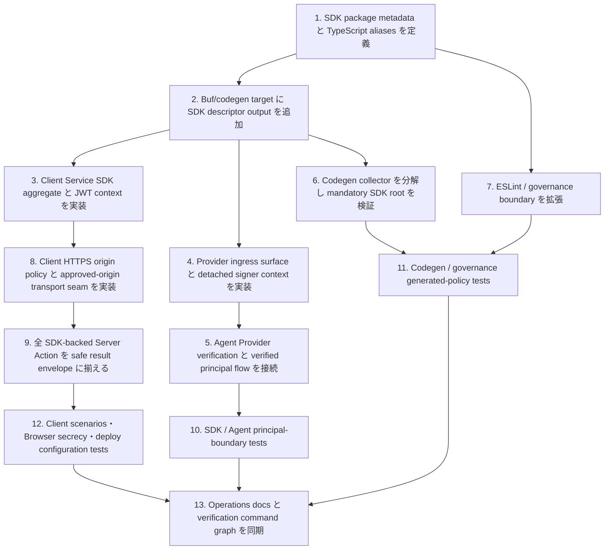

## Scope

### In Scope

- `TAMAC-SDK-S001` から `TAMAC-SDK-S008` までを満たす server-side SDK package `@cf-tamac/sdk` の package/API/auth/error/transport design。
- `TamacAgentClient` を Client Service JWT 専用 aggregate とし、lifecycle、model policy、event、thread、run、state、schedule、tool、integration、health operations を一つの invocation context で提供する design。
- `TamacProviderIngressClient` を Provider detached-signature principal 専用 surface とし、Provider signing callback、nonce、timestamp、request digest、installation identity を一つの Provider-facing context で扱う design。
- `WORKSPACE-GOVERNANCE-S015` から `WORKSPACE-GOVERNANCE-S017` までを満たす SDK package classification、generated Agent RPC descriptor generation、mandatory generated policy、deploy artifact validation、package boundary governance。
- Management Client の server-only Agent RPC adapter が SDK を利用し、Client D1、signing key store、acting user derivation、HTTPS origin allowlist validation を所有する design。
- SDK-backed Server Actions が safe display data、safe status、safe error category、correlation ID の閉じた result schema を返す design。
- Agent TypeSpec/proto contract は existing `cftamac.agent.v1` generated Protobuf RPC contract を source とし、SDK はその typed consumer として動作する design。
- Verification は SDK/Agent UT、Client server/browser boundary tests、governance tests、codegen drift check、deploy artifact tests、`openspec validate`、lint/test/build command を対象にする。

### Out of Scope

- 承認済み Specs が要求する SDK、Agent authentication boundary、Management Client security boundary、governance、operations の全責務を In Scope として扱う。

## Assumptions / Dependencies

- Agent public API source of truth は `packages/agent/src/typespec/main.tsp` であり、proto3 と Protobuf-ES descriptors は generation command が所有する。
- Existing runtime dependencies として `@connectrpc/connect`、`@connectrpc/connect-web`、`@bufbuild/protobuf`、Web Crypto Ed25519 signing capability を利用できる。
- Management Client の `CLIENT_DB`、encrypted signing key store、`CLIENT_CREDENTIAL_ENCRYPTION_KEY`、acting user policy、managed Agent record resolution は Client adapter が所有する。
- SDK は framework-neutral server-side package とし、Next.js 固有の `server-only` marker、Client D1 repository、Worker env resolution は Client server-side adapter が所有する。
- `AGENT_RPC_ALLOWED_ORIGINS` は server-managed configuration に置く non-secret JSON array とし、canonical HTTPS origin の完全一致 policy を表す。
- Managed Agent record の `agent_rpc_origin` は canonical origin を保持し、transport 構築直前に current allowlist policy を適用する。
- Provider signer public seam は secret-free canonical signing input を受ける `signDetached(input)` callback とする。
- Deploy artifact generator は Agent artifact と Client artifact を別 root として作成し、Client artifact には SDK runtime closure を含める。

## Impacted Areas

- SDK package: package metadata、public exports、Client Service aggregate、Provider ingress surface、transport、auth metadata、error normalization、invocation context、generated descriptors、SDK tests。
- Agent authentication: Connect Worker authentication branch、Provider signature verification、verified principal construction、Integration ingress dispatch、Agent-owned final authorization、Agent tests。
- Agent codegen: Buf generation target、codegen drift helper decomposition、generated descriptor stability checks、Agent surface governance。
- Management Client: server-only origin policy、managed Agent registration、Client D1 loader、SDK transport factory、全 SDK-backed Server Actions、Browser-safe result mapper、browser secrecy tests、import graph tests。
- Workspace tooling: root scripts、workspace packages、TypeScript path aliases、ESLint boundary classifier、generated policy registry、governance scripts、deploy artifact generator、CI validation commands。
- Configuration / operations: `AGENT_RPC_ALLOWED_ORIGINS` env validation、Worker configuration examples、self-host deployment、control-plane authentication runbook、Client package guide。
- Security: principal-specific authentication context、Client Service JWT destination policy、acting user metadata、request ID/correlation ID/idempotency metadata、safe error projection、browser-delivered data classification。

## Directory Tree

```text
.
├─ package.json
├─ pnpm-workspace.yaml
├─ pnpm-lock.yaml
├─ tsconfig.base.json
├─ eslint.config.js
├─ README.md
├─ CONTRIBUTING.md
├─ CODING_STANDARDS.md
├─ docs
│  └─ operations
│     ├─ agent-control-plane-auth.md
│     └─ self-host-deploy.md
├─ openspec
│  └─ changes
│     └─ introduce-tamac-sdk
│        ├─ proposal.md
│        ├─ design.md
│        ├─ tasks.md
│        ├─ browser-safe-registration-operation-ui-spec.md
│        ├─ specs
│        │  ├─ tamac-sdk
│        │  │  └─ spec.md
│        │  └─ workspace-governance
│        │     └─ spec.md
│        ├─ wireframes
│        │  ├─ managed-agent-registration-desktop.wireframe.json
│        │  ├─ managed-agent-registration-desktop.wireframe.html
│        │  ├─ managed-agent-registration-mobile.wireframe.json
│        │  ├─ managed-agent-registration-mobile.wireframe.html
│        │  ├─ agent-operation-result-desktop.wireframe.json
│        │  ├─ agent-operation-result-desktop.wireframe.html
│        │  ├─ agent-operation-result-mobile.wireframe.json
│        │  └─ agent-operation-result-mobile.wireframe.html
│        └─ wireframe-screenshots
│           ├─ managed-agent-registration-desktop.wireframe-screenshot.png
│           ├─ managed-agent-registration-mobile.wireframe-screenshot.png
│           ├─ agent-operation-result-desktop.wireframe-screenshot.png
│           └─ agent-operation-result-mobile.wireframe-screenshot.png
├─ packages
│  ├─ agent
│  │  ├─ buf.gen.yaml
│  │  └─ src
│  │     ├─ AIAgent.ts
│  │     ├─ durable-object
│  │     │  └─ integration-handlers.ts
│  │     ├─ integrations
│  │     │  ├─ operations-delivery.ts
│  │     │  ├─ operations-ingress.ts
│  │     │  └─ security.ts
│  │     ├─ rpc
│  │     │  ├─ connect-worker-adapter.ts
│  │     │  ├─ dispatch
│  │     │  │  └─ integration-ingress.ts
│  │     │  └─ interceptors
│  │     │     └─ authorization.ts
│  │     └─ tests
│  │        ├─ client-service-ed25519-auth.test.ts
│  │        └─ rpc-interceptors.test.ts
│  ├─ client
│  │  ├─ .dev.vars.example
│  │  ├─ README.md
│  │  ├─ package.json
│  │  ├─ tsconfig.json
│  │  ├─ wrangler.toml
│  │  ├─ app
│  │  │  └─ agents
│  │  │     ├─ new
│  │  │     │  └─ page.tsx
│  │  │     └─ [agentId]
│  │  │        └─ settings
│  │  │           └─ page.tsx
│  │  └─ src
│  │     ├─ components
│  │     │  ├─ agent-registration-actions.tsx
│  │     │  ├─ agent-registration-form.tsx
│  │     │  ├─ agent-settings-form.tsx
│  │     │  ├─ model-policy-fields.tsx
│  │     │  ├─ model-policy-settings-section.tsx
│  │     │  └─ schemas
│  │     │     ├─ agent-registration.ts
│  │     │     └─ model-policy.ts
│  │     ├─ server
│  │     │  ├─ env.ts
│  │     │  ├─ agent-rpc
│  │     │  │  ├─ acting-user.ts
│  │     │  │  ├─ agent-loader.ts
│  │     │  │  ├─ create-client.ts
│  │     │  │  ├─ e2e-fake-clients.ts
│  │     │  │  ├─ index.ts
│  │     │  │  ├─ origin-policy.ts
│  │     │  │  └─ safe-results.ts
│  │     │  └─ actions
│  │     │     ├─ agent-health.ts
│  │     │     ├─ agent-lifecycle.ts
│  │     │     ├─ agent-operation-view-models.ts
│  │     │     ├─ browser-safe-helpers.ts
│  │     │     ├─ agent-operations
│  │     │     │  ├─ default-model-policy.ts
│  │     │     │  ├─ integrations.ts
│  │     │     │  ├─ schedules.ts
│  │     │     │  └─ tools.ts
│  │     │     ├─ agent-queries
│  │     │     │  ├─ events.ts
│  │     │     │  ├─ runs.ts
│  │     │     │  └─ threads.ts
│  │     │     ├─ managed-agent-registration.ts
│  │     │     ├─ managed-agents.ts
│  │     │     ├─ model-policies.ts
│  │     │     └─ model-policy-view-models.ts
│  │     └─ tests
│  │        ├─ agent-rpc-origin-policy.test.ts
│  │        ├─ browser-agent-rpc-secrecy.test.ts
│  │        ├─ client-agent-operations.test.ts
│  │        ├─ client-agent-rpc-factory.test.ts
│  │        ├─ client-bindings.test.ts
│  │        ├─ client-import-graph.test.ts
│  │        ├─ client-signing-key-store.test.ts
│  │        ├─ client-signing-key-usage.test.ts
│  │        └─ server-action-boundary.test.ts
│  └─ sdk
│     ├─ package.json
│     ├─ tsconfig.json
│     └─ src
│        ├─ index.ts
│        ├─ client.ts
│        ├─ transport.ts
│        ├─ invocation-context.ts
│        ├─ errors.ts
│        ├─ provider-ingress.ts
│        ├─ provider-ingress-transport.ts
│        ├─ provider-ingress-types.ts
│        ├─ auth
│        │  ├─ client-service-jwt.ts
│        │  └─ types.ts
│        ├─ generated
│        │  └─ agent-rpc
│        │     └─ cftamac
│        │        └─ agent
│        │           └─ v1_pb.ts
│        └─ tests
│           ├─ client.test.ts
│           ├─ auth.test.ts
│           ├─ errors.test.ts
│           ├─ browser-boundary.test.ts
│           └─ provider-ingress.test.ts
├─ scripts
│  ├─ codegen
│  │  ├─ check-agent-codegen-drift.mjs
│  │  └─ check-agent-codegen-drift.test.mjs
│  ├─ deploy
│  │  ├─ generate-deploy-artifacts.mjs
│  │  └─ generate-deploy-artifacts.test.mjs
│  └─ governance
│     ├─ verify-agent-surface.mjs
│     ├─ verify-agent-surface.test.mjs
│     ├─ verify-package-boundaries.mjs
│     └─ verify-package-boundaries.test.mjs
├─ tests
│  └─ e2e
│     ├─ managed-agent-fixture.ts
│     ├─ management-agent-registry.spec.ts
│     ├─ management-agent-rpc-secrecy.spec.ts
│     └─ management-model-policy.spec.ts
└─ .opencode
   ├─ skills
   │  └─ coding-guardian
   │     ├─ SKILL.md
   │     └─ references
   │        └─ repo-entrypoints.md
   └─ agents
      └─ unit
         ├─ build
         │  └─ builder.md
         ├─ agent
         │  ├─ engineer.md
         │  └─ reviewer.md
         └─ client
            ├─ engineer.md
            └─ reviewer.md
```

## New / Changed Files

| Type   | File                                                                                               | Change                                                                                                             |
| ------ | -------------------------------------------------------------------------------------------------- | ------------------------------------------------------------------------------------------------------------------ |
| Update | `package.json`                                                                                     | SDK package scripts、codegen drift 対象、verification command graph を定義する。                                   |
| Update | `pnpm-workspace.yaml`                                                                              | `packages/sdk` を workspace package として分類する。                                                               |
| Update | `pnpm-lock.yaml`                                                                                   | workspace package graph と解決済み dependency metadata を同期する。                                                |
| Update | `tsconfig.base.json`                                                                               | `@cf-tamac/sdk` と SDK generated descriptor aliases を定義する。                                                   |
| Update | `eslint.config.js`                                                                                 | SDK runtime と SDK generated descriptor の boundary element、server-side import ownership を検査する。             |
| Update | `README.md`、`CONTRIBUTING.md`、`CODING_STANDARDS.md`                                              | SDK package、generated ownership、Client security boundary、verification commands を開発者向けに説明する。         |
| Update | `docs/operations/self-host-deploy.md`                                                              | `AGENT_RPC_ALLOWED_ORIGINS` の deploy 設定、HTTPS canonical origin、health verification を手順化する。             |
| Update | `docs/operations/agent-control-plane-auth.md`                                                      | Client Service JWT destination policy、allowlist 更新、staging smoke、safe correlation を手順化する。              |
| Update | `openspec/changes/introduce-tamac-sdk/proposal.md`                                                 | Principal-specific SDK surface、HTTPS origin policy、safe result、generated policy の change intent を記述する。   |
| Update | `openspec/changes/introduce-tamac-sdk/specs/tamac-sdk/spec.md`                                     | Client/Provider surface、origin policy、Browser-safe result の外部可視契約と Scenario IDs を記述する。             |
| Update | `openspec/changes/introduce-tamac-sdk/specs/workspace-governance/spec.md`                          | SDK generated descriptor root の mandatory validation behavior を記述する。                                        |
| Update | `openspec/changes/introduce-tamac-sdk/design.md`                                                   | Specialist design、method/security matrices、UI wireframes、tests、release verification を統合する。               |
| Update | `openspec/changes/introduce-tamac-sdk/tasks.md`                                                    | Review remediation tasks と Scenario test tasks を dependency order で整理する。                                   |
| Add    | `openspec/changes/introduce-tamac-sdk/browser-safe-registration-operation-ui-spec.md`              | Registration/Agent operation の state、copy、placement、accessibility、security ownership を確定する。             |
| Add    | `openspec/changes/introduce-tamac-sdk/wireframes/*.wireframe.json`、`*.wireframe.html`             | Desktop/mobile の registration と Agent operation result previews を定義する。                                     |
| Add    | `openspec/changes/introduce-tamac-sdk/wireframe-screenshots/*.wireframe-screenshot.png`            | 4つの wireframe preview を `agent-browser` で撮影した design evidence として保存する。                             |
| Update | `packages/agent/buf.gen.yaml`                                                                      | SDK-owned Agent RPC descriptor output target を定義する。                                                          |
| Update | `packages/agent/src/rpc/connect-worker-adapter.ts`                                                 | RPC path ごとに Client Service JWT と Provider detached-signature の authentication branch を選択する。            |
| Update | `packages/agent/src/rpc/interceptors/authorization.ts`                                             | Client Service operations と Provider ingress grants の principal-specific authorization を固定する。              |
| Update | `packages/agent/src/rpc/dispatch/integration-ingress.ts`                                           | 検証済み Provider principal を Integration ingress command context へ渡す。                                        |
| Update | `packages/agent/src/integrations/security.ts`                                                      | detached signature verification から verified `INTEGRATION_INSTALLATION` principal を返す。                        |
| Update | `packages/agent/src/integrations/operations-ingress.ts`                                            | verified Provider principal と installation scope で event/tool result command を処理する。                        |
| Update | `packages/agent/src/integrations/operations-delivery.ts`                                           | verified Provider principal と delivery ownership を関連付ける。                                                   |
| Update | `packages/agent/src/durable-object/integration-handlers.ts`                                        | Provider verification result と Agent-owned final authorization の順序を固定する。                                 |
| Update | `packages/agent/src/AIAgent.ts`                                                                    | Provider ingress handler の typed verification seam を公開 method wiring に接続する。                              |
| Update | `packages/agent/src/tests/client-service-ed25519-auth.test.ts`                                     | `[TAMAC-SDK-S002]` の Client Service JWT operation inventory と principal boundary を検証する。                    |
| Update | `packages/agent/src/tests/rpc-interceptors.test.ts`                                                | `[TAMAC-SDK-S002]` の Provider detached-signature branch と verified principal を検証する。                        |
| Add    | `packages/sdk/package.json`                                                                        | `@cf-tamac/sdk` package metadata、exports、dependencies、scripts を定義する。                                      |
| Add    | `packages/sdk/tsconfig.json`                                                                       | SDK TypeScript build/check configuration を定義する。                                                              |
| Add    | `packages/sdk/src/index.ts`                                                                        | Client Service aggregate と Provider ingress surface の public exports を re-export only entrypoint で公開する。   |
| Add    | `packages/sdk/src/client.ts`                                                                       | Client Service JWT 専用 `TamacAgentClient` と factory を実装する。                                                 |
| Add    | `packages/sdk/src/transport.ts`                                                                    | Client Service Connect unary binary Protobuf transport を実装する。                                                |
| Add    | `packages/sdk/src/invocation-context.ts`                                                           | Agent ID、scope、acting user、request correlation、idempotency context types を定義する。                          |
| Add    | `packages/sdk/src/errors.ts`                                                                       | Connect code から SDK normalized error への mapping を実装する。                                                   |
| Add    | `packages/sdk/src/auth/client-service-jwt.ts`                                                      | EdDSA Client Service JWT generation と RPC metadata builder を実装する。                                           |
| Add    | `packages/sdk/src/auth/types.ts`                                                                   | credential view、Client signing context、acting user context の public types を定義する。                          |
| Add    | `packages/sdk/src/provider-ingress.ts`                                                             | Provider 専用 three-method integration surface と factory を実装する。                                             |
| Add    | `packages/sdk/src/provider-ingress-types.ts`                                                       | Provider invocation、installation identity、detached signer callback types を定義する。                            |
| Add    | `packages/sdk/src/provider-ingress-transport.ts`                                                   | canonical signing input と binary Connect metadata を Provider context から構成する。                              |
| Add    | `packages/sdk/src/generated/agent-rpc/cftamac/agent/v1_pb.ts`                                      | Agent RPC descriptor を generation command が生成する。                                                            |
| Add    | `packages/sdk/src/tests/client.test.ts`                                                            | `TAMAC-SDK-S001` と Client Service aggregate 側 `TAMAC-SDK-S002` を検証する。                                      |
| Add    | `packages/sdk/src/tests/provider-ingress.test.ts`                                                  | Provider surface 側 `TAMAC-SDK-S002` の detached-signature context を検証する。                                    |
| Add    | `packages/sdk/src/tests/auth.test.ts`                                                              | `TAMAC-SDK-S003` と `TAMAC-SDK-S004` の JWT metadata と signing context を検証する。                               |
| Add    | `packages/sdk/src/tests/errors.test.ts`                                                            | `TAMAC-SDK-S006` の normalized error mapping を検証する。                                                          |
| Add    | `packages/sdk/src/tests/browser-boundary.test.ts`                                                  | `TAMAC-SDK-S005` の server-side package metadata と safe result shape を検証する。                                 |
| Update | `packages/client/package.json`                                                                     | Management Client から `@cf-tamac/sdk` を workspace dependency として利用する。                                    |
| Update | `packages/client/tsconfig.json`                                                                    | Client server-only SDK adapter の type resolution を定義する。                                                     |
| Update | `packages/client/wrangler.toml`                                                                    | `AGENT_RPC_ALLOWED_ORIGINS` の canonical HTTPS origin array を Worker variable として定義する。                    |
| Update | `packages/client/.dev.vars.example`                                                                | local/staging 用 HTTPS origin allowlist の設定例を提供する。                                                       |
| Update | `packages/client/README.md`                                                                        | origin policy、JWT audience、server-only SDK adapter、検証手順を説明する。                                         |
| Update | `packages/client/app/agents/new/page.tsx`、`app/agents/[agentId]/settings/page.tsx`                | Registration と default model policy の Server Action result を wireframe-defined UI states へ渡す。               |
| Update | `packages/client/src/components/agent-registration-actions.tsx`、`agent-registration-form.tsx`     | Registration の pending/success/validation/configuration states、ResultRegion、focus behavior を実装する。         |
| Update | `packages/client/src/components/agent-settings-form.tsx`、`model-policy-settings-section.tsx`      | Default model policy result placement、safe copy、correlation ID support affordance を実装する。                   |
| Update | `packages/client/src/components/model-policy-fields.tsx`                                           | Pending/permission/configuration state の label、description、disabled behavior を実装する。                       |
| Update | `packages/client/src/server/env.ts`                                                                | `AGENT_RPC_ALLOWED_ORIGINS` の required binding と validation entrypoint を定義する。                              |
| Add    | `packages/client/src/server/agent-rpc/origin-policy.ts`                                            | JSON schema、HTTPS canonicalization、exact allowlist match、typed configuration error を実装する。                 |
| Update | `packages/client/src/server/agent-rpc/acting-user.ts`                                              | Client Service invocation context と safe correlation ownership を SDK adapter に供給する。                        |
| Update | `packages/client/src/server/agent-rpc/agent-loader.ts`                                             | managed Agent metadata を読み、credential 解決前に origin policy を再検証する。                                    |
| Update | `packages/client/src/server/agent-rpc/create-client.ts`                                            | `ApprovedAgentRpcOrigin` を受けて SDK transport を構築する。                                                       |
| Update | `packages/client/src/server/agent-rpc/e2e-fake-clients.ts`                                         | origin policy 後の test seam と Client Service operation inventoryを揃える。                                       |
| Update | `packages/client/src/server/agent-rpc/index.ts`                                                    | origin policy、SDK-backed adapter、safe result helpers の server exports を整理する。                              |
| Add    | `packages/client/src/server/agent-rpc/safe-results.ts`                                             | 四属性固定の Browser-safe result envelope と error category mapper を実装する。                                    |
| Update | `packages/client/src/server/actions/managed-agent-registration.ts`                                 | Browser input origin を canonicalize/allowlist validation してから metadata を永続化する。                         |
| Update | `packages/client/src/server/actions/managed-agents.ts`                                             | managed Agent 登録結果と SDK result を共通 safe envelope に投影する。                                              |
| Update | `packages/client/src/server/actions/model-policies.ts`                                             | registration-time SDK validation と safe result projection を共通境界へ揃える。                                    |
| Update | `packages/client/src/server/actions/agent-health.ts`、`agent-lifecycle.ts`                         | Health/lifecycle SDK result を閉じた Browser-safe envelope へ投影する。                                            |
| Update | `packages/client/src/server/actions/agent-operations/default-model-policy.ts`                      | model policy result/error を safe data、status、category、correlation ID へ投影する。                              |
| Update | `packages/client/src/server/actions/agent-operations/integrations.ts`、`schedules.ts`、`tools.ts`  | Integration/Schedule/Tool operations を共通 safe result contract に揃える。                                        |
| Update | `packages/client/src/server/actions/agent-queries/events.ts`、`runs.ts`、`threads.ts`              | Event/Run/Thread query results を action-specific safe display DTO に投影する。                                    |
| Update | `packages/client/src/server/actions/agent-operation-view-models.ts`、`model-policy-view-models.ts` | Browser に返す action-specific safe display DTO を定義する。                                                       |
| Update | `packages/client/src/server/actions/browser-safe-helpers.ts`                                       | common display validation と固定安全文言を safe result mapper に接続する。                                         |
| Update | `packages/client/src/components/schemas/agent-registration.ts`、`agent-registration-form.tsx`      | Server Action の safe validation result と correlation ID を form state で扱う。                                   |
| Update | `packages/client/src/components/schemas/model-policy.ts`                                           | model policy action の閉じた safe result schema を消費する。                                                       |
| Add    | `packages/client/src/tests/agent-rpc-origin-policy.test.ts`                                        | `TAMAC-SDK-S007` と `TAMAC-SDK-S008` の canonical allowlist と transport 前再検証を検証する。                      |
| Update | `packages/client/src/tests/client-agent-rpc-factory.test.ts`                                       | `TAMAC-SDK-S005` と `TAMAC-SDK-S008` の safe result、approved origin、factory ordering を検証する。                |
| Update | `packages/client/src/tests/client-agent-operations.test.ts`                                        | 全 SDK-backed operation/query result の四属性 contract と action-specific display DTO を検証する。                 |
| Update | `packages/client/src/tests/browser-agent-rpc-secrecy.test.ts`                                      | `TAMAC-SDK-S005` の閉じた result shape と Browser data classification を検証する。                                 |
| Update | `packages/client/src/tests/client-bindings.test.ts`                                                | `AGENT_RPC_ALLOWED_ORIGINS` binding と validation behavior を検証する。                                            |
| Update | `packages/client/src/tests/client-import-graph.test.ts`                                            | `WORKSPACE-GOVERNANCE-S015` の Client server/browser SDK boundary を検証する。                                     |
| Update | `packages/client/src/tests/client-signing-key-usage.test.ts`                                       | origin validation が signing context 解決より先に完了することを検証する。                                          |
| Update | `packages/client/src/tests/client-signing-key-store.test.ts`                                       | Managed Agent canonical origin と signing-key lookup fixtures を current Client policy に揃える。                  |
| Update | `packages/client/src/tests/server-action-boundary.test.ts`                                         | 全 SDK-backed Server Action の result contract と server-only execution を検証する。                               |
| Update | `scripts/codegen/check-agent-codegen-drift.mjs`                                                    | SDK descriptor root を mandatory target とし、issue collector を責務別 helper に分解する。                         |
| Update | `scripts/codegen/check-agent-codegen-drift.test.mjs`                                               | `[WORKSPACE-GOVERNANCE-S016]` の missing/drift/unexpected report と helper behavior を検証する。                   |
| Update | `scripts/deploy/generate-deploy-artifacts.mjs`                                                     | Client artifact に SDK runtime closure、package metadata、generated descriptors、origin policy config を含める。   |
| Update | `scripts/deploy/generate-deploy-artifacts.test.mjs`                                                | `[WORKSPACE-GOVERNANCE-S017]` の SDK closure と origin allowlist config を検証する。                               |
| Update | `scripts/governance/verify-agent-surface.mjs`                                                      | SDK package を Agent RPC SDK surface validation の scan 対象へ加える。                                             |
| Update | `scripts/governance/verify-agent-surface.test.mjs`                                                 | SDK package の Protobuf RPC surface fixture を追加する。                                                           |
| Update | `scripts/governance/verify-package-boundaries.mjs`                                                 | SDK generated descriptor root を generated policy registry の mandatory target にする。                            |
| Update | `scripts/governance/verify-package-boundaries.test.mjs`                                            | `[WORKSPACE-GOVERNANCE-S015]` と `[WORKSPACE-GOVERNANCE-S016]` の ownership/policy fixtures を検証する。           |
| Update | `tests/e2e/managed-agent-fixture.ts`                                                               | Origin allowlist、safe result、correlation ID を desktop/mobile test context に供給する。                          |
| Update | `tests/e2e/management-agent-registry.spec.ts`                                                      | `[TAMAC-SDK-S007]` の registration states、copy、focus、live region を検証する。                                   |
| Update | `tests/e2e/management-agent-rpc-secrecy.spec.ts`                                                   | `[TAMAC-SDK-S005]` の四属性 Browser result と server-side sensitive context ownership を検証する。                 |
| Update | `tests/e2e/management-model-policy.spec.ts`                                                        | `[TAMAC-SDK-S005]` の operation result states、correlation ID support affordance、responsive behavior を検証する。 |
| Update | `.opencode/skills/coding-guardian/SKILL.md`                                                        | SDK package、SDK generated descriptors、Client server-side SDK usage を coding baseline に加える。                 |
| Update | `.opencode/skills/coding-guardian/references/repo-entrypoints.md`                                  | SDK entrypoints と generated output ownership を entrypoint reference に加える。                                   |
| Update | `.opencode/agents/unit/agent/engineer.md`、`.opencode/agents/unit/agent/reviewer.md`               | Agent/codegen/governance apply/review scope に SDK descriptor policy を加える。                                    |
| Update | `.opencode/agents/unit/client/engineer.md`、`.opencode/agents/unit/client/reviewer.md`             | Client SDK adapter、origin policy、Browser secrecy の apply/review ownership を加える。                            |
| Update | `.opencode/agents/unit/build/builder.md`                                                           | SDK generated descriptor root を generation-only ownership と codegen verification scope に加える。                |

## System Diagram

```mermaid
flowchart LR
  Browser[Browser] -->|登録・Agent 操作| Action[Management Client Server Action]
  Action -->|origin validation| Policy[HTTPS origin allowlist]
  Policy -->|canonical origin| ClientDB[(Client D1 / signing key store)]
  ClientDB -->|managed metadata と signing context| MgmtClient[server-only SDK adapter]
  MgmtClient -->|Client Service context| ClientSDK[`TamacAgentClient`]
  ServerConsumer[サーバーサイド利用者] -->|Client Service context| ClientSDK
  Provider[Integration Provider] -->|Provider signing context| ProviderSDK[`TamacProviderIngressClient`]
  ClientSDK -->|Connect binary Protobuf + Client Service JWT| AgentWorker[Agent Service Worker]
  ProviderSDK -->|Connect binary Protobuf + detached signature| AgentWorker
  AgentWorker -->|Durable Object RPC| AIAgent[`AIAgent` Durable Object]
  ClientSDK -->|typed result / normalized error| MgmtClient
  Action -->|safe display data・status・category・correlation ID| Browser
```



## Package Diagram



## Sequence Diagram



## UI Wireframe Screenshots

### Managed Agent registration — desktop



- Source wireframe: `wireframes/managed-agent-registration-desktop.wireframe.json` / `wireframes/managed-agent-registration-desktop.wireframe.html`
- Screenshot: `wireframe-screenshots/managed-agent-registration-desktop.wireframe-screenshot.png`
- Notes: `/agents/new` の field order、ResultRegion、pending/success/validation/configuration states、correlation ID support affordance を desktop 幅で示す。

### Managed Agent registration — mobile



- Source wireframe: `wireframes/managed-agent-registration-mobile.wireframe.json` / `wireframes/managed-agent-registration-mobile.wireframe.html`
- Screenshot: `wireframe-screenshots/managed-agent-registration-mobile.wireframe-screenshot.png`
- Notes: 390px 幅の single-column field order、navigation trigger、ResultRegion、44px interaction target、long identifier wrapping を示す。

### Agent operation result — desktop



- Source wireframe: `wireframes/agent-operation-result-desktop.wireframe.json` / `wireframes/agent-operation-result-desktop.wireframe.html`
- Screenshot: `wireframe-screenshots/agent-operation-result-desktop.wireframe-screenshot.png`
- Notes: `/agents/[agentId]/settings` の default model policy operation における result placement、safe status/category copy、full correlation ID と copy feedback を示す。

### Agent operation result — mobile



- Source wireframe: `wireframes/agent-operation-result-mobile.wireframe.json` / `wireframes/agent-operation-result-mobile.wireframe.html`
- Screenshot: `wireframe-screenshots/agent-operation-result-mobile.wireframe-screenshot.png`
- Notes: mobile Settings shell の pending/success/permission/configuration/internal states、focus order、support reference wrapping を示す。

## Domain Model Diagram



## ER Diagram



## Package-Level Design

### Package List

| Package              | Purpose / Responsibility                                                                                                       | Public API                                                                 | Dependencies                                                           |
| -------------------- | ------------------------------------------------------------------------------------------------------------------------------ | -------------------------------------------------------------------------- | ---------------------------------------------------------------------- |
| `@cf-tamac/sdk`      | Client Service JWT aggregate、Provider detached-signature surface、typed transport、normalized error を所有する。              | `createTamacAgentClient`, `createTamacProviderIngressClient`, public types | `@connectrpc/connect`, `@connectrpc/connect-web`, `@bufbuild/protobuf` |
| `@cf-tamac/agent`    | TypeSpec/proto source、principal-specific authentication、Agent-owned final authorization、Durable Object runtime を所有する。 | generated Protobuf RPC contract、Connect binary Worker                     | TypeSpec, Buf, Cloudflare Workers                                      |
| `@cf-tamac/client`   | HTTPS origin policy、Client D1、signing key store、server-only SDK adapter、Browser-safe Server Action boundary を所有する。   | Server Actions, server-only adapter, safe result types                     | `@cf-tamac/sdk`, Next.js, Drizzle D1                                   |
| workspace governance | Codegen drift、mandatory generated policy、package boundary、Agent surface、deploy artifact validation を所有する。            | `pnpm check:codegen`, `pnpm lint`, deploy artifact scripts                 | Node.js scripts, ESLint, OpenSpec                                      |

### Details

#### `@cf-tamac/sdk`

- Purpose / Responsibility: Client Service JWT operations と Provider detached-signature ingress を、それぞれ専用の typed public surface と authentication context で提供する。
- Public API: `createTamacAgentClient`、`TamacAgentClient`、`createTamacProviderIngressClient`、`TamacProviderIngressClient`、Client/Provider context types、`TamacSdkOperationError`、`normalizeTamacSdkError`。
- Key Data Structures: `SdkInvocationContext` は Agent scope、acting user、request correlation を持つ。`ProviderIngressInvocationContext` は Agent/installation identity、nonce、timestamp、request digest、idempotency context を持つ。`ProviderIngressSigningContext` は `signDetached(input)` callback を持つ。
- Key Flows: Client Service consumer → JWT metadata → `TamacAgentClient` operations → typed result。Integration Provider → canonical signing input → detached signature → `TamacProviderIngressClient` three-method surface → typed result。
- Dependencies: Connect runtime は fetch-based unary binary Protobuf transport に利用し、Protobuf runtime は generated descriptors に利用する。
- Error Handling: Connect code を stable SDK category に mapping し、service/method、Agent、request correlation、安全な detail を含める。
- Testing Strategy: `TAMAC-SDK-S001` から `TAMAC-SDK-S006` を SDK UT で検証し、`TAMAC-SDK-S002` は Client Service inventory と Provider signer surface の両方を bracketed test title で検証する。
- Non-Functional: Request context と transport construction は per server execution に束ね、observability context を log へ渡せる形にする。
- Performance: Client Service と Provider の reusable transport factory により、同一 invocation context 内の service client creation を抑える。
- Security: Client Service context は JWT/acting user/scope を所有し、Provider context は installation identity/detached signer を所有する。Signer callback には canonical secret-free input を渡す。

#### `@cf-tamac/agent` authentication boundary

- Purpose / Responsibility: RPC path に対応する principal authentication、signature verification、replay/idempotency、Agent-owned final authorization を順序どおり実行する。
- Public API: `cftamac.agent.v1` Client Service operations と Provider-facing Integration ingress operations。
- Key Data Structures: JWT-authenticated `CLIENT_SERVICE` principal、signature-verified `INTEGRATION_INSTALLATION` principal、raw body digest、nonce、installation grants。
- Key Flows: Client Service operation → JWT authentication → scope authorization → Agent final authorization。Provider ingress → binary request validation → detached signature verification → verified principal → Agent final authorization。
- Dependencies: Agent TypeSpec descriptors、Connect Worker adapter、AIAgent Durable Object SQLite trust state。
- Error Handling: authentication/authorization/replay failures を stable Connect code と correlation context へ mapping する。
- Testing Strategy: `TAMAC-SDK-S002` を Agent authentication/interceptor tests で検証し、principal と operation inventory の対応を固定する。
- Non-Functional: Principal verification evidence は Agent-owned audit context に関連付ける。
- Performance: Path classification を decode/auth dispatch の一回の判定に閉じ、signature verification と DO routing を一 request 一回にする。
- Security: Verified principal を final authorization の唯一の principal context とし、authentication method と operation surface を対応付ける。

#### `@cf-tamac/client` server-side adapter

- Purpose / Responsibility: server-managed HTTPS origin policy、Client D1、managed Agent record、encrypted signing key store、acting user derivationを解決し、Client Service SDK aggregate と閉じた Browser-safe result を作る。
- Public API: `loadAgentRpcClients`、origin policy helpers、`BrowserSafeAgentRpcResult<TDisplayData>`、Server Actions。
- Key Data Structures: `ApprovedAgentRpcOrigin`、managed Agent metadata、credential reference、signing key selection、acting user context、scope policy、四属性 safe result envelope。
- Key Flows: Browser registration → canonical origin validation → managed metadata 保存。Server Action → managed metadata 読取 → current allowlist 再検証 → signing context 解決 → SDK transport → typed result/error → safe result projection。
- Dependencies: `@cf-tamac/sdk` を server-side graph で利用し、Next.js env と Client D1 repository は Client package が所有する。
- Error Handling: SDK normalized error は safe category と correlation ID へ投影し、origin policy failure は `configuration` category の safe result とする。
- Testing Strategy: `TAMAC-SDK-S005`、`TAMAC-SDK-S007`、`TAMAC-SDK-S008`、`WORKSPACE-GOVERNANCE-S015` を Client tests と governance tests で検証する。
- Non-Functional: 全 SDK-backed Server Action は同じ safe result envelope と correlation contract を使用する。
- Performance: signing key resolution と SDK construction は request 単位で行い、同一 action 内の repeated calls は aggregate を共有する。
- Security: Origin policy validation は signing key 解決と JWT-bearing transport construction より先に完了し、credential/private key/raw JWT/raw SDK error detail は server-side context が所有する。

#### Agent TypeSpec / codegen

- Purpose / Responsibility: Agent public RPC contract と generated outputs の source/generation pipeline を所有する。
- Public API: `cftamac.agent.v1` Protobuf RPC services と generated descriptors。
- Key Data Structures: Proto service descriptors、request/response message descriptors、Protobuf field stability metadata。
- Key Flows: TypeSpec compile → proto3 emit → Buf generation → Agent/Client/SDK descriptors → responsibility-specific codegen issue collectors → drift report。
- Dependencies: TypeSpec protobuf emitter、Buf、Protobuf-ES plugin。
- Error Handling: Codegen drift は path、command、descriptor group を含む report で fail する。
- Testing Strategy: `WORKSPACE-GOVERNANCE-S016` を SDK root の missing/drift/unexpected fixtures、issue ordering、command context、helper complexity gate で検証する。
- Non-Functional: Generation は deterministic output を生成する。
- Performance: `collectAgentCodegenIssues()` は contract surface policy、generated descriptor output、TypeSpec contract、proto contract の collector を合成し、各 function の complexity gate を満たす。
- Security: Agent public API は Protobuf RPC contract と binary Connect transport を source とする。

#### Workspace governance / deploy artifact

- Purpose / Responsibility: SDK package classification、Client browser boundary、Agent surface、mandatory generated ownership、self-contained deploy artifact と origin policy configuration を検証する。
- Public API: `pnpm lint`、`pnpm check:codegen`、`pnpm gen:deploy-artifacts`、`pnpm check:deploy-artifacts`。
- Key Data Structures: package graph classification、boundary fixture、deploy artifact spec、mandatory generated root registry。
- Key Flows: source scan → package graph classification → boundary validation → deploy artifact generation → artifact closure validation。
- Dependencies: ESLint boundary rules、Node governance scripts、OpenSpec scenario coverage。
- Error Handling: Validation failures include path、rule name、recommended command context。
- Testing Strategy: `WORKSPACE-GOVERNANCE-S015` から `WORKSPACE-GOVERNANCE-S017` を governance/codegen/deploy tests で検証する。
- Non-Functional: Developer guidance と `.opencode` agent guidance は SDK package を active implementation/review scope として扱う。
- Performance: Governance scan は existing file enumeration pattern と fixture tests を使い、validation 時間を安定させる。
- Security: SDK import ownership、SDK generated descriptor policy、Client origin policy、browser-delivered data boundary を validation target とする。

### Client Service Operation Matrix

Client Service scope vocabulary は `agent:read`、`agent:write`、`agent:admin`、`agent:tool:approve`、`agent:integration:admin` の group-based policy に固定する。Query は request ID で追跡し、command は request ID と `idempotency_key` で追跡する。

| Aggregate property | TypeSpec service          | Method / scope / request semantics                                                                                                                                                                                                                                                                  |
| ------------------ | ------------------------- | --------------------------------------------------------------------------------------------------------------------------------------------------------------------------------------------------------------------------------------------------------------------------------------------------- |
| `lifecycle`        | `AgentLifecycleService`   | `InitializeAgent` — `agent:admin` / command + idempotency、`GetAgent` — `agent:read` / query + request ID、`DestroyAgent` — `agent:admin` / command + idempotency、`RotateAgentCredential` — `agent:admin` / command + idempotency                                                                  |
| `modelPolicies`    | `AgentModelPolicyService` | `UpsertModelPolicy` — `agent:write` / command + idempotency、`GetModelPolicy` — `agent:read` / query + request ID、`ListModelPolicies` — `agent:read` / query + request ID、`ArchiveModelPolicy` — `agent:write` / command + idempotency、`ValidateModelPolicy` — `agent:read` / query + request ID |
| `events`           | `AgentEventService`       | `PublishEvent` — `agent:write` / command + idempotency、`GetEvent` — `agent:read` / query + request ID、`ListEvents` — `agent:read` / query + request ID                                                                                                                                            |
| `threads`          | `AgentThreadService`      | `ListThreads`、`GetThread`、`ListSections`、`GetLatestCompaction`、`GetThreadMemory`、`SearchThreadHistory` — `agent:read` / query + request ID                                                                                                                                                     |
| `runs`             | `AgentRunService`         | `GetRun`、`ListRuns` — `agent:read` / query + request ID、`CancelRun` — `agent:write` / command + idempotency                                                                                                                                                                                       |
| `state`            | `AgentStateService`       | `GetState`、`GetConfig` — `agent:read` / query + request ID、`UpdateConfig` — `agent:write` / command + idempotency                                                                                                                                                                                 |
| `schedules`        | `AgentScheduleService`    | `CreateSchedule`、`CancelSchedule` — `agent:write` / command + idempotency、`GetSchedule`、`ListSchedules` — `agent:read` / query + request ID                                                                                                                                                      |
| `tools`            | `AgentToolService`        | `ListTools`、`GetInvocation`、`ListInvocations` — `agent:read` / query + request ID、`ApproveInvocation`、`RejectInvocation` — `agent:tool:approve` / command + idempotency                                                                                                                         |
| `integrations`     | `AgentIntegrationService` | `InstallIntegration`、`UninstallIntegration`、`CreateAdapterConnection`、`DeleteAdapterConnection` — `agent:integration:admin` / command + idempotency、`GetInstallation`、`ListInstallations`、`ListAdapterConnections` — `agent:read` / query + request ID                                        |
| `health`           | `AgentHealthService`      | `Check` — `agent:read` / query + request ID                                                                                                                                                                                                                                                         |

`scripts/codegen/check-agent-codegen-drift.mjs` の command inventory は matrix の command/idempotency classification と一致させ、SDK aggregate tests と Agent authorization tests の共通 verification input にする。

### Provider Detached-Signature Contract

Provider public surface は `PublishEvent`、`PublishToolResult`、`PublishDeliveryResult` の three-method inventory とする。

| Method                  | Request identity                                                                                                                                     | Agent-local grant / ownership                                                                                        |
| ----------------------- | ---------------------------------------------------------------------------------------------------------------------------------------------------- | -------------------------------------------------------------------------------------------------------------------- |
| `PublishEvent`          | `agent_id`、`installation_id`、`connection_id`、`thread_key`、`idempotency_key`、event、timestamp、nonce、digest、signature                          | active installation/connection/adapter、`adapter.ingressGrant`、`agent.event`                                        |
| `PublishToolResult`     | `agent_id`、`installation_id`、`invocation_id`、`provider_operation_id`、`idempotency_key`、status、output、timestamp、nonce、digest、signature      | invocation installation/tool ownership、`integration.tool.result` の installation/tool scoped grant                  |
| `PublishDeliveryResult` | `agent_id`、`installation_id`、`delivery_id`、`delivery_context_id`、`provider_operation_id`、`idempotency_key`、status、timestamp、nonce、signature | delivery/installation/context/provider-operation ownership、delivery capability、`integration.delivery.result` grant |

`signDetached(input)` は次の canonical UTF-8 text bytes を Ed25519 で署名する。Field order、line separator、sentinel `-`、decimal representation、lowercase digest を固定する。

```text
agent-detached-signature-v1
service:<NFC-trimmed service>
method:<NFC-trimmed method>
agent_id:<NFC-trimmed agent_id>
installation_id:<NFC-trimmed installation_id>
connection_id:<NFC-trimmed value or ->
tool_id:<NFC-trimmed value or ->
invocation_id:<NFC-trimmed value or ->
delivery_context_id:<NFC-trimmed value or ->
timestamp_unix_ms:<base-10 integer>
nonce:<NFC-trimmed nonce>
idempotency_key:<NFC-trimmed idempotency_key>
body_sha256:<lowercase SHA-256 hex>
body_length:<base-10 byte length>
```

Method-specific canonical identity は次のとおり。

| Method                  | `connection_id`         | `tool_id` | `invocation_id`         | `delivery_context_id`                      |
| ----------------------- | ----------------------- | --------- | ----------------------- | ------------------------------------------ |
| `PublishEvent`          | request `connection_id` | `-`       | `-`                     | `-`                                        |
| `PublishToolResult`     | `-`                     | `-`       | request `invocation_id` | `-`                                        |
| `PublishDeliveryResult` | `-`                     | `-`       | `-`                     | resolved delivery の `delivery_context_id` |

Provider transport は generated request の unsigned Protobuf binary bytes を一度生成し、SHA-256 digest と byte length を計算し、canonical text を signer callback へ渡し、返却された signature bytes と `key_id`、`algorithm=Ed25519`、`signed_at_unix_ms` を request signature metadata に設定する。HTTP metadata allowlist は `Content-Type: application/proto`、`x-request-id`、`x-agent-correlation-id` とする。

Agent-owned timestamp validation window は `300_000` ms に固定する。Agent Worker は binary Connect path classification、request identity validation、active installation/trust key resolution、digest/signature verification、verified `INTEGRATION_INSTALLATION` principal construction、nonce/idempotency reservation、method-specific final authorization、state mutation、idempotency result recordingの順で処理する。Verified principal は `agentId`、`installationId`、`keyId`、`principalId=installationId`、`principalType=INTEGRATION_INSTALLATION` を持つ。

### HTTPS Origin Policy Contract

`AGENT_RPC_ALLOWED_ORIGINS` は non-empty JSON string array とし、一意な canonical HTTPS origins を保持する。Configuration parser は各 literal を `URL` で解析し、`protocol=https:`、`username=''`、`password=''`、`pathname='/'`、`search=''`、`hash=''` を満たし、literal と `URL.origin` が完全一致することを検証する。Canonicalization は hostname lowercase、IDN punycode、default `:443` normalization、explicit non-default port preservation を `URL.origin` に委譲する。

Browser registration input は同じ component constraints で `URL.origin` へ canonicalize し、allowlist `Set` の exact match で `ApprovedAgentRpcOrigin` を生成する。Managed Agent metadata は canonical string を保存する。Client D1 read 後の loader は current policy から `ApprovedAgentRpcOrigin` を生成し、その後に signing key、acting user、SDK transport を解決する。Configuration JSON/schema/canonical validation と stored-origin match の policy violation は `configuration` category、safe display data、correlation ID を持つ Browser-safe result へ mapping する。

### Browser-Safe Result Contract

全 SDK-backed Server Action は成功/error の両方で同じ四属性を返す。

```ts
type BrowserSafeAgentRpcErrorCategory = TamacSdkErrorCategory | 'configuration';

type BrowserSafeAgentRpcResult<TDisplayData> =
  | {
      readonly displayData: TDisplayData;
      readonly safeStatus: 'succeeded';
      readonly safeErrorCategory: null;
      readonly correlationId: string;
    }
  | {
      readonly displayData: TDisplayData;
      readonly safeStatus: 'failed';
      readonly safeErrorCategory: BrowserSafeAgentRpcErrorCategory;
      readonly correlationId: string;
    };
```

`TamacSdkErrorCategory` の closed vocabulary は `invalid_argument`、`unauthenticated`、`permission_denied`、`not_found`、`already_exists`、`failed_precondition`、`aborted`、`resource_exhausted`、`cancelled`、`deadline_exceeded`、`unavailable`、`internal`、`unknown` とする。`displayData` は action-specific allowlisted view model、field association、固定安全文言を持つ。Credential、signing key、JWT、origin policy detail、SDK/Connect diagnostic は server-side security/observability context が所有する。

UI state、copy、placement、focus、live region、responsive behavior は `browser-safe-registration-operation-ui-spec.md` と4つの source wireframesを implementation source とする。

### Codegen Collector Contract

`collectAgentCodegenIssues()` は input snapshot を一度収集し、次の responsibility-specific collectors を固定順で合成する。

| Helper                               | Input                               | Output              | Responsibility                                                                   |
| ------------------------------------ | ----------------------------------- | ------------------- | -------------------------------------------------------------------------------- |
| `collectAgentCodegenInputs`          | contract/generated roots            | immutable snapshots | proto/TypeSpec files と Agent/Client/SDK descriptor snapshots を一度だけ読み取る |
| `collectContractSurfacePolicyIssues` | contract surface roots              | `readonly string[]` | supported contract surface policy report                                         |
| `collectGeneratedOutputIssues`       | proto files と descriptor snapshots | `readonly string[]` | generated proto、Agent/Client/SDK output、Agent→Client→SDK parity report         |
| `collectTypeSpecContractIssues`      | TypeSpec files                      | `readonly string[]` | field numbering と thread-key metadata report                                    |
| `collectProtoContractIssues`         | proto files                         | `readonly string[]` | field/service/method inventory、RPC schema、model-policy invariants report       |

Issue ordering は contract surface policy、generated proto、Agent descriptor、Client descriptor、SDK descriptor、Agent→Client parity、Agent→SDK parity、TypeSpec fields、thread-key metadata、proto fields、service uniqueness、required service/method inventory、method uniqueness/policy、RPC invariants、model-policy invariants とする。Proto collector は空の proto snapshot に対して空配列を返し、top-level collector は先行 report を保持する。`pnpm lint:eslint` の cognitive complexity warning は zero を acceptance とする。

## Implementation Plan



## Test Plan

### User Acceptance Test (Manual)

| UAT ID                           | Related Requirement                                      | Spec Summary                                                                         | Customer Problem Summary                                                                  | Steps                                                                                                                                              | Expected Behavior                                                                                            |
| -------------------------------- | -------------------------------------------------------- | ------------------------------------------------------------------------------------ | ----------------------------------------------------------------------------------------- | -------------------------------------------------------------------------------------------------------------------------------------------------- | ------------------------------------------------------------------------------------------------------------ |
| UAT-TAMAC-SDK-HAP-001            | TAMAC-SDK-R001 Server-side Agent 操作 SDK                | Client Service consumer が `TamacAgentClient` で Agent health を呼び出す。           | Server-side consumer が一貫した Client Service context で Agent 操作を始めたい。          | SDK sample server script で approved Agent origin、`agent_id`、scope、acting user、signing context を渡して health check を実行する。              | typed health result と correlation ID を確認できる。                                                         |
| UAT-TAMAC-SDK-SEC-002            | TAMAC-SDK-R001 Server-side Agent 操作 SDK                | Client Service operations と Provider ingress が専用 authentication context を使う。 | SDK 利用者と Provider 運用者は principal ごとの安全な呼び出し面を必要としている。         | Client Service JWT で health operation、Provider detached signature で integration event publish を実行し、両方の correlation context を確認する。 | Client Service operation と Provider ingress operation がそれぞれの principal context で成功する。           |
| UAT-TAMAC-SDK-SEC-003            | TAMAC-SDK-R003 Server-side boundary                      | Management Client が SDK result/error を閉じた safe result として返す。              | 管理者は安全な UI 結果と運用調査用 correlation ID を同時に必要としている。                | Management Client で成功操作と policy error を実行し、Browser result と server log の correlation ID を確認する。                                  | Browser には safe display data、safe status、safe error category、correlation ID が届く。                    |
| UAT-TAMAC-SDK-SEC-004            | TAMAC-SDK-R004 Management Client Agent RPC origin policy | 登録時と transport 構築時に current HTTPS origin allowlist を適用する。              | 運用者は Client Service JWT の送信先を server-managed policy で制御したい。               | allowlist に canonical Agent origin を設定し、managed Agent 登録と health operation を実行する。                                                   | 登録 metadata と SDK transport が同じ canonical approved origin を使い、safe result を返す。                 |
| UAT-WORKSPACE-GOVERNANCE-SMK-005 | WORKSPACE-GOVERNANCE-R001 SDK package governance         | Generated policy と Client deploy artifact が SDK root/config を検査する。           | Maintainer は generated ownership と deploy input を一つの repeatable gate で確認したい。 | `pnpm check:codegen`、`pnpm test:governance`、`pnpm gen:deploy-artifacts && pnpm check:deploy-artifacts` を実行して validation report を確認する。 | SDK generated root、Client origin policy config、SDK runtime closure が mandatory targets として確認できる。 |

### E2E Test (Playwright)

| E2E ID                           | Playwright Test Name                                                               | Related Scenario          | Category | Summary                                                                       | Steps (Playwright)                                                                                                                             | Expected Behavior                                                                                            |
| -------------------------------- | ---------------------------------------------------------------------------------- | ------------------------- | -------- | ----------------------------------------------------------------------------- | ---------------------------------------------------------------------------------------------------------------------------------------------- | ------------------------------------------------------------------------------------------------------------ |
| E2E-TAMAC-SDK-SEC-001            | `[TAMAC-SDK-S005] Management Client が閉じた Browser-safe result を返す`           | TAMAC-SDK-S005            | SEC      | SDK-backed action の成功/error result shape と correlation を検査する。       | `/agents/[agentId]` の Agent operation を fixture RPC で実行し、success/error の action result keys、表示、correlation ID を検査する。         | Browser result は safe display data、safe status、safe error category、correlation ID の四属性で構成される。 |
| E2E-TAMAC-SDK-SEC-002            | `[TAMAC-SDK-S007] 許可済み HTTPS origin で managed Agent を登録する`               | TAMAC-SDK-S007            | SEC      | Browser registration input と server-managed allowlist の完全一致を検査する。 | allowlist fixture を設定し、canonical HTTPS origin で登録 form を送信して、登録結果と Agent registry 表示を検査する。                          | canonical origin metadata が受理され、safe status と correlation ID が表示される。                           |
| E2E-WORKSPACE-GOVERNANCE-SMK-003 | `[WORKSPACE-GOVERNANCE-S017] Client deploy artifact が SDK runtime closure を含む` | WORKSPACE-GOVERNANCE-S017 | SMK      | Generated Client deploy artifact と origin policy config を smoke 検査する。  | Artifact generation command を fixture から実行し、package metadata、SDK runtime closure、generated descriptors、allowlist config を検査する。 | Client artifact は Cloudflare Worker deploy root として自己完結した SDK/config closure を含む。              |

### Integration Test (Endpoint)

| IT ID                           | Test Name                                                                                    | Genre      | Category | Summary                                                                                  | Steps (Test)                                                                                                                                     | Expected Behavior                                                                                  |
| ------------------------------- | -------------------------------------------------------------------------------------------- | ---------- | -------- | ---------------------------------------------------------------------------------------- | ------------------------------------------------------------------------------------------------------------------------------------------------ | -------------------------------------------------------------------------------------------------- |
| IT-TAMAC-SDK-HAP-001            | `[TAMAC-SDK-S001] Server-side consumer が SDK で Agent health を確認する`                    | sdk        | HAP      | SDK health client の binary Connect request と Client Service metadata を検査する。      | Mock fetch transport で `AgentHealthService.Check` を呼び、method、content type、JWT metadata、typed response を検査する。                       | SDK は typed health result を返し、request context を保持する。                                    |
| IT-TAMAC-SDK-SEC-002            | `[TAMAC-SDK-S002] Client Service aggregate が認可 operation inventory を共有する`            | sdk        | SEC      | `TamacAgentClient` の operation keys と shared JWT context を検査する。                  | lifecycle/model policy/event/thread/run/state/schedule/tool/integration/health operations を列挙し、generated descriptor と context を検査する。 | 全 operation が同じ Client Service JWT、Agent scope、acting user、correlation context を利用する。 |
| IT-TAMAC-SDK-SEC-003            | `[TAMAC-SDK-S002] Provider ingress surface が detached-signature context を使用する`         | sdk/agent  | SEC      | Provider signer callback と Agent verified principal flow を検査する。                   | canonical request digest を sign し、Integration event publish を Agent adapter/DO fixture へ通し、principal と grant を検査する。               | Provider operation が signature-verified `INTEGRATION_INSTALLATION` principal で処理される。       |
| IT-TAMAC-SDK-SEC-004            | `[TAMAC-SDK-S003] SDK が acting user 付き Client Service JWT を付与する`                     | sdk        | SEC      | JWT claims と RPC metadata を検査する。                                                  | test signing context で mutating RPC metadata を生成し、claims、request ID、idempotency key を decode して検査する。                             | JWT と metadata は Agent ID、scope、acting user、request context に対応する。                      |
| IT-TAMAC-SDK-SEC-005            | `[TAMAC-SDK-S004] SDK consumer が自身の server-side storage から signing context を供給する` | sdk        | SEC      | consumer-supplied signing context を SDK が利用する。                                    | caller-provided signing context と callback fixture で SDK client を作り、signing invocation を検査する。                                        | SDK public API は credential view と acting user view を typed input として扱う。                  |
| IT-TAMAC-SDK-ERR-006            | `[TAMAC-SDK-S006] Permission denied が SDK normalized error として返る`                      | sdk        | ERR      | Connect error を SDK normalized error に mapping する。                                  | Mock transport が `permission_denied` と `aborted` を返す case を実行し、category、code、service/method、safe detail を検査する。                | Normalized error が stable category と correlation context を持つ。                                |
| IT-TAMAC-SDK-SEC-007            | `[TAMAC-SDK-S007] Registration が canonical HTTPS origin を policy で受理する`               | client     | SEC      | Browser input canonicalization、exact allowlist match、metadata persistence を検査する。 | Registration action に allowlist と equivalent HTTPS input を渡し、persisted value と safe result を検査する。                                   | canonical approved origin が保存され、safe status と correlation ID が返る。                       |
| IT-TAMAC-SDK-SEC-008            | `[TAMAC-SDK-S008] Loader が credential 解決前に stored origin を再検証する`                  | client     | SEC      | D1 read から SDK factory までの validation ordering を検査する。                         | policy failure fixture で loader を実行し、policy mapper、credential resolver、SDK factory の call order と safe result を検査する。             | origin validation が先に完了し、configuration category と correlation ID が返る。                  |
| IT-WORKSPACE-GOVERNANCE-REG-009 | `[WORKSPACE-GOVERNANCE-S016] Generated policy が SDK Agent RPC contract output を検査する`   | governance | REG      | SDK generated root を codegen と package policy の mandatory target にする。             | missing/drift/unexpected と workflow policy fixture を実行し、root、rule、command context を含む report を検査する。                             | Codegen と governance の両 validation が SDK descriptor root を mandatory target として報告する。  |
| IT-WORKSPACE-GOVERNANCE-SMK-010 | `[WORKSPACE-GOVERNANCE-S017] Client deploy artifact が SDK runtime closure を含む`           | deploy     | SMK      | Client artifact closure と allowlist config を検査する。                                 | Client artifact を生成し、SDK package metadata、runtime source、generated descriptors、Worker configuration を列挙する。                         | Artifact root は self-contained Client Worker 構成になる。                                         |

### Unit/Component Test (UT)

| UT ID                           | Test Name                                                                                                        | Package              | Category | Summary                                                          | Steps (Test)                                                                                                                         | Expected Behavior                                                                                        |
| ------------------------------- | ---------------------------------------------------------------------------------------------------------------- | -------------------- | -------- | ---------------------------------------------------------------- | ------------------------------------------------------------------------------------------------------------------------------------ | -------------------------------------------------------------------------------------------------------- |
| UT-TAMAC-SDK-HAP-001            | `[TAMAC-SDK-S001] SDK health client は binary Connect transport を構成する`                                      | `@cf-tamac/sdk`      | HAP      | Client Service transport の binary profile を検査する。          | transport factory に test fetch を渡し、HTTP method、content type、`useBinaryFormat` を検査する。                                    | Binary Connect profile で request が作成される。                                                         |
| UT-TAMAC-SDK-BND-002            | `[TAMAC-SDK-S002] TamacAgentClient は Client Service operation inventory を公開する`                             | `@cf-tamac/sdk`      | BND      | Public aggregate property と context type を検査する。           | factory return object の operation keys、generated descriptor binding、Client Service context を検査する。                           | lifecycle/model policy/event/thread/run/state/schedule/tool/integration/health operations が利用できる。 |
| UT-TAMAC-SDK-SEC-003            | `[TAMAC-SDK-S002] TamacProviderIngressClient は detached signer callback を使用する`                             | `@cf-tamac/sdk`      | SEC      | Provider canonical signing input と metadata を検査する。        | deterministic clock/nonce/digest fixture で three methods を呼び、signer input と binary metadata を assert する。                   | Provider surface が installation identity、nonce、timestamp、digest、signature を対応付ける。            |
| UT-TAMAC-SDK-SEC-004            | `[TAMAC-SDK-S003] Client Service JWT claims は Agent context に対応する`                                         | `@cf-tamac/sdk`      | SEC      | JWT builder の claims を検査する。                               | deterministic clock/key fixture で JWT を生成し、claims と metadata を assert する。                                                 | issuer、audience、Agent ID、scope、acting user、jti、request context が含まれる。                        |
| UT-TAMAC-SDK-SEC-005            | `[TAMAC-SDK-S005] Safe result mapper は四属性の閉じた result を返す`                                             | `@cf-tamac/client`   | SEC      | Success/failure projection と error category を検査する。        | typed result、SDK normalized error、origin policy error、unknown error を mapper へ渡し、result keys と safe values を assert する。 | Browser-safe result が displayData、safeStatus、safeErrorCategory、correlationId で構成される。          |
| UT-TAMAC-SDK-SEC-006            | `[TAMAC-SDK-S007] Origin policy は canonical HTTPS origin を完全一致で承認する`                                  | `@cf-tamac/client`   | SEC      | Env JSON schema と canonicalization を検査する。                 | host case、IDN、default port、path、query、fragment、credential components の fixtures を parse/canonicalize して assert する。      | canonical HTTPS origin の集合と Browser input が exact match で評価される。                              |
| UT-TAMAC-SDK-SEC-007            | `[TAMAC-SDK-S008] Agent loader は ApprovedAgentRpcOrigin で SDK factory を呼ぶ`                                  | `@cf-tamac/client`   | SEC      | Stored metadata と current policy の typed boundary を検査する。 | managed Agent fixture と policy fixture から loader を実行し、approved-origin value と resolver/factory ordering を assert する。    | SDK transport factory は validated `ApprovedAgentRpcOrigin` を受け取る。                                 |
| UT-WORKSPACE-GOVERNANCE-BND-008 | `[WORKSPACE-GOVERNANCE-S015] Workspace validation が SDK usage を server-side Agent RPC boundary として報告する` | `scripts/governance` | BND      | Package boundary fixture を検査する。                            | server-side SDK import fixture と browser-visible graph fixture を validation script に通す。                                        | SDK imports は server-side execution boundary ownership として分類される。                               |
| UT-WORKSPACE-GOVERNANCE-REG-009 | `[WORKSPACE-GOVERNANCE-S016] SDK descriptor root と codegen collector complexity を検査する`                     | `scripts/codegen`    | REG      | Mandatory root、issue ordering、helper structure を検査する。    | codegen fixtures と ESLint complexity check を実行し、root/rule/command report と function complexity を assert する。               | SDK root が必須 target になり、responsibility-specific collectors が complexity gate を満たす。          |
| UT-WORKSPACE-GOVERNANCE-SMK-010 | `[WORKSPACE-GOVERNANCE-S017] Deploy artifact validation は SDK/config closure を検査する`                        | `scripts/deploy`     | SMK      | Deploy artifact required files と allowlist example を検査する。 | Client artifact fixture を生成し、SDK package metadata、generated descriptors、Worker configuration を assert する。                 | Artifact validation が SDK runtime と origin policy config を required closure として扱う。              |

## Release Recovery

- Package recovery: `@cf-tamac/sdk` と SDK generated descriptors は TypeSpec/proto source から再生成可能な package output として扱う。Release gate は `pnpm check:codegen` と `pnpm lint` を通過条件にする。
- Data handling: Client D1 の managed Agent record は canonical HTTPS origin を保持し、current `AGENT_RPC_ALLOWED_ORIGINS` policy によって SDK transport eligibility を再評価できる状態にする。
- Contract handling: Agent Protobuf RPC contract は existing `cftamac.agent.v1` を利用する。SDK package release は generated descriptor drift check を通過した commit に限定する。
- Validation recovery: codegen drift、package boundary、origin policy、deploy artifact validation の report を修正対象として扱い、publish は validation pass 後に実行する。

## Release Procedure

- `corepack enable && pnpm install` を実行する。
- `AGENT_RPC_ALLOWED_ORIGINS` に production/staging Agent Service の canonical HTTPS origins を設定し、Client env validation を実行する。
- `pnpm gen:agent:proto && pnpm gen:agent:rpc` を実行し、Agent と SDK の generated descriptors を生成する。
- `pnpm check:codegen` を実行し、generated descriptor drift と RPC invariant を確認する。
- `pnpm format:check` を実行し、artifact と implementation files の format を確認する。
- `pnpm lint` を実行し、OpenSpec、ESLint、governance、supply-chain validation を確認する。
- `pnpm test:agent && pnpm test:client && pnpm test:governance` を実行する。
- `pnpm test:run` を実行し、workspace tests を確認する。
- `pnpm check:agent && pnpm check:client && pnpm --filter @cf-tamac/sdk check` を実行する。
- `pnpm gen:deploy-artifacts && pnpm check:deploy-artifacts` を実行し、Client artifact closure を確認する。
- `pnpm build` を実行し、Agent、SDK、Management Client build を確認する。
- `docs/operations/self-host-deploy.md` と `docs/operations/agent-control-plane-auth.md` の staging smoke を実行し、safe correlation ID で Client/Agent logs を照合する。

## Acceptance Criteria

- `@cf-tamac/sdk` と Management Client は `TAMAC-SDK-S001` から `TAMAC-SDK-S008` までの automated tests を通過する。
- `TamacAgentClient` は Client Service operation inventory と JWT context を提供し、`TamacProviderIngressClient` は detached-signature principal context で three-method integration surface を提供する。
- Management Client は登録時と SDK transport 構築時に canonical HTTPS origin allowlist を適用し、Browser-delivered payload を safe display data、safe status、safe error category、correlation ID の閉じた schema で返す。
- Codegen drift check と generated package policy は SDK generated Agent RPC descriptor root を mandatory target として検査し、`WORKSPACE-GOVERNANCE-S016` の report expectations と complexity gate を満たす。
- Workspace governance は SDK package を server-side Agent RPC package として分類し、`WORKSPACE-GOVERNANCE-S015` の package boundary expectations を満たす。
- Deploy artifact generator は `WORKSPACE-GOVERNANCE-S017` の SDK runtime/config closure expectations を満たす。
- `openspec validate --type change "introduce-tamac-sdk" --strict --no-interactive` が pass する。

## Open Issues

- 実装判断は Client Service JWT aggregate、Provider signer callback surface、HTTPS origin allowlist、closed safe result、mandatory generated policy の本文設計に確定している。
