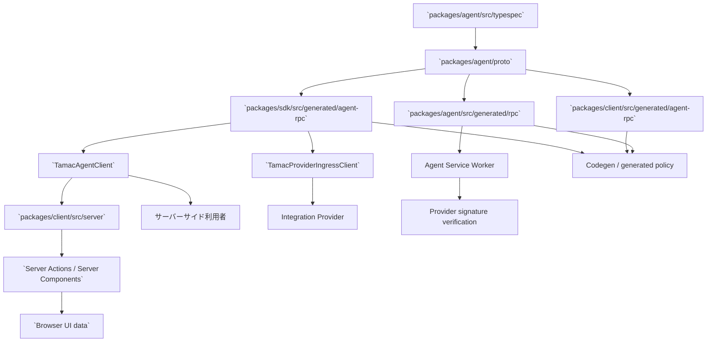
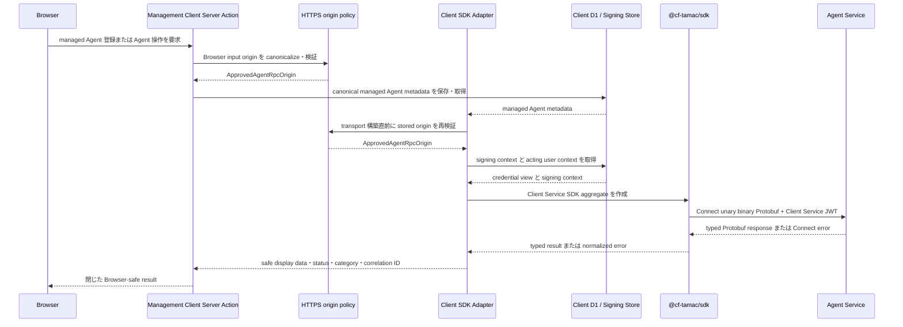
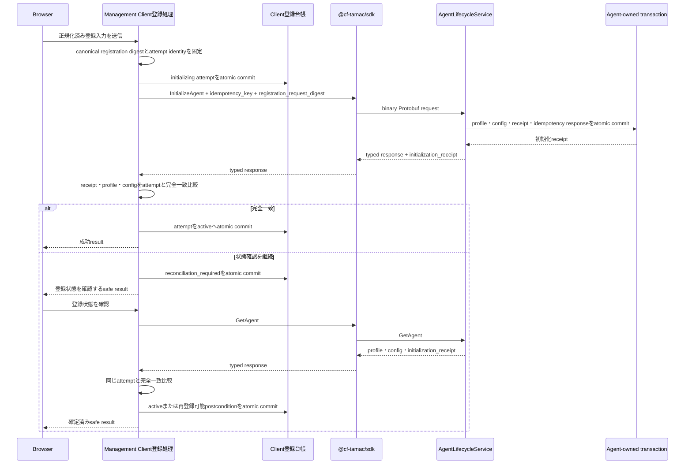
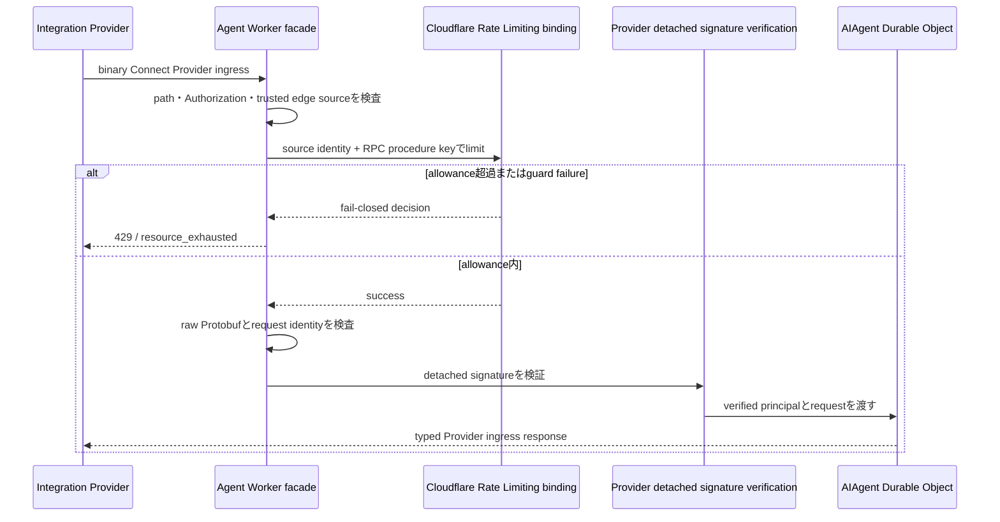
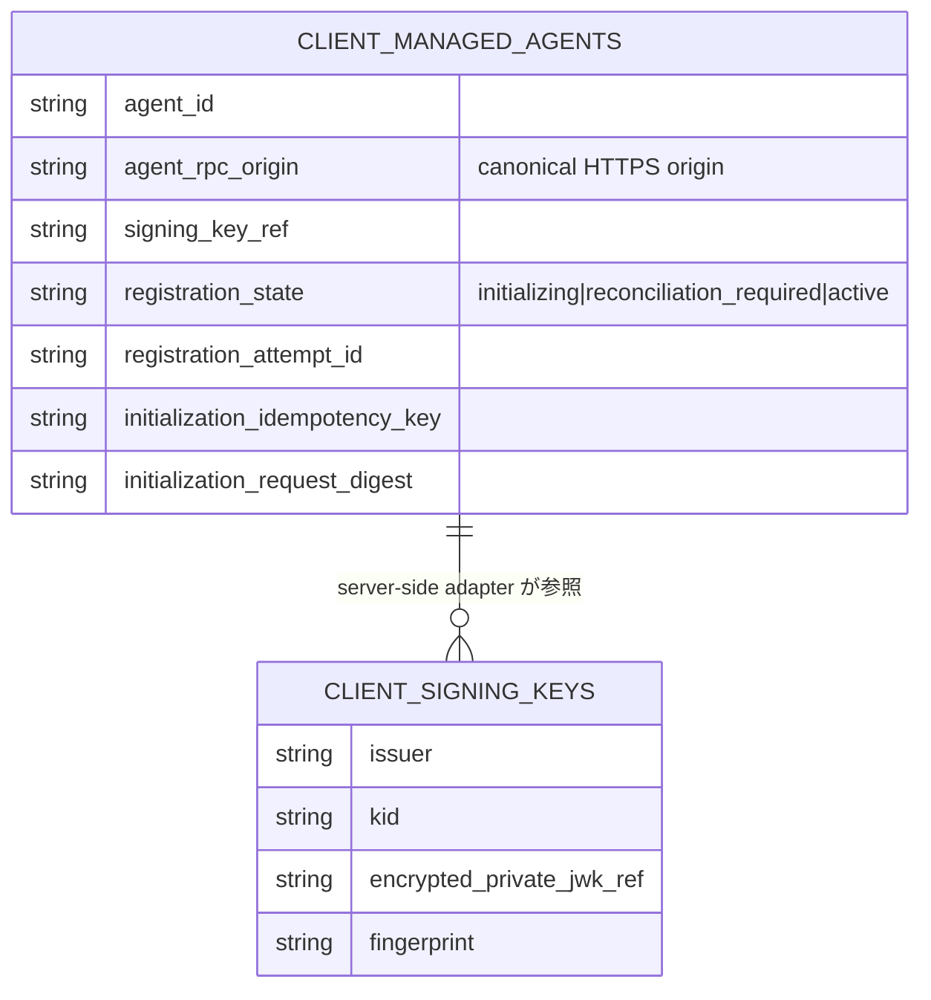
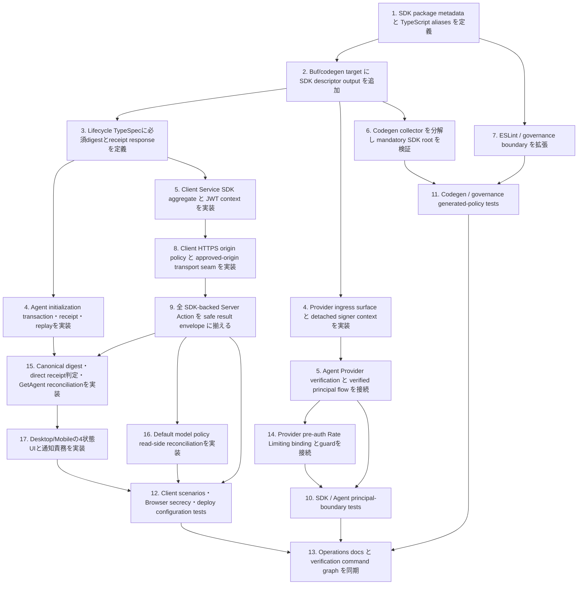

## Scope

### In Scope

- `TAMAC-SDK-S001` から `TAMAC-SDK-S008` までを満たす server-side SDK package `@cf-tamac/sdk` の package/API/auth/error/transport design。
- `TamacAgentClient` を Client Service JWT 専用 aggregate とし、lifecycle、model policy、event、thread、run、state、schedule、tool、integration、health operations を一つの invocation context で提供する design。
- `TamacProviderIngressClient` を Provider detached-signature principal 専用 surface とし、Provider signing callback、nonce、timestamp、request digest、installation identity を一つの Provider-facing context で扱う design。
- `TAMAC-SDK-S002` に基づき、Provider ingress を detached signature 検証と Agent-owned state 処理より前に Cloudflare Rate Limiting binding の pre-auth edge admission guard で保護する design。外部bucket windowはedge admissionを所有し、accepted Event、pending Run、Thread、replay/idempotency、audit、resource versionはAIAgent Durable Object SQLiteが所有する。
- `WORKSPACE-GOVERNANCE-S015` から `WORKSPACE-GOVERNANCE-S017` までを満たす SDK package classification、generated Agent RPC descriptor generation、mandatory generated policy、deploy artifact validation、package boundary governance。
- Management Client の server-only Agent RPC adapter が SDK を利用し、Client D1、signing key store、acting user derivation、HTTPS origin allowlist validation を所有する design。
- SDK-backed Server Actions が safe display data、safe status、safe error category、correlation ID の閉じた result schema を返す design。
- `TAMAC-SDK-S005` に基づき、登録と既定model policy更新の確定・失敗・状態確認を同じ idempotency context と Browser-safe result で扱う design。
- `MANAGEMENT-CLIENT-WIREFRAMES-S001` に基づき、非同期操作完了時の programmatic focus を `tabIndex={-1}` を持つ結果見出しへ統一する design。
- `AGENT-LIFECYCLE-S001`、`AGENT-LIFECYCLE-S002`、`AGENT-LIFECYCLE-S010`に基づき、`InitializeAgent`の必須`registration_request_digest`、初期化receiptの原子的な確定、`InitializeAgent`と`GetAgent`からの安定した返却、Management Clientの完全一致判定を実現するdesign。
- Agent APIの正本は`packages/agent/src/typespec/main.tsp`とそのimport treeとし、proto3とAgent/Client/SDK Protobuf RPC descriptorsはgeneration commandが所有する出力として扱う。SDKは生成済みtyped contractのconsumerとして動作するdesign。
- Verification は SDK/Agent UT、Client server/browser boundary tests、governance tests、codegen drift check、deploy artifact tests、`openspec validate`、lint/test/build command を対象にする。

### Out of Scope

- 実装対象は、承認済みSpecsが定義するSDK、Agent lifecycle・authentication境界、Management Client security・UI境界、governance、operationsの責務に限定する。

## Assumptions / Dependencies

- Agent public API source of truth は `packages/agent/src/typespec/main.tsp` であり、proto3 と Protobuf-ES descriptors は generation command が所有する。
- Existing runtime dependencies として `@connectrpc/connect`、`@connectrpc/connect-web`、`@bufbuild/protobuf`、Web Crypto Ed25519 signing capability を利用できる。
- Management Client の `CLIENT_DB`、encrypted signing key store、`CLIENT_CREDENTIAL_ENCRYPTION_KEY`、acting user policy、managed Agent record resolution は Client adapter が所有する。
- SDK は framework-neutral server-side package とし、Next.js 固有の `server-only` marker、Client D1 repository、Worker env resolution は Client server-side adapter が所有する。
- `AGENT_RPC_ALLOWED_ORIGINS` は server-managed configuration に置く non-secret JSON array とし、canonical HTTPS origin の完全一致 policy を表す。
- Managed Agent record の `agent_rpc_origin` は canonical origin を保持し、transport 構築直前に current allowlist policy を適用する。
- Provider signer public seam は secret-free canonical signing input を受ける `signDetached(input)` callback とする。
- Agent Worker は Wrangler 4.36.0 以降で提供される Cloudflare Rate Limiting binding を利用し、`RateLimit.limit({ key })` の結果を Provider ingress の pre-authentication guard として扱う。Agent domain state、replay/idempotency ledger、auditはAgent-owned storageが確定する。
- `PROVIDER_INGRESS_RATE_LIMITER` は環境ごとに専用の正整数文字列 `namespace_id` を割り当て、`limit = 100`、`period = 60` の単純policyで構成する。
- Provider ingressの信頼済みsource identityは、Cloudflare edgeが付与する単一の妥当な`CF-Connecting-IP`を使用する。Trusted source validationの各error outcomeは同一のfail-closed responseへ畳み込む。
- Deploy artifact generator は Agent artifact と Client artifact を別 root として作成し、Client artifact には SDK runtime closure を含める。
- Agent lifecycle TypeSpecは、`InitializeAgentRequest.registration_request_digest = 8`、`InitializeAgentResponse.initialization_receipt = 7`、`GetAgentResponse.initialization_receipt = 6`、`AgentInitializationReceipt.idempotency_key = 1`、`AgentInitializationReceipt.registration_request_digest = 2`を安定field番号として使用する。
- `registration_request_digest`はClientが正規化済み登録入力から生成する非空のopaque digestであり、Agentは受信値を完全一致比較の契約値として扱う。Connect request body digestはtransport監査値として独立して扱う。

## Impacted Areas

- SDK package: package metadata、public exports、Client Service aggregate、Provider ingress surface、transport、auth metadata、error normalization、invocation context、generated descriptors、SDK tests。
- Agent authentication: Connect Worker authentication branch、Provider signature verification、verified principal construction、Integration ingress dispatch、Agent-owned final authorization、Agent tests。
- Provider ingress protection: Rate Limiting binding、trusted edge source validation、procedure-scoped bucket key、safe denial observability、429 response mapping。
- Agent codegen: Buf generation target、codegen drift helper decomposition、generated descriptor stability checks、Agent surface governance。
- Management Client: server-only origin policy、managed Agent registration、Client D1 loader、SDK transport factory、全 SDK-backed Server Actions、Browser-safe result mapper、browser secrecy tests、import graph tests。
- Client data integrity: managed Agent registration attempt state、atomic D1 commit、create/edit分離、Agent初期化reconciliation、model policy read-after-write reconciliation。
- Agent lifecycle contract: `InitializeAgent`の必須digest、`InitializeAgent`/`GetAgent`のreceipt response、field stability、transaction、idempotent replay、conflict mapping。
- Agent lifecycle persistence: profile、config、credential、audit、system Thread、initialization receipt、idempotency responseを一つのAgent-owned transactionで確定する。
- Client accessibility: status/alert通知領域と`tabIndex={-1}`の結果見出しを分離したfocus semantics、component/E2E traceability。
- Workspace tooling: root scripts、workspace packages、TypeScript path aliases、ESLint boundary classifier、generated policy registry、governance scripts、deploy artifact generator、CI validation commands。
- Configuration / operations: `AGENT_RPC_ALLOWED_ORIGINS` env validation、Worker configuration examples、self-host deployment、control-plane authentication runbook、Client package guide。
- Security: principal-specific authentication context、Client Service JWT destination policy、acting user metadata、request ID/correlation ID/idempotency metadata、safe error projection、browser-delivered data classification。

## Directory Tree

```text
.
├─ package.json
├─ pnpm-workspace.yaml
├─ pnpm-lock.yaml
├─ tsconfig.base.json
├─ eslint.config.js
├─ README.md
├─ CONTRIBUTING.md
├─ CODING_STANDARDS.md
├─ docs
│  └─ operations
│     ├─ agent-control-plane-auth.md
│     └─ self-host-deploy.md
├─ openspec
│  └─ changes
│     └─ introduce-tamac-sdk
│        ├─ proposal.md
│        ├─ design.md
│        ├─ tasks.md
│        ├─ browser-safe-registration-operation-ui-spec.md
│        ├─ specs
│        │  ├─ agent-lifecycle
│        │  │  └─ spec.md
│        │  ├─ management-client-wireframes
│        │  │  └─ spec.md
│        │  ├─ tamac-sdk
│        │  │  └─ spec.md
│        │  └─ workspace-governance
│        │     └─ spec.md
│        ├─ wireframes
│        │  ├─ managed-agent-registration-desktop.wireframe.json
│        │  ├─ managed-agent-registration-desktop.wireframe.html
│        │  ├─ managed-agent-registration-mobile.wireframe.json
│        │  ├─ managed-agent-registration-mobile.wireframe.html
│        │  ├─ agent-operation-result-desktop.wireframe.json
│        │  ├─ agent-operation-result-desktop.wireframe.html
│        │  ├─ agent-operation-result-mobile.wireframe.json
│        │  └─ agent-operation-result-mobile.wireframe.html
│        └─ wireframe-screenshots
│           ├─ managed-agent-registration-desktop.wireframe-screenshot.png
│           ├─ managed-agent-registration-mobile.wireframe-screenshot.png
│           ├─ agent-operation-result-desktop.wireframe-screenshot.png
│           └─ agent-operation-result-mobile.wireframe-screenshot.png
├─ packages
│  ├─ agent
│  │  ├─ buf.gen.yaml
│  │  ├─ wrangler.toml
│  │  └─ src
│  │     ├─ AIAgent.ts
│  │     ├─ env.ts
│  │     ├─ worker.ts
│  │     ├─ typespec
│  │     │  └─ src
│  │     │     └─ services
│  │     │        └─ agent-lifecycle.tsp
│  │     ├─ domain
│  │     │  ├─ agent-core.ts
│  │     │  └─ lifecycle-operations.ts
│  │     ├─ durable-object
│  │     │  └─ integration-handlers.ts
│  │     ├─ integrations
│  │     │  ├─ operations-delivery.ts
│  │     │  ├─ operations-ingress.ts
│  │     │  └─ security.ts
│  │     ├─ rpc
│  │     │  ├─ connect-worker-adapter.ts
│  │     │  ├─ mappers
│  │     │  │  └─ core.ts
│  │     │  ├─ dispatch
│  │     │  │  ├─ integration-ingress.ts
│  │     │  │  └─ lifecycle.ts
│  │     │  └─ interceptors
│  │     │     ├─ authorization.ts
│  │     │     └─ provider-ingress-rate-limit.ts
│  │     ├─ storage
│  │     │  ├─ initializers
│  │     │  │  └─ agent-storage.ts
│  │     │  ├─ repositories
│  │     │  │  ├─ factory.ts
│  │     │  │  └─ initialization-receipt-repository.ts
│  │     │  └─ schema
│  │     │     └─ agent-storage.ts
│  │     └─ tests
│  │        ├─ agent-worker-bindings.test.ts
│  │        ├─ agent-initialization-receipt.test.ts
│  │        ├─ agent-stage2-core.test.ts
│  │        ├─ client-service-ed25519-auth.test.ts
│  │        ├─ contract-generation.test.ts
│  │        ├─ protobuf-field-stability.test.ts
│  │        ├─ rpc-schema-invariants.test.ts
│  │        ├─ provider-ingress-rate-limit.test.ts
│  │        └─ rpc-interceptors.test.ts
│  ├─ client
│  │  ├─ .dev.vars.example
│  │  ├─ README.md
│  │  ├─ package.json
│  │  ├─ tsconfig.json
│  │  ├─ wrangler.toml
│  │  ├─ app
│  │  │  └─ agents
│  │  │     ├─ new
│  │  │     │  └─ page.tsx
│  │  │     └─ [agentId]
│  │  │        └─ settings
│  │  │           └─ page.tsx
│  │  └─ src
│  │     ├─ components
│  │     │  ├─ agent-registration-actions.tsx
│  │     │  ├─ agent-registration-form.tsx
│  │     │  ├─ agent-settings-form.tsx
│  │     │  ├─ model-policy-fields.tsx
│  │     │  ├─ model-policy-settings-section.tsx
│  │     │  ├─ operation-result-region.tsx
│  │     │  └─ schemas
│  │     │     ├─ agent-registration.ts
│  │     │     └─ model-policy.ts
│  │     ├─ server
│  │     │  ├─ env.ts
│  │     │  ├─ db
│  │     │  │  ├─ access-credentials.ts
│  │     │  │  ├─ managed-agents.ts
│  │     │  │  ├─ managed-agent-registration-attempts.ts
│  │     │  │  ├─ schema.ts
│  │     │  │  └─ migrations
│  │     │  │     └─ 0004_managed_agent_registration_reconciliation.sql
│  │     │  ├─ agent-rpc
│  │     │  │  ├─ acting-user.ts
│  │     │  │  ├─ agent-loader.ts
│  │     │  │  ├─ create-client.ts
│  │     │  │  ├─ e2e-fake-clients.ts
│  │     │  │  ├─ index.ts
│  │     │  │  ├─ origin-policy.ts
│  │     │  │  └─ safe-results.ts
│  │     │  └─ actions
│  │     │     ├─ agent-health.ts
│  │     │     ├─ agent-lifecycle.ts
│  │     │     ├─ agent-operation-view-models.ts
│  │     │     ├─ browser-safe-helpers.ts
│  │     │     ├─ agent-operations
│  │     │     │  ├─ default-model-policy.ts
│  │     │     │  ├─ integrations.ts
│  │     │     │  ├─ schedules.ts
│  │     │     │  └─ tools.ts
│  │     │     ├─ agent-queries
│  │     │     │  ├─ events.ts
│  │     │     │  ├─ runs.ts
│  │     │     │  └─ threads.ts
│  │     │     ├─ managed-agent-registration.ts
│  │     │     ├─ managed-agent-registration-attempt.ts
│  │     │     ├─ managed-agents.ts
│  │     │     ├─ model-policies.ts
│  │     │     └─ model-policy-view-models.ts
│  │     └─ tests
│  │        ├─ agent-management-ui.test.tsx
│  │        ├─ agent-rpc-origin-policy.test.ts
│  │        ├─ browser-agent-rpc-secrecy.test.ts
│  │        ├─ client-agent-operations.test.ts
│  │        ├─ client-agent-rpc-factory.test.ts
│  │        ├─ client-bindings.test.ts
│  │        ├─ client-d1-schema.test.ts
│  │        ├─ client-import-graph.test.ts
│  │        ├─ client-repository-boundary.test.ts
│  │        ├─ managed-agent-registration-attempt.test.ts
│  │        ├─ client-signing-key-store.test.ts
│  │        ├─ client-signing-key-usage.test.ts
│  │        └─ server-action-boundary.test.ts
│  └─ sdk
│     ├─ package.json
│     ├─ tsconfig.json
│     └─ src
│        ├─ index.ts
│        ├─ client.ts
│        ├─ transport.ts
│        ├─ invocation-context.ts
│        ├─ errors.ts
│        ├─ provider-ingress.ts
│        ├─ provider-ingress-transport.ts
│        ├─ provider-ingress-types.ts
│        ├─ auth
│        │  ├─ client-service-jwt.ts
│        │  └─ types.ts
│        ├─ generated
│        │  └─ agent-rpc
│        │     └─ cftamac
│        │        └─ agent
│        │           └─ v1_pb.ts
│        └─ tests
│           ├─ client.test.ts
│           ├─ auth.test.ts
│           ├─ errors.test.ts
│           ├─ browser-boundary.test.ts
│           └─ provider-ingress.test.ts
├─ scripts
│  ├─ codegen
│  │  ├─ check-agent-codegen-drift.mjs
│  │  └─ check-agent-codegen-drift.test.mjs
│  ├─ deploy
│  │  ├─ generate-deploy-artifacts.mjs
│  │  └─ generate-deploy-artifacts.test.mjs
│  └─ governance
│     ├─ verify-agent-surface.mjs
│     ├─ verify-agent-surface.test.mjs
│     ├─ verify-package-boundaries.mjs
│     └─ verify-package-boundaries.test.mjs
├─ tests
│  └─ e2e
│     ├─ managed-agent-fixture.ts
│     ├─ management-agent-registry.spec.ts
│     ├─ management-agent-rpc-secrecy.spec.ts
│     └─ management-model-policy.spec.ts
└─ .opencode
   ├─ skills
   │  └─ coding-guardian
   │     ├─ SKILL.md
   │     └─ references
   │        └─ repo-entrypoints.md
   └─ agents
      └─ unit
         ├─ build
         │  └─ builder.md
         ├─ agent
         │  ├─ engineer.md
         │  └─ reviewer.md
         └─ client
            ├─ engineer.md
            └─ reviewer.md
```

## New / Changed Files

| Type   | File                                                                                                                                                     | Change                                                                                                                                                                                            |
| ------ | -------------------------------------------------------------------------------------------------------------------------------------------------------- | ------------------------------------------------------------------------------------------------------------------------------------------------------------------------------------------------- |
| Update | `package.json`                                                                                                                                           | SDK package scripts、codegen drift 対象、verification command graph を定義する。                                                                                                                  |
| Update | `pnpm-workspace.yaml`                                                                                                                                    | `packages/sdk` を workspace package として分類する。                                                                                                                                              |
| Update | `pnpm-lock.yaml`                                                                                                                                         | workspace package graph と解決済み dependency metadata を同期する。                                                                                                                               |
| Update | `tsconfig.base.json`                                                                                                                                     | `@cf-tamac/sdk` と SDK generated descriptor aliases を定義する。                                                                                                                                  |
| Update | `eslint.config.js`                                                                                                                                       | SDK runtime と SDK generated descriptor の boundary element、server-side import ownership を検査する。                                                                                            |
| Update | `README.md`、`CONTRIBUTING.md`、`CODING_STANDARDS.md`                                                                                                    | SDK package、generated ownership、Client security boundary、verification commands を開発者向けに説明する。                                                                                        |
| Update | `docs/operations/self-host-deploy.md`                                                                                                                    | `AGENT_RPC_ALLOWED_ORIGINS` の deploy 設定、HTTPS canonical origin、health verification を手順化する。                                                                                            |
| Update | `docs/operations/agent-control-plane-auth.md`                                                                                                            | Client Service JWT destination policy、Provider rate-limit監視、登録reconciliation、safe correlationを手順化する。                                                                                |
| Update | `openspec/changes/introduce-tamac-sdk/proposal.md`                                                                                                       | Principal-specific SDK surface、HTTPS origin policy、safe result、generated policy の change intent を記述する。                                                                                  |
| Add    | `openspec/changes/introduce-tamac-sdk/specs/agent-lifecycle/spec.md`                                                                                     | 必須登録digest、初期化receipt、`GetAgent`照合、`active`確定条件を外部契約として定義する。                                                                                                         |
| Update | `openspec/changes/introduce-tamac-sdk/specs/tamac-sdk/spec.md`                                                                                           | Client/Provider surface、origin policy、Browser-safe result の外部可視契約と Scenario IDs を記述する。                                                                                            |
| Add    | `openspec/changes/introduce-tamac-sdk/specs/management-client-wireframes/spec.md`                                                                        | 非同期操作完了時の結果見出しfocusと通知領域semanticsを外部可視契約として定義する。                                                                                                                |
| Update | `openspec/changes/introduce-tamac-sdk/specs/workspace-governance/spec.md`                                                                                | SDK generated descriptor root の mandatory validation behavior を記述する。                                                                                                                       |
| Update | `openspec/changes/introduce-tamac-sdk/design.md`                                                                                                         | Specialist design、method/security matrices、UI wireframes、tests、release verification を統合する。                                                                                              |
| Update | `openspec/changes/introduce-tamac-sdk/tasks.md`                                                                                                          | Review remediation tasks と Scenario test tasks を dependency order で整理する。                                                                                                                  |
| Add    | `openspec/changes/introduce-tamac-sdk/browser-safe-registration-operation-ui-spec.md`                                                                    | Registration/Agent operationの状態確認copy、結果見出しfocus、live region、security ownershipを確定する。                                                                                          |
| Add    | `openspec/changes/introduce-tamac-sdk/wireframes/*.wireframe.json`、`*.wireframe.html`                                                                   | Desktop/mobile の registration と Agent operation result previews を定義する。                                                                                                                    |
| Add    | `openspec/changes/introduce-tamac-sdk/wireframe-screenshots/*.wireframe-screenshot.png`                                                                  | 4つの wireframe preview を `agent-browser` で撮影した design evidence として保存する。                                                                                                            |
| Update | `packages/agent/buf.gen.yaml`                                                                                                                            | SDK-owned Agent RPC descriptor output target を定義する。                                                                                                                                         |
| Update | `packages/agent/src/typespec/src/services/agent-lifecycle.tsp`                                                                                           | `registration_request_digest`をfield 8の必須入力とし、field 7の`InitializeAgentResponse.initialization_receipt`、field 6の`GetAgentResponse.initialization_receipt`を必須responseとして定義する。 |
| Update | `packages/agent/wrangler.toml`                                                                                                                           | `PROVIDER_INGRESS_RATE_LIMITER` の環境別namespaceと100 requests/60 seconds policyを定義する。                                                                                                     |
| Update | `packages/agent/src/env.ts`                                                                                                                              | Cloudflare `RateLimit` bindingをAgent Worker環境contractへ追加する。                                                                                                                              |
| Update | `packages/agent/src/worker.ts`                                                                                                                           | Provider pre-auth denialをsafe counter recordとしてWorkers Logsへ出力するobserverを接続する。                                                                                                     |
| Update | `packages/agent/src/rpc/connect-worker-adapter.ts`                                                                                                       | Provider traffic guardをraw body読取・detached signature・Agent routingより前へ接続する。                                                                                                         |
| Add    | `packages/agent/src/rpc/interceptors/provider-ingress-rate-limit.ts`                                                                                     | trusted edge source検査、procedure-scoped key生成、binding呼出、fail-closed decisionを実装する。                                                                                                  |
| Update | `packages/agent/src/rpc/interceptors/authorization.ts`                                                                                                   | Client Service operations と Provider ingress grants の principal-specific authorization を固定する。                                                                                             |
| Update | `packages/agent/src/rpc/dispatch/integration-ingress.ts`                                                                                                 | 検証済み Provider principal を Integration ingress command context へ渡す。                                                                                                                       |
| Update | `packages/agent/src/integrations/security.ts`                                                                                                            | detached signature verification から verified `INTEGRATION_INSTALLATION` principal を返す。                                                                                                       |
| Update | `packages/agent/src/integrations/operations-ingress.ts`                                                                                                  | verified Provider principal と installation scope で event/tool result command を処理する。                                                                                                       |
| Update | `packages/agent/src/integrations/operations-delivery.ts`                                                                                                 | verified Provider principal と delivery ownership を関連付ける。                                                                                                                                  |
| Update | `packages/agent/src/durable-object/integration-handlers.ts`                                                                                              | Provider verification result と Agent-owned final authorization の順序を固定する。                                                                                                                |
| Update | `packages/agent/src/AIAgent.ts`                                                                                                                          | Provider ingress handler の typed verification seam を公開 method wiring に接続する。                                                                                                             |
| Update | `packages/agent/src/domain/agent-core.ts`                                                                                                                | 必須登録digestと必須初期化receiptをlifecycle command/result viewへ定義する。                                                                                                                      |
| Update | `packages/agent/src/domain/lifecycle-operations.ts`                                                                                                      | Profile/config/credential/audit/receipt/idempotency responseを一つのtransactionで確定し、完全一致replayを返す。                                                                                   |
| Update | `packages/agent/src/rpc/dispatch/lifecycle.ts`                                                                                                           | `InitializeAgent`の必須digestをdomain commandへ渡し、validation errorを安定Connect codeへ写像する。                                                                                               |
| Update | `packages/agent/src/rpc/mappers/core.ts`                                                                                                                 | `InitializeAgentResponse`と`GetAgentResponse`へ同じ初期化receiptを写像する。                                                                                                                      |
| Update | `packages/agent/src/storage/schema/agent-storage.ts`、`storage/initializers/agent-storage.ts`                                                            | Agent IDごとの初期化receiptを必須fieldと一意identityで永続化する。                                                                                                                                |
| Update | `packages/agent/src/storage/repositories/factory.ts`、`storage/repositories/initialization-receipt-repository.ts`                                        | 初期化transactionへreceipt repositoryを参加させ、初回値と完全一致するimmutable write/readを提供する。                                                                                             |
| Update | `packages/agent/src/tests/client-service-ed25519-auth.test.ts`                                                                                           | `[TAMAC-SDK-S002]` の Client Service JWT operation inventory と principal boundary を検証する。                                                                                                   |
| Update | `packages/agent/src/tests/rpc-interceptors.test.ts`                                                                                                      | `[TAMAC-SDK-S002]` の Provider detached-signature branch と verified principal を検証する。                                                                                                       |
| Add    | `packages/agent/src/tests/provider-ingress-rate-limit.test.ts`                                                                                           | `[TAMAC-SDK-S002]` のkey、ordering、failure mode、handler/DO非到達を検証する。                                                                                                                    |
| Update | `packages/agent/src/tests/agent-worker-bindings.test.ts`                                                                                                 | Rate Limiting bindingとAgent-owned binding境界を検証する。                                                                                                                                        |
| Add    | `packages/agent/src/tests/agent-initialization-receipt.test.ts`                                                                                          | `[AGENT-LIFECYCLE-S001]`、`[AGENT-LIFECYCLE-S002]`、`[AGENT-LIFECYCLE-S010]`の必須digest、transaction、replay、conflict、query receiptを検証する。                                                |
| Update | `packages/agent/src/tests/agent-stage2-core.test.ts`、`contract-generation.test.ts`、`rpc-schema-invariants.test.ts`、`protobuf-field-stability.test.ts` | Lifecycle receiptのrequiredness、field番号、generated contract、domain/storage invariantを検証する。                                                                                              |
| Add    | `packages/sdk/package.json`                                                                                                                              | `@cf-tamac/sdk` package metadata、exports、dependencies、scripts を定義する。                                                                                                                     |
| Add    | `packages/sdk/tsconfig.json`                                                                                                                             | SDK TypeScript build/check configuration を定義する。                                                                                                                                             |
| Add    | `packages/sdk/src/index.ts`                                                                                                                              | Client Service aggregate と Provider ingress surface の public exports を re-export only entrypoint で公開する。                                                                                  |
| Add    | `packages/sdk/src/client.ts`                                                                                                                             | Client Service JWT 専用 `TamacAgentClient` と factory を実装する。                                                                                                                                |
| Add    | `packages/sdk/src/transport.ts`                                                                                                                          | Client Service Connect unary binary Protobuf transport を実装する。                                                                                                                               |
| Add    | `packages/sdk/src/invocation-context.ts`                                                                                                                 | Agent ID、scope、acting user、request correlation、idempotency context types を定義する。                                                                                                         |
| Add    | `packages/sdk/src/errors.ts`                                                                                                                             | Connect code から SDK normalized error への mapping を実装する。                                                                                                                                  |
| Add    | `packages/sdk/src/auth/client-service-jwt.ts`                                                                                                            | EdDSA Client Service JWT generation と RPC metadata builder を実装する。                                                                                                                          |
| Add    | `packages/sdk/src/auth/types.ts`                                                                                                                         | credential view、Client signing context、acting user context の public types を定義する。                                                                                                         |
| Add    | `packages/sdk/src/provider-ingress.ts`                                                                                                                   | Provider 専用 three-method integration surface と factory を実装する。                                                                                                                            |
| Add    | `packages/sdk/src/provider-ingress-types.ts`                                                                                                             | Provider invocation、installation identity、detached signer callback types を定義する。                                                                                                           |
| Add    | `packages/sdk/src/provider-ingress-transport.ts`                                                                                                         | canonical signing input、binary Connect metadata、`resource_exhausted`正規化contextを構成する。                                                                                                   |
| Add    | `packages/sdk/src/generated/agent-rpc/cftamac/agent/v1_pb.ts`                                                                                            | Agent RPC descriptor を generation command が生成する。                                                                                                                                           |
| Add    | `packages/sdk/src/tests/client.test.ts`                                                                                                                  | `TAMAC-SDK-S001` と Client Service aggregate 側 `TAMAC-SDK-S002` を検証する。                                                                                                                     |
| Add    | `packages/sdk/src/tests/provider-ingress.test.ts`                                                                                                        | Provider surface 側 `TAMAC-SDK-S002` の detached-signature context を検証する。                                                                                                                   |
| Add    | `packages/sdk/src/tests/auth.test.ts`                                                                                                                    | `TAMAC-SDK-S003` と `TAMAC-SDK-S004` の JWT metadata と signing context を検証する。                                                                                                              |
| Add    | `packages/sdk/src/tests/errors.test.ts`                                                                                                                  | `TAMAC-SDK-S006` の normalized error mapping を検証する。                                                                                                                                         |
| Add    | `packages/sdk/src/tests/browser-boundary.test.ts`                                                                                                        | `TAMAC-SDK-S005` の server-side package metadata と safe result shape を検証する。                                                                                                                |
| Update | `packages/client/package.json`                                                                                                                           | Management Client から `@cf-tamac/sdk` を workspace dependency として利用する。                                                                                                                   |
| Update | `packages/client/tsconfig.json`                                                                                                                          | Client server-only SDK adapter の type resolution を定義する。                                                                                                                                    |
| Update | `packages/client/wrangler.toml`                                                                                                                          | `AGENT_RPC_ALLOWED_ORIGINS` の canonical HTTPS origin array を Worker variable として定義する。                                                                                                   |
| Update | `packages/client/.dev.vars.example`                                                                                                                      | local/staging 用 HTTPS origin allowlist の設定例を提供する。                                                                                                                                      |
| Update | `packages/client/README.md`                                                                                                                              | origin policy、JWT audience、server-only SDK adapter、検証手順を説明する。                                                                                                                        |
| Update | `packages/client/app/agents/new/page.tsx`、`app/agents/[agentId]/settings/page.tsx`                                                                      | Registration と default model policy の Server Action result を wireframe-defined UI states へ渡す。                                                                                              |
| Update | `packages/client/src/components/agent-registration-actions.tsx`、`agent-registration-form.tsx`                                                           | Registration の pending/success/validation/configuration states、ResultRegion、focus behavior を実装する。                                                                                        |
| Update | `packages/client/src/components/operation-result-region.tsx`                                                                                             | 通知領域semanticsと`tabIndex={-1}`を持つ結果見出しfocusの単一責務を維持する。                                                                                                                     |
| Update | `packages/client/src/components/agent-settings-form.tsx`、`model-policy-settings-section.tsx`                                                            | Default model policy result placement、safe copy、correlation ID support affordance を実装する。                                                                                                  |
| Update | `packages/client/src/components/model-policy-fields.tsx`                                                                                                 | Pending/permission/configuration state の label、description、disabled behavior を実装する。                                                                                                      |
| Update | `packages/client/src/server/env.ts`                                                                                                                      | `AGENT_RPC_ALLOWED_ORIGINS` の required binding と validation entrypoint を定義する。                                                                                                             |
| Add    | `packages/client/src/server/agent-rpc/origin-policy.ts`                                                                                                  | JSON schema、HTTPS canonicalization、exact allowlist match、typed configuration error を実装する。                                                                                                |
| Update | `packages/client/src/server/agent-rpc/acting-user.ts`                                                                                                    | Client Service invocation context と safe correlation ownership を SDK adapter に供給する。                                                                                                       |
| Update | `packages/client/src/server/agent-rpc/agent-loader.ts`                                                                                                   | managed Agent metadata を読み、credential 解決前に origin policy を再検証する。                                                                                                                   |
| Update | `packages/client/src/server/agent-rpc/create-client.ts`                                                                                                  | `ApprovedAgentRpcOrigin` を受けて SDK transport を構築する。                                                                                                                                      |
| Update | `packages/client/src/server/agent-rpc/e2e-fake-clients.ts`                                                                                               | origin policy 後の test seam と Client Service operation inventoryを揃える。                                                                                                                      |
| Update | `packages/client/src/server/agent-rpc/index.ts`                                                                                                          | origin policy、SDK-backed adapter、safe result helpers の server exports を整理する。                                                                                                             |
| Add    | `packages/client/src/server/agent-rpc/safe-results.ts`                                                                                                   | 四属性固定の Browser-safe result envelope と error category mapper を実装する。                                                                                                                   |
| Update | `packages/client/src/server/actions/managed-agent-registration.ts`                                                                                       | Browser input origin を canonicalize/allowlist validation してから metadata を永続化する。                                                                                                        |
| Add    | `packages/client/src/server/actions/managed-agent-registration-attempt.ts`                                                                               | create attemptのcanonical digest、idempotency、initializing/reconciliation state、`InitializeAgent`直接responseと`GetAgent`のreceipt/profile/config完全一致による`active`確定を実装する。         |
| Update | `packages/client/src/server/actions/managed-agents.ts`                                                                                                   | managed Agent 登録結果と SDK result を共通 safe envelope に投影する。                                                                                                                             |
| Update | `packages/client/src/server/db/schema.ts`、`db/managed-agents.ts`、`db/access-credentials.ts`                                                            | 登録attempt metadataとmanaged Agent/credential/signing metadataのatomic commitを実装する。                                                                                                        |
| Add    | `packages/client/src/server/db/managed-agent-registration-attempts.ts`                                                                                   | Create/edit attempt、`initializing`、`reconciliation_required`、`active`、safe observation、atomic cleanupのrepository APIを実装する。                                                            |
| Add    | `packages/client/src/server/db/migrations/0004_managed_agent_registration_reconciliation.sql`                                                            | Client-owned ledgerへ登録attempt state、idempotency key、request digestを追加する。                                                                                                               |
| Update | `packages/client/src/server/actions/model-policies.ts`                                                                                                   | registration-time SDK validation と safe result projection を共通境界へ揃える。                                                                                                                   |
| Update | `packages/client/src/server/actions/agent-health.ts`、`agent-lifecycle.ts`                                                                               | Health/lifecycle SDK result を閉じた Browser-safe envelope へ投影する。                                                                                                                           |
| Update | `packages/client/src/server/actions/agent-operations/default-model-policy.ts`                                                                            | model policy result/error を safe data、status、category、correlation ID へ投影する。                                                                                                             |
| Update | `packages/client/src/server/actions/agent-operations/integrations.ts`、`schedules.ts`、`tools.ts`                                                        | Integration/Schedule/Tool operations を共通 safe result contract に揃える。                                                                                                                       |
| Update | `packages/client/src/server/actions/agent-queries/events.ts`、`runs.ts`、`threads.ts`                                                                    | Event/Run/Thread query results を action-specific safe display DTO に投影する。                                                                                                                   |
| Update | `packages/client/src/server/actions/agent-operation-view-models.ts`、`model-policy-view-models.ts`                                                       | Browser に返す action-specific safe display DTO を定義する。                                                                                                                                      |
| Update | `packages/client/src/server/actions/browser-safe-helpers.ts`                                                                                             | common display validation と固定安全文言を safe result mapper に接続する。                                                                                                                        |
| Update | `packages/client/src/components/schemas/agent-registration.ts`、`agent-registration-form.tsx`                                                            | Server Action の safe validation result と correlation ID を form state で扱う。                                                                                                                  |
| Update | `packages/client/src/components/schemas/model-policy.ts`                                                                                                 | model policy action の閉じた safe result schema を消費する。                                                                                                                                      |
| Add    | `packages/client/src/tests/agent-rpc-origin-policy.test.ts`                                                                                              | `TAMAC-SDK-S007` と `TAMAC-SDK-S008` の canonical allowlist と transport 前再検証を検証する。                                                                                                     |
| Update | `packages/client/src/tests/client-agent-rpc-factory.test.ts`                                                                                             | `TAMAC-SDK-S005` と `TAMAC-SDK-S008` の safe result、approved origin、factory ordering を検証する。                                                                                               |
| Update | `packages/client/src/tests/client-agent-operations.test.ts`                                                                                              | 全 SDK-backed operation/query result の四属性 contract と action-specific display DTO を検証する。                                                                                                |
| Update | `packages/client/src/tests/browser-agent-rpc-secrecy.test.ts`                                                                                            | `TAMAC-SDK-S005` の閉じた result shape と Browser data classification を検証する。                                                                                                                |
| Update | `packages/client/src/tests/client-bindings.test.ts`                                                                                                      | `AGENT_RPC_ALLOWED_ORIGINS` binding と validation behavior を検証する。                                                                                                                           |
| Update | `packages/client/src/tests/client-import-graph.test.ts`                                                                                                  | `WORKSPACE-GOVERNANCE-S015` の Client server/browser SDK boundary を検証する。                                                                                                                    |
| Update | `packages/client/src/tests/client-signing-key-usage.test.ts`                                                                                             | origin validation が signing context 解決より先に完了することを検証する。                                                                                                                         |
| Update | `packages/client/src/tests/client-signing-key-store.test.ts`                                                                                             | Managed Agent canonical origin と signing-key lookup fixtures を current Client policy に揃える。                                                                                                 |
| Update | `packages/client/src/tests/server-action-boundary.test.ts`                                                                                               | 全 SDK-backed Server Action の result contract と server-only execution を検証する。                                                                                                              |
| Update | `packages/client/src/tests/agent-management-ui.test.tsx`                                                                                                 | `[MANAGEMENT-CLIENT-WIREFRAMES-S001]` の結果見出しfocusとstatus/alert領域を検証する。                                                                                                             |
| Update | `packages/client/src/tests/client-d1-schema.test.ts`、`client-repository-boundary.test.ts`                                                               | Atomic registrationとreconciliation metadataのClient-owned境界を検証する。                                                                                                                        |
| Update | `packages/client/src/tests/managed-agent-registration-attempt.test.ts`                                                                                   | `[AGENT-LIFECYCLE-S010]`と`[TAMAC-SDK-S005]`の直接response、response loss、timeout、D1確定、再登録可能状態matrixを検証する。                                                                      |
| Update | `scripts/codegen/check-agent-codegen-drift.mjs`                                                                                                          | SDK descriptor root を mandatory target とし、issue collector を責務別 helper に分解する。                                                                                                        |
| Update | `scripts/codegen/check-agent-codegen-drift.test.mjs`                                                                                                     | `[WORKSPACE-GOVERNANCE-S016]` の missing/drift/unexpected report と helper behavior を検証する。                                                                                                  |
| Update | `scripts/deploy/generate-deploy-artifacts.mjs`                                                                                                           | Client artifact に SDK runtime closure、package metadata、generated descriptors、origin policy config を含める。                                                                                  |
| Update | `scripts/deploy/generate-deploy-artifacts.test.mjs`                                                                                                      | `[WORKSPACE-GOVERNANCE-S017]` の SDK closure と origin allowlist config を検証する。                                                                                                              |
| Update | `scripts/governance/verify-agent-surface.mjs`                                                                                                            | SDK package を Agent RPC SDK surface validation の scan 対象へ加える。                                                                                                                            |
| Update | `scripts/governance/verify-agent-surface.test.mjs`                                                                                                       | SDK package の Protobuf RPC surface fixture を追加する。                                                                                                                                          |
| Update | `scripts/governance/verify-package-boundaries.mjs`                                                                                                       | SDK generated descriptor root を generated policy registry の mandatory target にする。                                                                                                           |
| Update | `scripts/governance/verify-package-boundaries.test.mjs`                                                                                                  | `[WORKSPACE-GOVERNANCE-S015]` と `[WORKSPACE-GOVERNANCE-S016]` の ownership/policy fixtures を検証する。                                                                                          |
| Update | `tests/e2e/managed-agent-fixture.ts`                                                                                                                     | Origin allowlist、safe result、correlation ID を desktop/mobile test context に供給する。                                                                                                         |
| Update | `tests/e2e/management-agent-registry.spec.ts`                                                                                                            | `[TAMAC-SDK-S007]` の registration states、copy、focus、live region を検証する。                                                                                                                  |
| Update | `tests/e2e/management-agent-rpc-secrecy.spec.ts`                                                                                                         | `[TAMAC-SDK-S005]` の四属性 Browser result と server-side sensitive context ownership を検証する。                                                                                                |
| Update | `tests/e2e/management-model-policy.spec.ts`                                                                                                              | `[TAMAC-SDK-S005]` の operation result states、correlation ID support affordance、responsive behavior を検証する。                                                                                |
| Update | `.opencode/skills/coding-guardian/SKILL.md`                                                                                                              | SDK package、SDK generated descriptors、Client server-side SDK usage を coding baseline に加える。                                                                                                |
| Update | `.opencode/skills/coding-guardian/references/repo-entrypoints.md`                                                                                        | SDK entrypoints と generated output ownership を entrypoint reference に加える。                                                                                                                  |
| Update | `.opencode/agents/unit/agent/engineer.md`、`.opencode/agents/unit/agent/reviewer.md`                                                                     | Agent/codegen/governance apply/review scope に SDK descriptor policy を加える。                                                                                                                   |
| Update | `.opencode/agents/unit/client/engineer.md`、`.opencode/agents/unit/client/reviewer.md`                                                                   | Client SDK adapter、origin policy、Browser secrecy の apply/review ownership を加える。                                                                                                           |
| Update | `.opencode/agents/unit/build/builder.md`                                                                                                                 | SDK generated descriptor root を generation-only ownership と codegen verification scope に加える。                                                                                               |

## System Diagram

```mermaid
flowchart LR
  Browser[Browser] -->|登録・Agent 操作| Action[Management Client Server Action]
  Action -->|origin validation| Policy[HTTPS origin allowlist]
  Policy -->|canonical origin| ClientDB[(Client D1 / signing key store)]
  ClientDB -->|managed metadata と signing context| MgmtClient[server-only SDK adapter]
  MgmtClient -->|Client Service context| ClientSDK[`TamacAgentClient`]
  ServerConsumer[サーバーサイド利用者] -->|Client Service context| ClientSDK
  Provider[Integration Provider] -->|Provider signing context| ProviderSDK[`TamacProviderIngressClient`]
  ClientSDK -->|Connect binary Protobuf + Client Service JWT| AgentWorker[Agent Service Worker]
  ProviderSDK -->|Connect binary Protobuf + detached signature| ProviderGuard[Provider pre-auth traffic guard]
  ProviderGuard -->|source + RPC procedure key| RateBinding[Cloudflare Rate Limiting binding]
  RateBinding -->|allowance内| AgentWorker
  RateBinding -->|allowance超過・binding failure| SafeExhausted[`resource_exhausted`]
  AgentWorker -->|Durable Object RPC| AIAgent[`AIAgent` Durable Object]
  ClientSDK -->|typed result / normalized error| MgmtClient
  Action -->|safe display data・status・category・correlation ID| Browser
```



## Package Diagram



## Sequence Diagram







## UI Wireframe Screenshots

### Managed Agent registration — desktop


- Source wireframe: `wireframes/managed-agent-registration-desktop.wireframe.json` / `wireframes/managed-agent-registration-desktop.wireframe.html`
- Screenshot: `wireframe-screenshots/managed-agent-registration-desktop.wireframe-screenshot.png`
- Notes: `/agents/new`の初期入力、`reconciliation_required`、receipt完全一致後の`active`成功、再登録可能の4状態をdesktop幅で示す。Mineral teal palette、`IBM Plex Sans JP`、`IBM Plex Mono`、相互排他的な通知領域、状態別actionを含む。

### Managed Agent registration — mobile


- Source wireframe: `wireframes/managed-agent-registration-mobile.wireframe.json` / `wireframes/managed-agent-registration-mobile.wireframe.html`
- Screenshot: `wireframe-screenshots/managed-agent-registration-mobile.wireframe-screenshot.png`
- Notes: 390px幅のsingle-column構成で、初期入力、同じattemptによる状態確認、`active`成功、新しいattemptを開始する再登録可能状態を示す。44px interaction target、long identifier wrapping、結果見出しfocusを含む。

### Agent operation result — desktop


- Source wireframe: `wireframes/agent-operation-result-desktop.wireframe.json` / `wireframes/agent-operation-result-desktop.wireframe.html`
- Screenshot: `wireframe-screenshots/agent-operation-result-desktop.wireframe-screenshot.png`
- Notes: `/agents/[agentId]/settings` の default model policy operation における result placement、safe status/category copy、full correlation ID と copy feedback を示す。

### Agent operation result — mobile


- Source wireframe: `wireframes/agent-operation-result-mobile.wireframe.json` / `wireframes/agent-operation-result-mobile.wireframe.html`
- Screenshot: `wireframe-screenshots/agent-operation-result-mobile.wireframe-screenshot.png`
- Notes: mobile Settings shell の pending/success/permission/configuration/internal states、focus order、support reference wrapping を示す。

## Domain Model Diagram


## ER Diagram



## Package-Level Design

### Package List

| Package              | Purpose / Responsibility                                                                                                                                                                               | Public API                                                                 | Dependencies                                                           |
| -------------------- | ------------------------------------------------------------------------------------------------------------------------------------------------------------------------------------------------------ | -------------------------------------------------------------------------- | ---------------------------------------------------------------------- |
| `@cf-tamac/sdk`      | Client Service JWT aggregate、Provider detached-signature surface、typed transport、normalized error を所有する。                                                                                      | `createTamacAgentClient`, `createTamacProviderIngressClient`, public types | `@connectrpc/connect`, `@connectrpc/connect-web`, `@bufbuild/protobuf` |
| `@cf-tamac/agent`    | TypeSpec/proto source、初期化receipt、Provider pre-auth traffic guard、principal-specific authentication、Agent-owned final authorization、Durable Object runtimeを所有する。                          | generated Protobuf RPC contract、Connect binary Worker                     | TypeSpec, Buf, Cloudflare Workers, Rate Limiting binding               |
| `@cf-tamac/client`   | HTTPS origin policy、canonical registration digest、atomic Client D1 registration、signing key store、receipt reconciliation、server-only SDK adapter、Browser-safe Server Action boundaryを所有する。 | Server Actions, server-only adapter, safe result types                     | `@cf-tamac/sdk`, Next.js, Drizzle D1                                   |
| workspace governance | Codegen drift、mandatory generated policy、package boundary、Agent surface、deploy artifact validation を所有する。                                                                                    | `pnpm check:codegen`, `pnpm lint`, deploy artifact scripts                 | Node.js scripts, ESLint, OpenSpec                                      |

### Details

#### `@cf-tamac/sdk`

- Purpose / Responsibility: Client Service JWT operations と Provider detached-signature ingress を、それぞれ専用の typed public surface と authentication context で提供する。
- Public API: `createTamacAgentClient`、`TamacAgentClient`、`createTamacProviderIngressClient`、`TamacProviderIngressClient`、Client/Provider context types、`TamacSdkOperationError`、`normalizeTamacSdkError`。
- Key Data Structures: `SdkInvocationContext` は Agent scope、acting user、request correlation を持つ。`ProviderIngressInvocationContext` は Agent/installation identity、nonce、timestamp、request digest、idempotency context を持つ。`ProviderIngressSigningContext` は `signDetached(input)` callback を持つ。
- Key Flows: Client Service consumer → JWT metadata → `TamacAgentClient` operations → typed result。Integration Provider → canonical signing input → detached signature → `TamacProviderIngressClient` three-method surface → pre-auth traffic guard → typed result。
- Dependencies: Connect runtime は fetch-based unary binary Protobuf transport に利用し、Protobuf runtime は generated descriptors に利用する。
- Error Handling: Connect code を stable SDK category に mapping し、Provider側の`resource_exhausted`もservice/method、Agent、request correlation、安全なdetailを持つnormalized errorへ変換する。
- Testing Strategy: `TAMAC-SDK-S001` から `TAMAC-SDK-S006` を SDK UT で検証し、`TAMAC-SDK-S002` は Client Service inventory、Provider signer surface、Provider rate-limit error normalizationの複数testで検証する。
- Non-Functional: Request context と transport construction は per server execution に束ね、observability context を log へ渡せる形にする。
- Performance: Client Service と Provider の reusable transport factory により、同一 invocation context 内の service client creation を抑える。
- Security: Client Service context は JWT/acting user/scope を所有し、Provider context は installation identity/detached signer を所有する。Signer callback には canonical secret-free input を渡す。

#### `@cf-tamac/agent` authentication boundary

- Purpose / Responsibility: RPC path分類、Provider pre-auth traffic guard、principal authentication、signature verification、replay/idempotency、Agent-owned final authorizationを順序どおり実行する。
- Public API: `cftamac.agent.v1` Client Service operations と Provider-facing Integration ingress operations。
- Key Data Structures: `RateLimit` binding、trusted edge source、procedure-scoped hashed bucket key、JWT-authenticated `CLIENT_SERVICE` principal、signature-verified `INTEGRATION_INSTALLATION` principal、raw body digest、nonce、installation grants。
- Key Flows: Client Service operation → JWT authentication → scope authorization → Agent final authorization。Provider ingress → binary profile/path classification → trusted source validation → rate-limit decision → raw Protobuf identity validation → detached signature verification → verified principal → Agent final authorization。
- Dependencies: Agent TypeSpec descriptors、Connect Worker adapter、Cloudflare Rate Limiting binding、AIAgent Durable Object SQLite trust state。
- Error Handling: rate-limit exhaustionとguard failureを固定`resource_exhausted`へ畳み込み、authentication/authorization/replay failuresをstable Connect codeとcorrelation contextへmappingする。
- Testing Strategy: `TAMAC-SDK-S002` を Agent authentication/interceptor/rate-limit testsで検証し、key、ordering、principal、operation inventoryの対応を固定する。
- Non-Functional: Pre-auth denialはservice、method、固定reason、`PROVIDER_INGRESS_PRE_AUTH` principal typeだけをsafe counterへ記録する。
- Performance: Rate Limiting bindingをraw body読取・Web Crypto・DO routingより先に一回呼び、allowance超過trafficの高コスト処理を遮断する。
- Security: Verified principal を final authorization の唯一の principal context とし、authentication method と operation surface を対応付ける。

#### `@cf-tamac/agent` lifecycle receipt

- Purpose / Responsibility: `InitializeAgent`の必須登録digest、初期化結果、immutable receipt、idempotency responseを同じAgent aggregate transactionで確定し、`InitializeAgent`と`GetAgent`へ安定して返す。
- Public API: `AgentLifecycleService.InitializeAgent`、`AgentLifecycleService.GetAgent`、`AgentInitializationReceipt`。
- Key Data Structures: 必須`registrationRequestDigest`、`AgentInitializationReceiptView`、Agent ID一意のreceipt row、lifecycle idempotency record。
- Key Flows: TypeSpec request validation → Agent-scoped authorization → idempotency reservation → lifecycle transaction → receipt/response mapping → replayまたは`GetAgent` query。
- Dependencies: Agent TypeSpec/proto、lifecycle domain operation、Agent-owned SQLite repositories、RPC lifecycle dispatcher/mapper。
- Error Handling: 空のdigestは`invalid_argument`、同じidempotency keyと異なるdigestは`already_exists`、transaction競合は`aborted`、profile/receipt整合性違反は`internal`へ写像する。
- Testing Strategy: `AGENT-LIFECYCLE-S001`、`AGENT-LIFECYCLE-S002`、`AGENT-LIFECYCLE-S010`をTypeSpec/proto field stability、transaction、replay、conflict、query integration testsで検証する。
- Non-Functional: 初期化receiptは初回成功時のcommand identityを保持し、replayと状態確認で同じ値を返す。
- Performance: `GetAgent`はAgent ID一意のreceiptをprofile/configと同じlocal storageから一回読み取る。
- Security: `registration_request_digest`はClient registration意味論の照合値、request body digestはtransport監査値として別fieldで扱い、ログはrequest/correlation identityと安全な結果分類で構成する。

#### `@cf-tamac/client` server-side adapter

- Purpose / Responsibility: server-managed HTTPS origin policy、atomic Client D1 registration、managed Agent attempt state、encrypted signing key store、acting user derivationを解決し、Client Service SDK aggregateと閉じたBrowser-safe resultを作る。
- Public API: `loadAgentRpcClients`、origin policy helpers、`BrowserSafeAgentRpcResult<TDisplayData>`、Server Actions。
- Key Data Structures: `ApprovedAgentRpcOrigin`、managed Agent metadata、registration attempt state、initialization idempotency key/request digest、credential reference、signing key selection、acting user context、scope policy、四属性safe result envelope。
- Key Flows: Browser registration → prerequisite validation → canonical digest/attempt固定 → atomic D1 commit → create専用Agent初期化 → direct response完全一致判定 → active確定またはread-side reconciliation。Settings mutation →同一SDK contextのpolicy upsert/config update → `GetConfig` reconciliation →safe result projection。
- Dependencies: `@cf-tamac/sdk` を server-side graph で利用し、Next.js env と Client D1 repository は Client package が所有する。
- Error Handling: SDK normalized errorはsafe categoryとcorrelation IDへ投影し、origin policy failureは`configuration`、適用状態確認中は`internal`または`unavailable`のsafe resultとする。
- Testing Strategy: `AGENT-LIFECYCLE-S010`、`CLIENT-REGISTRY-S001`、`AGENT-MANAGEMENT-UI-S002`、`AGENT-MANAGEMENT-UI-S017`、`AGENT-MANAGEMENT-UI-S018`、`TAMAC-SDK-S005`、`TAMAC-SDK-S007`、`TAMAC-SDK-S008`、`MANAGEMENT-CLIENT-WIREFRAMES-S001`、`WORKSPACE-GOVERNANCE-S015`をClient/governance testsで検証する。
- Non-Functional: 全 SDK-backed Server Action は同じ safe result envelope と correlation contract を使用する。
- Performance: signing key resolution と SDK construction は request 単位で行い、同一 action 内の repeated calls は aggregate を共有する。
- Security: Origin policy validationはsigning key解決とJWT-bearing transport constructionより先に完了し、atomic ledger/reconciliation metadataと機密contextをserver-side ownershipへ閉じる。

#### Agent TypeSpec / codegen

- Purpose / Responsibility: Agent public RPC contract と generated outputs の source/generation pipeline を所有する。
- Public API: `cftamac.agent.v1` Protobuf RPC services と generated descriptors。
- Key Data Structures: Proto service descriptors、request/response message descriptors、Protobuf field stability metadata。
- Key Flows: TypeSpec compile → proto3 emit → Buf generation → Agent/Client/SDK descriptors → responsibility-specific codegen issue collectors → drift report。
- Dependencies: TypeSpec protobuf emitter、Buf、Protobuf-ES plugin。
- Error Handling: Codegen drift は path、command、descriptor group を含む report で fail する。
- Testing Strategy: `WORKSPACE-GOVERNANCE-S016` を SDK root の missing/drift/unexpected fixtures、issue ordering、command context、helper complexity gate で検証する。
- Non-Functional: Generation は deterministic output を生成する。
- Performance: `collectAgentCodegenIssues()` は contract surface policy、generated descriptor output、TypeSpec contract、proto contract の collector を合成し、各 function の complexity gate を満たす。
- Security: Agent public API は Protobuf RPC contract と binary Connect transport を source とする。

#### Workspace governance / deploy artifact

- Purpose / Responsibility: SDK package classification、Client browser boundary、Agent surface、mandatory generated ownership、self-contained deploy artifact と origin policy configuration を検証する。
- Public API: `pnpm lint`、`pnpm check:codegen`、`pnpm gen:deploy-artifacts`、`pnpm check:deploy-artifacts`。
- Key Data Structures: package graph classification、boundary fixture、deploy artifact spec、mandatory generated root registry。
- Key Flows: source scan → package graph classification → boundary validation → deploy artifact generation → artifact closure validation。
- Dependencies: ESLint boundary rules、Node governance scripts、OpenSpec scenario coverage。
- Error Handling: Validation failures include path、rule name、recommended command context。
- Testing Strategy: `WORKSPACE-GOVERNANCE-S015` から `WORKSPACE-GOVERNANCE-S017` を governance/codegen/deploy tests で検証する。
- Non-Functional: Developer guidance と `.opencode` agent guidance は SDK package を active implementation/review scope として扱う。
- Performance: Governance scan は existing file enumeration pattern と fixture tests を使い、validation 時間を安定させる。
- Security: SDK import ownership、SDK generated descriptor policy、Client origin policy、browser-delivered data boundary を validation target とする。

### Client Service Operation Matrix

Client Service scope vocabulary は `agent:read`、`agent:write`、`agent:admin`、`agent:tool:approve`、`agent:integration:admin` の group-based policy に固定する。Query は request ID で追跡し、command は request ID と `idempotency_key` で追跡する。

| Aggregate property | TypeSpec service          | Method / scope / request semantics                                                                                                                                                                                                                                                                  |
| ------------------ | ------------------------- | --------------------------------------------------------------------------------------------------------------------------------------------------------------------------------------------------------------------------------------------------------------------------------------------------- |
| `lifecycle`        | `AgentLifecycleService`   | `InitializeAgent` — `agent:admin` / command + idempotency + 必須`registration_request_digest` + 必須receipt、`GetAgent` — `agent:read` / query + request ID + 必須receipt、`DestroyAgent` — `agent:admin` / command + idempotency、`RotateAgentCredential` — `agent:admin` / command + idempotency  |
| `modelPolicies`    | `AgentModelPolicyService` | `UpsertModelPolicy` — `agent:write` / command + idempotency、`GetModelPolicy` — `agent:read` / query + request ID、`ListModelPolicies` — `agent:read` / query + request ID、`ArchiveModelPolicy` — `agent:write` / command + idempotency、`ValidateModelPolicy` — `agent:read` / query + request ID |
| `events`           | `AgentEventService`       | `PublishEvent` — `agent:write` / command + idempotency、`GetEvent` — `agent:read` / query + request ID、`ListEvents` — `agent:read` / query + request ID                                                                                                                                            |
| `threads`          | `AgentThreadService`      | `ListThreads`、`GetThread`、`ListSections`、`GetLatestCompaction`、`GetThreadMemory`、`SearchThreadHistory` — `agent:read` / query + request ID                                                                                                                                                     |
| `runs`             | `AgentRunService`         | `GetRun`、`ListRuns` — `agent:read` / query + request ID、`CancelRun` — `agent:write` / command + idempotency                                                                                                                                                                                       |
| `state`            | `AgentStateService`       | `GetState`、`GetConfig` — `agent:read` / query + request ID、`UpdateConfig` — `agent:write` / command + idempotency                                                                                                                                                                                 |
| `schedules`        | `AgentScheduleService`    | `CreateSchedule`、`CancelSchedule` — `agent:write` / command + idempotency、`GetSchedule`、`ListSchedules` — `agent:read` / query + request ID                                                                                                                                                      |
| `tools`            | `AgentToolService`        | `ListTools`、`GetInvocation`、`ListInvocations` — `agent:read` / query + request ID、`ApproveInvocation`、`RejectInvocation` — `agent:tool:approve` / command + idempotency                                                                                                                         |
| `integrations`     | `AgentIntegrationService` | `InstallIntegration`、`UninstallIntegration`、`CreateAdapterConnection`、`DeleteAdapterConnection` — `agent:integration:admin` / command + idempotency、`GetInstallation`、`ListInstallations`、`ListAdapterConnections` — `agent:read` / query + request ID                                        |
| `health`           | `AgentHealthService`      | `Check` — `agent:read` / query + request ID                                                                                                                                                                                                                                                         |

`scripts/codegen/check-agent-codegen-drift.mjs` の command inventory は matrix の command/idempotency classification と一致させ、SDK aggregate tests と Agent authorization tests の共通 verification input にする。

### Provider Detached-Signature Contract

Provider public surface は `PublishEvent`、`PublishToolResult`、`PublishDeliveryResult` の three-method inventory とする。

| Method                  | Request identity                                                                                                                                     | Agent-local grant / ownership                                                                                        |
| ----------------------- | ---------------------------------------------------------------------------------------------------------------------------------------------------- | -------------------------------------------------------------------------------------------------------------------- |
| `PublishEvent`          | `agent_id`、`installation_id`、`connection_id`、`thread_key`、`idempotency_key`、event、timestamp、nonce、digest、signature                          | active installation/connection/adapter、`adapter.ingressGrant`、`agent.event`                                        |
| `PublishToolResult`     | `agent_id`、`installation_id`、`invocation_id`、`provider_operation_id`、`idempotency_key`、status、output、timestamp、nonce、digest、signature      | invocation installation/tool ownership、`integration.tool.result` の installation/tool scoped grant                  |
| `PublishDeliveryResult` | `agent_id`、`installation_id`、`delivery_id`、`delivery_context_id`、`provider_operation_id`、`idempotency_key`、status、timestamp、nonce、signature | delivery/installation/context/provider-operation ownership、delivery capability、`integration.delivery.result` grant |

`signDetached(input)` は次の canonical UTF-8 text bytes を Ed25519 で署名する。Field order、line separator、sentinel `-`、decimal representation、lowercase digest を固定する。

```text
agent-detached-signature-v1
service:<NFC-trimmed service>
method:<NFC-trimmed method>
agent_id:<NFC-trimmed agent_id>
installation_id:<NFC-trimmed installation_id>
connection_id:<NFC-trimmed value or ->
tool_id:<NFC-trimmed value or ->
invocation_id:<NFC-trimmed value or ->
delivery_context_id:<NFC-trimmed value or ->
timestamp_unix_ms:<base-10 integer>
nonce:<NFC-trimmed nonce>
idempotency_key:<NFC-trimmed idempotency_key>
body_sha256:<lowercase SHA-256 hex>
body_length:<base-10 byte length>
```

Method-specific canonical identity は次のとおり。

| Method                  | `connection_id`         | `tool_id` | `invocation_id`         | `delivery_context_id`                      |
| ----------------------- | ----------------------- | --------- | ----------------------- | ------------------------------------------ |
| `PublishEvent`          | request `connection_id` | `-`       | `-`                     | `-`                                        |
| `PublishToolResult`     | `-`                     | `-`       | request `invocation_id` | `-`                                        |
| `PublishDeliveryResult` | `-`                     | `-`       | `-`                     | resolved delivery の `delivery_context_id` |

Provider transport は generated request の unsigned Protobuf binary bytes を一度生成し、SHA-256 digest と byte length を計算し、canonical text を signer callback へ渡し、返却された signature bytes と `key_id`、`algorithm=Ed25519`、`signed_at_unix_ms` を request signature metadata に設定する。HTTP metadata allowlist は `Content-Type: application/proto`、`x-request-id`、`x-agent-correlation-id` とする。

Agent-owned timestamp validation window は `300_000` ms に固定する。Agent Workerはbinary Connect profile/path classification、Provider pre-auth traffic guard、raw Protobuf request identity validation、active installation/trust key resolution、digest/signature verification、verified `INTEGRATION_INSTALLATION` principal construction、nonce/idempotency reservation、method-specific final authorization、state mutation、idempotency result recordingの順で処理する。Verified principalは`agentId`、`installationId`、`keyId`、`principalId=installationId`、`principalType=INTEGRATION_INSTALLATION`を持つ。

### Provider Ingress Pre-Authentication Rate Limit

`packages/agent/wrangler.toml`は環境ごとに専用namespaceを持つbindingのsource fixtureを定義する。Deploy artifact generatorはrelease operatorが指定する`CF_TAMAC_AGENT_RATE_LIMIT_NAMESPACE_PRODUCTION`と`CF_TAMAC_AGENT_RATE_LIMIT_NAMESPACE_STAGING`を正整数文字列として検証し、operator入力値をproductionとstagingの生成artifactへ注入する。

```toml
[[ratelimits]]
name = "PROVIDER_INGRESS_RATE_LIMITER"
namespace_id = "1001"

[ratelimits.simple]
limit = 100
period = 60
```

上記 `namespace_id` は生成後のWrangler設定へ注入されたCloudflare accountのenvironment-specific IDを表す。入力が未指定・不正・同一の場合、generatorはartifact生成を拒否する。

`AgentWorkerBindings` は `readonly PROVIDER_INGRESS_RATE_LIMITER: RateLimit` をrequired runtime bindingとして持つ。`RateLimit.limit({ key })`は同一Cloudflare location内で100 calls/60 secondsのallowanceを評価する。専用namespaceはcounterを当該Agent Worker environmentにスコープし、Rate Limiting APIのcolo-local・eventually consistent特性をDoS緩和として扱う。

Bucket materialは固定version、信頼済みedge source identity、generated inventoryから解決したRPC service/methodだけで構成する。

```text
material =
  "tamac/provider-ingress-rate-limit/v1\0" +
  normalized_cf_connecting_ip + "\0" +
  generated_service + "\0" +
  generated_method

key = "pir1:" + base64url(SHA-256(UTF-8(material)))
```

Bucket materialの入力集合は固定version、trusted edge source、generated service/methodに限定する。`agent_id`、`installation_id`、connection/tool/delivery identity、nonce、signature、request ID、payloadはallowance通過後のrequest identity/authentication境界が扱う。同じsource/procedureはpayload identityにかかわらず同じbucketへ対応し、別sourceまたは別procedureだけが別bucketへ対応する。`CF-Connecting-IP`は単一値・非空・妥当なIP literalへ正規化し、accepted form以外のsource input outcomeをtrusted source validation errorとして扱う。

処理順は次で固定する。

1. `POST`と`Content-Type: application/proto`を検査する。
2. generated handler pathとProvider procedureを解決する。
3. `Authorization`を含むProvider ingressを`permission_denied`で停止する。
4. trusted edge sourceを検査し、procedure-scoped hashed keyを生成する。
5. `await env.PROVIDER_INGRESS_RATE_LIMITER.limit({ key })`を一回実行する。
6. allowance通過後にraw bodyを読み、Protobuf wire formatとrequest identityを検査する。
7. generated handlerでdetached signature、Installation/trust key、nonce/idempotency、Agent-owned final authorization、state mutationを処理する。

Allowance超過、binding resolution error、`limit` operation contract error、binding throw/reject、outcome shape error、trusted source validation errorは固定`Code.ResourceExhausted`、HTTP 429、固定安全文言へ畳み込む。このdecisionはpre-auth boundaryで完了し、Agent stateはrequest受信前のversionを保持する。Response schemaはConnect codeと固定safe messageで構成し、Provider SDKは既存`normalizeTamacSdkError`で`resource_exhausted`へ変換する。

Allowance超過bucketでは、有効なdetached signatureを持つrequestと署名検証結果がfailureとなるrequestの双方が同じHTTP 429 / `resource_exhausted` response schemaへ対応する。外部契約のAgent resource versionは、rate-limit denialの前後に認可済みClient Service contextで呼び出す`AgentStateService.GetState` responseの`state_version`として観測し、同じ値であることを検証する。

Guardはdecisionとsafe observationを分離する。Worker outer layerへ渡すcounter schemaは`name = agent.provider_ingress_rate_limit_denied`、`counterType = rate_limit`、service、method、`principalType = PROVIDER_INGRESS_PRE_AUTH`、固定reason enum、timestampだけで構成する。Workers Logs/TracesはHTTP 429とこのcounterをprocedure別に監視する。

Test seamは`RateLimit`互換stub、deterministic source/procedure、observer captureをdependency injectionし、production guardと同じcode pathを通す。`x-agent-test-rate-limit`はClient Service guard seamとして扱い、Provider testsはbinding stubでallow/exhaustion/failureを再現する。全Provider test titleは既存`[TAMAC-SDK-S002]`を参照する。

### HTTPS Origin Policy Contract

`AGENT_RPC_ALLOWED_ORIGINS` は non-empty JSON string array とし、一意な canonical HTTPS origins を保持する。Configuration parser は各 literal を `URL` で解析し、`protocol=https:`、`username=''`、`password=''`、`pathname='/'`、`search=''`、`hash=''` を満たし、literal と `URL.origin` が完全一致することを検証する。Canonicalization は hostname lowercase、IDN punycode、default `:443` normalization、explicit non-default port preservation を `URL.origin` に委譲する。

Browser registration input は同じ component constraints で `URL.origin` へ canonicalize し、allowlist `Set` の exact match で `ApprovedAgentRpcOrigin` を生成する。Managed Agent metadata は canonical string を保存する。Client D1 read 後の loader は current policy から `ApprovedAgentRpcOrigin` を生成し、その後に signing key、acting user、SDK transport を解決する。Configuration JSON/schema/canonical validation と stored-origin match の policy violation は `configuration` category、safe display data、correlation ID を持つ Browser-safe result へ mapping する。

### Browser-Safe Result Contract

全 SDK-backed Server Action は成功/error の両方で同じ四属性を返す。

```ts
type BrowserSafeAgentRpcErrorCategory = TamacSdkErrorCategory | 'configuration';

type BrowserSafeAgentRpcResult<TDisplayData> =
  | {
      readonly displayData: TDisplayData;
      readonly safeStatus: 'succeeded';
      readonly safeErrorCategory: null;
      readonly correlationId: string;
    }
  | {
      readonly displayData: TDisplayData;
      readonly safeStatus: 'failed';
      readonly safeErrorCategory: BrowserSafeAgentRpcErrorCategory;
      readonly correlationId: string;
    };
```

`TamacSdkErrorCategory` の closed vocabulary は `invalid_argument`、`unauthenticated`、`permission_denied`、`not_found`、`already_exists`、`failed_precondition`、`aborted`、`resource_exhausted`、`cancelled`、`deadline_exceeded`、`unavailable`、`internal`、`unknown` とする。`displayData` は action-specific allowlisted view model、field association、固定安全文言を持つ。Credential、signing key、JWT、origin policy detail、SDK/Connect diagnostic は server-side security/observability context が所有する。

UI state、copy、placement、focus、live region、responsive behavior は `browser-safe-registration-operation-ui-spec.md` と4つの source wireframesを implementation source とする。完了時focusのsource of truthは`MANAGEMENT-CLIENT-WIREFRAMES-S001`であり、`tabIndex={-1}`を持つ結果見出しがfocus target、通知領域containerがstatus/alert semanticsのownerとなる。

### Agent Initialization Receipt Contract

Lifecycle contractは次のfield番号と必須性を固定する。

| Message                      | Field                         | Number | Contract                                                                           |
| ---------------------------- | ----------------------------- | ------ | ---------------------------------------------------------------------------------- |
| `InitializeAgentRequest`     | `registration_request_digest` | 8      | 必須の非空string。Client registration requestを識別するopaque digestを受け付ける。 |
| `AgentInitializationReceipt` | `idempotency_key`             | 1      | 初期化commandの必須idempotency identityを返す。                                    |
| `AgentInitializationReceipt` | `registration_request_digest` | 2      | request field 8と完全一致するdigestを返す。                                        |
| `InitializeAgentResponse`    | `initialization_receipt`      | 7      | 初回成功と成功replayの両方で必須receiptを返す。                                    |
| `GetAgentResponse`           | `initialization_receipt`      | 6      | 初期化済みAgentの必須receiptを返す。                                               |

TypeSpecは`registration_request_digest`、両responseの`initialization_receipt`、receipt内の2 fieldをrequiredとして表現する。Proto3 scalarのempty値はlifecycle command validationで`invalid_argument`へ写像し、受信digestのbyte表現を完全一致値として保持する。`SecurityMetadata.raw_body_digest`は受信Protobuf bytesの監査値、`registration_request_digest`はClient registrationの意味論的照合値として別fieldに保持する。

`initializeAgentInStore`はAgent context、idempotency、nonce、authorization、既存profile/receipt invariantを検証した後、次の書き込みを`AgentStorageRepositories.transaction`で一括確定する。

1. Agent profileとlifecycle状態
2. 初期configとdefault model policy
3. credential generationとprincipal/grant
4. system Thread/Sectionとlifecycle audit Event
5. `idempotency_key`と`registration_request_digest`を持つimmutable initialization receipt
6. `initialization_receipt`を含むidempotency response

Agent storage schema initializerは、Agent IDを一意keyとし、`idempotency_key`、`registration_request_digest`、`created_at_ms`を必須columnとするinitialization receipt tableを起動時に確立する。Drizzle schema、bootstrap SQL、repository row typeは同じcolumn contractを共有し、既存Agent storage initializationと同じtransaction-capable database handleを使用する。

Transactionの戻り値は保存済みreceiptを含む`InitializeAgentResult`とし、RPC mapperは同じreceiptを`InitializeAgentResponse.initialization_receipt`へ写像する。`GetAgent`はprofile/config認可後に同じreceipt rowを読み、field 6へ写像する。Profile、config、receiptの組は初期化済みAgentのaggregate invariantとして扱う。

| Condition                           | Domain result            | Connect result                | State postcondition                                                |
| ----------------------------------- | ------------------------ | ----------------------------- | ------------------------------------------------------------------ |
| 新しい`idempotency_key`と非空digest | 初期化成功               | typed success + receipt       | profile/config/receipt/idempotency responseを同一transactionで確定 |
| 同じprincipal・key・digest・request | 保存済みresponseをreplay | typed success + 同一receipt   | 初回成功時のaggregate stateを保持                                  |
| 同じkeyと異なるdigestまたはrequest  | conflict                 | `already_exists`              | 初回成功時のaggregate stateを保持                                  |
| transaction競合                     | concurrency              | `aborted`                     | transaction開始前のaggregate stateを保持                           |
| profile・config・receipt整合性違反  | internal                 | `internal` + safe correlation | 調査可能なAgent-owned invariantを保持                              |

Audit/observabilityはservice、method、`agent_id`、principal、request ID、correlation ID、idempotency key、transport body digest、結果分類を関連付ける。初回成功は一つのlifecycle audit Eventを生成し、成功replayは保存済みresponseとreceiptを返す。

### Client Registration and Mutation Reconciliation

Managed Agent registrationはcreateとeditを別flowとして扱う。Createは入力・origin・active default signing keyの検証後、正規化済みregistration objectを固定field順のcanonical JSONへ変換する。Canonical objectはschema version、`agentId`、canonical `agentRpcOrigin`、`displayName`、`displayOrder`、model policyの各入力、credential referenceの公開metadataを順序固定で持つ。UTF-8 bytesのSHA-256をlowercase hexへ変換し、`sha256:<64-hex>`を`registration_request_digest`とする。

Attempt ID、`registration:<agentId>:<attemptId>`形式のinitialization idempotency key、canonical digestはRPC前に一度生成する。Managed Agent、credential reference、signing metadata、`registration_state = initializing`、attempt ID、idempotency key、digest、期待model policy refを単一atomic D1 commitで保存する。Editは既存managed Agentとcredential referenceのmutable metadataを単一atomic D1 commitで更新し、create attempt identityを保持する。Agent初期化はcreate flowが専有する。

Createの`InitializeAgent`は固定key/digestを必須fieldとして送る。Direct success responseも`GetAgent` responseと同じpredicateで検証してからledgerを`active`へ確定する。完全一致predicateは次の値をすべて比較する。

- Receipt: `idempotency_key`、`registration_request_digest`
- Profile: `agent_id`、正規化済み`display_name`、初期化済みlifecycle status
- Config: `agent_id`、`display_name`、`model_policy_ref`

Response loss、timeout、`unavailable`、direct responseの部分一致、`active`確定D1 updateの再確認が必要な結果はledgerを`reconciliation_required`として確定し、同じattempt identityの`GetAgent`で照合する。照合は次のpostconditionへ収束する。

| Observation                                                                      | Ledger postcondition                                                               | Browser-safe result                                   | Enabled action                         |
| -------------------------------------------------------------------------------- | ---------------------------------------------------------------------------------- | ----------------------------------------------------- | -------------------------------------- |
| Direct responseまたは`GetAgent`が`active` profile/config/receiptの完全一致を返す | `active`へatomic commit                                                            | `succeeded` + safe Agent metadata                     | `Agentの概要を開く`、`Agent一覧に戻る` |
| `GetAgent`が`not_found`を返す                                                    | Create attemptのClient-owned rowsをatomic cleanupし、再登録可能postconditionを確定 | `failed` + `not_found` + 保持済みform state           | `Agentを再登録`で新しいattemptを開始   |
| `GetAgent`が`destroyed` lifecycle statusを返す                                   | `reconciliation_required`と`failed_precondition` observationをatomic commit        | `failed` + `failed_precondition` + 保持済みform state | 同じattemptの`登録状態を確認`          |
| `GetAgent`がreceipt missing、key/digest部分一致、profile/config部分一致を返す    | `reconciliation_required`と`failed_precondition` observationをatomic commit        | `failed` + `failed_precondition` + 保持済みform state | 同じattemptの`登録状態を確認`          |
| `GetAgent`がtimeout、`unavailable`、`internal`を返す                             | `reconciliation_required`とsafe observationをatomic commit                         | `failed` + 対応safe category + 保持済みform state     | 同じattemptの`登録状態を確認`          |
| 完全一致後のClient `active` commitが再確認を必要とする                           | `reconciliation_required`と`internal` observationをatomic commit                   | `failed` + `internal` + 確認済みresult                | 同じattemptの`登録状態を確認`          |

`reconciliation_required`と状態確認error後は全入力値と直前の確認済みresultを表示したままmutation fields/actionsをlockし、同じattemptの`登録状態を確認`を唯一の確認actionにする。`not_found` cleanup完了後の再登録可能postconditionでは保持入力を編集可能にし、`Agentを再登録`が新しいattempt ID、idempotency key、digestを生成する。`active`では照合済みのsafe Agent metadataを読み取り表示する。

Server Action完了結果は`ResultRegion`だけがstatus/alert通知を担当し、Browser入力検証は`ValidationSummary`だけがalertを担当する。両領域は状態machineにより相互排他的に表示する。成功、safe failure、状態確認完了は`tabIndex={-1}`を持つ結果見出しへfocusを移し、通常のTab順は次のinteractive actionから継続する。Cleanup/active commitの観測値はattempt ID、phase、safe category、correlation IDで構成し、四属性Browser-safe resultへ投影する。

Default model policy保存は一つの`ServerAgentRpcClients`とcorrelation contextで`UpsertModelPolicy`、`UpdateConfig`、必要時の`GetConfig`を実行する。親operation keyから`${operationKey}:policy`と`${operationKey}:config`を固定し、draftが同一の状態確認では同じkeyを使う。`UpsertModelPolicy`成功後に`UpdateConfig`のresponseが未確定の場合は`GetConfig`でdesired`modelPolicyRef`とconfig versionを照合する。

| Observation             | Agent-owned postcondition                        | UI state                                                              |
| ----------------------- | ------------------------------------------------ | --------------------------------------------------------------------- |
| desired refが適用済み   | current configを成功として採用                   | safe metadata/config versionで概要とdraftを更新                       |
| previous refが確認済み  | 保存済みpolicyとprevious configを保持            | `failed` result、直前に確認済みの概要と利用者draftを保持              |
| config responseが未確定 | 保存済みpolicyと現在のconfigを照合対象として保持 | `failed` + safe category + `適用状態を確認` action、概要とdraftを保持 |

Policy compensationはAgent-owned policyの履歴と既存refを保護するためread-side reconciliationで行う。状態確認中のUIは状態確認actionだけをenabled actionとし、success heading、summary update、form resetを成功確認後に実行する。登録とSettingsの非同期結果は成功・safe failure・reconciliationのすべてで結果見出しへprogrammatic focusを移し、ancestor通知領域がstatus/alert semanticsを所有する。

### Codegen Collector Contract

`collectAgentCodegenIssues()` は input snapshot を一度収集し、次の responsibility-specific collectors を固定順で合成する。

| Helper                               | Input                               | Output              | Responsibility                                                                   |
| ------------------------------------ | ----------------------------------- | ------------------- | -------------------------------------------------------------------------------- |
| `collectAgentCodegenInputs`          | contract/generated roots            | immutable snapshots | proto/TypeSpec files と Agent/Client/SDK descriptor snapshots を一度だけ読み取る |
| `collectContractSurfacePolicyIssues` | contract surface roots              | `readonly string[]` | supported contract surface policy report                                         |
| `collectGeneratedOutputIssues`       | proto files と descriptor snapshots | `readonly string[]` | generated proto、Agent/Client/SDK output、Agent→Client→SDK parity report         |
| `collectTypeSpecContractIssues`      | TypeSpec files                      | `readonly string[]` | field numbering と thread-key metadata report                                    |
| `collectProtoContractIssues`         | proto files                         | `readonly string[]` | field/service/method inventory、RPC schema、model-policy invariants report       |

Issue ordering は contract surface policy、generated proto、Agent descriptor、Client descriptor、SDK descriptor、Agent→Client parity、Agent→SDK parity、TypeSpec fields、thread-key metadata、proto fields、service uniqueness、required service/method inventory、method uniqueness/policy、RPC invariants、model-policy invariants とする。Proto collector は空の proto snapshot に対して空配列を返し、top-level collector は先行 report を保持する。`pnpm lint:eslint` の cognitive complexity warning は zero を acceptance とする。

## Implementation Plan



## Test Plan

### User Acceptance Test (Manual)

| UAT ID                           | Related Requirement                                      | Spec Summary                                                                         | Customer Problem Summary                                                               | Steps                                                                                                                                              | Expected Behavior                                                                                                      |
| -------------------------------- | -------------------------------------------------------- | ------------------------------------------------------------------------------------ | -------------------------------------------------------------------------------------- | -------------------------------------------------------------------------------------------------------------------------------------------------- | ---------------------------------------------------------------------------------------------------------------------- |
| UAT-TAMAC-SDK-HAP-001            | TAMAC-SDK-R001 サーバーサイドAgent操作SDK                | Client Service consumerが`TamacAgentClient`でAgent healthを呼び出す。                | サーバー側consumerが一貫したClient Service contextでAgent操作を始めたい。              | SDK sample server scriptでapproved Agent origin、`agent_id`、scope、acting user、signing contextを渡してhealth checkを実行する。                   | typed health resultとcorrelation IDを確認できる。                                                                      |
| UAT-TAMAC-SDK-SEC-002            | TAMAC-SDK-R001 Server-side Agent 操作 SDK                | Client Service operations と Provider ingress が専用 authentication context を使う。 | SDK 利用者と Provider 運用者は principal ごとの安全な呼び出し面を必要としている。      | Client Service JWT で health operation、Provider detached signature で integration event publish を実行し、両方の correlation context を確認する。 | Client Service operation と Provider ingress operation がそれぞれの principal context で成功する。                     |
| UAT-TAMAC-SDK-PERF-003           | TAMAC-SDK-R001 Server-side Agent 操作 SDK                | Provider ingress excess trafficを署名検証とAgent state処理より前に制限する。         | Provider利用者は攻撃trafficからAgent資源と正規requestの処理能力を保護する必要がある。  | Stagingの専用source/procedureでallowanceを超えるProvider ingressを送信し、429とWorkers Logs counterを確認する。                                    | Excess trafficは安全な`resource_exhausted`になり、Agent state versionとsignature/DO counterはrequest前の値を保持する。 |
| UAT-TAMAC-SDK-SEC-003            | TAMAC-SDK-R003 Server-side boundary                      | Management Client が SDK result/error を閉じた safe result として返す。              | 管理者は安全な UI 結果と運用調査用 correlation ID を同時に必要としている。             | Management Client で成功操作と policy error を実行し、Browser result と server log の correlation ID を確認する。                                  | Browser には safe display data、safe status、safe error category、correlation ID が届く。                              |
| UAT-TAMAC-SDK-REG-004            | TAMAC-SDK-R003 Server-side boundary                      | 応答が未確定なmutationを同じidempotency contextで状態確認する。                      | 管理者は再送による二重処理を避けつつ、登録・設定の確定状態を安全に確認する必要がある。 | Agent response loss fixtureで登録とpolicy保存を実行し、状態確認action、入力保持、correlation IDを確認する。                                        | UIは直前に確認済みの概要とdraftを保持し、状態確認後に成功またはsafe failureへ確定する。                                |
| UAT-AGENT-LIFECYCLE-REG-005      | AGENT-LIFECYCLE-R001 Agent ID と安定したidentity         | 必須digestと初期化receiptで登録試行を照合する。                                      | 管理者は初期化応答の状態にかかわらず、対象Agentと登録試行の一致を安全に確認したい。    | 登録response loss fixtureで状態確認を実行し、receiptのkey/digest、profile、config、UIの4状態を確認する。                                           | 完全一致時だけ`active`成功となり、確認継続時は同じattempt、再登録可能時は保持入力から新しいattemptを開始できる。       |
| UAT-TAMAC-SDK-SEC-004            | TAMAC-SDK-R004 Management Client Agent RPC origin policy | 登録時と transport 構築時に current HTTPS origin allowlist を適用する。              | 運用者は Client Service JWT の送信先を server-managed policy で制御したい。            | allowlist に canonical Agent origin を設定し、managed Agent 登録と health operation を実行する。                                                   | 登録 metadata と SDK transport が同じ canonical approved origin を使い、safe result を返す。                           |
| UAT-WORKSPACE-GOVERNANCE-SMK-005 | WORKSPACE-GOVERNANCE-R001 SDKワークスペース検証          | 生成物policyとClientデプロイ成果物がSDK root/configを検査する。                      | Maintainerは生成物ownershipとdeploy inputを一つの反復可能なgateで確認したい。          | `pnpm check:codegen`、`pnpm test:governance`、`pnpm gen:deploy-artifacts && pnpm check:deploy-artifacts`を実行して検証reportを確認する。           | SDK generated root、Client origin policy config、SDK runtime closureが必須対象として確認できる。                       |

### E2E Test (Playwright)

| E2E ID                                    | Playwright Test Name                                                                 | Related Scenario                  | Category | Summary                                                                       | Steps (Playwright)                                                                                                                     | Expected Behavior                                                                                            |
| ----------------------------------------- | ------------------------------------------------------------------------------------ | --------------------------------- | -------- | ----------------------------------------------------------------------------- | -------------------------------------------------------------------------------------------------------------------------------------- | ------------------------------------------------------------------------------------------------------------ |
| E2E-TAMAC-SDK-SEC-001                     | `[TAMAC-SDK-S005] Management Client が閉じた Browser-safe result を返す`             | TAMAC-SDK-S005                    | SEC      | SDK-backed action の成功/error result shape と correlation を検査する。       | `/agents/[agentId]` の Agent operation を fixture RPC で実行し、success/error の action result keys、表示、correlation ID を検査する。 | Browser result は safe display data、safe status、safe error category、correlation ID の四属性で構成される。 |
| E2E-TAMAC-SDK-SEC-002                     | `[TAMAC-SDK-S007] 許可済み HTTPS origin で managed Agent を登録する`                 | TAMAC-SDK-S007                    | SEC      | Browser registration input と server-managed allowlist の完全一致を検査する。 | allowlist fixture を設定し、canonical HTTPS origin で登録 form を送信して、登録結果と Agent registry 表示を検査する。                  | canonical origin metadata が受理され、safe status と correlation ID が表示される。                           |
| E2E-MANAGEMENT-CLIENT-WIREFRAMES-A11Y-003 | `[MANAGEMENT-CLIENT-WIREFRAMES-S001] 非同期操作の完了時に結果見出しへフォーカスする` | MANAGEMENT-CLIENT-WIREFRAMES-S001 | A11Y     | 成功・safe failure・状態確認結果のfocus targetを検査する。                    | 登録とSettings操作をdesktop/mobileで完了させ、headingの`tabindex=-1`、focus、ancestor status/alertを検査する。                         | Programmatic focusは結果見出しへ移り、通知領域が結果に対応するsemanticsを持つ。                              |
| E2E-AGENT-LIFECYCLE-REG-004               | `[AGENT-LIFECYCLE-S010] 登録試行を初期化receiptと照合する`                           | AGENT-LIFECYCLE-S010              | REG      | Desktop/Mobileの登録照合4状態とactionを検査する。                             | response loss、完全一致、`not_found`のfixturesで登録画面を実行し、保持入力、主要action、safe result、focusを検査する。                 | 同じattemptの状態確認、`active`成功、保持入力からの再登録開始が確定UI契約どおり表示される。                  |
| E2E-WORKSPACE-GOVERNANCE-SMK-003          | `[WORKSPACE-GOVERNANCE-S017] Clientデプロイ成果物がSDK実行時依存を含む`              | WORKSPACE-GOVERNANCE-S017         | SMK      | 生成済みClientデプロイ成果物とorigin policy configをsmoke検査する。           | 成果物生成commandをfixtureから実行し、package metadata、SDK runtime closure、generated descriptors、allowlist configを検査する。       | Client成果物はCloudflare Worker deploy rootとして自己完結したSDK/config closureを含む。                      |

### Integration Test (Endpoint)

| IT ID                           | Test Name                                                                                    | Genre        | Category | Summary                                                                                  | Steps (Test)                                                                                                                                                                                                                                     | Expected Behavior                                                                                                       |
| ------------------------------- | -------------------------------------------------------------------------------------------- | ------------ | -------- | ---------------------------------------------------------------------------------------- | ------------------------------------------------------------------------------------------------------------------------------------------------------------------------------------------------------------------------------------------------ | ----------------------------------------------------------------------------------------------------------------------- |
| IT-TAMAC-SDK-HAP-001            | `[TAMAC-SDK-S001] サーバー側consumerがSDKでAgent healthを確認する`                           | sdk          | HAP      | SDK health clientのbinary Connect requestとClient Service metadataを検査する。           | Mock fetch transportで`AgentHealthService.Check`を呼び、method、content type、JWT metadata、typed responseを検査する。                                                                                                                           | SDKはtyped health resultを返し、request contextを保持する。                                                             |
| IT-TAMAC-SDK-SEC-002            | `[TAMAC-SDK-S002] Client Service aggregate が認可 operation inventory を共有する`            | sdk          | SEC      | `TamacAgentClient` の operation keys と shared JWT context を検査する。                  | lifecycle/model policy/event/thread/run/state/schedule/tool/integration/health operations を列挙し、generated descriptor と context を検査する。                                                                                                 | 全 operation が同じ Client Service JWT、Agent scope、acting user、correlation context を利用する。                      |
| IT-TAMAC-SDK-SEC-003            | `[TAMAC-SDK-S002] Provider ingress surface が detached-signature context を使用する`         | sdk/agent    | SEC      | Provider signer callback と Agent verified principal flow を検査する。                   | canonical request digest を sign し、Integration event publish を Agent adapter/DO fixture へ通し、principal と grant を検査する。                                                                                                               | Provider operation が signature-verified `INTEGRATION_INSTALLATION` principal で処理される。                            |
| IT-TAMAC-SDK-PERF-004           | `[TAMAC-SDK-S002] Provider ingress excess trafficをpre-authで制限する`                       | agent        | PERF     | Cloudflare Rate Limiting bindingのordering、key、fail-closed mappingを検査する。         | RateLimit stubでallow/exhaustion/throw/invalid outcomeとtrusted source fixturesを実行し、exhausted bucketへ有効・無効signatureのrequestを送る。Denial前後に認可済み`AgentStateService.GetState`を呼び、phase markerと`state_version`を記録する。 | 有効・無効signatureの双方が同じ429`resource_exhausted`になり、pre-auth phaseで完了し、前後の`state_version`が一致する。 |
| IT-TAMAC-SDK-SEC-004            | `[TAMAC-SDK-S003] SDK が acting user 付き Client Service JWT を付与する`                     | sdk          | SEC      | JWT claims と RPC metadata を検査する。                                                  | test signing context で mutating RPC metadata を生成し、claims、request ID、idempotency key を decode して検査する。                                                                                                                             | JWT と metadata は Agent ID、scope、acting user、request context に対応する。                                           |
| IT-TAMAC-SDK-SEC-005            | `[TAMAC-SDK-S004] SDK consumer が自身の server-side storage から signing context を供給する` | sdk          | SEC      | consumer-supplied signing context を SDK が利用する。                                    | caller-provided signing context と callback fixture で SDK client を作り、signing invocation を検査する。                                                                                                                                        | SDK public API は credential view と acting user view を typed input として扱う。                                       |
| IT-TAMAC-SDK-ERR-006            | `[TAMAC-SDK-S006] 権限拒否がSDK normalized errorとして返る`                                  | sdk          | ERR      | Connect errorをSDK normalized errorにmappingする。                                       | Mock transportが`permission_denied`と`aborted`を返すcaseを実行し、category、code、service/method、safe detailを検査する。                                                                                                                        | Normalized errorがstable categoryとcorrelation contextを持つ。                                                          |
| IT-TAMAC-SDK-SEC-007            | `[TAMAC-SDK-S007] Registration が canonical HTTPS origin を policy で受理する`               | client       | SEC      | Browser input canonicalization、exact allowlist match、metadata persistence を検査する。 | Registration action に allowlist と equivalent HTTPS input を渡し、persisted value と safe result を検査する。                                                                                                                                   | canonical approved origin が保存され、safe status と correlation ID が返る。                                            |
| IT-TAMAC-SDK-SEC-008            | `[TAMAC-SDK-S008] Loader が credential 解決前に stored origin を再検証する`                  | client       | SEC      | D1 read から SDK factory までの validation ordering を検査する。                         | policy failure fixture で loader を実行し、policy mapper、credential resolver、SDK factory の call order と safe result を検査する。                                                                                                             | origin validation が先に完了し、configuration category と correlation ID が返る。                                       |
| IT-TAMAC-SDK-REG-009            | `[TAMAC-SDK-S005] Registrationとmodel policy mutationを状態確認で確定する`                   | client       | REG      | Atomic D1 commit、create/edit分離、Agent read-side reconciliationを検査する。            | D1各phase、InitializeAgent、UpdateConfig、GetAgent/GetConfigのfailure/response-loss fixtureでpostconditionを検査する。                                                                                                                           | Ledger/Agent/UIは確定matrixに一致し、四属性resultと同一correlation/idempotency contextを保つ。                          |
| IT-AGENT-LIFECYCLE-REG-010      | `[AGENT-LIFECYCLE-S010] 登録試行を初期化receiptと照合する`                                   | agent/client | REG      | 必須digest、direct response、`GetAgent` receipt、Client ledger確定を検査する。           | TypeSpec生成物、Agent transaction、同一key/digest replay、異なるdigest conflict、Client response-loss/active-commit fixturesを実行する。                                                                                                         | Field番号が安定し、receipt/profile/config完全一致時だけClient ledgerが`active`になる。                                  |
| IT-AGENT-LIFECYCLE-HAP-011      | `[AGENT-LIFECYCLE-S001] InitializeAgentが指定Agent IDの状態を確立する`                       | agent        | HAP      | 初期化成功responseの必須receiptとtransactionを検査する。                                 | 必須key/digestを持つInitialize requestを実行し、response receiptとAgent-owned profile/config/receipt/idempotency responseを読み取る。                                                                                                            | 同じtransactionで確定したstateとrequest完全一致receiptが返る。                                                          |
| IT-AGENT-LIFECYCLE-HAP-012      | `[AGENT-LIFECYCLE-S002] GetAgentがAgent情報と初期化receiptを返す`                            | agent        | HAP      | Query responseの必須receiptを検査する。                                                  | 初期化済みAgentにGetAgentを実行し、profile/configとfield 6のreceiptを検査する。                                                                                                                                                                  | 初期化時と同じkey/digestを持つreceiptがtyped responseで返る。                                                           |
| IT-WORKSPACE-GOVERNANCE-REG-009 | `[WORKSPACE-GOVERNANCE-S016] 生成物policyがSDKのAgent RPC契約出力を検査する`                 | governance   | REG      | SDK generated rootをcodegenとpackage policyの必須対象にする。                            | missing/drift/unexpectedとworkflow policy fixtureを実行し、root、rule、command contextを含むreportを検査する。                                                                                                                                   | Codegenとgovernanceの両validationがSDK descriptor rootを必須対象として報告する。                                        |
| IT-WORKSPACE-GOVERNANCE-SMK-010 | `[WORKSPACE-GOVERNANCE-S017] Clientデプロイ成果物がSDK実行時依存を含む`                      | deploy       | SMK      | Client成果物の自己完結性とallowlist configを検査する。                                   | Client成果物を生成し、SDK package metadata、runtime source、generated descriptors、Worker configurationを列挙する。                                                                                                                              | 成果物rootは自己完結したClient Worker構成になる。                                                                       |

### Unit/Component Test (UT)

| UT ID                                    | Test Name                                                                                        | Package              | Category | Summary                                                                         | Steps (Test)                                                                                                                           | Expected Behavior                                                                                        |
| ---------------------------------------- | ------------------------------------------------------------------------------------------------ | -------------------- | -------- | ------------------------------------------------------------------------------- | -------------------------------------------------------------------------------------------------------------------------------------- | -------------------------------------------------------------------------------------------------------- |
| UT-TAMAC-SDK-HAP-001                     | `[TAMAC-SDK-S001] SDK health client は binary Connect transport を構成する`                      | `@cf-tamac/sdk`      | HAP      | Client Service transport の binary profile を検査する。                         | transport factory に test fetch を渡し、HTTP method、content type、`useBinaryFormat` を検査する。                                      | Binary Connect profile で request が作成される。                                                         |
| UT-TAMAC-SDK-BND-002                     | `[TAMAC-SDK-S002] TamacAgentClient は Client Service operation inventory を公開する`             | `@cf-tamac/sdk`      | BND      | Public aggregate property と context type を検査する。                          | factory return object の operation keys、generated descriptor binding、Client Service context を検査する。                             | lifecycle/model policy/event/thread/run/state/schedule/tool/integration/health operations が利用できる。 |
| UT-TAMAC-SDK-SEC-003                     | `[TAMAC-SDK-S002] TamacProviderIngressClient は detached signer callback を使用する`             | `@cf-tamac/sdk`      | SEC      | Provider canonical signing input と metadata を検査する。                       | deterministic clock/nonce/digest fixture で three methods を呼び、signer input と binary metadata を assert する。                     | Provider surface が installation identity、nonce、timestamp、digest、signature を対応付ける。            |
| UT-TAMAC-SDK-PERF-004                    | `[TAMAC-SDK-S002] Provider rate-limit keyはtrusted sourceとprocedureから生成される`              | `@cf-tamac/agent`    | PERF     | Hashed bucket keyとsafe denial decisionを検査する。                             | 同じsource/procedure、別source、別procedure、異なるpayload identityでkeyとbinding callsをassertする。                                  | 同じsource/procedureの全payload variantが同じbucketへ対応し、別source/procedureがbucketを分離する。      |
| UT-TAMAC-SDK-SEC-004                     | `[TAMAC-SDK-S003] Client Service JWT claims は Agent context に対応する`                         | `@cf-tamac/sdk`      | SEC      | JWT builder の claims を検査する。                                              | deterministic clock/key fixture で JWT を生成し、claims と metadata を assert する。                                                   | issuer、audience、Agent ID、scope、acting user、jti、request context が含まれる。                        |
| UT-TAMAC-SDK-SEC-005                     | `[TAMAC-SDK-S005] Safe result mapper は四属性の閉じた result を返す`                             | `@cf-tamac/client`   | SEC      | Success/failure projection と error category を検査する。                       | typed result、SDK normalized error、origin policy error、unknown error を mapper へ渡し、result keys と safe values を assert する。   | Browser-safe result が displayData、safeStatus、safeErrorCategory、correlationId で構成される。          |
| UT-TAMAC-SDK-SEC-006                     | `[TAMAC-SDK-S007] Origin policy は canonical HTTPS origin を完全一致で承認する`                  | `@cf-tamac/client`   | SEC      | Env JSON schema と canonicalization を検査する。                                | host case、IDN、default port、path、query、fragment、credential components の fixtures を parse/canonicalize して assert する。        | canonical HTTPS origin の集合と Browser input が exact match で評価される。                              |
| UT-TAMAC-SDK-SEC-007                     | `[TAMAC-SDK-S008] Agent loader は ApprovedAgentRpcOrigin で SDK factory を呼ぶ`                  | `@cf-tamac/client`   | SEC      | Stored metadata と current policy の typed boundary を検査する。                | managed Agent fixture と policy fixture から loader を実行し、approved-origin value と resolver/factory ordering を assert する。      | SDK transport factory は validated `ApprovedAgentRpcOrigin` を受け取る。                                 |
| UT-MANAGEMENT-CLIENT-WIREFRAMES-A11Y-008 | `[MANAGEMENT-CLIENT-WIREFRAMES-S001] Operation result headingがprogrammatic focusを受ける`       | `@cf-tamac/client`   | A11Y     | Headingとnotification regionの責務分離を検査する。                              | success/failure resultをrenderし、headingの`tabIndex`、focus、ancestor role/live属性、Tab順をassertする。                              | Headingだけがprogrammatic focus targetになり、regionがstatus/alert semanticsを提供する。                 |
| UT-AGENT-LIFECYCLE-BND-009               | `[AGENT-LIFECYCLE-S001] Lifecycle receipt field番号と必須性を維持する`                           | `@cf-tamac/agent`    | BND      | TypeSpec/proto/generated descriptorsのfield contractを検査する。                | TypeSpec compile後にrequest field 8、Initialize response field 7、Get response field 6、receipt fields 1/2とrequirednessをassertする。 | Agent/Client/SDK descriptorsが同じrequired receipt contractを持つ。                                      |
| UT-AGENT-LIFECYCLE-REG-010               | `[AGENT-LIFECYCLE-S010] Clientはreceipt完全一致で登録状態を確定する`                             | `@cf-tamac/client`   | REG      | Canonical digest、direct response、query response、D1 postconditionを検査する。 | response receipt/profile/configの一致・部分一致・response loss・active commit outcomeをfixture化し、stateとactionをassertする。        | 完全一致は`active`、確認継続は同じattempt、確認済み再登録可能状態は新しいattempt actionを返す。          |
| UT-MANAGEMENT-CLIENT-WIREFRAMES-A11Y-011 | `[MANAGEMENT-CLIENT-WIREFRAMES-S001] 登録結果の通知領域を状態ごとに一つ表示する`                 | `@cf-tamac/client`   | A11Y     | `ResultRegion`と`ValidationSummary`の相互排他を検査する。                       | Browser validationとServer Action resultを別々にrenderし、role、live属性、結果見出しfocus、enabled actionをassertする。                | 各状態で一つの通知ownerが支援技術へ結果を伝え、次のinteractive actionへTab移動できる。                   |
| UT-WORKSPACE-GOVERNANCE-BND-008          | `[WORKSPACE-GOVERNANCE-S015] ワークスペース検証がSDK利用をサーバー側Agent RPC境界として報告する` | `scripts/governance` | BND      | Package boundary fixtureを検査する。                                            | server-side SDK import fixtureとbrowser-visible graph fixtureをvalidation scriptに通す。                                               | SDK importsはサーバー側実行境界ownershipとして分類される。                                               |
| UT-WORKSPACE-GOVERNANCE-REG-009          | `[WORKSPACE-GOVERNANCE-S016] SDK descriptor root と codegen collector complexity を検査する`     | `scripts/codegen`    | REG      | Mandatory root、issue ordering、helper structure を検査する。                   | codegen fixtures と ESLint complexity check を実行し、root/rule/command report と function complexity を assert する。                 | SDK root が必須 target になり、responsibility-specific collectors が complexity gate を満たす。          |
| UT-WORKSPACE-GOVERNANCE-SMK-010          | `[WORKSPACE-GOVERNANCE-S017] Deploy artifact validation は SDK/config closure を検査する`        | `scripts/deploy`     | SMK      | Deploy artifact required files と allowlist example を検査する。                | Client artifact fixture を生成し、SDK package metadata、generated descriptors、Worker configuration を assert する。                   | Artifact validation が SDK runtime と origin policy config を required closure として扱う。              |

## Rollback / Migration

- Contract rollout: `packages/agent/src/typespec/main.tsp`のimport treeで必須digestとreceipt fieldを定義し、`pnpm gen:agent:proto && pnpm gen:agent:rpc`で4つのcommand-owned generated rootを同じrelease artifact setへ生成する。Field 8、7、6、1、2をrelease manifestのcontract fingerprintへ記録する。
- Data rollout: Client D1へregistration state、attempt ID、initialization idempotency key、request digest、safe observationのDDLを適用し、schema smokeでread/writeとatomic postconditionを確認する。Agent-owned receipt tableはAgent storage initializerとschema contractで同じreleaseへ反映する。
- Coordinated release: Registration操作をmaintenance windowへ集約し、Agent contract/runtime、SDK、Management Clientを同じcontract fingerprintで順番にdeployする。Agent health、Initialize/Get receipt smoke、Client状態確認smokeを完了してregistration trafficを開始する。
- Package recovery: `@cf-tamac/sdk`、proto、Agent/Client/SDK descriptorsはTypeSpec sourceから再生成可能なpackage outputとして扱う。Recovery artifactは同じcontract fingerprintを持つAgent/SDK/Client一式で構成し、`pnpm check:codegen`と`pnpm lint`を通過条件にする。
- Data recovery: Client D1のattempt identityとsafe observation、Agent-owned receiptのkey/digestをcorrelation IDで照合する。`reconciliation_required`は同じattemptの`GetAgent`確認へ進み、`not_found`を確認したcreate attemptはatomic cleanupで再登録可能postconditionへ進む。
- Provider ingress recovery: 各environmentの`PROVIDER_INGRESS_RATE_LIMITER` namespaceと100/60 policyをdeployment manifestで管理し、binding operation failure時はProvider trafficを`resource_exhausted`へ閉じたままconfigurationとWorkers Logsを照合する。
- Validation recovery: codegen drift、package boundary、origin policy、deploy artifact validationのreportを修正対象として扱い、全validation pass後のartifact setをpublishする。

## Release Procedure

- `corepack enable && pnpm install` を実行する。
- Cloudflare account内でproduction/staging専用のRate Limiting `namespace_id`を割り当て、`CF_TAMAC_AGENT_RATE_LIMIT_NAMESPACE_PRODUCTION` と `CF_TAMAC_AGENT_RATE_LIMIT_NAMESPACE_STAGING` へ設定して `pnpm gen:deploy-artifacts` へ渡す。generatorが生成Wranglerへ100 requests/60 seconds policyとenvironment-specific namespaceを注入する。
- `AGENT_RPC_ALLOWED_ORIGINS` に production/staging Agent Service の canonical HTTPS origins を設定し、Client env validation を実行する。
- Client D1の`0004_managed_agent_registration_reconciliation.sql`を適用し、registration attempt metadataのread/write smokeを実行する。
- `pnpm gen:agent:proto && pnpm gen:agent:rpc` を実行し、Agent と SDK の generated descriptors を生成する。
- 実装中は`git diff -- packages/agent/proto packages/agent/src/generated/rpc packages/client/src/generated/agent-rpc packages/sdk/src/generated/agent-rpc`でcommand-owned outputの意図したfield差分と4 root parityを確認する。
- Sourceとcommand-owned outputを同じ変更集合へ取り込んだcheckoutで`pnpm check:codegen`を実行し、commit/clean checkoutへ依存せず4 generated rootsの再生成後hash不変とRPC invariantを確認する。
- `pnpm format:check` を実行し、artifact と implementation files の format を確認する。
- `pnpm lint` を実行し、OpenSpec、ESLint、governance、supply-chain validation を確認する。
- `pnpm test:agent && pnpm test:client && pnpm test:governance` を実行する。
- `pnpm --filter @cf-tamac/sdk test && pnpm test:e2e`を実行し、Provider `resource_exhausted`正規化、Client reconciliation、結果見出しfocusを確認する。
- `pnpm test:run` を実行し、workspace tests を確認する。
- `pnpm check:agent && pnpm check:client && pnpm --filter @cf-tamac/sdk check` を実行する。
- `pnpm gen:deploy-artifacts && pnpm check:deploy-artifacts` を実行し、Client artifact closure を確認する。
- `pnpm build` を実行し、Agent、SDK、Management Client build を確認する。
- `docs/operations/self-host-deploy.md` と `docs/operations/agent-control-plane-auth.md` の staging smoke を実行し、safe correlation ID で Client/Agent logs を照合する。

## Acceptance Criteria

- `@cf-tamac/sdk` と Management Client は `TAMAC-SDK-S001` から `TAMAC-SDK-S008` までの automated tests を通過する。
- `TamacAgentClient` は Client Service operation inventory と JWT context を提供し、`TamacProviderIngressClient` は detached-signature principal context で three-method integration surface を提供する。
- Provider ingressはtrusted edge sourceとRPC procedureのhashed keyをCloudflare Rate Limiting bindingへ渡し、allowance超過とguard failureをdetached signature/DO処理前の安全な`resource_exhausted`へ変換する。
- Management Client は登録時と SDK transport 構築時に canonical HTTPS origin allowlist を適用し、Browser-delivered payload を safe display data、safe status、safe error category、correlation ID の閉じた schema で返す。
- Managed Agent registrationとdefault model policy mutationはatomic ledgerとread-side reconciliationで適用状態を確定し、状態確認中は同じidempotency context、利用者draft、直前に確認済みの概要を保持する。
- `InitializeAgentRequest.registration_request_digest`はfield 8の必須入力、`InitializeAgentResponse.initialization_receipt`はfield 7の必須response、`GetAgentResponse.initialization_receipt`はfield 6の必須responseとして生成され、receipt fields 1/2はrequestのkey/digestと完全一致する。
- Agent初期化transactionはprofile、config、credential、audit、receipt、idempotency responseを一括確定し、同じrequestのreplayと`GetAgent`で同じreceiptを返す。
- Management Clientはdirect responseと`GetAgent`の両方でreceipt/profile/config完全一致を検証し、`active`、同じattemptの状態確認、保持入力からの再登録可能状態へ確定matrixどおり収束する。
- `MANAGEMENT-CLIENT-WIREFRAMES-S001`のcomponent/E2E testsは`tabIndex={-1}`を持つ結果見出しへのfocusとancestor status/alert semanticsを検証する。
- Codegen drift check と generated package policy は SDK generated Agent RPC descriptor root を mandatory target として検査し、`WORKSPACE-GOVERNANCE-S016` の report expectations と complexity gate を満たす。
- Workspace governance は SDK package を server-side Agent RPC package として分類し、`WORKSPACE-GOVERNANCE-S015` の package boundary expectations を満たす。
- Deploy artifact generator は `WORKSPACE-GOVERNANCE-S017` の SDK runtime/config closure expectations を満たす。
- `openspec validate --type change "introduce-tamac-sdk" --strict --no-interactive` が pass する。

## Open Issues

- N/A。Client Service JWT aggregate、Provider pre-auth rate limit、Provider signer callback、初期化receipt、Client reconciliation、4状態登録UI、結果見出しfocus、HTTPS origin allowlist、closed safe result、mandatory generated policyの実装判断は本文で確定している。
