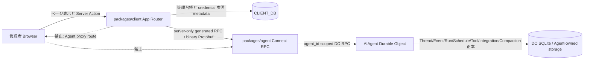
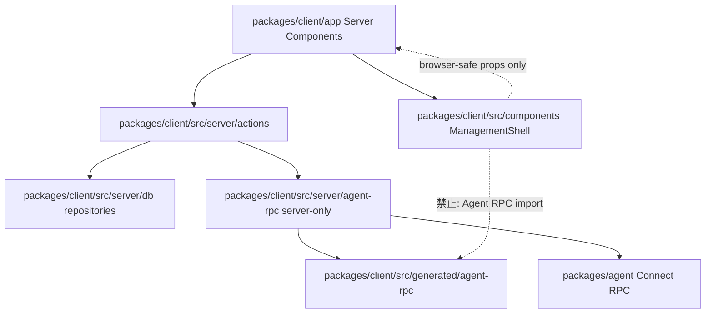
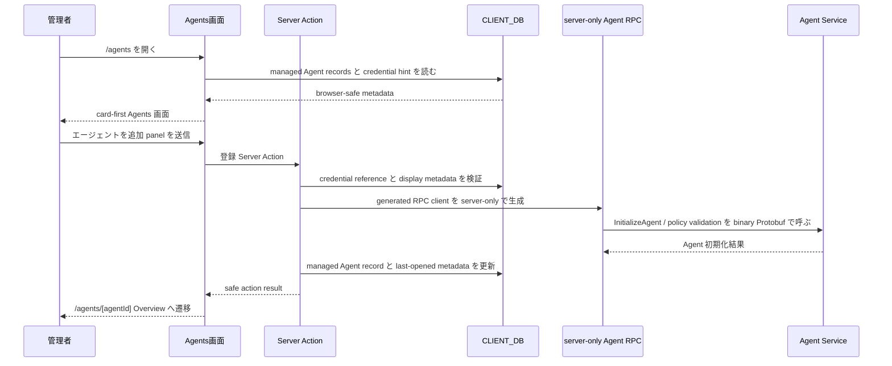
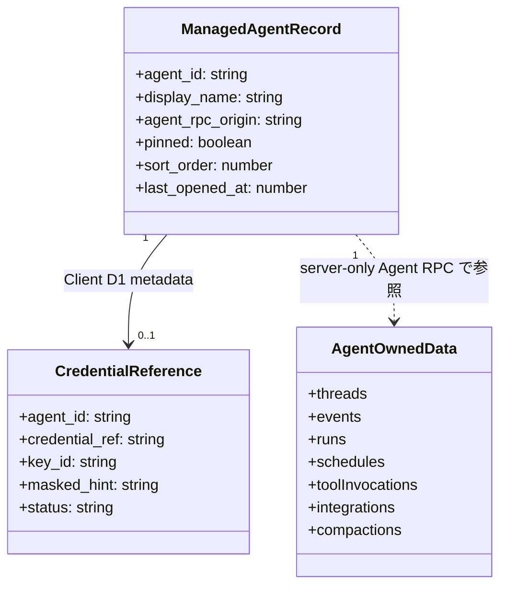
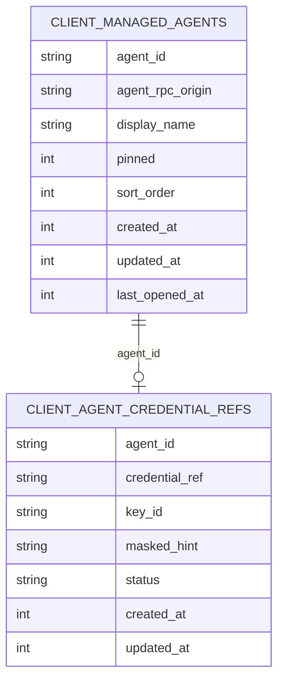
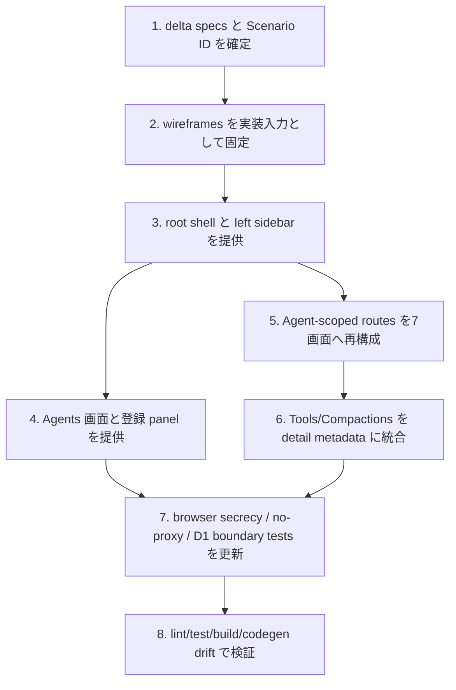

## Scope

### In Scope

- `management-client` の `MANAGEMENT-CLIENT-S001`、`MANAGEMENT-CLIENT-S002`、`MANAGEMENT-CLIENT-S009`、`MANAGEMENT-CLIENT-S010` に対応する、左サイドバー型の global / selected-Agent navigation shell、browser secrecy、no-proxy 境界の再設計。
- `client-management` の `CLIENT-MANAGEMENT-S010` から `CLIENT-MANAGEMENT-S014` に対応する、Agents 画面、Global Settings、Agent-scoped Overview / Threads / Events / Runs / Schedules / Integrations / Settings の card / summary-first UI と状態設計。
- Agent registration を `/agents` 画面内 action として扱う設計。
- `Tools` と `Compactions` に相当する情報を Runs、Events、Threads、Overview、Integrations、Settings の Agent-scoped detail / metadata として表示する設計。
- desktop / mobile の responsive shell、loading / empty / error / permission-denied / disabled / selected-agent-required / optimistic 状態、keyboard 操作、focus 管理、secret-safe copy。

### Out of Scope

- Agent TypeSpec、proto、generated RPC、Agent Worker runtime、Durable Object、Agent storage、Agent binding、Agent governance script の変更。今回の UI redesign は Agent public API 変更を提案しない。
- Agent REST、OpenAPI、Orval、ad-hoc JSON DTO、public Durable Object fetch、Client Agent API proxy route、Browser direct Agent RPC の追加。
- Client D1 に Agent-domain snapshot を保存する設計。Thread、Event、Run、Schedule、ToolInvocation、Integration Installation、Compaction body、raw observability log は Client D1 に保存しない。
- Global Settings のための新しい Client D1 table 追加。Client-wide settings はこの変更では browser-safe な runtime/config 表示、UI preference、既存 management ledger の表示設定に限定し、新規 D1 migration は行わない。

## Assumptions / Dependencies

- `proposal.md` は `management-client` と `client-management` を Modified Spec Units として指定しており、delta specs はこの 2 unit に限定する。
- `packages/client` は Next.js App Router on Cloudflare Workers の Management Client であり、Browser-visible modules は Agent credential、Connect runtime、server-only Agent RPC factory、Client D1 seam を import しない。
- Agent-owned data は Client server-side generated Agent RPC client から取得する。Agent Worker は Connect unary binary Protobuf のまま維持する。
- Agent selection は `Agents` 画面の責務とする。Topbar は選択中 Agent の表示 chip と `/agents` への導線だけを持ち、cross-Agent quick switcher は持たない。
- `/` は server-side で `/agents` へ redirect する。`Global Settings` は `/settings` とする。
- `wireframes/*.md` は design-only の詳細画面契約であり、HTML wireframe は未生成である。

## Impacted Areas

- `openspec/changes/redesign-management-client-ui/**`: proposal 済み artifact、delta spec、design、tasks、Markdown wireframes。
- `packages/client/app/**`: root redirect、root layout shell、`/agents`、Agent-scoped routes、`/settings`、Agent registration flow、Tool / Compaction detail placement。
- `packages/client/src/components/**`: horizontal `SectionNav` / `ControlRoomFrame` 依存を左サイドバー shell と card / summary components へ置換する。
- `packages/client/src/server/**`: existing Client D1 repositories、Server Actions、server-only Agent RPC factory を維持し、browser-safe navigation props と selection action を server-side に閉じる。
- `packages/client/src/tests/**`: navigation labels、browser secrecy、Client D1 boundary、component states、Scenario ID coverage を更新する。
- Security / operations: Browser secrecy、no-proxy、secret-safe error、no generated hand-edit、no codegen drift を acceptance に含める。

## Directory Tree

```text
openspec/changes/redesign-management-client-ui
├─ design.md
├─ tasks.md
├─ specs
│  ├─ management-client
│  │  └─ spec.md
│  └─ client-management
│     └─ spec.md
└─ wireframes
   ├─ README.md
   ├─ 01-navigation-shell.md
   ├─ 02-global-agents.md
   ├─ 03-global-settings.md
   ├─ 04-agent-overview.md
   ├─ 05-threads.md
   ├─ 06-events.md
   ├─ 07-runs.md
   ├─ 08-schedules.md
   ├─ 09-integrations.md
   ├─ 10-agent-settings.md
   └─ 11-states-copy-a11y.md
packages/client
├─ app
│  ├─ layout.tsx
│  ├─ page.tsx
│  ├─ settings
│  │  └─ page.tsx
│  └─ agents
│     ├─ page.tsx
│     ├─ new
│     │  └─ page.tsx
│     └─ [agentId]
│        ├─ layout.tsx
│        ├─ page.tsx
│        ├─ threads
│        │  └─ page.tsx
│        ├─ events
│        │  └─ page.tsx
│        ├─ runs
│        │  └─ page.tsx
│        ├─ compactions
│        │  └─ page.tsx
│        ├─ tools
│        │  └─ page.tsx
│        ├─ schedules
│        │  └─ page.tsx
│        ├─ integrations
│        │  └─ page.tsx
│        └─ settings
│           └─ page.tsx
├─ src
│  ├─ components
│  │  ├─ management-shell.tsx
│  │  ├─ sidebar-navigation.tsx
│  │  ├─ agent-card.tsx
│  │  ├─ agent-list.tsx
│  │  ├─ control-room-frame.tsx
│  │  ├─ section-nav.tsx
│  │  ├─ tool-view.tsx
│  │  └─ compaction-view.tsx
│  ├─ server
│  │  └─ actions
│  │     └─ managed-agents.ts
│  └─ tests
│     ├─ browser-agent-rpc-secrecy.test.ts
│     ├─ client-api-proxy-absence.test.ts
│     ├─ client-d1-schema.test.ts
│     ├─ client-repository-boundary.test.ts
│     └─ management-navigation.test.tsx
```

## New / Changed Files

| Type   | File                                                                             | Change                                                                                                           |
| ------ | -------------------------------------------------------------------------------- | ---------------------------------------------------------------------------------------------------------------- |
| Add    | `openspec/changes/redesign-management-client-ui/design.md`                       | 本設計を記録し、implementation phase の境界と検証方針を固定する。                                                |
| Add    | `openspec/changes/redesign-management-client-ui/specs/management-client/spec.md` | shell、browser secrecy、no-proxy の delta requirements を追加する。                                              |
| Add    | `openspec/changes/redesign-management-client-ui/specs/client-management/spec.md` | Agents、Global Settings、Agent-scoped 画面、Tools/Compactions 統合、状態/a11y の delta requirements を追加する。 |
| Add    | `openspec/changes/redesign-management-client-ui/tasks.md`                        | Scenario ID と test task を対応させた implementation-ready checklist を定義する。                                |
| Add    | `openspec/changes/redesign-management-client-ui/wireframes/*.md`                 | UI/UX の詳細 wireframe、copy、states、accessibility、security boundary を Markdown で定義する。                  |
| Update | `packages/client/app/layout.tsx`                                                 | root layout に `ManagementShell` を組み込み、global navigation と main landmark を提供する。                     |
| Update | `packages/client/app/page.tsx`                                                   | hero / landing を削除し、`/agents` へ server-side redirect する。                                                |
| Add    | `packages/client/app/settings/page.tsx`                                          | Global Settings を Client-wide settings screen として追加し、Agent-owned data を扱わない。                       |
| Update | `packages/client/app/agents/page.tsx`                                            | Agents 一覧を card / summary-first にし、Agent registration と selection を同一画面内 action に統合する。        |
| Delete | `packages/client/app/agents/new/page.tsx`                                        | registration flow を `/agents` 画面内 panel / dialog に統合するため、分散した登録 page を整理する。              |
| Add    | `packages/client/app/agents/[agentId]/layout.tsx`                                | registered Agent の存在確認と selected-Agent navigation の server-rendered boundary を提供する。                 |
| Update | `packages/client/app/agents/[agentId]/page.tsx`                                  | Overview を card / summary-first にし、Tool approval queue と Compaction summary を内包する。                    |
| Update | `packages/client/app/agents/[agentId]/threads/page.tsx`                          | Thread 詳細に Memory / Compaction metadata panel を統合する。                                                    |
| Update | `packages/client/app/agents/[agentId]/events/page.tsx`                           | Events を timeline/card-first にし、ToolInvocation 由来 Event を detail metadata として扱う。                    |
| Update | `packages/client/app/agents/[agentId]/runs/page.tsx`                             | Runs 詳細に Tool execution / approval information を統合する。                                                   |
| Delete | `packages/client/app/agents/[agentId]/tools/page.tsx`                            | Tool 情報を Runs / Integrations / Overview / Settings の Agent-scoped detail に役割別統合する。                  |
| Delete | `packages/client/app/agents/[agentId]/compactions/page.tsx`                      | Compaction 情報を Overview / Threads metadata として統合する。                                                   |
| Update | `packages/client/app/agents/[agentId]/schedules/page.tsx`                        | Schedule cards、create/cancel states、overlap policy 表示を wireframe に合わせる。                               |
| Update | `packages/client/app/agents/[agentId]/integrations/page.tsx`                     | Integration cards/detail に Tool catalog を統合する。                                                            |
| Update | `packages/client/app/agents/[agentId]/settings/page.tsx`                         | API、credential、model policy、safe settings を Agent-scoped に整理する。                                        |
| Add    | `packages/client/src/components/management-shell.tsx`                            | Topbar、left sidebar、main landmark、skip link を含む browser-safe shell を提供する。                            |
| Add    | `packages/client/src/components/sidebar-navigation.tsx`                          | Global / selected-Agent navigation と disabled/selected states を描画する。                                      |
| Add    | `packages/client/src/components/agent-card.tsx`                                  | Agents 一覧の card-first 表示単位を提供する。                                                                    |
| Update | `packages/client/src/components/agent-list.tsx`                                  | table/list 主体から card grid と empty/search/filter states へ再構成する。                                       |
| Update | `packages/client/src/components/control-room-frame.tsx`                          | horizontal frame 依存を廃止し、必要な shared layout utilities だけへ縮小または削除する。                         |
| Delete | `packages/client/src/components/section-nav.tsx`                                 | horizontal tabs navigation を廃止する。                                                                          |
| Update | `packages/client/src/components/tool-view.tsx`                                   | Tools top-level ではなく Runs / Integrations detail 内 component として再利用する。                              |
| Update | `packages/client/src/components/compaction-view.tsx`                             | Compactions top-level ではなく Overview / Threads detail metadata として再利用する。                             |
| Update | `packages/client/src/server/actions/managed-agents.ts`                           | Agent selection、last-opened update、registration Server Action を browser-safe に集約する。                     |
| Update | `packages/client/src/tests/browser-agent-rpc-secrecy.test.ts`                    | 新 shell / sidebar / card components が Agent RPC seam を含まないことを Scenario ID 付きで検証する。             |
| Update | `packages/client/src/tests/client-api-proxy-absence.test.ts`                     | Client が public Agent API proxy を公開しない enduring security boundary を検証する。                            |
| Update | `packages/client/src/tests/management-navigation.test.tsx`                       | left sidebar、Agent 未選択 disabled state、Global/selected-Agent navigation labels を検証する。                  |
| Update | `packages/client/src/tests/client-d1-schema.test.ts`                             | 新 UI が Client D1 に Agent-domain snapshot table を追加しないことを回帰検証する。                               |
| Update | `packages/client/src/tests/client-repository-boundary.test.ts`                   | Agent-owned data を Client D1 repository が保存しないことを回帰検証する。                                        |

## System Diagram



## Package Diagram



## Sequence Diagram



## UI Wireframes

N/A。`wireframe` skill による `{name}.wireframe.html` は未生成。代替として、design-only Markdown wireframe は `wireframes/*.md` に作成済みであり、本設計と tasks はそれらを実装時の UI/UX contract として参照する。

## Domain Model Diagram



## ER Diagram



新しい Client D1 table は追加しない。Global Settings は Client-wide 表示設定と runtime/config 状態の画面であり、Agent-domain snapshot や secret を保存しない。

## Package-Level Design

### Package List

| Package                          | Purpose / Responsibility                                                                        | Public API                                    | Dependencies                                           |
| -------------------------------- | ----------------------------------------------------------------------------------------------- | --------------------------------------------- | ------------------------------------------------------ |
| `packages/client/app`            | App Router routes、Server Components、route layout、redirect、selected-Agent shell を所有する。 | `/agents`, `/settings`, `/agents/[agentId]/*` | `packages/client/src/components`, `src/server/actions` |
| `packages/client/src/components` | browser-safe UI components、card / summary views、navigation shell、states を所有する。         | React components                              | browser-safe props のみ                                |
| `packages/client/src/server`     | Server Actions、Client D1 repositories、server-only Agent RPC factory を所有する。              | Server Actions / server-only modules          | `CLIENT_DB`, generated Agent RPC client                |
| `packages/client/src/tests`      | Scenario ID 付きの route、navigation、boundary、component state tests を所有する。              | Vitest / component tests                      | `packages/client/app`, `src/components`, `src/server`  |
| `packages/agent`                 | Agent-owned data と Protobuf RPC-only public API を所有し、今回変更しない。                     | Connect unary binary Protobuf RPC             | Durable Object / Agent-owned storage                   |

### Details

#### `packages/client/app`

- Purpose / Responsibility: route shell と server-rendered boundary を所有する。global route は `/agents` と `/settings`、selected-Agent route は `/agents/[agentId]` 配下の 7 画面を提供する。
- Public API: Next.js App Router pages と layouts。public Agent API は提供しない。
- Key Data Structures: route params、browser-safe managed Agent display metadata、action result payload。
- Key Flows: `/` redirect → `/agents` card list → Agents 画面内 registration panel → selected-Agent Overview。Agent-scoped routes は `[agentId]` が Client D1 に登録済みか server-side で確認する。
- Dependencies: `src/server/actions` から Client D1 と Agent RPC を server-side に閉じる。Browser-visible route component は server-only modules を直接 import しない。
- Error Handling: not found、permission-denied、RPC error、validation error は secret-safe copy と actionable CTA を表示する。
- Testing Strategy: `MANAGEMENT-CLIENT-S001`、`MANAGEMENT-CLIENT-S009`、`MANAGEMENT-CLIENT-S010`、`CLIENT-MANAGEMENT-S010`、`CLIENT-MANAGEMENT-S012` を route/navigation/component tests で検証する。
- Non-Functional: left sidebar は keyboard accessible、mobile drawer は focus trap と Esc close を持つ。
- Performance: card skeleton と Server Component streaming を活用し、Agent-owned data は必要画面だけで取得する。
- Security: no `/api/**` Agent proxy、no direct browser RPC、no credential props。

#### `packages/client/src/components`

- Purpose / Responsibility: design system に近い reusable UI shell と card / summary components を所有し、route-local JSX duplication を避ける。
- Public API: `ManagementShell`, `SidebarNavigation`, `AgentCard`, screen-specific cards / panels。
- Key Data Structures: `NavigationItem`, `AgentDisplaySummary`, `StatusTone`, `SecretSafeErrorViewModel`。
- Key Flows: Server Component から受けた safe props を表示し、client interactivity は sidebar drawer、collapse、modal open/close、pending 表示に限定する。
- Dependencies: React と browser-safe shared components。`@connectrpc/connect`、generated Agent RPC、server-only modules、`CLIENT_DB` seam は依存禁止。
- Error Handling: `ErrorAlert` と `EmptyState` を再利用し、raw stack や credential を表示しない。
- Testing Strategy: `CLIENT-MANAGEMENT-S014` と `MANAGEMENT-CLIENT-S002` を component tests と browser secrecy tests で検証する。
- Non-Functional: `skip-to-content`、`aria-current`, `aria-disabled`, `aria-live`, `prefers-reduced-motion` を標準化する。
- Performance: card-first layout は virtualization ではなく pagination / filtering と skeleton を優先する。大量 Agent は server search に昇格できる構造にする。
- Security: props に secret を含めない。structured values は等幅表示だが token / secret body は渡さない。

#### `packages/client/src/server`

- Purpose / Responsibility: Client D1 ownership、credential reference resolution、server-only Agent RPC invocation、Server Action validation を所有する。
- Public API: `registerManagedAgent`, `selectManagedAgent`, `markManagedAgentOpened`, `setManagedAgentPinned`, Agent screen data query actions。
- Key Data Structures: managed Agent record、credential reference metadata、safe validation result、Agent RPC result sanitizer。
- Key Flows: Browser form → Server Action → server-side validation → Client D1 repository / generated Agent RPC → safe UI result。
- Dependencies: Drizzle D1 repository、`server-only` Agent RPC modules、generated Agent RPC descriptors。Agent runtime source は import しない。
- Error Handling: domain error を user-facing safe message に変換し、internal details は server-side log に限定する。
- Testing Strategy: `CLIENT-MANAGEMENT-S010` から `CLIENT-MANAGEMENT-S014` と既存 `CLIENT-MANAGEMENT-S009/S017/S018` の境界を unit/integration tests で検証する。
- Non-Functional: action idempotency、double submit prevention、pagination、no snapshot persistence を維持する。
- Performance: Agent-owned lists は page size と filter を Agent RPC query に渡し、Client D1 へ cache しない。
- Security: credential ref は server-only で解決し、Browser へ raw credential / token / signing material を返さない。

## Implementation Plan



## Test Plan

### User Acceptance Test (Manual)

| UAT ID                        | Related Requirement                         | Spec Summary                                                                | Customer Problem Summary                                        | Steps                                                                             | Expected Behavior                                                                    |
| ----------------------------- | ------------------------------------------- | --------------------------------------------------------------------------- | --------------------------------------------------------------- | --------------------------------------------------------------------------------- | ------------------------------------------------------------------------------------ |
| UAT-MANAGEMENT-CLIENT-HAP-001 | MANAGEMENT-CLIENT-R009 navigation shell     | global と selected-Agent が左サイドバーで分離される。                       | 管理者が全体画面と Agent 固有画面を混同しない。                 | `/agents` を開き、Agent 未選択、選択済み、mobile 幅で navigation を確認する。     | Global は Agents/Global Settings のみ、selected-Agent は選択時だけ有効になる。       |
| UAT-CLIENT-MANAGEMENT-HAP-001 | CLIENT-MANAGEMENT-R010 Agents screen        | Agents 画面が card-first で Agent 登録と選択を扱う。                        | 管理者が登録・選択を同じ入口で迷わず行える。                    | 空状態、複数 Agent、検索、`エージェントを追加` panel を確認する。                 | 登録 flow は Agents 画面内 action として動作する。                                   |
| UAT-CLIENT-MANAGEMENT-HAP-002 | CLIENT-MANAGEMENT-R011 Agent-scoped screens | Overview/Threads/Events/Runs/Schedules/Integrations/Settings が表示される。 | 管理者が Agent の状態を table-only ではなく要約から把握できる。 | Agent を選択し、7 画面を巡回して card / summary、states、breadcrumbs を確認する。 | 各画面は選択中 Agent の情報だけを表示し、Tool / Compaction 情報は detail 内にある。  |
| UAT-MANAGEMENT-CLIENT-SEC-001 | MANAGEMENT-CLIENT-R011 browser-safe shell   | Browser に Agent credential / direct RPC logic を出さない。                 | 管理 UI が攻撃面や proxy API にならない。                       | DevTools で HTML、bundle、network、storage、route を確認する。                    | Agent credential、Agent RPC direct request、proxy route、raw secret は観測されない。 |

### E2E Test (Playwright)

| E2E ID                        | Playwright Test Name                                                                | Related Scenario       | Category | Summary                                                                           | Steps (Playwright)                                                                              | Expected Behavior                                                               |
| ----------------------------- | ----------------------------------------------------------------------------------- | ---------------------- | -------- | --------------------------------------------------------------------------------- | ----------------------------------------------------------------------------------------------- | ------------------------------------------------------------------------------- |
| E2E-MANAGEMENT-CLIENT-HAP-001 | `[MANAGEMENT-CLIENT-S009] 左サイドバーが global と selected-Agent を分離する`       | MANAGEMENT-CLIENT-S009 | HAP      | Agent 未選択/選択済みで sidebar 状態を検証する。                                  | `/agents` を開き、Agent 選択前後と mobile drawer を操作する。                                   | Global items は常時表示、selected-Agent items は選択時のみ有効になる。          |
| E2E-MANAGEMENT-CLIENT-SEC-001 | `[MANAGEMENT-CLIENT-S002] Browser が Agent RPC を直接実行しない`                    | MANAGEMENT-CLIENT-S002 | SEC      | Browser-visible behavior が server-side Agent RPC boundary を保つことを検証する。 | `/agents` と selected-Agent screens を操作し、network と bundle-observable surface を確認する。 | Agent RPC は Client server 側からのみ発生し、Browser に credential は渡らない。 |
| E2E-CLIENT-MANAGEMENT-HAP-001 | `[CLIENT-MANAGEMENT-S010] Agents 画面が card-first で登録 action を提供する`        | CLIENT-MANAGEMENT-S010 | HAP      | card-first list と登録 panel を検証する。                                         | `/agents` で empty/list/search/registration panel を操作する。                                  | Agent cards と同一画面内登録 flow が表示され、sidebar に New Agent は出ない。   |
| E2E-CLIENT-MANAGEMENT-HAP-002 | `[CLIENT-MANAGEMENT-S011] selected-Agent screens が7画面で有効になる`               | CLIENT-MANAGEMENT-S011 | HAP      | Agent-scoped navigation を検証する。                                              | Agent を開き、Overview/Threads/Events/Runs/Schedules/Integrations/Settings を巡回する。         | すべて選択中 Agent に scope され、Agent 未選択時は guidance が出る。            |
| E2E-CLIENT-MANAGEMENT-HAP-003 | `[CLIENT-MANAGEMENT-S012] Tools と Compactions が detail metadata として表示される` | CLIENT-MANAGEMENT-S012 | HAP      | Tool / Compaction 情報が Agent-scoped context に沿って表示されることを検証する。  | Overview/Threads/Runs/Integrations/Settings を開いて該当 metadata を確認する。                  | Tool / Compaction 情報は選択中 Agent の detail context に表示される。           |

### Integration Test (Endpoint)

| IT ID                        | Test Name                                                                             | Genre  | Category | Summary                                                           | Steps (Test)                                                                                   | Expected Behavior                                                                            |
| ---------------------------- | ------------------------------------------------------------------------------------- | ------ | -------- | ----------------------------------------------------------------- | ---------------------------------------------------------------------------------------------- | -------------------------------------------------------------------------------------------- |
| IT-MANAGEMENT-CLIENT-SEC-001 | `[MANAGEMENT-CLIENT-S002] 再設計 shell が Agent RPC seam を Browser に含めない`       | client | SEC      | app/browser-visible source の禁止 import と禁止文字列を検査する。 | `packages/client/app/**` と browser-visible components を静的検査する。                        | generated Agent RPC、Connect runtime、credential headers、server-only factory が存在しない。 |
| IT-MANAGEMENT-CLIENT-SEC-002 | `[MANAGEMENT-CLIENT-S008] Client は Agent proxy route を公開しない`                   | client | SEC      | App Router route handlers と network boundary を検査する。        | route handlers と server action boundary を列挙し、public Agent API proxy surface を検査する。 | public Agent API proxy は公開されず、Agent RPC は server-side module からのみ呼ばれる。      |
| IT-CLIENT-MANAGEMENT-BND-001 | `[CLIENT-MANAGEMENT-S013] Client D1 は Agent-domain snapshot を保存しない`            | client | BND      | Client D1 schema と repository API を検査する。                   | table names、write APIs、repository exports を列挙する。                                       | managed Agent records と credential refs 以外の Agent-domain snapshot table/API がない。     |
| IT-CLIENT-MANAGEMENT-HAP-001 | `[CLIENT-MANAGEMENT-S010] Agent selection は Server Action で last-opened を更新する` | client | HAP      | Agent selection の server-side boundary を検証する。              | `selectManagedAgent` action を呼び、Client D1 metadata と safe result を検証する。             | Browser へ credential を返さず、last-opened metadata が更新される。                          |

### Unit/Component Test (UT)

| UT ID                         | Test Name                                                                                | Package                        | Category | Summary                                                  | Steps (Test)                                                                     | Expected Behavior                                                          |
| ----------------------------- | ---------------------------------------------------------------------------------------- | ------------------------------ | -------- | -------------------------------------------------------- | -------------------------------------------------------------------------------- | -------------------------------------------------------------------------- |
| UT-MANAGEMENT-CLIENT-A11Y-001 | `[MANAGEMENT-CLIENT-S009] SidebarNavigation が keyboard と aria-current を満たす`        | packages/client/src/components | A11Y     | sidebar の focus、current、disabled state を検証する。   | component render で nav role、aria-current、aria-disabled、keyboard を検証する。 | 現在地と無効理由が支援技術に伝わる。                                       |
| UT-MANAGEMENT-CLIENT-SEC-001  | `[MANAGEMENT-CLIENT-S002] ManagementShell props は browser-safe metadata のみを受け取る` | packages/client/src/components | SEC      | shell props に secret-like fields がないことを検証する。 | fixture props と禁止 key/文字列を検査する。                                      | credentialRef value、Authorization、Bearer、Connect factory 名を含まない。 |
| UT-CLIENT-MANAGEMENT-HAP-001  | `[CLIENT-MANAGEMENT-S010] AgentCard が status を色だけで伝えない`                        | packages/client/src/components | A11Y     | card status の icon+label+tone を検証する。              | status variants を render し、label と icon aria を assert する。                | status は色単独ではなく text label を持つ。                                |
| UT-CLIENT-MANAGEMENT-ERR-001  | `[CLIENT-MANAGEMENT-S014] secret-safe error が raw stack と token を表示しない`          | packages/client/src/components | ERR      | error component の sanitization を検証する。             | raw stack/token を含む error fixture を渡す。                                    | 表示 copy は抽象化され、raw secret-like content は出ない。                 |
| UT-CLIENT-MANAGEMENT-BND-001  | `[CLIENT-MANAGEMENT-S012] ToolView と CompactionView は Agent-scoped detail を描画する`  | packages/client/src/components | BND      | detail component としての再利用を検証する。              | Runs/Threads context props で render する。                                      | 選択中 Agent context に沿った Tool / Compaction detail が表示される。      |

## Rollback / Migration

- DB migration は N/A。新しい Client D1 table を追加せず、既存 `client_managed_agents` と `client_agent_credential_refs` を維持する。
- Agent API migration は N/A。TypeSpec、proto、generated RPC、Agent Worker runtime は変更しない。
- route shell に重大問題が見つかった場合は、互換 shim を追加せず change set を revert し、再度 OpenSpec と tests を整合させる。

## Release Procedure

- `openspec validate --type change "redesign-management-client-ui" --strict --no-interactive` を通す。
- implementation phase では `pnpm lint`、`pnpm check:client`、`pnpm test:client`、`pnpm build`、`pnpm check:codegen` を通す。
- Browser secrecy と no-proxy route の regression を reviewer が確認する。
- left sidebar、Agents registration action、Tool / Compaction detail placement を UAT で確認する。

## Acceptance Criteria

- `MANAGEMENT-CLIENT-S001`、`MANAGEMENT-CLIENT-S002`、`MANAGEMENT-CLIENT-S009`、`MANAGEMENT-CLIENT-S010` と `CLIENT-MANAGEMENT-S010` から `CLIENT-MANAGEMENT-S014` の automated tests が Scenario ID を test title に含んで pass する。
- Global area は `Agents` と `Global Settings` のみ、selected-Agent area は `Overview`、`Threads`、`Events`、`Runs`、`Schedules`、`Integrations`、`Settings` のみになる。
- Agent 未選択時は selected-Agent items が hidden または disabled になり、`Agents` 画面への guidance が表示される。
- Agent registration は Agents 画面内 action として操作でき、Tool / Compaction 情報は Agent-scoped detail context に表示される。
- Browser bundle、HTML、storage、network response に Agent credential、direct Agent RPC invocation logic、Agent proxy route、raw secret が含まれない。
- Agent TypeSpec/proto/generated RPC に差分がないことを `pnpm check:codegen` で確認する。

## Open Issues

- なし。`/` は `/agents` redirect、Global Settings route は `/settings`、Agent selection と registration は Agents 画面、Global Settings は新 Client D1 table なしで設計する。
